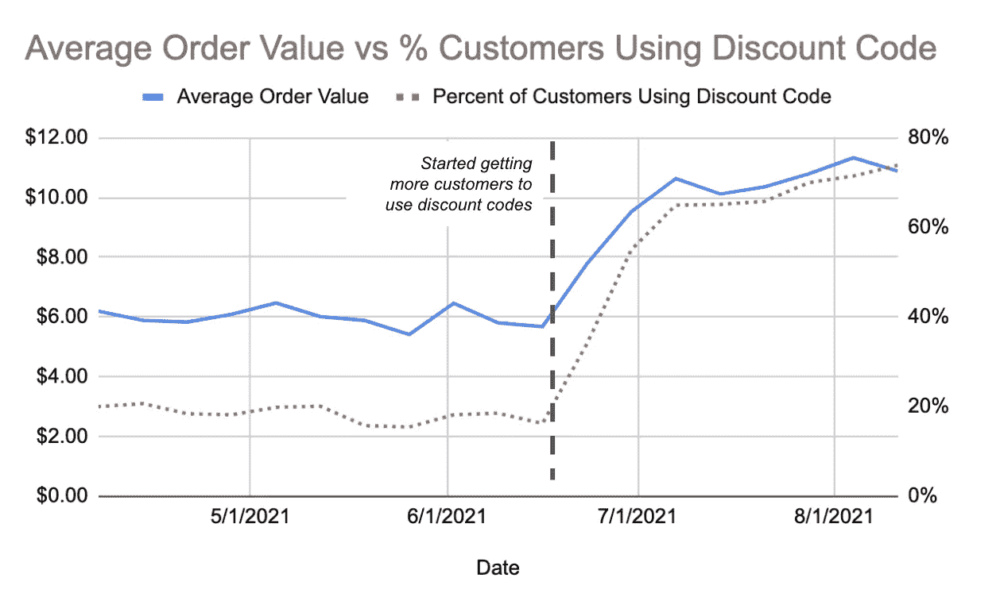
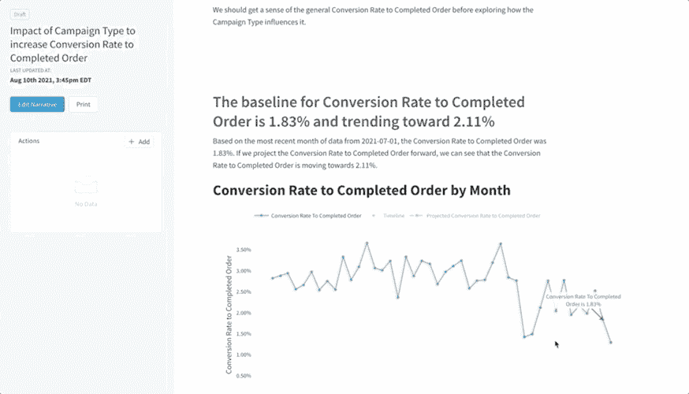

# 当相关性优于因果关系时

> 原文：<https://towardsdatascience.com/when-correlation-is-better-than-causation-1cbfa2708fbb?source=collection_archive---------33----------------------->

## “相关性不等于因果关系”

米凯拉·帕兰特拍摄的照片

我不喜欢这个短语。不是因为不准(当然准)。我不喜欢它被用来解除分析师的武装。这句简单的话一出口就能让任何分析嘎然而止。

当一个利益相关者说，“是的…但是相关性不等于因果关系”，那就是“你的见解不足以让我采取行动。”又名**节目主持人**。

这个流行的短语让决策者相信，他们*需要*因果洞察力，以便根据数据做出决策。是的，在一个完美的世界里，我们只会根据因果洞察力行动。但是在实践中，这个要求是不合理的。通常情况下，当利益相关者需要“因果关系”来做决定时，会花费很长时间，所以他们会失去耐心，最终在没有任何数据的情况下做出决定。

例如，考虑 A/B 测试。这是当今团队处理因果关系需求最常见的方式。但是 A/B 很难正确执行——正如无数统计学家挥手试图让我们承认这一事实所显示的那样(比如[这个](https://www.evanmiller.org/how-not-to-run-an-ab-test.html)和[这个](/top-5-mistakes-with-statistics-in-a-b-testing-9b121ea1827c))。可悲的现实是，A/B 测试需要大量的数据、完美的工程实现和高水平的统计严谨性才能正确完成…所以我们最终发布了没有有效结果的新特性。

这种事经常发生！但是，数据团队为了在一天结束时做出一个基于直觉的决定，而敷衍了事地试图证明因果关系，这对他们自己没有任何好处。我们需要改变方法。

# 因果关系的负面影响

现实是因果关系很难证明。它不仅需要更高水平的统计严谨性，还需要大量精心收集的数据。这意味着你要等很长时间才能做出因果关系的判断。这也适用于其他因果推断方法，不仅仅是 A/B 测试。

最终，当用数据做决策时，因果关系是一个不切实际的要求。所以让我们停止尝试，寻找另一种方式。让我们回到使用相关性。

我并不是建议一场混战。我们不想以“技术上相关”但没有合理解释的荒谬见解告终，就像[这些](https://flowingdata.com/2014/05/12/random-things-that-correlate/)。我说的是在商业环境中使用相关性来最大化我们做出“最佳”决策的机会。并且以这样一种方式去做，我们可以相信洞察力给了我们一个合理的预期，任何给定的决定将如何影响我们所关心的事情。毕竟这是数据的目标。

# 解决方案:一种使用相关性来通知决策的启发式方法

为了从相关性中获得可信的见解，我们希望最大化我们在数据中看到的相关关系实际上是因果关系的可能性。我们可以通过以下四个最佳实践来做到这一点。

# 1.测试相关性时要有意识

不要把随机的事情联系起来。搜索足够长的时间，你一定会发现一个真正“令人惊讶”的相关性[、](https://www.datasciencecentral.com/profiles/blogs/hilarious-graphs-and-pirates-prove-that-correlation-is-not)、[，就像这个](https://www.datasciencecentral.com/profiles/blogs/hilarious-graphs-and-pirates-prove-that-correlation-is-not)。最有可能的是，这种关系是由于机会，现在你已经浪费了你和其他人的时间。统计学家将这种方法称为“p-hacking”。

相反，把重点放在已经联系在一起的事情上。一个很好的方法是关注顾客的行动。如果你试图关联以客户行为为中心的数据，你肯定只能探索以某种方式*实际上*关联的行为。听起来很简单，但是很容易被忽略。例如，我们不应该看“我们开设课程的时间”如何影响客户注册的可能性，我们应该看“客户看到课程的时间”如何影响他们注册的可能性。因为我们从客户及其行动的角度看待所有行为，所以我们可以保证这些行动是相互关联的，从而增加了我们看到的相关关系也是因果关系的可能性。

# 2.关联转换率，而不是总数

在大多数分析中，我们试图判断一个特定的决定或变化将如何影响客户的行为。客户行为最好用转化率来表示，而不是总数。如果我告诉你，10 个人转化了 30 个人，这并不能告诉我太多关于客户的行为心态。如果我告诉你网站上 10%的人转化 vs 30%的人，那么你对客户的转化意愿有所了解。

现在，想象一下试图将电话查询总数与总转化率联系起来。我们可能会发现，电话咨询总量的增加与总转化率的增加高度相关。显然是的，因为我们的漏斗中有更多的人，但是我们直觉地知道更多的电话询问并不会导致更多的转化。它们只是相互关联，因为它们都受到另一个因素(体积)的影响。通过查看转换率，我们可以更容易地梳理出可以用来影响客户行为的见解。

您可能还想关联其他标准化指标(如平均订单值)，但如果可能的话，应该避免这样做。这些指标可能会有更多的差异，这意味着您要么需要更多的数据来找到可靠的见解，要么需要对指标进行降维(有效地将其转化为转换率)以减少差异，然后再进行分析。我现在不会在这个问题上讲太多细节，但是我们会在以后的博客文章中涉及到它。与此同时，转换率永远是一个安全的赌注。

# 3.确保趋势在较长时间内保持一致

您的业务和客户总是在变化，因此了解这一点非常重要。很多时候，我们会以汇总的方式查看相关性，从我们的分析中剥离时间。但是一切都在随时间变化，所以过去存在的相关性今天可能已经消失了，如果你不分析数据，你永远不会知道。

由于历史行为是未来行为的最佳预测者，我们需要了解数据是如何随时间变化的，尤其是当我们正在分析的要素也在变化时。如果有 X 的人一直有更高的 Y，那么我们知道我们可以更容易地相信，当我们让更多的人做 X 时，我们也将有更好的机会增加 Y。只要影响随着时间的推移是一致的，我们就可以更有信心这些趋势在未来也是可靠的。

证明这一点的一个很好的练习是回顾你以前运行的 A/B 测试。当我们这样做的时候，我们发现其中一些在短时间内具有统计学意义，并且随着时间的推移并不一致。这是 A/B 测试中常见的风险，因此，许多专家建议运行 evergreen 测试。但是这带来了很多工程上的复杂性，大多数团队最终都没有设置好。

# 4.始终监控结果

使用相关性的坏处是，我们可能是错的。尽管当我们遵循上面的最佳实践时，这种可能性降低了，但它仍然是一种风险。但是，如果我们能够对相关的发现迅速采取行动，并警惕地监控结果，我们就可以极大地降低任何错误决策演变成灾难的风险。顺便说一句，这也适用于因果洞见。事情总有不按你预期的方式发展的风险([就像这个警示故事](https://www.narrator.ai/blog/when-good-data-analyses-fail-to-deliver-the-results-you-expect/))。

在监控结果的时候，追踪你所做的改变是如何影响你想要达到的结果是很重要的。假设您发现使用折扣代码的客户与平均订单价值之间存在正相关关系。一旦你发现一个相关的趋势，你会想慢慢地将客户量转移到有更好表现的群体中。然后，我们可以使用下图监控结果。

作者图片

如果我们能在做出改变的同时跟踪这些数据，我们就能知道我们是否做出了正确的决定，如果没有，我们就会很快失败。

# 一种可重用的、可靠的方法

我们可以将这种方法自动化，分析将类似于下面的分析，使决策者能够更快地做出更多数据驱动的决策。

作者图片

# 结论

在实践中，我们需要准确的洞察力，我们需要快速行动。等待两个月的因果分析或四周的 A/B 测试是不会成功的。但是，如果我们能够对相关性迅速采取行动，特别是当它们已经使用上述技术进行了严格评估时，我们将能够更快地做出更好的决策。所以，让我们放弃“相关性不等于因果关系”这句话，对相关性本身多一点信心。

*原载于 2021 年 8 月 11 日* [*https://www .叙述者. ai*](https://www.narrator.ai/blog/when-correlation-is-better-than-causation/) *。*