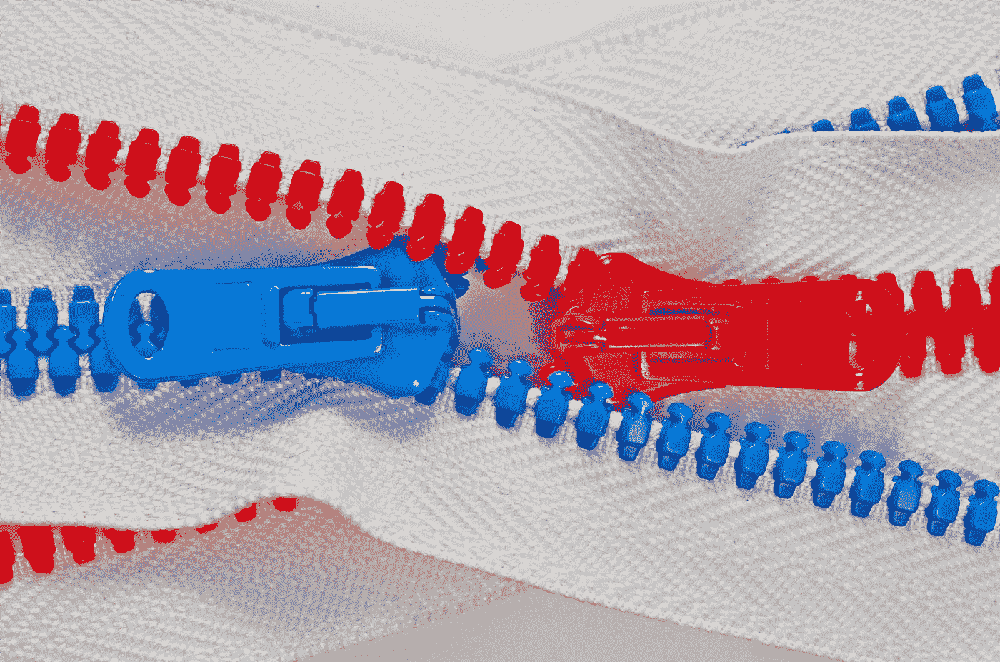

# 支持向量机什么时候会失败？

> 原文：<https://towardsdatascience.com/when-do-support-vector-machines-fail-3f23295ebef2?source=collection_archive---------5----------------------->

托马斯·索贝克在 [Unsplash](https://unsplash.com?utm_source=medium&utm_medium=referral) 上的照片

## 何时使用和不使用它们，以及如何使用

# 介绍

你可能碰巧看到了我的[上一篇关于介绍支持向量机(SVMs)的文章](/support-vector-machines-in-under-5-minutes-3074762a49bf)，在这篇文章中，关键的基本概念在一个高层次上被介绍了。在本文中，我们将讨论在分类和回归用例中，支持向量机何时不适合使用。

# 1)支持向量机不适合大型数据集

已知最初的 SVM 实现具有具体的理论基础，但它不适合在大型数据集中进行分类，原因很简单-算法训练的复杂性高度依赖于数据集的大小。换句话说，训练时间会随着数据集的增长而增长，直到由于计算限制而变得不可行为止。

从好的方面来看，自 1992 年美国电话电报公司贝尔实验室首次实施以来，SVM 已经取得了一些进展[1]。如今，随着数据集规模的增大，训练支持向量机的可扩展性大大提高。

# 2)支持向量机在不平衡数据集中表现不佳

这有两个更好的理由。第一个是软利润优化问题的弱点。当不平衡数据用于训练时，这导致超平面偏向少数类。

第二个原因源于不平衡支持向量比率的问题，即正和负支持向量之间的比率变得不平衡，结果，超平面的决策边界处的数据点被分类为负的可能性更高。

然而，有一些方法可以减少这种影响。一种更常用的方法是引入类别权重，因此正面支持的大小将成比例地高于负面支持向量的大小。当使用不平衡数据集进行训练时，类权重也用于其他机器学习算法中。

# 3)具有“错误”核的支持向量机

这有点直观。对于现在的支持向量机来说，选择正确的核函数是关键。例如，当数据不可线性分离时，使用线性核会导致算法性能不佳。然而，选择“正确的”核本身是另一个问题，在所使用的技术中，流行的技术包括在超参数搜索中改变核函数。

# 4)当数据中有太多噪声时

在这些有噪声数据的情况下，目标类是重叠的，也就是说，要素可能具有非常相似或重叠的属性。由于优化算法的性质，这可能导致达到几个局部最优，特别是对于高维数据集。

然而，值得注意的是，对于具有高偏差的核，例如线性和多项式核，噪声不应该是问题。噪声问题应该更多地存在于诸如径向基函数(RBF)的低偏差核中。

# 附加备注

虽然使用原始 SVM 算法有几个众所周知的缺点，但多年来已经进行了大量研究来改进它，使得上述现有影响不太严重，并且可以通过其他方法来减少/减轻。

# 参考

[1] Boser，b .，Guyon，I .，Vapnik，v .:最优间隔分类器的训练算法。《第五届计算学习理论年度研讨会论文集》，匹兹堡(1992)

[2]巴图维塔和帕拉迪(2013 年)。支持向量机的类别不平衡学习方法。在不平衡的学习中。[https://doi.org/10.1002/9781118646106.ch5](https://doi.org/10.1002/9781118646106.ch5)