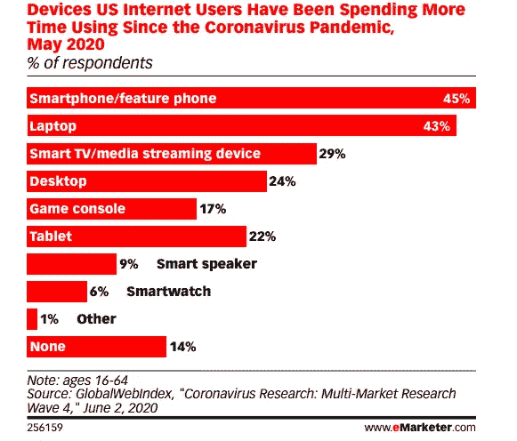
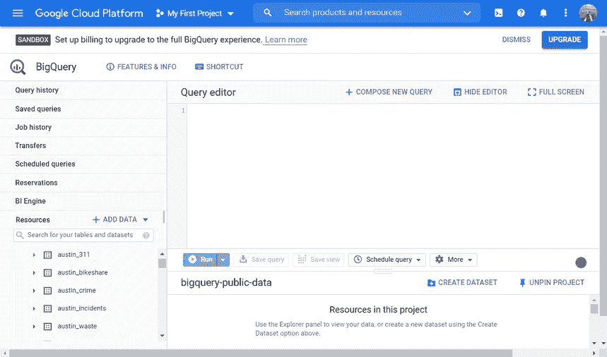
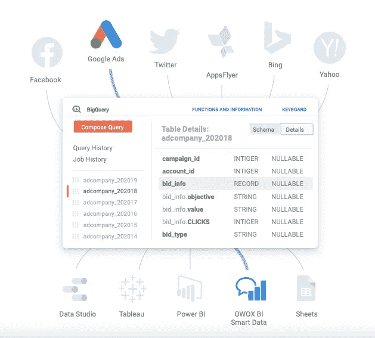
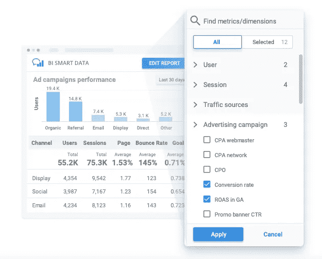

# 当 Google Analytics 和 Data Studio 不够用，是时候转而使用 Google BigQuery 了

> 原文：<https://towardsdatascience.com/when-google-analytics-and-data-studio-arent-enough-and-it-s-time-to-switch-to-google-bigquery-ff286fcdf8d8?source=collection_archive---------23----------------------->

来源: [Unsplash](https://unsplash.com/photos/HXIDmkyYRhQ)

## 让我们弄清楚什么时候应该放弃标准的 Google Analytics 和 Google Data Studio 解决方案，转而考虑选择数据仓库

业务越来越多地转移到网上，2020 年已经表明，许多行业的公司没有网上业务根本无法生存。自然，在线客户越多，在线用户活动就越多，营销分析师就越需要处理数据以获得有用的见解。

这些数据必须存储在某个地方，进行处理(最好是实时处理)，并无限期存储。毕竟，对于一个有经验的营销人员来说，历史数据是一笔真正的财富。

让我们弄清楚什么时候应该放弃标准的 Google Analytics 和 Google Data Studio 解决方案，转而考虑选择一个数据仓库。

# 挑战

许多人都熟悉这样一种哲学:如果一切正常，不要碰它，因为你会弄坏它。一方面，这种说法非常合理，但另一方面，企业的需求往往很快超出定制服务的能力。

如今，游戏规则正以惊人的速度变化着。移动和智能设备使营销变得复杂，并不断增加营销中使用的数据量。从 GlobalWebIndex 的 2020 年[全球媒体情报报告](https://www.globalwebindex.com/reports/gmi-report)中可以看出，这种趋势不会消失。

来源: [eMarketer](https://www.emarketer.com)

为营销报告生成数据的设备数量每天都在增加。相应地，营销专家处理的数据量也在增长。仅仅使用关于销售和广告活动的信息已经不够了。营销报告应该考虑许多不同来源的数据(广告服务、网站、移动应用程序、在线商店、线下商店、客户关系管理系统和呼叫跟踪系统)。同时，来自不同来源的数据也有不同的组织方式。

几乎所有营销人员使用的标准服务，如谷歌分析和谷歌数据工作室，都有其局限性。它们的灵活性和可扩展性不足以应对不断变化的需求。此外，许多公司根本缺乏处理数据的资源。因此，大多数信息都有未经处理和未被使用的风险。

营销分析师的首要任务是尽可能快、尽可能便宜地为他们的公司提供高质量、有用的见解。云服务和数据仓库在这方面发挥了重要作用，提供了重要的扩展解决方案和设置灵活性。让我们来看看如何理解什么时候该改变你正在使用的工具。

# 什么时候使用 Google BigQuery 才有意义？

大多数公司使用谷歌的知名和受欢迎的服务。然而，并不是所有的服务都同样有用，也不是所有的服务对所有的公司都合适或必要。这完全取决于企业和行业的规模。从逻辑上讲，只有一个登录页面的初创公司和大型全渠道零售商需要不同的分析工具。为了避免不必要的金钱和时间支出，公司必须清楚地了解自己需要什么。

当您遇到以下服务的局限性时，是时候改变您的分析系统了:

# 谷歌分析

**注意！**在本文中，当我们谈论谷歌分析时，我们指的是[通用分析](https://support.google.com/analytics/answer/2790010?hl=en)。谷歌最近推出了名为[谷歌分析 4](https://blog.google/products/marketingplatform/analytics/new_google_analytics) 的新版谷歌分析，这是新用户的默认选项。下一代谷歌分析有其优势和局限性，但目前(截至 2021 年初)，该产品仍在完善、改进和更新中。

如果你还没有太多的数据，或者你刚刚推出你的在线商店，那么谷歌分析(即通用分析)非常适合你。一开始，如果你只有几个广告源，你可以很容易地手动下载数据。但是随着广告渠道和活动数量的增加，考虑自动化是值得的。否则，你会发现自己陷入了例行和无聊的数据传输。为了节省时间和避免人为错误，你应该自动化你的营销。

OWOX BI 允许您轻松快速地将不同广告服务的成本数据自动收集到 Google Analytics 和 Google BigQuery 中。此外，OWOX BI 检查 UTM 标签，并自动将所有成本数据转换为您的基础货币。

回到 Google Analytics 的数据收集限制:这项服务是免费的，可以处理世界范围内的大量信息，从逻辑上讲，它对数据收集设置了限制。这些限制适用于所有 Google Analytics 收藏标签、库和 SDK。

如果你有一家小企业或一家初创公司，每年的广告预算高达 10 万美元，你就没什么好担心的。你不太可能超过服务限制。但是那些一年广告预算在 10 万美元或以上的公司应该小心了。您很容易超出限制，并因此丢失有关用户行为的重要信息。您需要非常小心这些限制:

*   测量协议，Android SDK，iOS SDK，gtag。js 和分析。js —每个用户每天 200，000 次点击，每个会话 500 次点击
*   Web 属性、属性、跟踪 ID —每个属性每月 1000 万次点击
*   移动片段，遗传算法。js 和任何其他遗留跟踪库——每个会话 500 次点击

当然，很难错过谷歌分析关于超出限制和限制新数据收集的信息。但是我们的目标是不要坐以待毙，然后四处乱跑，惊慌失措。意识到这些限制并在达到这些限制时有一个行动计划是很重要的。事实上，当你达到这些极限时，你可以向三个方向移动:

1.  转到谷歌分析的[付费版本。](https://www.owox.com/gmp/)
2.  保持免费版本，但是[减少了监控参数](https://www.owox.com/blog/articles/owox-bi-streaming/)的数量。
3.  [使用数据收集连接器、云存储和可视化服务，专门为您的企业设计定制的分析系统](https://www.owox.com/blog/articles/how-a-cmo-can-build-an-effective-marketing-analytics-system/)。

# 数据工作室

[Google Data Studio](https://datastudio.google.com/) 是一款出色的数据可视化服务，可以与其他 Google 产品进行本地集成，并具有许多优势:

*   它是免费的。
*   它带有大量的[仪表盘模板，适合各种场合](https://datastudio.google.com/gallery)。
*   您可以将它连接到不同的数据源。

Data Studio 还包括许多过滤器、页面和报表级别的元素、计算字段、简单的共享选项以及许多其他功能。

您可以在两个级别使用此服务:

*   **基础。**根据 Google Analytics 的数据创建报告。
*   **高级。**根据不同数据源的数据创建报告(内部 CRM 系统、广告服务的成本数据)。

如果您需要基于一个或两个数据源设置一个直观易懂且优雅的仪表板，Data Studio 非常适合小公司和初创公司。但是不要忘记这个服务是为数据可视化而设计的。它的缺点包括缺乏对 Excel 文件的支持(来自 Excel 的数据必须手动连接)，自动仪表板更新速度慢，以及缺乏使用许多数据源的复杂可视化。

Data Studio 功能对于大多数中型公司来说已经足够了，只要它们使用单一数据源。换句话说，您需要将不同来源的数据上传到同一个数据存储中，在那里对数据进行处理，然后上传到 Data Studio。

但是对于每年广告预算超过 100 万美元的大公司来说，处理的数据量对于这项免费服务来说实在是太大了。为了解决这种数据困境，你可以使用 Google BigQuery，它让公司能够在几分钟甚至几秒钟内处理数 Pb 的数据。

# 什么是 BigQuery？

不同的企业(即使他们来自相同的细分市场)对营销分析有不同的要求——销售渠道、购买频率以及品牌推广和客户保持的方法。值得注意的是，Google BigQuery 的发展使得市场上的所有公司都可以进行大数据分析，而不仅仅是大公司。

[Google BigQuery](https://console.cloud.google.com/bigquery) 是一个完全托管的无服务器数据仓库，能够安全、可扩展地分析数 Pb 的数据。此外，作为谷歌云平台的一部分(根据 [Forrester Research](https://cloud.google.com/forrester-data-management-analytics) 的数据管理领导者)，该服务与谷歌产品进行了内置集成。

图片由作者提供

Google BigQuery 简单快捷，许多专家都可以使用它。它还带有现成的 SQL 查询集，因此您可以从收集的数据中获得有用的见解。它的其他优势包括:

*   **安全可靠。**控制对加密项目或数据集的访问，实施身份访问管理(IAM)。
*   **可扩展性。**根据贵公司的规模、性能和成本要求定制数据存储。
*   **成本优化。**获得现收现付的定价选项和预测成本的能力。
*   **实现价值的时间。**轻松快速地开始使用 Google BigQuery，探索数据以找到有用的见解，并更快地抓住新的商机。

BigQuery 有助于减轻公司管理、控制、维护和保护数据仓库基础设施的负担。这使得组织能够专注于实现业务目标。

此外，不要忘记，当你为营销部门创建一个分析系统时，你应该始终关注两个因素:

1.  您的企业应该能够完全访问和控制其数据。
2.  数据应该呈现在一个方便、熟悉、适合决策者的界面中。

当使用 Google BigQuery 时，您可以确保满足这些条件。虽然我们认为这项服务是营销分析师的一个真正发现，但它不能被称为完美无缺。Google BigQuery [限制](https://cloud.google.com/bigquery/quotas)传入请求的数量、每天更新表的数量等等。为了避免不必要的例行和繁琐的工作，我们建议设置从所有数据源自动导入数据。

市场认可的大型连接器，如 [OWOX BI](https://www.owox.com/) 已经与 Google BigQuery 合作多年。OWOX BI 收集数据并将数据(来自谷歌分析、广告服务、网站、线下商店、电话跟踪系统和 CRM 系统)合并到谷歌 BigQuery 中。因此，您可以以统一的结构接收所有数据，并可以使用它来创建任何报告。

图片由作者提供

# 用 Google BigQuery 集成数据

如果您决定使用 Google BigQuery 来研究您的数据，那么请注意，这样做的第一步是准确地识别您需要处理的所有数据源。这可能包括各种服务、平台和应用程序，如 Google Analytics、广告服务、网站、线下商店、呼叫跟踪系统和 CRM 系统。对于许多公司来说，这是使用 BigQuery 的主要挑战。

请注意，要从非谷歌产品自动上传数据，您需要一个处理和传输数据的平台，如 [OWOX BI Pipeline](https://www.owox.com/products/bi/pipeline/) ，它为每个人提供流行和定制的连接器。

许多营销人员被 BigQuery 吓坏了，因为他们必须等待分析师准备好报告或了解 SQL。OWOX BI 是专门为将数据存储在 Google BigQuery 数据存储中的营销人员设计的。

[OWOX BI Smart Data](https://www.owox.com/products/bi/smart-data/) 将您的数据以适合您业务模式的格式进行组合，并允许您在简单的报告设计器中轻松构建报告。数据只有在给你的企业带来优势时才有价值。您可以完全专注于您的业务目标，而智能数据则关心您的数据源和数据结构，并考虑您的业务模型。该产品为营销人员提供了一个解决方案，无需 SQL 查询，只需点击几下鼠标即可构建报告。

无需任何编码即可获得现成的营销报告！通过使用简单的 OWOX BI Report Builder 界面，您无需了解数据的结构或等待分析师的响应。只需选择您希望在报告中看到的维度和指标，智能数据就会以您能够理解的方式即时显示您的数据。

图片由作者提供

# 关键要点

*   为了应对现代数据驱动营销的复杂性，您需要创建一个适合您业务的营销分析环境。
*   从小步开始，但要有未来发展的规划。
*   对于有望使用大数据的成长型企业来说，云存储是最佳选择。
*   使用像 Google BigQuery 这样的服务可以降低运营和材料成本，确保项目的可扩展性，并利用包括机器学习在内的高级功能。
*   通过将您的数据工作负载迁移到 BigQuery，您将降低基础设施维护成本，并有时间发挥创造力，寻找强大的见解和想法来实现您的业务目标。