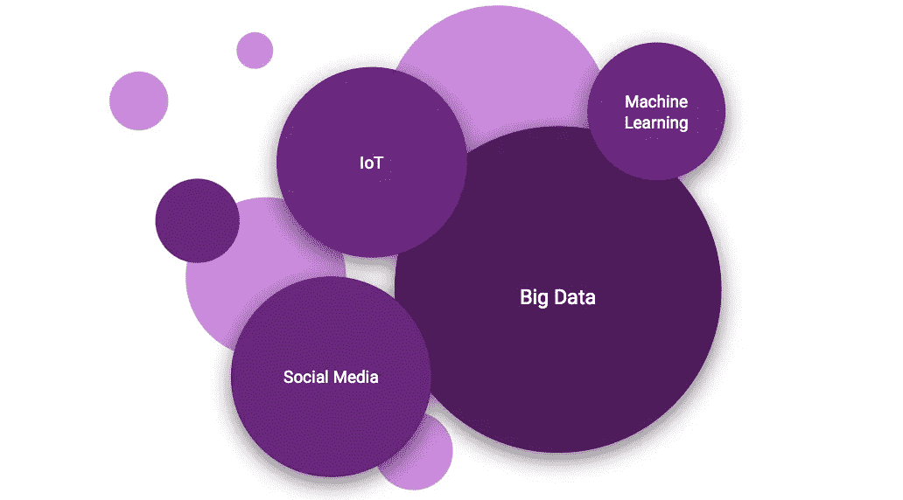
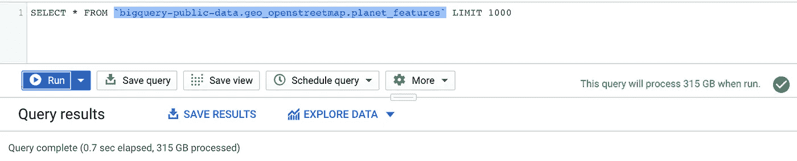

# 什么时候数据才算大数据？

> 原文：<https://towardsdatascience.com/when-is-data-considered-big-data-2f2b38942276?source=collection_archive---------36----------------------->

## 关于大数据这个流行词，你必须知道什么

妮娜·朗在 [Unsplash](https://unsplash.com/photos/AYCIZ2x1yIk?utm_source=unsplash&utm_medium=referral&utm_content=creditCopyText) 上拍摄的照片

大数据是指来自互联网、移动电话、金融行业、能源行业、医疗保健等领域的大量数据。以及智能代理、社交媒体、智能计量系统、车辆等来源。使用特殊解决方案对其进行存储、处理和评估[1]。

与大数据相关的领域和术语—按作者分类的图片

**4v 的**

为了处理、存储和分析数据，必须考虑以下四个挑战:

*   **数量**(数据总量——2025 年的数据将是 2017 年的八倍[2])
*   **速度**(数据生成和处理的速度，例如流媒体、IOT、社交媒体)
*   **多样化**(结构化和日益非结构化的数据)
*   **准确性**(缺乏数据质量和评估的专业知识)

## 技术方面

但是我们什么时候谈论大数据呢？必须收集多少数据才能被视为大数据？正常的数据存储技术通常以兆字节/千兆字节工作。**当数据量达到 TB/Pb 时，我们就在说大数据。**这一经验法则的原因是，当处理这种数据量时，传统系统不再足够强大，而且成本也明显更高。

大数据(存储)技术的典型特征是:

*   分布式存储
*   数据复制
*   本地数据处理
*   高可用性
*   数据划分
*   非规范化数据
*   处理结构化和非结构化数据

用谷歌的 BigQuery 在几秒钟内查询大量数据——作者图片

## 分析和可视化方面

通过使用大数据技术，使用和分析数据有了新的可能性:

*   通过更多可用的计算能力(关键词:云)，可以更快地处理/分析更大量的数据(例如，对于机器学习是必不可少的)
*   深度学习(基于大量数据，例如图像)
*   实现实时报告是必要的，例如在物联网领域

但是由于大量的数据，可视化领域也带来了新的方法和挑战。因此，必须创建新的可视化技术，以使数据量对用户来说更加有形。一些示例可视化是树状图、旭日图或文字云。

爱荷华州白酒数据的树状图示例—作者图片

## 未来会带来什么？

虽然就数据量而言，许多公司尚未进入大数据世界，但大数据的一两个特征可能适用于他们的数据。但是有一点是明确的:数据量将不断增长，即使不是指数增长，因此为这个主题做好准备也是有用的。人们在考虑他们的 IT 架构和系统环境时，需要考虑大数据。还有一点，深度/机器学习这个新兴领域，通过更多的数据进行训练，变得越来越高效。因此，该区域是大数据的完美补充。借助功能强大且易于使用的公共云提供商服务，人们能够更快、更轻松地处理、存储和分析大数据。这对于中小型公司来说尤其具有优势[4]。

## 结论

大数据绝对是一个时髦词，并不是每个公司都需要它。然而，大数据领域提供了巨大的优势和处理细节的新方法。然而，它带来了需要克服的技术挑战。有了公共云服务，这一挑战更容易应对。

> *“世界是一个大数据问题。”——作者安德鲁·迈克菲(Andrew McAfee)，麻省理工学院项目联合主任*

## 来源

[1]谷歌，【https://cloud.google.com/what-is-big-data】T2(2021)

[2]麦肯锡公司，[人工智能下一个数字前沿？](https://www.mckinsey.com/~/media/mckinsey/industries/advanced%20electronics/our%20insights/how%20artificial%20intelligence%20can%20deliver%20real%20value%20to%20companies/mgi-artificial-intelligence-discussion-paper.ashx) (2017)

[3] itsvit，[https://it svit . com/blog/big-data-information-visualization-techniques/](https://itsvit.com/blog/big-data-information-visualization-techniques/)

[4] Bernice M Purce **，** [大数据利用云计算](https://www.researchgate.net/publication/256888844_Big_data_using_cloud_computing) (2013)