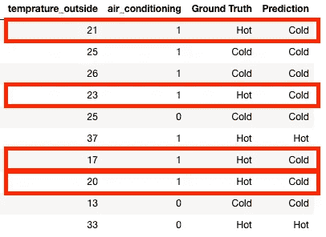
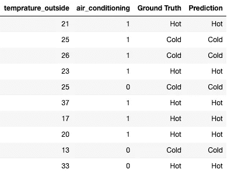
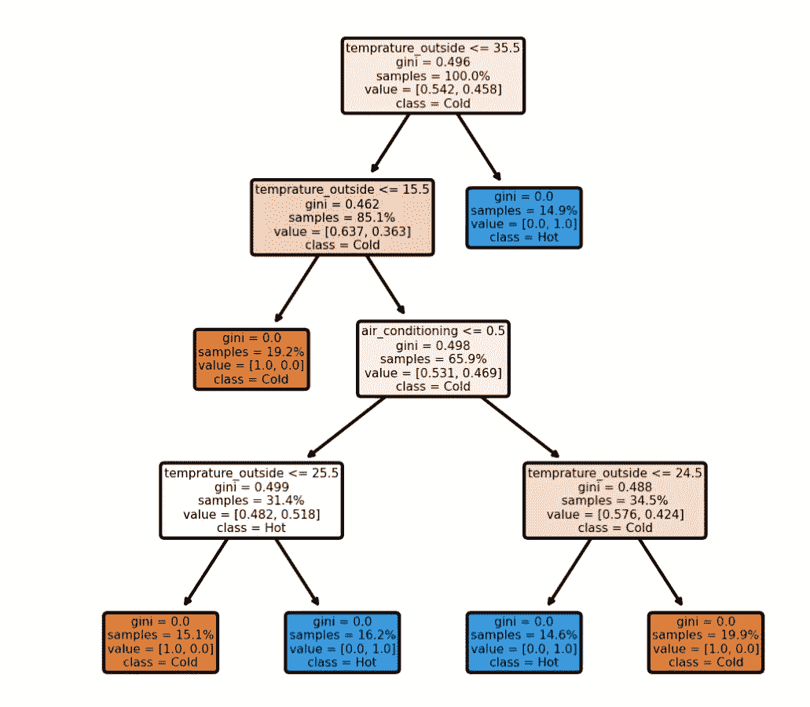

# 当逻辑回归不起作用时

> 原文：<https://towardsdatascience.com/when-logistic-regression-simply-doesnt-work-8cd8f2f9d997?source=collection_archive---------15----------------------->

## 逻辑回归不能正常工作时的一个简单例子


蒂姆·高在 [Unsplash](https://unsplash.com?utm_source=medium&utm_medium=referral) 上拍摄的照片

逻辑回归是从结构化表格数据中预测目标标签的一种非常常用的方法。虽然有一些更高级的方法通常表现更好，但逻辑回归的简单性使其成为首选。

然而，理解逻辑回归的局限性是很重要的。在这篇文章中，我想通过展示一个非常简单的用例来展示一些局限性，在这个用例中，逻辑回归不能很好地工作。

假设你想根据室外温度和空调是否开着这两个特征来预测室内温度是高是低。

让我们为此任务创建一个模拟数据集:

这是一个非常简单化的“室内温度”模型——空调外面冷就把外面的温度加 10 度，外面热就降低 10 度。热的定义是超过 25 度。而且如果空调关了，室内温度和室外温度是一样的。

将数据分成训练和测试:

训练逻辑回归模型:

以前 10 个测试用例为例，看看模型预测到了什么:



正如我们所看到的，10 个案例中，有 4 个被预测错了。

检查模型的准确性:

```
0.655
```

尽管生成该数据集背后的想法非常简单，但有大量的数据点，而且完全没有噪声，逻辑回归模型在该数据集上表现不佳。

原因是目标标签与特征没有线性相关性。在这种情况下，逻辑回归(或回归问题的线性回归)无法以良好的准确性预测目标(即使是在训练数据上)。

那么在这种情况下我们能做些什么呢？

我们可以使用另一个模型，一个非常简单的选择可能是决策树。

让我们看看它在测试集的前 10 个案例中的表现如何:



正如我们所看到的，决策树正确地预测了所有 10 个例子。

如果我们计算它的精确度:

```
1.0
```

这意味着决策树正确地预测了测试集的所有情况。

也许我们应该看看决策树的结构，以了解它是如何表现得如此之好的。



我们可以看到，它基本上搞清楚了逻辑——如果外面的温度超过 35.5 度(我们这里只有整数，所以 35 足够了)，房间里就会很热。如果外面的温度低于 15.5 度，房间里就会很冷。任何介于两者之间的事情都取决于空调是否开着。

一件有趣的事情是，通过更多一点的特征工程，我们可以使逻辑回归在这里工作。如果我们创建新的特征，以某种方式将室外温度与空调结合起来，让模型知道空调是在加热还是冷却，我们就使这个问题适合于用逻辑回归来解决:

```
0.99
```

我希望这篇文章能让你明白什么时候使用逻辑回归是好的，什么时候寻找其他方法更好，或者如何创建新的特性使你的任务更适合逻辑回归。