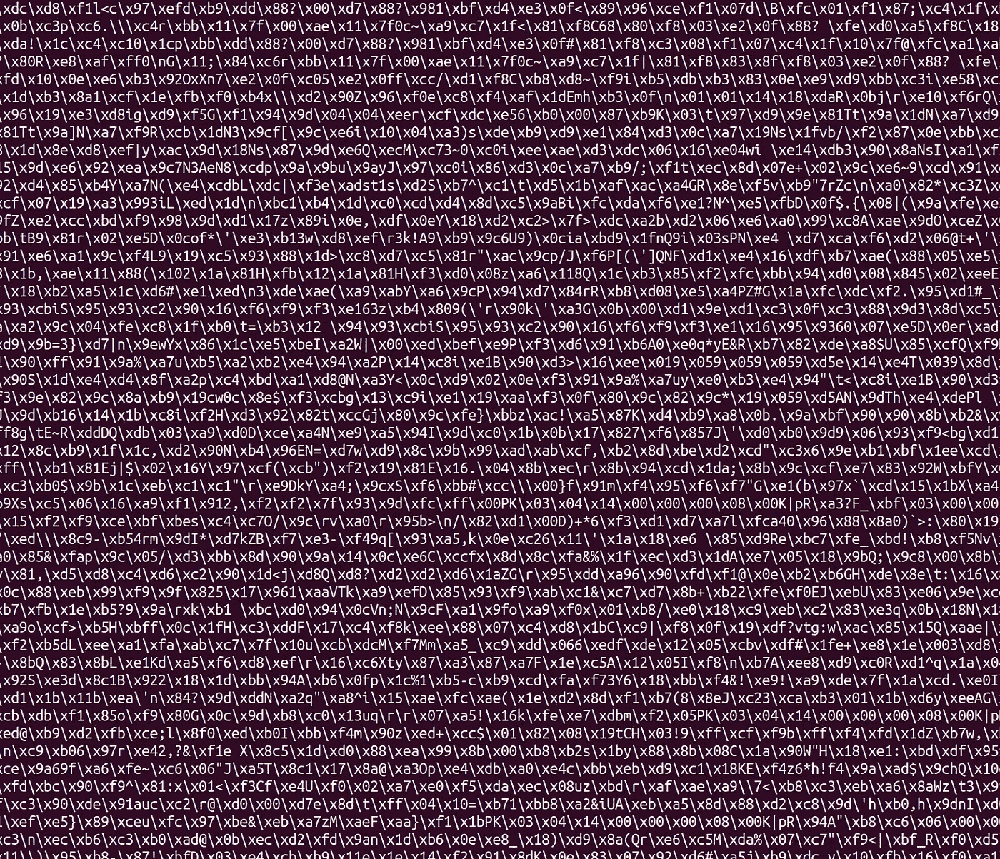
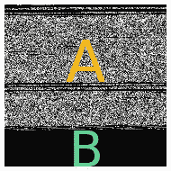
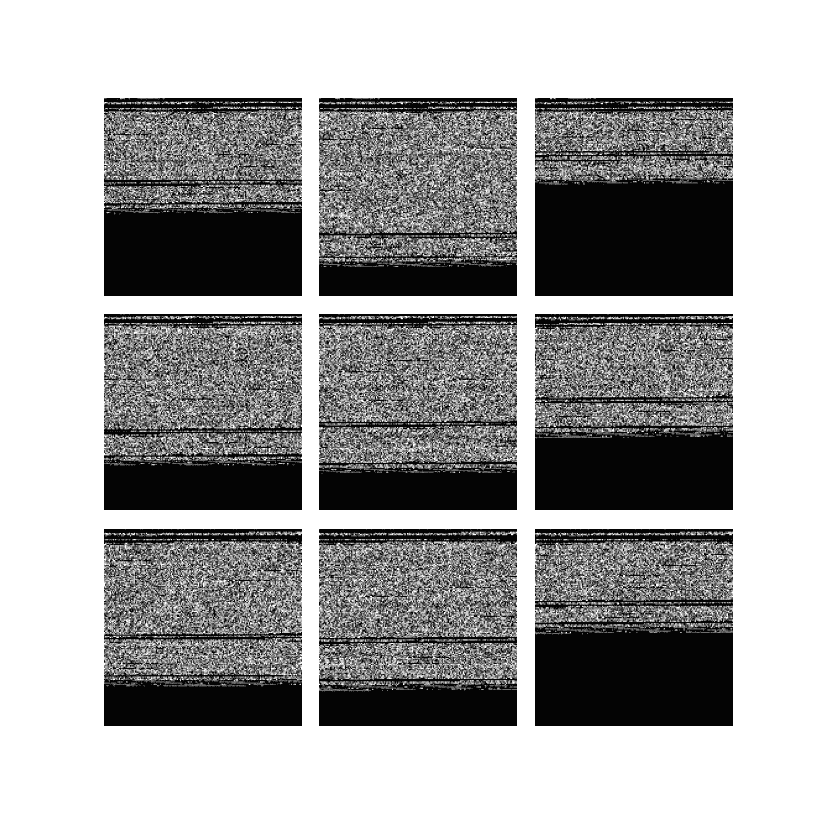
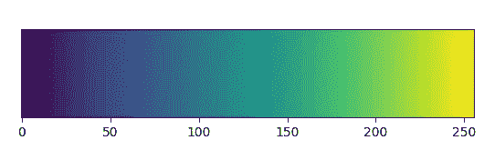
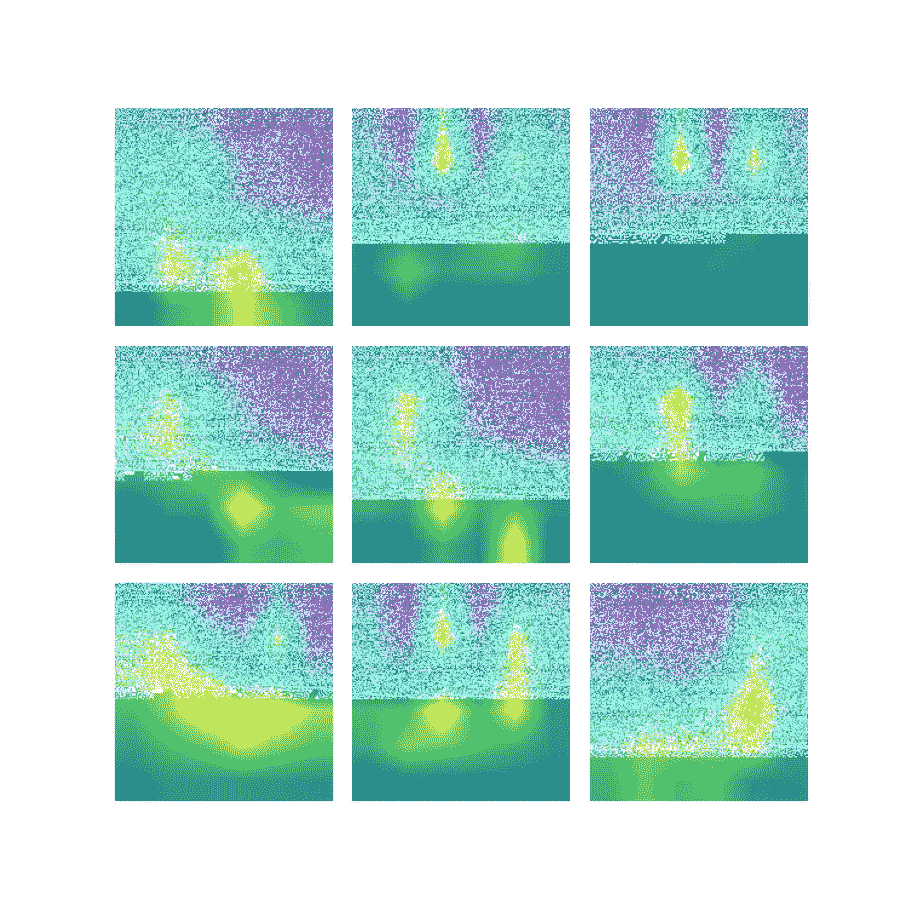
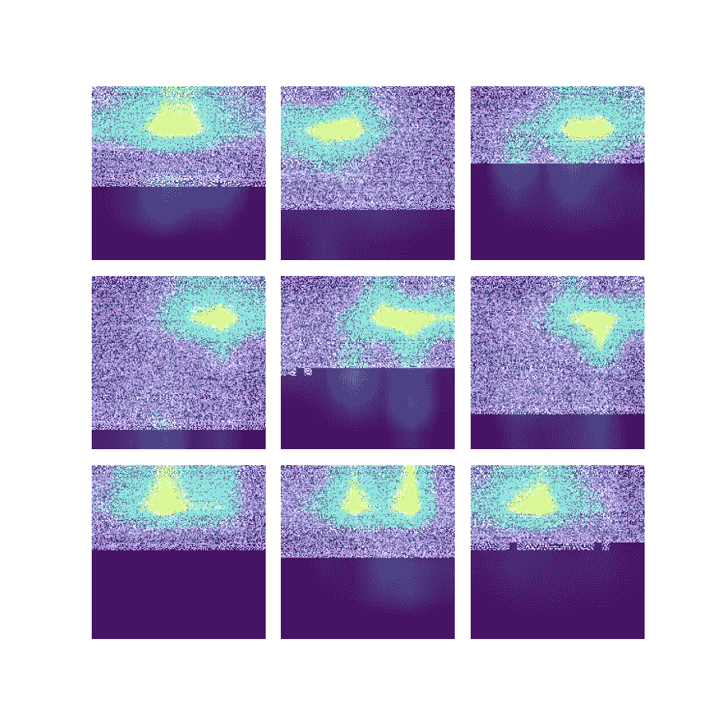

# 当一切都不确定时——用神经网络

> 原文：<https://towardsdatascience.com/when-nothings-certain-go-with-neural-networks-54e07516b87a?source=collection_archive---------29----------------------->

## 试图交付一个完美的软件解决方案并不容易。尤其是当你遇到一个不容易解决的问题时。

用 python 打印的我们的一个 *docx* 文件的字节表示(我是作者的*图像)*

在开发另一个项目时，我们的团队遇到了一个巨大的挑战——仅通过查看传入的数据来猜测接收的是哪种内容。这个想法来自于对发送给我们的文件内容是否是给定扩展名指定的内容的质疑。

在本文中，我们将详细描述基于文件内容识别不同类型文件的问题、解决此类问题的方法、可能解决方案的初步证明以及对结果的有趣解释。

# 各种不同的扩展

有这么多不同的文件扩展名，以及随之而来的编码和结构。有些是我们日常使用的。有些非常罕见，并且是特定于工作平台的。你可能对像 *png* 或 *txt* 这样的扩展名很熟悉，但是对于 *1st* 或 *diz* 呢？这些听起来不是每个人都熟悉的。但最重要的是，它们是以某种特殊的方式被创造出来的，所以认出它们应该不是不可能的。

说到找到合适的解决方案，有很多方法可以尝试。我们的团队正在使用 python，这就是为什么我们首先要寻找 python 模块——但不能就此止步，要走得更远。所有被检查的库都有一些共同点——要么根据文件头(大多数情况下是前 300 个字节)猜测文件的类型，要么在文件中搜索特定类型的短语。不幸的是，它们都不足以满足我们的需求——当 *zip* archives 遇到 *docx* 和 *xlsx* office 文件时，查看标题是有问题的，并且搜索特定类型的短语不能保证这些短语不是出于对文件进行编码以外的目的(例如，演示)。

出现了许多问题:如果归档中有一个未压缩的文档怎么办？如果有人将特定编码序列粘贴到文档中会怎样？如果将许多具有不同扩展名的文件合并成一个文件会怎么样？问了这么多问题，我们不确定如何建立这样一个灵活的解决方案。此外，我们真的希望它是自适应的，能够适应未知的新数据类型。

当谈到处理任何不确定性时，用神经网络武装起来的人工智能已经多次显示出它的优势。没有别的选择，我们决定试一试。

# 概念的初步证明

首先，因为我们没有太多的时间，无论我们试图实现什么都不能花太长时间，必须给我们足够的论据来决定我们是否在正确的道路上。我们已经定义了关键假设，以避免在流程中迷失方向:

*   使用卷积神经网络(CNN)
*   只为两个类准备数据 *docx* 和 *zip*
*   将文件二进制表示转换为图像输入数组(用于 CNN)
*   为了能够在训练模型之后回顾文件，并查看它对哪些部分感兴趣
*   要使用最大 32 千字节的文件

## 输入数据表示

由于使用卷积神经网络，输入数据必须从二进制表示转换为图像阵列表示。每个编码字符由相应像素的亮度表示(从 0-全黑到 255-全白)。输入的形状是 180 x 180 像素，这样我们就可以显示 32，400 个字符。

输入可以用以下几个部分来表征:

在我们的一个 docx 文件中标记的部分被翻译成图像(我*由作者*制作)

A 部分—这是文件的二进制内容所在的位置。

B 部分—填充图像其余部分的黑带，以防文件中的数据少于 32 千字节。

## 为什么用图像表示而不是顺序数据？

为了进行概念的初步验证，最好首先准备一个易于解释的解决方案，以便任何人都能够理解您实际在做什么，而不是直接跳到任何需要更复杂理解的东西，如递归神经网络或变压器模型。为可解释的人工智能提供了很好的工具 [tf-explain](https://github.com/sicara/tf-explain) 模块，您可以使用它轻松地向其他人展示训练模型的高级神经活动区域(决定性部分)。

## 为什么黑带是必要的？

当使用卷积神经网络进行数据分类时，必须为神经网络模型使用的所有训练、测试和验证数据确定固定的输入形状。对于这种特殊的概念验证，我们选择处理大小最大为 180 x 180 (~32 千字节)的文件。某些 *docx* 文档和 *zip* 归档文件所占用的空间可能会小于大约 32 千字节所确定的最大可能空间。这就是为什么有必要用可能的中性值填充我们输入的其余部分——在我们的例子中，黑带是底部用二进制零填充的结果( *\x00* )。

## 准备好的数据集

我们的小数据集由 115 个 docx 文件和 114 个 T2 压缩文件组成，这些文件是从个人文件和网上找到的。值得一提的是，出于好奇，一些 *docx* 文件被附加在 *zip* 档案中，作为额外的复杂性级别(看看这样的实验在没有大型数据集的情况下是否可行)。

下面，你可以看到我们的 *docx* 和 *zip* 文件转换成图像的例子:

由图像表示的数据集文件的示例网格—使用 matplotlib 库生成(I*image by author*)

## 神经网络模型

为了让事情变得简单，我们决定使用在官方文件中找到的卷积神经网络模型。如果你开始你的机器学习之旅，这就是你应该做的——只需谷歌必要的东西，检查你已经找到的东西，并根据你的需要进行调整。一开始没什么特别的。

# 结果及其解释

在训练我们的模型 100 个时期后，我们已经达到了 98.4%的准确率。当试图预测未知文件的类型(两个类中的 16 个文件)时，我们获得了 99.1%的平均准确率。

## 我们能指望准确性吗？

作为衡量我们所构建的潜力以及结果如何随时间变化的指标之一，这是我们可以使用的指标。但是如果您想要构建生产就绪解决方案，请记住不要忘记准备好您的测试集。如果这不会花费你太多的时间，只需查看数据并一步一步地手动构建您的集合——只有这样，您才能找到任何更可靠的指标。

## 预测 *docx* 文件的决定性区域

为了更准确地了解我们的模型所关注的内容，我们使用了前面提到的 tf-explain 模块和 GradCAM explainer，这有助于我们找到高度神经活动的区域——这在决定特定文件是否将被分类为 *docx* 或 *zip* 时非常重要。

使用 [*绿色*色图](https://matplotlib.org/stable/tutorials/colors/colormaps.html)标记活动水平，其中 0 表示特定像素上的最低活动，255 表示最高活动。GradCAM explainer 将此颜色贴图用作默认贴图。

用 matplotlib 库生成的 Viridis 颜色图(I *作者的图像*

下面你可以看到对一些 *docx* 文件的解释:

TF-解释模型神经活动的 GradCAM 结果，同时对我们的一个 docx 文件进行分类——使用 matplotlib 库创建(I*image by author*)

每张图片代表一个特定的 *docx* 文件，该文件被转换成图像并标有*绿色*颜色图。根据文档的内容，活跃度会有很大的不同，例如，在第一个示例中，我们可以看到内容底部的活跃度最高，而在接下来的两张图片中，活跃度最高的是中上部。有趣的是，该模型考虑了相当大的区域来判断它是否是 *docx* 类型的文件。

## 填充如何影响结果？

我们选择的表示输入数据的方式有助于做出更准确的预测，但也会因为观察到与特定情况无关的部分而产生干扰。

让我们来看看下图:

TF-解释我们的一个 docx 文件的 GradCAM 结果，该文件在图像的中性部分有明显的神经活动

您还记得 model 通过查看背景而不是与分类对象相关的部分来对图像进行高精度分类的案例吗？比如在对动物进行分类时查看树木。

我们的情况没有什么不同——模型确实会查看我们为填充输入形状的其余部分而创建的黑带。

但这有错吗？

回答这个问题时有两个想法需要考虑。

首先浮现在脑海中的其中一个问题提示我们这是不正确的——谁会通过观察一个物体以外的任何东西来对这个物体进行个人分类，尤其是当它是一个在预测时应该保持中立的人工附加部分时？

第二个告诉我们试着去理解——为什么我们会认为这样的部分是相关的？在许多情况下，当涉及到发现未知的数据特征时，重要的是不要将可以看到的内容缩小太多—总有更多的东西是不确定的，可以帮助我们找到一种更简单的方法来执行复杂的分类，只需说一个文件比其他文件小，这在一些抽象的情况下可能是真的。

在我们的情况下，这是第一个。但是记住这一点——它并不总是不相关的。

## 预测 *zip* 档案的决定性领域

我们还对 *zip* 文件执行了相同的活动级别检查:

TF-解释模型的神经活动的 GradCAM 结果，同时对我们的一个 zip 存档进行分类——使用 matplotlib 库创建(I*image by author*)

与 *docx* 文件相比， *zip* 文件的活动图彼此更加相似，在图像上的扩散程度也更低(完全集中在特定区域)。

## *zip* 档案中包含的 *docx* 文件呢？

即使没有使用太多的例子，该模型预测的 zip 类也令人惊讶地好——在每张测试图像上都达到了 98%以上的准确率。

在试图交付一个完美的软件解决方案时处理不确定性并不容易。很多时候，我们每个人都会走到走进死胡同的那一步。在那个时候，记得检查记录良好的机器学习算法。在许多情况下，简单的神经网络是可行的——你不必成为解决问题的数据大师。

敬请期待！