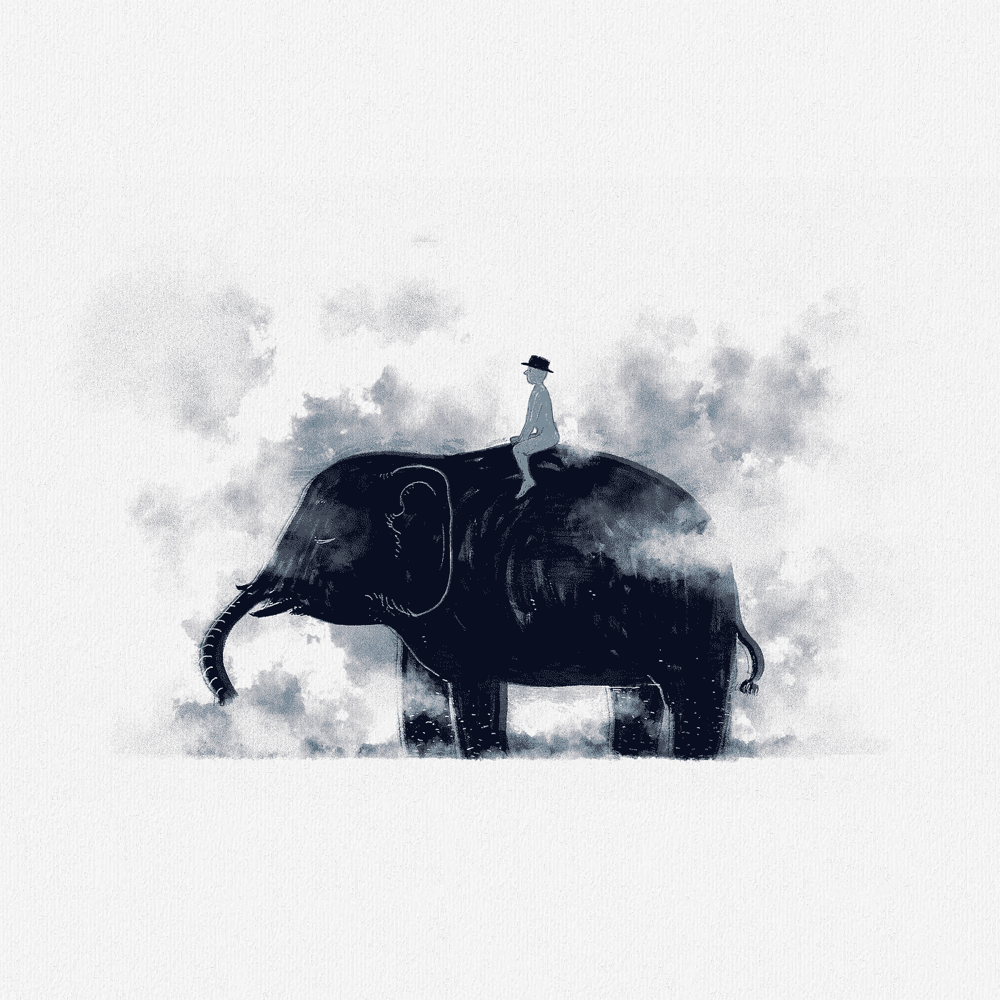

# 当熊猫不再为我召唤熊时，我知道我已经成为了一名数据科学家

> 原文：<https://towardsdatascience.com/when-pandas-stopped-conjuring-bears-for-me-i-knew-i-had-become-a-data-scientist-8b6142697fd5?source=collection_archive---------4----------------------->

## [入门](https://towardsdatascience.com/tagged/getting-started)

## 作为一名年轻的数据科学家，有三件事不用担心

图片由 [Kankanravee Kanyawath](https://pixabay.com/users/once1nueng-7520188/?utm_source=link-attribution&utm_medium=referral&utm_campaign=image&utm_content=5544856) 来自 [Pixabay](https://pixabay.com/?utm_source=link-attribution&utm_medium=referral&utm_campaign=image&utm_content=5544856)

熊一直困扰着我的职业生涯。

当我还是心理学研究生的时候，我们听说过一个叫丹·韦格纳的研究员，他因研究多余的想法而出名。在他臭名昭著的实验中，他将证明如何要求人们不要去想事情，比如白熊，会适得其反，并导致与人们被要求抑制的事情相关的高侵入性想法。“白熊现象”或者更恰当地称为“讽刺过程理论”有助于解释各种心理问题。

离开研究生院后不久，我发现自己又一次面对熊。这次他们是熊猫。我记得我觉得 Python 库的名字很有趣，当我开始学习如何使用它来分析数据时，我的想法被黑白相间的皮毛图像打断了。

但是这些侵扰性的熊的想法并没有持续多久。随着我对数据科学的了解越来越多，也越来越擅长使用熊猫库来操作数据，我的真实熊猫图像慢慢被数据帧和代码行所取代。

随着这些心理图像的改变，我知道我不再是一个压抑白熊想法的绝望的心理学家，而是一个数据科学家，一系列全新的焦虑浮现在我的脑海中。

以免你认为这篇文章仅仅是关于熊的，事实并非如此。相反，这篇文章是关于这些年来那些熊在我身上唤起的东西，主要是焦虑。

因此，我想重点谈谈年轻的发展中的数据科学家面临的 3 个常见焦虑。我也在那里，我也面对他们，但最终胜出。在此，我分享我在这个领域工作了近 15 年后，现在如何看待他们。所以，不要再说白熊和熊猫了，让我们为数据科学的学生介绍一下房间里的其他大象吧！

Image by [愚木混株 Cdd20](https://pixabay.com/users/cdd20-1193381/?utm_source=link-attribution&utm_medium=referral&utm_campaign=image&utm_content=4057425) from [Pixabay](https://pixabay.com/?utm_source=link-attribution&utm_medium=referral&utm_campaign=image&utm_content=4057425)

数据科学教育和焦虑似乎是相辅相成的。数据科学是许多不同技能的复杂组合。它包含了许多不同的技术，需要对数学模型有所了解，并且最适合批判性思维。由于其复杂性，在学习数据科学时存在许多不确定性。这种不确定性造成了很多焦虑。

# 焦虑#1:专注

年轻数据科学家最大的担忧之一是知道应该重点学习哪些技能。事实上，就在几天前，我参加了一个由大学主办的会议，会议由一群不同的年轻数据科学家参加。在分组讨论中，一名学生问道:

> “你认为哪些技能是我最需要关注的？”

关注的核心是认识到这个领域正在迅速发展，随着任何领域的发展，专业化越来越成为一个问题。当您可以雇佣一位对适用于特定业务问题的有限工具集非常了解的数据科学家时，为什么要雇佣一位对许多数据科学工具略知一二的数据科学家呢？

专家的问题是，一旦他们解决了手头的问题，他们对公司的效用就降低了。多面手的问题是，在处理新用例时，需要多花一点时间进行实验。

归根结底，专业化非常重要，因为它提供了学习数据科学过程的环境。也就是说，专业化不应该是目的，而是学生学习数据科学如何更普遍地工作的一种手段。因此，对于学生来说，重要的是集中精力学习一套专门的技能，同时认识到这些技能如何推广到其他用途。

这里的关键是要认识到，最重要的不是特定的技能组合，而是你能够将复杂的技能组合起来，并解决问题。

少关注你应该学习的具体技能，多关注用你所学做一些有用的事情。你控制着潜在雇主或客户的叙述，所以确保你能证明你知道如何应用一套专门的工具来解决一个专门的问题。更进一步，解释同样的过程如何应用到与他们更相关的用例中。

简而言之，你应该关注的技能是理解你所学的特定技能如何也是适用于大多数数据科学问题的更基本过程的一部分。演示如何快速从学习转向应用。

# 焦虑#2:自信

第二个焦虑是信心。大多数年轻的数据科学家对自己用新获得的技能解决业务问题的能力缺乏信心。缺乏自信是由两种主要力量激发的:复杂性和自我。

我说的复杂是什么意思？

Python 中最流行的数据科学库之一是 Scikit-Learn (sklearn)。Sklearn 包含了近 200 种不同的模型或“[估算器](https://scikitlearnjl.readthedocs.io/en/latest/models/#:~:text=scikit%2Dlearn%20has%20on%20the,neural%20nets%2C%20...))”这只是一个数据科学库。此外，过多的深度学习模型架构、混合和集成以及模型的选择是压倒性的。更不用说可用于预处理数据和部署解决方案的所有技术，这两者都对整体成功有影响。

所有这些复杂性增加了高度的不确定性，从而降低了信心。

第二种影响自信的力量是自我。将术语“科学”作为其定义的一部分的数据科学伴随着学院科学家的包袱而来。也就是说，这个领域中有一些自大的人，他们乐于评判进入这个领域的新数据科学家的能力。

这些自负会让人觉得数据科学在商业中的应用比实际情况更加僵化。底线是，没有人知道所有的事情，尤其是在数据科学领域。

对你所知道的要有信心，因为你已经成功地应用了它。因为你不断地应用新的东西，所以要对你能够学习的东西建立信心。

# 焦虑#3:适当性

我要分享的最后一个焦虑是恰当性，我看到很多学生也在经历这个问题。这种焦虑与信心有关，但延伸到对什么是数据科学的“适当”使用的担忧。例如，我过去总是质疑我的解决方案是“正确的”还是“正确的”我从来没有意识到，对于大多数商业问题来说，没有一个单一的“正确的”或“正确的”解决方案。

此外，有太多的可能性让我们无法知道绝对的“最佳”解决方案。所以与其担心你的解决方案是否合适，不如多关注你的解决方案是否通过解决一个问题带来价值。下面是一个向消费者展示价值的简单框架:

> 考虑一个好的基准，比如一个现有的过程、人为错误(人类每小时大约犯 3-6 个[错误](https://www.linkedin.com/pulse/human-factors-error-role-bad-luck-incident-graham-edkins#:~:text=So%20just%20how%20normal%20is,3%2D6%20errors%20per%20hour)，或者一个基线模型。
> 
> 围绕该基准构建您的解决方案，以展示其价值。
> 
> 基于业务需求、反馈和使用新数据进行的持续性能评估，从那里进行迭代。

以上只是我职业生涯早期经历过的一些更常见的焦虑，该领域的学生直到今天仍在表达。我希望你发现这有助于设定期望，并为你提供一些帮助克服这些焦虑的见解。

比如参与学习数据科学、职业发展或糟糕的商业决策？[加入我](https://www.facebook.com/groups/thinkdatascience)。