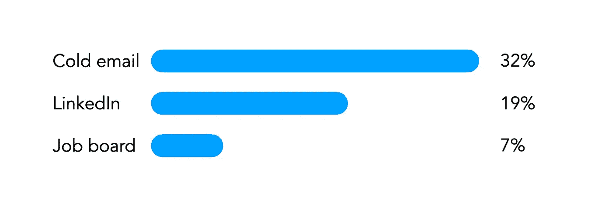
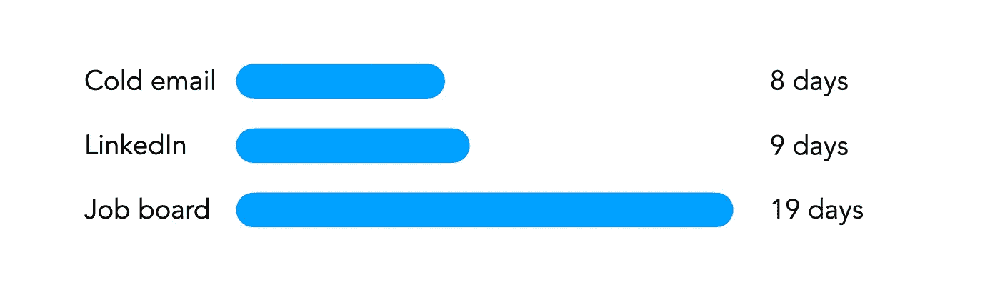
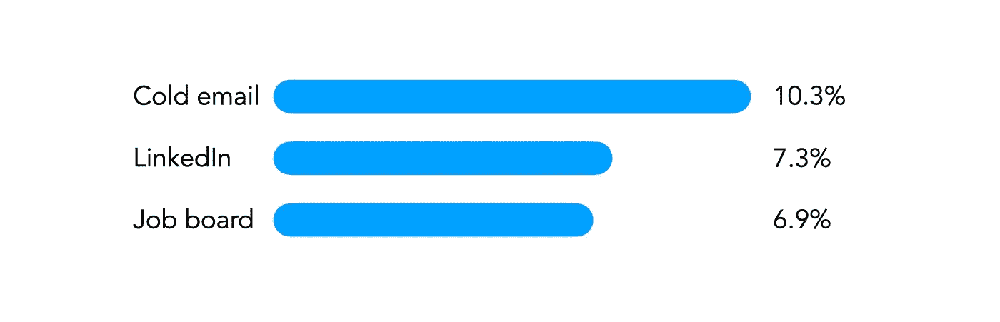
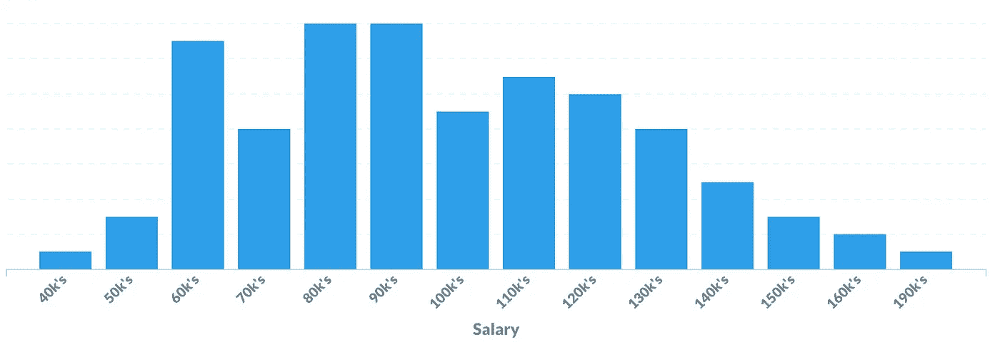
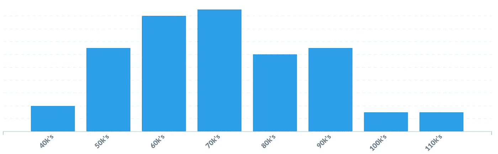

# “我应该什么时候收到回信？”以及其他痛苦的问题——用数据回答

> 原文：<https://towardsdatascience.com/when-should-i-hear-back-and-other-painful-questions-answered-with-data-cd06edb1976a?source=collection_archive---------18----------------------->

## [办公时间](https://towardsdatascience.com/tagged/office-hours)

## 用实际数据讲述的求职故事

避免“我什么时候会收到回复”的焦虑，让你自己免于尴尬的去看牙医——图片由 [Unsplash](https://unsplash.com/photos/-2vD8lIhdnw) 提供

求职过程中最大的问题之一是缺乏可操作的数据。

没有数据，求职者对自己的处境一无所知。是我的简历很糟糕，还是只有这种难得的回音？我现在应该得到一份工作了吗，或者我的经历对这个就业市场来说是正常的吗？这个提议合理吗，或者我应该谈判吗？更一般地说:*我的经历是典型的，还是我做错了什么？*

一个人对这些问题得不到答案的时间越长，就会越自我怀疑。

我看到市场上一些最有前途的数据科学家公开质疑自己的能力，这都是因为他们在没有正确背景的情况下，在艰难的经济或异常竞争的就业市场中航行。

很难找到合适的上下文。大多数人所能做的最好的事情，就是通过听取新员工的经历，来满足于轶事数据。但是求职是非常随机的，每个人的经历都不一样。为了真正了解就业市场，你需要几千份工作申请的回复率、面试率、回复时间和许多其他参数的大量统计数据(实时更新)。

在[sharpes minds](http://sharpestminds.com)，我们已经帮助数百名学员找到了数据科学领域的工作。我们处在一个独特的位置，可以从他们求职的大量统计数据中了解就业市场。这是我们的发现。

**就这么难得听到回音？**

即使是最好的申请人也经常得不到他们申请的公司的回复。但是响应率是非常多变的，并且在很大程度上取决于您决定采用的应用程序策略。以下是我们发现的三种不同申请策略的平均回复率:求职公告板申请、LinkedIn DMs 和冷冰冰的电子邮件(所谓“冷冰冰的电子邮件”，我指的是突然向某人传达一条深思熟虑的定制信息)。

我应该在这里补充一点，尽管这些招聘信息看起来很糟糕，但实际上可能更糟糕。这是因为求职公告板的回复率非常不均衡:对于极少数求职者来说，回复率确实很好(在某些情况下，回复率可能高达 30%)，但对于大多数人来说，回复率确实很糟糕。回复率中值接近 2%。

这个故事的寓意是:尽量避开求职公告板，除非你有可能被求职者跟踪系统发现的经验——尤其是如果你所在的领域工作机会稀缺，你需要让每一份申请都有价值。

我现在应该收到回复了吗？

很少有什么事情比在申请或面试后怀疑自己是否逾期未得到公司的跟进更让申请者紧张的了。这是可以理解的:如果许多公司不想前进，他们会让你见鬼去，这意味着没有消息往往是坏消息。但是你什么时候应该永远放弃一份申请呢？

以下是我们发现的每种应用策略的平均响应时间:

**面试真的那么难吗，还是我有什么问题？**

收到 LinkedIn DM 或冷冰冰的电子邮件的回复本身就有价值。它可以带来信息交流，甚至是潜在的导师。但是正如我们在上面看到的，这意味着你会很快收到回复，如果没有别的事情的话——拒绝或者其他。

但是得到回音并不是申请的真正目的——你想要的是一次面试。在这一点上，应用策略的表现如何？每个人获得面试机会的可能性有多大？

在你看到这些数字并决定求职公告板到底好不好之前，你可能应该知道，尽管 LinkedIn 的申请看起来*像是给求职公告板一个类似的面试机会，但根据我们的数据，它们实际上导致获得工作机会的概率*高出*3 倍。*

通过与我们的导师(其中许多人本身就是招聘经理)交谈，我们认为我们知道为什么:向招聘经理发送定制信息，让你有机会在进入正式流程之前，在非正式场合与招聘经理建立联系。这是给人留下好的第一印象的好方法，也是展示你对公司或职位所做的研究的好方法。这种印象会产生持续的积极影响。

这个报价合理吗，或者我应该谈判吗？

SharpestMinds 在美国和加拿大都有业务，我们发现按国家划分我们的工资数据很有用，因为信不信由你，在货币调整的基础上，加拿大的数据科学家、分析师和机器学习工程师的收入大约是美国同行的一半！

以下是我们过去六个月在美国雇佣的学员的薪资数据:

这是加拿大学员的相同情况:

顺便说一下，“我应该谈判吗？”几乎总是*是的。*只要你合理地提出你的要求(例如，“我认为我们接近一个可行的数字，我真的很想加入这家公司，但还有 3000 美元的加薪空间吗？”)，公司能做的最糟糕的事情就是拒绝你的要求，坚持最初的提议。即使是入门级的数据科学家和分析师通常也比他们想象的有更多的谈判空间。

**我的求职经历是典型的，还是我做错了什么？**

我们从研究这些数据中学到的最大的一个教训是，人们在求职过程中的经历是多么的不同。

一些学员开始找工作，并在几周内被录用。还有的在积极寻找 3 个月、6 个月甚至 12 个月。您的里程可能会有所不同。

但平均而言，我们发现，从他们获得导师的技术支持(意味着他们的导师认为他们已经做好工作准备)开始，学员需要 3 到 6 个月才能找到工作。

**做什么？**

如果你找工作的时间已经超过 6 个月，那可能只是运气不好——你可能只是在分布的远端。

但这也可能是一个暗示，你需要改进你的简历，改变你的申请策略，或者提高你的面试和技术技能。在一天结束的时候，唯一确定的方法就是努力地跟踪你的申请。一旦你这样做了，你就可以将你的回复率和面试率与我们在这里分享的典型值进行比较，希望能更好地了解你的立场。

如果事实证明你得到的面试机会明显少于正常水平，你可能需要找人来审核你的简历和 Linkedin 个人资料。

如果这不是问题所在，那么你可能需要关注你的面试技巧。模拟面试是一个很好的主意，和那些也在积极面试的同行交流也是一个很好的方法。

如果在那之后，你需要一些额外的支持，[我们很乐意帮助](https://www.sharpestminds.com)！