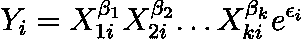
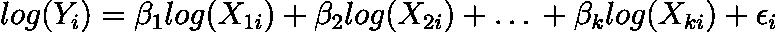
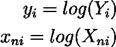
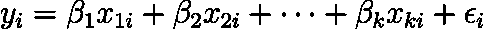
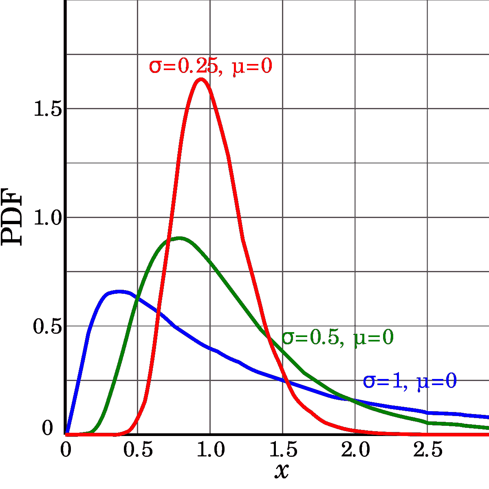
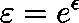
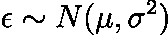
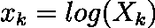
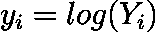

# 我们什么时候应该使用对数线性模型？

> 原文：<https://towardsdatascience.com/when-should-we-use-the-log-linear-model-db76c405b97e?source=collection_archive---------12----------------------->

## 线性模型的一个有吸引力的替代方案

图片由 Gerd Altmann [Pixabay](https://medium.com/u/a640208c527a?source=post_page-----db76c405b97e--------------------------------) 提供

世界不是线性的。这是一个人人皆知的简单陈述。然而，它给我们的建模方法带来了有意义的结果。学术界和工业界使用的绝大多数模型都是线性模型。

所考虑的现象的线性假设是非常武断的。对于包含少量观测值的研究来说，这通常是必要的，因为它有助于参数估计。当我们有较大的观察样本时，我们可以考虑因变量和自变量之间的非线性相关性。为此，我们可能需要估计一个非线性模型。这些类型的模型需要更先进的估计技术和计算能力。然而，这种方法有一个重要的替代方案。也就是说，我们可以用变换变量的线性模型的平均值来近似非线性关系。

# 对数线性模型

可以简化为线性模型的广泛使用的模型是由以下函数形式描述的对数线性模型:

对数线性模型和线性模型的区别在于，在对数线性模型中，因变量是独立变量的乘积，而不是总和。通过对上述方程的每一侧取对数，可以很容易地将该模型转换成线性模型:

只需替换为:

其中 n = 1，2，…，k，我们得到一个纯线性模型:

# 什么时候用？

如果我们使用对数线性模型，我们必须记住，我们是在计算因变量和自变量的对数。因此，变量应该只有正值，因为负值的对数不存在。

出现的问题是，在考虑使用对数线性模型时，我们应该观察变量的哪种分布。长话短说:对数正态分布。

不同均值和标准差的对数正态分布。来源:https://en.wikipedia.org/wiki/Log-normal_distribution

当我们的误差项等于正态分布误差的指数时，我们得到对数正态分布:

我们可以观察到，如果误差项具有对数正态分布，那么它的对数也具有正态分布。我们还知道，正态分布变量的线性组合也具有线性分布。因此，如果对数线性模型中的所有变量都具有对数正态分布，则:

正态分布。因此，我们看到，在实践中，当因变量和自变量具有对数正态分布时，我们应该使用对数线性模型。另一方面，当那些变量是正态或接近正态时，我们应该坚持简单的线性模型。

# 参考

[1][https://en.wikipedia.org/wiki/Log-normal_distribution](https://en.wikipedia.org/wiki/Log-normal_distribution)

[2]迈尔斯基，耶日。 *Ekonometria。*2009 年，UW WNE