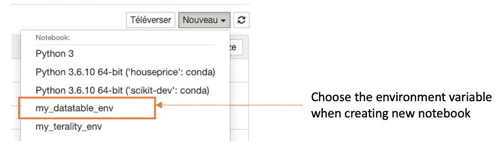
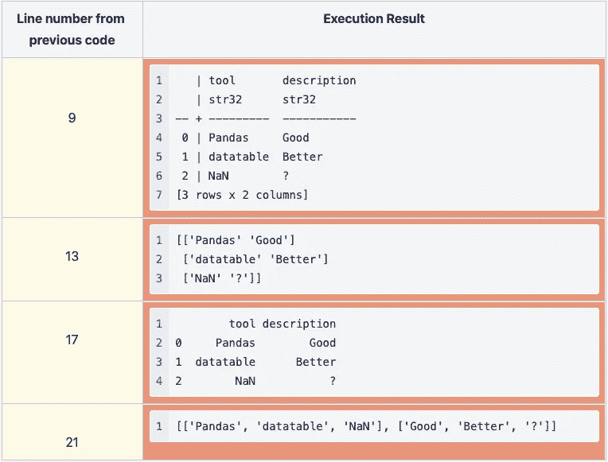
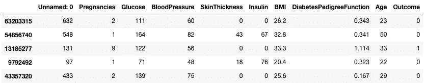
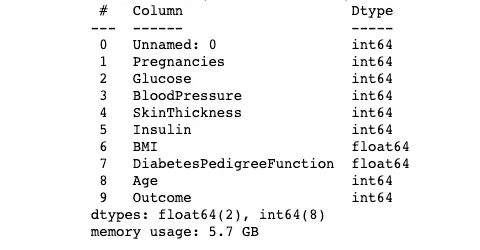
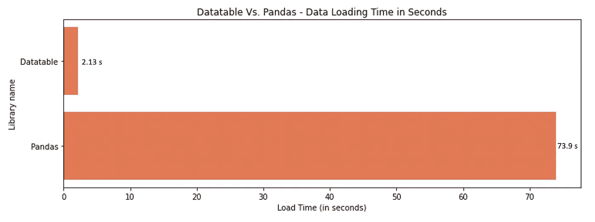
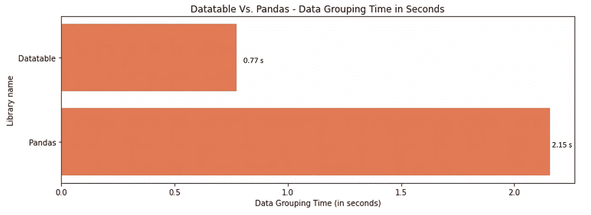
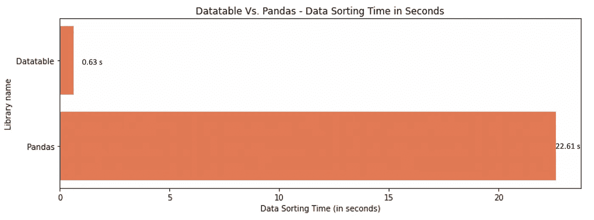

# 什么时候应该考虑用 Datatable 代替 Pandas 处理大数据？

> 原文：<https://towardsdatascience.com/when-should-you-consider-using-datatable-instead-of-pandas-to-process-large-data-29a4245f67c6?source=collection_archive---------9----------------------->

## 在处理大型数据集时，使用熊猫可能会令人沮丧。数据表可能是解决方案。

照片来自 [Unsplash](https://images.unsplash.com/photo-1534078362425-387ae9668c17?ixlib=rb-1.2.1&ixid=MnwxMjA3fDB8MHxwaG90by1wYWdlfHx8fGVufDB8fHx8&auto=format&fit=crop&w=3269&q=80)

# 介绍

Pandas 在主要使用 Python 的数据科学家的数据分析工具中脱颖而出，因为它的易用性和它为数据处理提供的灵活性。尽管有这些好处，但不幸的是，在处理非常大的数据集时，它并不那么有效。有工具可以克服这一挑战。

下面是 [Datatable](https://datatable.readthedocs.io/en/latest/) ，一个用于处理表格数据的 python 库。它是最有效的工具之一，支持内存不足的数据集、多线程数据处理和灵活的 API。在本文中，我们将介绍数据表的一些基础知识，并与熊猫进行比较分析。

# 不使用熊猫的理由很少

以下是你不应该使用熊猫的两个主要原因:

*   **内存管理**:由于 Pandas 为内存分析提供了一个数据结构，它有时需要 10x 的内存数据集。要做到这一点，您必须确保您的机器上始终有足够的内存。
*   **代码执行的高时间复杂度** : Pandas 的设计并没有有效地利用计算能力。默认情况下，它使用单个 CPU 内核作为单个进程来计算其功能。

# 什么是数据表，如何设置它

图 1:来自 [H2O 的数据表徽标/数据表 github](https://repository-images.githubusercontent.com/83748372/f6f9ab80-0960-11eb-898e-9406da6fe342)

正如简介中所解释的， [Datatable](https://datatable.readthedocs.io/en/latest/) 是一个 python 库，用于在单节点机器上以可能的最高速度执行大型数据处理(高达 100GB)。Datatable 项目始于 2017 年，第一个用户是[无人驾驶. ai](https://www.h2o.ai/driverless-ai/) 。

Datatable 的一个重要特性是它与 Pandas/NumPy/pure python 的互操作性，这使得它为用户提供了轻松转换到另一个数据处理框架的能力。

## 数据表入门

运行本文的代码有两种选择。

*   ***第一个选项*** :本文中使用的那个，当你想在自己的机器上运行一切的时候。
*   ***第二种选择*** :使用[我制作的 colab 笔记本](https://colab.research.google.com/drive/1zmCcvT1Y_wlS0ZBEst9yRuSdpxxruuGF?usp=sharing)，运行不同数值的实验。

1.  ***安装数据表库***

安装很简单，可以在 macOS、Linux、Windows 上用下面的命令行执行。

对于安装，我建议您首先创建一个环境变量，以防您有一个与 Datatable 不兼容的 [python 版本。](https://datatable.readthedocs.io/en/latest/start/install.html)

确保在激活环境变量后运行以下指令。

最后，您可以在创建新的笔记本文件时选择环境变量，如下所示。

图 2:创建新的。ipynb fine(图片由作者提供)

2. ***数据表基础***

在开始对 Pandas 和 Datatable 进行比较分析之前，让我们通过运行下面的代码来确保我们的安装一切正常。

图 3:代码执行结果(图片由作者提供)

现在我们确信安装过程一切顺利，我们终于可以开始了！

# 数据表与熊猫——让我们进行比较分析

## 基准数据集

使用来自 Kaggle 的[糖尿病数据集，我将每一行复制了 10 万次，最终得到 76 80 万行(令人震惊🤯不是吗？)以便我们可以有足够大的数据集来执行适当的比较。最终数据集大小为 5.7 GB。](https://www.kaggle.com/mathchi/diabetes-data-set)

下面是来自基准数据集的 5 个随机样本。

图 4:来自基准数据的五个随机样本(图片由作者提供)

## **1。数据加载**

此分析的目标是确定包含 76 800 000 行的同一数据集的加载时间。

图 5:熊猫和 Datatable 的数据的内存使用量是 5.7 GB(图片由作者提供)

Pandas 和 Datatable 都使用相同的内存来存储数据。但是它们加载的时间不一样。

图 6:熊猫数据加载时间:78 秒，数据表:2.13 秒(图片由作者提供)

从上面的图 6 中，我们可以注意到用 Pandas 加载数据集需要大约 74 秒，而 Datatable 只需要不到 3 秒。总的来说，Datatable 比熊猫快 34 倍。34 是 73.9/2.13 的结果。

## **2。卸载数据**

我们通过加载 Datatable 和 Pandas 格式的数据开始实验。但是，我们可能希望将数据转换成不同的格式。让我们将 Numpy 视为目标格式。

图 7:熊猫的数据卸载时间:16.62 秒，数据表:6.56 秒(图片由作者提供)

从上面的图 7 中，我们观察到在将数据卸载到 NumPy 数组方面，Datatable 仍然胜过 Pandas。对于熊猫来说，这个过程需要 16.62 秒，而 Datatable 只需要 6.55 秒。总体数据表比熊猫快 2 倍。

## **3。分组数据**

Datatable 也有分组功能，类似于 Pandas。让我们计算患者的平均年龄，并根据结果值(0 和 1)进行分组。

第五行中的**。f** 变量是 Datatable 的原生变量，它提供了一种方便的方法来引用框架中的任何列。

图 8:熊猫数据分组时间:2.15 秒，数据表:0.77 秒(图片由作者提供)

从图 8 中，我们可以注意到 Pandas 在分组数据时比 Datatable 慢 2 倍。

## 4.分类数据

医生可能希望根据怀孕次数从低到高对患者的数据进行排序，以便进一步分析。这是我们的计算方法。

图 9:熊猫的数据排序时间:22.61 秒，数据表:063 秒(图片由作者提供)

Datatable 在相同的列上破坏了熊猫的数据排序！它的运行时间比熊猫快大约 36 倍。

# 结论

基于前面的比较分析，我们可以观察到 Datatable 库优于 Pandas。然而，当使用非常小的数据集(例如，少于 1000 行)时，使用 Pandas 而不是 Datatable 可能会有所不同，因为时间执行间隔非常小(2 毫秒)。

我希望这篇文章能够帮助您清楚地了解为什么应该在 Pandas 上使用 Datatable，以及它如何通过将您的大数据处理提升到一个新的水平来为您的组织增加价值。您可以在下面找到更多资源。

在 [YouTube](https://www.youtube.com/channel/UC9xKdy8cz6ZuJU5FTNtM_pQ) 上关注我，了解更多互动环节！

# 额外资源

[数据表文档](https://datatable.readthedocs.io/en/latest/index.html)

再见🏃🏾