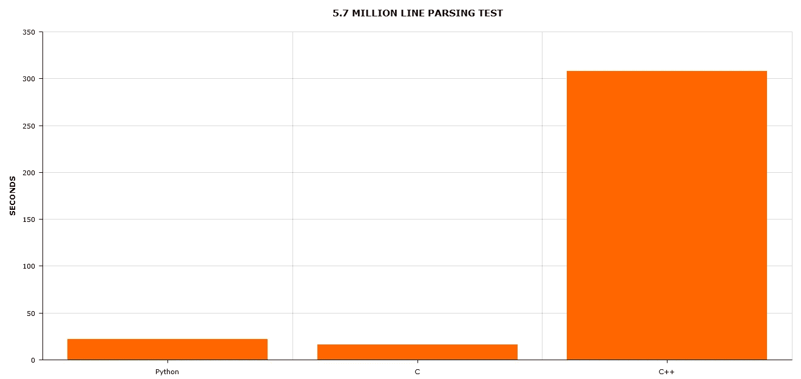

# 当速度很重要时，使用 C

> 原文：<https://towardsdatascience.com/when-speed-matters-use-c-f040d9381680?source=collection_archive---------14----------------------->

## C、Python 和 C++之间的 CSV 读取性能测试

由 [Unsplash](https://unsplash.com/s/photos/speed?utm_source=unsplash&utm_medium=referral&utm_content=creditCopyText) 上的 [CHUTTERSNAP](https://unsplash.com/@chuttersnap?utm_source=unsplash&utm_medium=referral&utm_content=creditCopyText) 拍摄

# 介绍

当我使用 C 时，我倾向于感觉自己像一只恐龙。没有人知道 C 了。它不再是主流，它的使用主要与驱动程序或操作系统编程和嵌入式系统有关。

还值得再学 C 吗？我最初以为懂 C++会让 C 变得无关紧要。但是在我学习 C++的过程中，我开始注意到可能是这样的情况，C 仍然有它的位置。

# 真实测试:阅读大型 CSV

尽管简单，CSV 文件仍然无处不在。解析它们的需求非常普遍，在某些场景中，您可能需要处理数万亿字节的 CSV。

如果是这样的话，实施就很重要。当数据集很小时，一个简单的操作很容易在数据集变大时成为瓶颈；应该观察性能，速度比代码可维护性和代码冗长更重要。

在这篇小文章中，我将使用 Python、C 和 C++17 中逐行读取文件的惯用方法来分析三种不同的行解析器。

特定的测试将解析一个 570 万行的 CSV，其中每行大约有 50 个字符宽(在我的测试中，我使用了 derivates 市场报价，但是该场景适用于任何类型的数据)。我们将测量在每种语言中逐行读取文件需要多长时间。

# 计算机编程语言

Python 因其简单而被广泛(过度)使用。学习 Python 极其简单。语法简单明了，其垃圾收集器使得编程变得简单明了。它不是一种快速的语言，除非你使用 C 编译的库，比如 Numpy。当你需要做一些用 Numpy 无法完成或难以实现的事情时，性能问题就会到处出现。

上面的代码展示了 Python 中逐行读取文件的惯用方式。测得的运行时间为 22 秒。

# C/C++

我最近开始用 C++工作，而不是用 C 或 Java。通过这样做，我可以在需要时拥有 C 的性能和控制，以及 Java 的高级和面向对象的结构来简化代码的编排，特别是集合(C++中的容器)，这在数据分析中很有用。

下面的代码片段包括用 C 和 C++编写的逐行读取 CSV 文件的代码。

C++惯用方法的测量时间分别是 300 秒，经典 C 方法的测量时间是 16 秒。

# 结论

惯用的 C++实现所花费的时间如此之大，令人尴尬。

惯用代码例程逐行读取文件所花费的时间

相反，我们观察 Python 是如何对某些函数/库进行了如此多的优化，以至于它们的性能几乎和 C 一样好。这并不意味着 Python 和 C 一样快，因为当你使用定制代码或密集数据分析时，Python 的效率会非常低。但是我惊讶地发现 Python 中有如此优化的例程。

这个简短测试的要点是*惯用的*并不意味着你的代码将会执行。

不要卖你的 K&R*【C 编程语言】*的拷贝；在 C++中重用那些 1980 年代的 C 方法仍然可以节省一些计算时间。