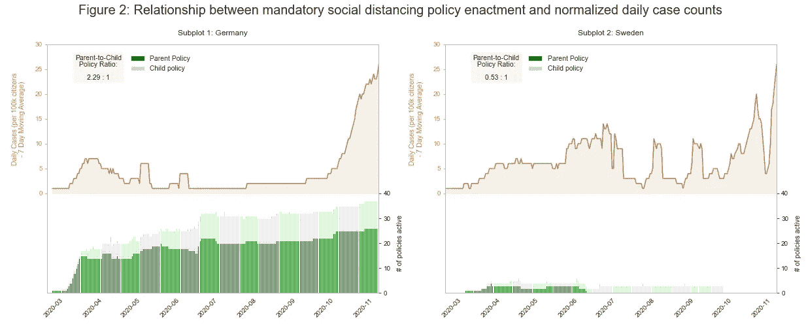
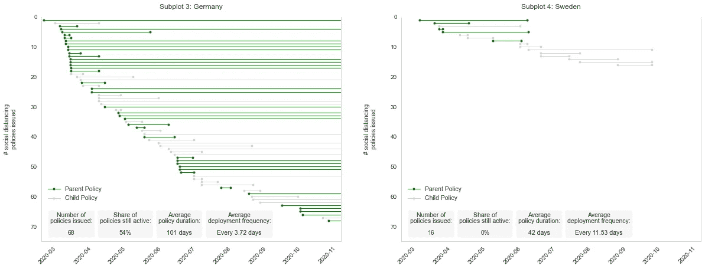

# 当锤子遇见舞蹈

> 原文：<https://towardsdatascience.com/when-the-hammer-meets-the-dance-f1c86386f161?source=collection_archive---------26----------------------->

## 新冠肺炎疫情早期德国和瑞典的社会距离政策展开的鹰眼比较

盖尔·马塞尔在 [Unsplash](https://unsplash.com/s/photos/pandemic-dance?utm_source=unsplash&utm_medium=referral&utm_content=creditCopyText) 上拍摄的照片

新冠肺炎疫情促使全球各国政府建立了一个非药物干预(NPI)的军火库。除了接种疫苗，NPI 是公民必须遵循的社区缓解策略，以防止冠状病毒的传播。无论 NPIs 是作为纯粹的建议(例如，经常洗手)还是强制性措施(例如，晚间宵禁)，我们可能都同意这些干预措施已经从根本上改变了我们近两年的日常生活方式。在我[的上一篇文章](/how-do-people-move-when-social-distancing-becomes-the-rule-64af52857640)中，我以德国和瑞典的单一政策为例，证明了政府干预的影响，这两个国家对疫情问题的反应截然不同。但是这些策略总体上如何发挥作用呢？现有的研究暗示，各国政府何时以及以何种节奏推出 NPI 存在相当大的差异(Hale 等人，2020 年)。受到这些发现的启发，我接下来提出了以下问题:

*德国和瑞典在疫情早期针对每日 COVID 病例动态制定严格的社会和物理隔离措施方面有何不同？*

我们为什么要关心？在新冠肺炎·疫情事件之后，我们只有直觉。进入疫情将近两年，我们拥有的是数据，大量的数据。将政策部署时间表与灾后的案例动态联系起来，为政府提供了宝贵的经验，以便在今后制定更多基于证据的应对战略。

# **设置**

我收集了 2020 年 2 月下旬至 11 月下旬的数据，以分析疫情早期阶段应对新冠肺炎病例动态的政策动员。

**收集流行病学数据**。我进入可公开访问的 [OxCOVID19](https://covid19.eng.ox.ac.uk/database.html) 数据库(Mahdi et al .，2020)查询在感兴趣的时间跨度内，这两个国家累计的确诊新冠肺炎病例数。(在我的[上一篇文章](/how-do-people-move-when-social-distancing-becomes-the-rule-64af52857640)中阅读更多关于这个库的信息)。由于事件数据是以累积计数的形式返回的，所以我首先将所有值分解成每日数字。这项工作揭示了瑞典 88 例连续 0 日病例中的可疑部分。通过对来自 [worldometer](https://www.worldometers.info/coronavirus/coronavirus-cases/) 的案例报告进行抽查，我将这些数据点暴露为缺失值。此外，20 例每日病例数为负值的情况发出了危险信号。我求助于欧洲疾病预防控制中心(ECDC，2021)的事件数据来解决缺失和错误的值。这对于防止此类记录扭曲任何数据操作至关重要。

从这条弯路中得到的启示是双重的:首先，即使是通过最著名的来源提供的数据，也不能让我们在一头扎进分析之前摆脱严格验证的任务。第二，如果快速浏览一下可能会给我们带来“有机”替代价值，我们应该抵制采用更复杂估算策略的诱惑。为什么？数据驱动的插补减轻了痛苦，但考虑到算术合成值是未披露现实的纯近似值，因此无法提供解决方案。

在消除了所有提到的不一致之后，另一个问题浮现在脑海中。某个新冠肺炎案例被确认的那一天，不一定是这个事件进入数据库的那一天(官僚主义是我们最大的敌人，数据工程师也有周末……)。为了消除报告延迟的影响，我将案例数转换为 7 天移动平均数。值得一提的是，重新采样到更高的粒度级别(例如，从几天到几周或几个月)为我们提供了一种驯服噪声的替代方法。然而，我故意决定不采用这种方法，因为我的目标是在尽可能低的粒度级别上探索案例策略动态。最后，我将观察结果归一化为每 10 万公民的每日病例数，以排除瑞典和德国之间总体人口规模的巨大差异(德国的居民人数大约是瑞典的 8 倍)。

**收集策略数据**。世界卫生组织的 [PHSM API](https://www.who.int/emergencies/diseases/novel-coronavirus-2019/phsm) 被查询以获取两国在一段时间内采取的**公共卫生和**社会措施的数据(世卫组织，2021)。鉴于 OxCOVID19 将政策数据预先分为 8 个粗粒度类别，PHSM 提出了一个更细粒度的分类方案。使用分类属性 *who_category、* *who_subcategory* 、 *who_measure* 和 *enforcement* ，我将这些政策划分为严格的社会和物理距离措施。此外，属性 *prev_measure_number* 和*following _ measure _ number*允许我追溯策略之间的父子依赖关系。这对于更深入地描述两个国家所采取的政策部署方案非常有价值。从这个意义上来说，任何没有在 *prev_measure_number* 中输入的策略都有资格作为新引入的干预。相反，与 *prev_measure_number* 相关联的任何策略都是现有策略的后代。

**图一。** *针对常态化每日案例的 7 天移动平均线的政策部署。*

我创建了一个 2 乘 2 的小倍数图，以框定我对德国和瑞典每日案例数相关的政策部署动态的分析。底部两个类似甘特图的图表显示了一段时间内这两个国家政策干预的开始和持续时间。颜色编码区分没有前任的父策略和代表前一干预的修改、扩展或重新引入的子策略。为直观起见，在任何给定时间点有效的母公司和子公司保单的数量以堆叠条形图的形式投射到上部两个象限，描绘了两个国家/地区在可用日期的 7 天移动平均案例数。

下面的两个图表(图 1，支线剧情 3 和 4)描绘了一个对比鲜明的叙述。在最初的几个案例被记录下来后，德国政府发布了一系列的 68 条强制性的距离政策，是瑞典出台的数量的 4 倍多。事实上，在德国当局实施的所有强制距离政策中，有 54%在观察范围结束时仍然有效。两次干预措施出台之间的时间间隔非常短，平均不到 4 天，而大范围的平均政策运行时间为 101 天，这成为德国政策动员机制的主导主题。总之，视觉线索和汇总统计暗示了一个非常系统和充分的政策反应。联邦政府结构通常被认为是迅速遏制危机的协调障碍。根据这一分析，我敢说德国的分权行政结构可能最终会支持快速、全面地推出这些干预措施。

这些发现与从瑞典相应图表中得出的推论形成鲜明对比。截至 9 月底，瑞典所有 16 项强制距离政策都已逐步取消。这些政策不仅出台的时间间隔更长，平均为 11.53 天，而且平均持续时间仅为 42 天。支持这些观察的相关线图(副曲线 2)显示，当每日病例数变化时，瑞典几乎不改变齿轮。相比之下，德国的政策组合在最初的快速增长之后稳步扩大，几乎与病例数的增加完全同步，直到 3 月中旬事件首次达到峰值(子情节 1)。即使新确诊病例仍然很少，德国也维持了许多父母和子女政策的 2:1 混合。

# **统计分析**

使用皮尔逊相关系数，我将有效保单的数量与每日确诊病例和死亡人数相关联，以从统计角度观察已确定的动态。简单地说，相关系数量化了两个不同变量之间线性关系的强度。接近 0 的值暗示弱关系，而接近绝对 1 的值暗示两个变量接近完美同步。正系数意味着两个变量朝同一个方向移动，而负系数表示朝相反方向移动。值得一提的是，变量之间线性关联的假设仍然是对现实的天真简化，但这没关系。在解释结果时，我们对这些潜在假设的认识很重要。最重要的是，相关系数是易于计算和概念上可访问的关联度量，便于我们对潜在的更复杂的关系得出初步结论。

***表 1。*** *现行保单数与每日确诊病例/死亡数的皮尔逊相关系数(归一化 7 天移动平均数)。*

表 1 中展示的相关性分析结果证实了瑞典和德国政策部署方案如何适应日常案例动态的推断差异。将德国的有效保单数量与标准化每日病例数和死亡数相关联，得出的相关系数分别为 0.33 和 0.36。具有证明统计显著性的低 p 值的系数对。我们可能会哀悼这些系数的数量级。然而，研究结果应该放在国家政策制定的背景下。当考虑到官僚主义的障碍无疑会限制一个民主的、联邦政府组织的政策日程每天重新调整的灵活性时，已确定的相关性被认为是实质性的。

同样的分析得出瑞典的相关系数相对较小，不显著，为-0.1。这些发现再一次与强调瑞典政府极简政策反应的文献产生共鸣，瑞典政府选择自愿的自我监管，而不是通过明确的立法行动来缓解(Capano 等人，2020 年)。然而，将有效保单的数量与标准化的每日死亡人数相关联产生了 0.3 的统计显著相关系数。这一有点令人惊讶的发现可能源于瑞典随着累计死亡人数的上升而从较宽松的政策干预转向更严格的政策干预的趋势(Cheibub 等人，2020 年)。

# 这一切意味着什么？

疫情政策回应中发现的差异与 Cheibub 等人(2020)的发现相呼应，即国家民主政体对疫情的回应方式绝不相似。这些异质性背后的驱动力仍然存在争议。我借助霍夫斯泰德的文化维度理论来解释德国和瑞典之间的明显差异。这一理论将不确定性规避的概念定义为“(……)一种文化的成员感受到模糊或未知情况威胁的程度，并创造了试图避免这些情况的信念和制度” (Hofsede-insights.com，2020)。

瑞典在满分 100 分中获得 29 分，被描绘成一个容忍不确定性的国家，它更愿意在一套最基本的必要规则下引导其社会。另一方面，德国在 100 分中得了 67 分，它依赖于规划和对不确定性的系统预测。两张甘特图(图 1，子图 3 和 4)为这一推理提供了令人信服的支持。德国在疫情早期发布了一套密切关注的父母政策，随着时间的推移，新的父母和子女政策不断增加，这些政策不仅在很大程度上得到维持，而且扩展到大量的社会距离政策中。虽然这可以被理解为一种彻底缓解不确定性的行为，以对抗未知比例的疫情，但德国维持平均父母与子女政策比率为 2.23 比 1 的事实(图 1，子曲线 1)描绘了政策干预的持续而可控的扩张。相比之下，瑞典 0.53 比 1 的比率是反应主义方法的缩影(图 1，副曲线 2)。最终，瑞典的政策机构在所有主题化的维度上都有所欠缺——政策持续时间、部署频率和迄今为止的总干预量——这暗示了一个高信任度社会所特有的政策足迹，它无视过度的政府控制。

# **限制**

我的分析采用了两个外部数据源来解决 OxCOVID19 数据库中的不足，并获得了将手头的研究问题“数据化”所需的额外变量。然而，整合来自多个来源的数据意味着整合不同的信息分类法、数据收集和预处理方法，这些只是在数据控制者的网站上暂时披露。由于我的分析受制于几个关于数据来源和方法的未知因素，因此必须像往常一样，对调查结果有所保留。

虽然该分析确定了活动策略数量和每日案例计数之间的显著相关性，但我提醒您不要将相关性误认为是因果关系。这一分析为读者提供了一个描述性的切入点，让他们见证不同的社会距离政策策略在起作用。然而，这种便利是以忽略许多因素为代价的，这些因素很容易将我们推入错误的因果归属。例如，在夏季的几个月里，其他因素，如不受分析控制的天气，可能会促进社交距离。这种情况提醒我们不要把社交距离政策的数量贴上降低每日病例数背后的独立驱动因素的标签。我在我的[上一篇文章](/how-do-people-move-when-social-distancing-becomes-the-rule-64af52857640)中简要地谈到了省略变量偏差的概念，以防这个小小的反思引起你的兴趣。

# **结论**

我们首先提出以下问题:*德国和瑞典在疫情早期针对每日 COVID 病例动态制定严格的社会和物理隔离措施方面有何不同？* Capano 等人(2020)称疫情为“自然实验”,在此过程中，政府对同一问题表现出明显不同的政策反应。我的分析揭示了德国和瑞典政府在动员起来对抗疫情方面的巨大差异。与此同时，我得出的结论是，这些应对措施是国家领导、政府组织以及在全国范围内构想和部署政策的政治能力的复杂产物。

士气:这不是锤子或舞蹈，而是需要在国家和文化特殊性的背景下理解的新闻和发布之间精心制作的混合。但如果我们可以肯定地说一件事，它可能是这样的:一个答案，在什么情况下我们需要多少锤打和舞蹈不应该放弃把这个疫情提供给我们的数据进行测试的机会。

# 参考

Capano，g .，Howlett，m .，Jarvis，D. S. L .，Ramesh，m .，和 Goyal，N. (2020)。动员政策(能力)抗击新冠肺炎:理解国家反应的差异。政策与社会，39(3)，1–24 页。https://doi.org/10.1080/14494035.2020.1787628

洪金元，朱耀杰，朱耀杰(2020)。权利与死亡:政府对疫情的反应。SSRN 电子杂志。【https://doi.org/10.2139/ssrn.3645410 

t .黑尔、n .安格里斯特、a .彭斯瑞克、b .基拉、t .菲利普斯和韦伯斯特(2020 年)。政府对新冠肺炎的反应各不相同。Blavatnik 政府学院工作文件系列，32。[www . bsg . ox . AC . uk/covidtracker % 0ah ttps://www . bsg . ox . AC . uk/research/publications/variation-government-responses-新冠肺炎](http://www.bsg.ox.ac.uk/covidtracker%0Ahttps://www.bsg.ox.ac.uk/research/publications/variation-government-responses-covid-19)

**数据**

ECDC (2021 年)。*每日更新世界各国新报告的新冠肺炎病例。*[数据集]。[https://www . ecdc . Europa . eu/en/publications-data/download-todays-data-geographic-distribution-新冠肺炎-cases-worldwide](https://www.ecdc.europa.eu/en/publications-data/download-todays-data-geographic-distribution-covid-19-cases-worldwide)

马赫迪、布拉什奇克、德洛特科、萨尔维、陈、T. S. T .、哈维和扎雷布斯基(2020)。OxCOVID19 数据库:更好理解新冠肺炎全球影响的多模态数据库。medRxiv。

世卫组织(2021 年)。PHSM:跟踪公共卫生和社会措施。【数据集&码书】。[https://www . who . int/emergencies/diseases/novel-coronavirus-2019/phsm](https://www.who.int/emergencies/diseases/novel-coronavirus-2019/phsm)