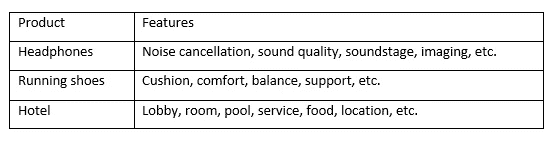
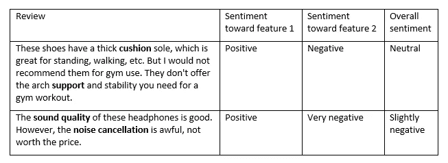
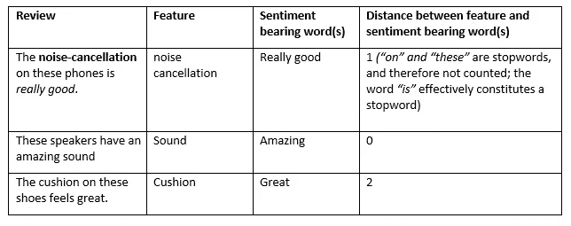
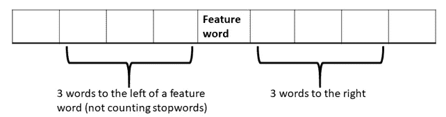
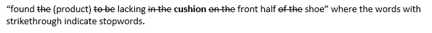
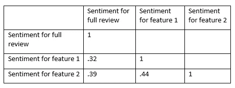
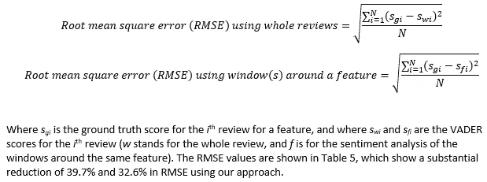
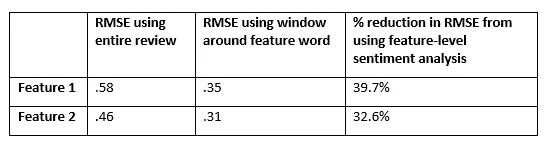

# 产品特征与评论层次的情感分析:当部分比整体更有价值时

> 原文：<https://towardsdatascience.com/when-the-parts-may-be-worth-more-than-the-whole-feature-vs-review-level-sentiment-analysis-eb101ea31539?source=collection_archive---------36----------------------->

## [入门](https://towardsdatascience.com/tagged/getting-started)


由[马库斯·温克勒](https://unsplash.com/@markuswinkler?utm_source=medium&utm_medium=referral)在 [Unsplash](https://unsplash.com?utm_source=medium&utm_medium=referral) 上拍摄

由德克萨斯州奥斯汀西湖高中的 Aadit Barua 和 Josh Barua 制作。

**主旨**

我们开发并测试了一种简单的方法，用于从用户评论中提取关于产品或服务的个体特征的情感。动机是用户可能在他们的评论中提到多个特性，并且可能对这些特性持有不同甚至相反的意见。例如，客户可能喜欢一副耳机的音质，但不喜欢噪声消除功能。然而，对整个评论执行情感分析可能产生关于对个体特征的情感的误导或不正确的结果。因此，在假设用户表达他们的情感接近特征词的情况下，我们首先预处理文本以提取特征周围的词窗口，而不是通过情感分析器传递整个评论。使用跑鞋的评论，我们为每个特征情感分数建立了基础事实，并且表明与我们的方法相关联的误差显著小于通过使用整体评论获得的误差。

**何必纠结于功能级的情绪？**

情感分析在许多自然语言处理应用中扮演着重要的角色，包括推荐系统和理解消费者对品牌和产品的看法。评论通常涉及多个特征或属性。下面的表 1 提供了一些例子。



表 1:经常提及的产品特性

对完整评论进行情感分析是很常见的。然而，总体评论的情绪可能不会正确地反映对个别特征的情绪。考虑表 2 中显示的一些评论。特征词以粗体显示。



表 2:功能级别与总体情绪

在这些例子中，用户表达了对两个特征的相反意见，其结果是总体情感没有反映与任一特征相关联的正确情感。

**特征级情感分析什么时候有用？**

特征级情感分析在许多应用中是有用的。将消费者对产品特征的偏好作为输入的推荐系统可以使用针对个体特征的情感分数来做出更相关的建议。我们可以根据消费者对特定功能的感受(例如，两款智能手机的摄像头和电池质量)，准确地比较产品。向公司提供详细的反馈以帮助改进其产品或服务取决于我们获得特征级情感的能力。例如，从酒店评论的情感分析中，我们可以告诉酒店管理层，消费者喜欢它的酒店。但是在特征级别执行分析可以提供这样的见解，即虽然客人对服务感到兴奋，但对便利设施的体验并不深刻。对第一个特征(服务)的非常积极的看法可能掩盖了对第二个特征(便利设施)的稍微消极的看法。

**一种简单的无监督方法**

可能有复杂的监督方法来提取特征级情感。然而，我们概述了一个简单的无监督方法。我们假设诸如形容词之类的带有情感的词很可能靠近特征词而不是远离它。表 3 中示出了三个评论、其中包含的特征、带有情感的单词以及特征和带有情感的单词之间的距离(单词的数量)。我们在计数中忽略停用词。 [Stanford NLP 页面](https://nlp.stanford.edu/IR-book/html/htmledition/dropping-common-terms-stop-words-1.html)提供了一个常用停用词以及基本上表现类似停用词的单词的列表。



表 3:特征词和情感词之间的距离

为了提取特征词的情感承载词，我们建议提取特征词周围的词窗口，如图 1 所示。



图 1:围绕特征词的 3 个词的窗口

例如，考虑我们数据中的真实评论(我们在这个相当负面的评论中删除了品牌和产品名称):

“在 10 多双上面有数百英里的(品牌名称)后，我尝试了这些作为替代品。不幸的是，它们在舒适度和质量上倒退了一大步。总的来说，我发现(产品 1)比(产品 2)更窄，但 6 毫米的跌落感觉差不多。对于一双中性的鞋子来说，足弓支撑感觉真的很大，因为它们对我来说太窄了。我喜欢鞋面上添加的网格，但是，我发现(产品 1)在鞋前半部分的缓冲中有所欠缺。”

如果我们对用户对气垫的看法感兴趣，我们提取以下窗口大小为 3 的内容:



这种情绪被“缺乏”这个词抓住了。我们使用短语“发现缺少缓冲前半鞋的产品”作为无监督情感分析的 VADER 的输入。在一篇评论中多次提到一个特性也是可能的。在这种情况下，我们为给定评论的相同特征提取多个窗口。提取单词窗口的代码如下所示:

```
from nltk.tokenize import word_tokenize #import word_tokenize 
limit = 3 #the number of words on either side of the feature word used to create the window
attribute = "cushion" #desired feature 
reviews_list = ["I love the cushion, but hate the support.", "Even though the shoe was durable, it had very little cushion and made my feet sore after runs."] #list of product reviews
attribute_position_list = [] #list of positions where the feature word was found in each review
review_with_attribute_list = [] #list of review containing the feature wordfor review in reviews_list:
    word_tokens = word_tokenize(review) #tokenizes each review
    position = 0 #position in the review where the feature is found
    for word in word_tokens: #for each word in the review
        if(word.find(attribute)>-1):
            attribute_position_list.append(position) 
            review_with_attribute_list.append(word_tokens) 
        position = position + 1index = 0 #keeps track of which review is being parsed
for review in review_with_attribute_list:
    limited_sentence_list = [] #list of words within the window 
    for item in range(len(review)):
        if(abs(item - attribute_position_list[index]) <= limit): 
            limited_sentence_list.append(review[item])
    parsed_review = ' '.join(limited_sentence_list)
    print(parsed_review)
    index = index + 1
```

VADER 代码分享如下:

```
from nltk.sentiment.vader import SentimentIntensityAnalyzer
def get_sentiment(parsed_review): #passes the parsed review 
    sid = SentimentIntensityAnalyzer()
    score = sid.polarity_scores(parsed_review)
    compound = score.get('compound')
    return compound #returns the sentiment score
```

**测试我们的方法**

我们使用一组跑鞋评论来测试我们的方法。首先，我们使用 VADER 来获得完整评论的情感分数。然后，我们使用上面的解析器提取特征词周围的词窗口。我们使用两个功能:缓冲和支撑。为每个特征提取的单词被用作 VADER 的输入。我们注意到特征情感之间的相关性是. 44(表 4)，这不是特别高。结果，如表 4 所示，个体特征和总体情绪之间的相关性甚至更低，这表明总体情绪不会给我们一个用户对特定特征感觉如何的良好指示。



表 4:整个评论、特征 1 和特征 2 的情感之间的相关性

为了建立基础事实，我们手动阅读每篇评论，并对两个特征中的每一个进行评分。我们为每个特征计算两个均方根误差(RMSE)值:一个使用整个评论的基本事实分数和情感分数，另一个使用基本事实分数和特征级情感分数。我们设置的 RMSE 公式是:



表 5:使用整体评论和词窗进行情感分析的 RMSE 值

**结论**

情感分析是自然语言处理的一个关键要素，它的有用性依赖于它对顾客偏好的洞察。向公司提供有关其产品或服务的详细指导和建议的能力取决于我们在特征或属性层面进行情感分析的能力。我们在本文中演示了一个简单的方法。我们希望你能尝试更复杂的方法。也许 Peter Turney (2002)提出的提取词类二元模型和分析语义倾向的想法可以适用于我们的环境。也许 BIOES 标记方法可以以修改的形式应用。但是无论你做什么，玩得开心点！

**参考文献**

彼得·特尼，《竖起大拇指还是竖起大拇指？语义导向应用于评论的无监督分类。”arXiv 预印本 cs/0212032 (2002 年)。