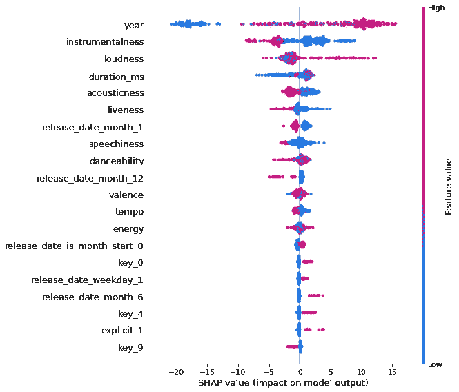

# 何时避免深度学习

> 原文：<https://towardsdatascience.com/when-to-avoid-deep-learning-a7cfe3635022?source=collection_archive---------1----------------------->

## 意见

## 以下是原因和时间…


纳丁·沙巴纳在[Unsplash](https://unsplash.com/s/photos/stop?utm_source=unsplash&utm_medium=referral&utm_content=creditCopyText)【1】上拍摄的照片。

# 目录

1.  介绍
2.  当你想简单地解释
3.  当你可以使用其他算法时
4.  当你有一个小的数据集和预算
5.  摘要
6.  参考

# 介绍

本文面向可能考虑使用深度学习算法的数据科学家，并希望了解更多关于在您的工作中实施这些类型的模型的缺点。深度学习算法有很多好处，功能强大，炫耀起来也很有趣。然而，有一些时候你应该避免它们。我将在下面讨论你应该停止使用深度学习的时间，所以如果你想更深入地研究深度学习，请继续阅读。

# 当你想简单地解释


照片由[马尔特赫尔姆霍尔德](https://unsplash.com/@maltehelmhold?utm_source=unsplash&utm_medium=referral&utm_content=creditCopyText)在[Unsplash](https://unsplash.com/s/photos/explain?utm_source=unsplash&utm_medium=referral&utm_content=creditCopyText)【2】上拍摄。

因为其他算法存在的时间更长，所以它们有无数的文档，包括使可解释性更容易的例子和函数。这也是其他算法的工作方式。由于这个原因，深度学习可能会让数据科学家望而生畏，当你不确定如何向利益相关者解释时，使用深度学习算法可能会令人厌烦。

> **这里有 3 个例子，说明你在解释深度学习时会遇到困难:**

*   当你想要描述你的模型的主要特征时——这些特征变成了隐藏的输入，所以你不知道是什么导致了某个预测的发生，如果你需要向利益相关者或客户证明为什么达到了某个输出，这可能更像是一个黑盒
*   当您想要调整学习率和批量大小等超参数时
*   当你想解释算法本身是如何工作的——例如，如果你要向利益相关者展示算法本身，他们可能会迷路，因为即使是简化的方法仍然难以理解

> **这里有 3 个例子，说明如何从非深度学习算法中解释上述相同的情况:**

*   当你想解释你的主要特性时，你可以很容易地访问 SHAP 库，比如说，对于 CatBoost 算法，一旦你的模型被拟合，你可以简单地从`feat = model.get_feature_importance()`制作一个摘要图，然后使用`summary_plot()`按特性名称对特性进行排序，这样你就可以向利益相关者(*和你自己*)展示一个不错的图



非深度学习模型的分级 SHAP 输出示例[3]。

*   作为一种解决方案，其他一些算法通过随机网格搜索或更结构化的集合网格搜索方法，使调整超参数变得非常容易。甚至有一些算法可以自行调整，因此您不必担心复杂的调整
*   解释其他算法的工作原理可能会容易得多，比如决策树，例如，你可以轻松地显示是或否，0/1 图表，显示导致预测的特征的简单答案，如*是的，下雨了*，*是的，现在是冬天*，将提供*是的，天气将会变冷*

总的来说，深度学习算法是有用和强大的，所以它们肯定有一个时间和地点，但也有其他算法可以替代，我们将在下面讨论。

# 当你可以使用其他算法时


卢卡·布拉沃在[Unsplash](https://unsplash.com/s/photos/forest?utm_source=unsplash&utm_medium=referral&utm_content=creditCopyText)【4】上拍摄的照片。

坦率地说，有一些算法可以很快给你一个很好的模型和很好的结果。其中一些算法包括线性回归、决策树、随机森林、XGBoost 和 CatBoost。这些是更简单的选择。

> **这里有一些例子，说明为什么你会想要使用非深度学习算法，因为你有这么多其他更简单的非深度学习选项:**

*   它们可以更容易、更快速地设置，例如，深度学习可能需要您让您的模型添加连续、密集的层，并对其进行编译，这可能比简单地使用回归器或分类器并用非深度学习算法对其进行拟合更复杂、更耗时
*   我个人发现，这种更复杂的深度学习代码可能会导致更多的错误，如何修复它的文档可能会令人困惑或过时，不适用，而使用类似随机森林的算法，可以有更多易于理解的错误文档
*   深度学习算法的训练有时可能并不复杂，但当从一个端点进行预测时，可能会对如何提供预测值感到困惑，而一些模型，您可以简单地将值放在有序值的编码列表中

我会说，你当然可以尝试深度学习算法，但在你这样做之前，最好从一个更简单的解决方案开始。这取决于你训练和预测的频率，或者是一次性的任务。还有一些其他原因让你不想使用深度学习算法，比如当你有一个小数据集和小预算时，我们将在下面讨论。

# 当你有一个小的数据集和预算


照片由[你好我是尼克](https://unsplash.com/@helloimnik?utm_source=unsplash&utm_medium=referral&utm_content=creditCopyText)在[Unsplash](https://unsplash.com/s/photos/small?utm_source=unsplash&utm_medium=referral&utm_content=creditCopyText)【5】。

通常，你可以在一家小公司或者一家初创公司担任数据科学家。在这种情况下，您可能没有太多的数据，也没有太多的预算。因此，你会尽量避免使用深度学习算法。有时，您甚至可以有一个只有几千行和几个要素的小数据集，您可以简单地在本地运行一个替代模型，而不是频繁地花费大量资金来维护它。

> **这里是你应该根据成本和数据可用性使用深度学习算法的时候:**

*   小数据可用性通常是许多公司的情况(*但并不总是如此*)，深度学习在具有大量数据的信息上表现更好
*   您可能正在执行一次性任务，因为模型只预测一次—并且您可以在本地免费运行它(*并非所有模型都会在生产中频繁运行*)，就像一个简单的决策树分类器。在深度学习模型上投入时间可能不值得。
*   您的公司对数据科学应用感兴趣，但希望保持较小的预算，而不是从深度学习模型中执行昂贵的执行，而是使用带有**早期停止轮次**的基于树的模型，以防止过度拟合，缩短培训时间，并最终降低成本

我曾经提出过深度学习，但由于各种原因，它被否决了，而这些原因通常都是如此。但是，我不想完全劝阻某人使用深度学习，因为这是你在职业生涯中有时应该使用的东西，可以是你经常做的事情，或者主要取决于环境和你工作的地方。

# 摘要

总的来说，在你深入研究深度学习之前，要意识到有些时候你应该出于各种原因避免使用它。当然，有更多的理由避免使用它，但也有使用它的理由。最终还是要看你自己深度学习的利弊。

> 以下是不应使用深度学习的三种情况/原因:

```
* When You Want to Easily Explain* When You Can Use Other Algorithms* When You Have Small Dataset and Budget
```

我希望你觉得我的文章既有趣又有用。如果你同意或不同意避免深度学习的原因，请在下面随意评论。为什么或为什么不？作为一名数据科学家，你认为还有哪些原因应该避免使用深度学习？这些当然可以进一步澄清，但我希望我能够对深度学习有所启发。感谢您的阅读！

***我不属于这些公司中的任何一家。***

*请随时查看我的个人资料、* [Matt Przybyla](https://medium.com/u/abe5272eafd9?source=post_page-----a7cfe3635022--------------------------------) 、*和其他文章，并通过以下链接订阅接收我的博客的电子邮件通知，或通过点击屏幕顶部的订阅图标* *的* ***，如果您有任何问题或意见，请在 LinkedIn 上联系我。***

**订阅链接:**[https://datascience2.medium.com/subscribe](https://datascience2.medium.com/subscribe)

# 参考

[1]Nadine sha abana 在 [Unsplash](https://unsplash.com/s/photos/stop?utm_source=unsplash&utm_medium=referral&utm_content=creditCopyText) 上拍摄的照片，(2018)

[2]照片由[马尔特·赫尔姆霍尔德](https://unsplash.com/@maltehelmhold?utm_source=unsplash&utm_medium=referral&utm_content=creditCopyText)在 [Unsplash](https://unsplash.com/s/photos/explain?utm_source=unsplash&utm_medium=referral&utm_content=creditCopyText) 上拍摄，(2021)

[3] M.Przybyla，来自非深度学习模型的排名 SHAP 输出的例子，(2021)

[4]Luca Bravo 在 [Unsplash](https://unsplash.com/s/photos/forest?utm_source=unsplash&utm_medium=referral&utm_content=creditCopyText) 上拍摄的照片，(2016)

[5]图片来自[你好我是尼克](https://unsplash.com/@helloimnik?utm_source=unsplash&utm_medium=referral&utm_content=creditCopyText)在[Unsplash](https://unsplash.com/s/photos/small?utm_source=unsplash&utm_medium=referral&utm_content=creditCopyText)(2021)