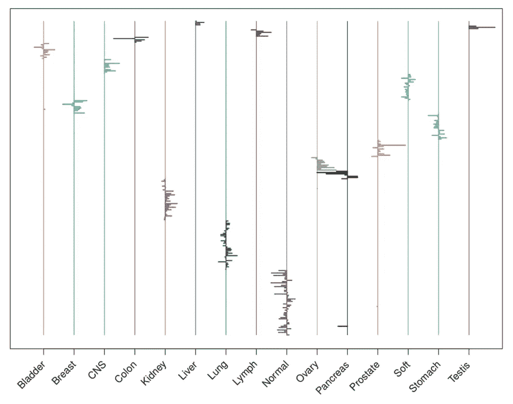

# 何时使用套索回归

> 原文：<https://towardsdatascience.com/when-to-use-lasso-regression-8a4c4b334fa8?source=collection_archive---------21----------------------->

如果您正在处理大数据，LASSO 回归是您数据科学武库中的一个很好的工具。计算效率很高*和*同时执行变量选择和回归。那有多厉害？！在本文中，我们将讨论何时需要使用这个强大的工具对多元线性回归建模。

照片由迈克考克斯在 Unsplash。

# 1.你想要一个稀疏模型。

在多元线性回归中使用 LASSO 的第一种情况是当您想要一个稀疏模型时。实际上，稀疏模型可以采取多种形式。最“经典”的情况是，你有一大组变量，但其中只有一小部分是真正重要的。但情况并非总是如此。例如，所有的变量可能都很重要，但是在一个局部区域内，只有少数变量是必需的。例如，假设您有高光谱成像数据，这些数据的波长彼此高度相关。因为它们高度相关，所以你只需要在高度相关的集合中选择一个变量。基本上，这一个变量充当所有与其高度相关的变量的代表。最后，也有可能你的所有变量都很重要，但只有少数变量解释了大部分变异。

该图显示了 15 种不同的组织类型，基因从上到下排列。套索正则多项式分类器显示相对少量的基因是重要的(4，718 个基因中的 254 个)，右边的条表示正系数，左边的条表示负系数。图片来自具有稀疏性的统计学习(2015)。

套索回归适用于稀疏模型，因为它是围绕“赌稀疏”原则建立的。本质上，这一原则表明，如果我们想有效地估计我们的参数，“真相”必须是稀疏的。

> *“使用在稀疏问题中表现良好的过程，因为没有过程在密集问题中表现良好。”*
> 
> *哈斯蒂，提布拉尼，&弗里德曼(2015)*

然而，一些人认为“真相”本质上是密集的，我们的模型应该考虑到这一点。绝对是哲学辩论的话题！

# 2.n << p

当预测变量的数量远大于观测值的数量时，您会希望选择套索回归而不是多元线性回归。当 *n* < < *p* 时，这就是所谓的大 *p* ，小 *n* 的问题。这是非常典型的基因组数据。有了基因组数据，每个人都有成千上万个基因。这意味着，仅仅为了使 *n* 等于 *p* ，你就必须收集数千个样本。这种情况通常不会发生，因为这相当昂贵，而且需要做很多工作。这通常意味着你会留下一个大问题，小问题。

包含 1，000 个基因序列的微阵列数据。照片由国家癌症研究所在 Unsplash 上拍摄。

*n* < *p* 怎么了？本质上，如果真实的模型不是稀疏的，我们就没有足够的观测值来精确估计我们的参数。如果 *n < p* ，最小二乘法将失效，我们将无法获得唯一的估计值(Hastie，Tibshirani，& Wainwright，2015)。现在，如果我们假设稀疏性，或者，如果我们假设只有一小部分变量是重要的，我们可以使用 LASSO 将许多系数缩小到零，只留下大 *p* ，小 *n* 场景中的重要系数。

# 3.你有一些多重共线性。

最后，当您的模型中存在多重共线性时，套索回归非常有用。多重共线性意味着预测变量(也称为独立变量)并不那么独立。对于多元线性回归，这可能会导致系数发生显著变化，并影响模型的可解释性。幸运的是，由于 LASSO 内置的变量选择，它可以在不牺牲可解释性的情况下处理一些多重共线性。但是，如果共线性太高，LASSO 的变量选择性能将开始受到影响。如果有高度相关或共线的预测值，它将只选择其中一个。如果每次运行 LASSO 时得到不同的预测值，您将知道您的共线性是否过高。如果您确实发现您的数据有许多多重共线性，请尝试使用弹性网。这是岭回归和套索回归的混合，在多重共线性较高时效果很好。或者，你可以通过多次运行 LASSO 来破解它，每次运行都跟踪所有重要的预测因素。

多元线性回归是对大量数据进行建模的一个很好的工具，但是它也有其局限性。幸运的是，LASSO 回归是处理稀疏模型和大数据的一个很好的选择。我希望你有机会自己尝试套索！快乐造型！

## 参考

Hastie，T.J .，Tibshirani，R.J .，和 Friedman，J.H. (2001 年)。统计学习的要素:数据挖掘、推理和预测。纽约斯普林格。

t . j . hastie、r . j . TiB shirani 和 m . wain right(2015 年)。稀疏统计学习。佛罗里达州博卡拉顿 CRC 出版社。

*原载于 2021 年 12 月 28 日*[*【https://thatdarndata.com】*](https://thatdarndata.com/when-to-use-lasso-regression/)*。*