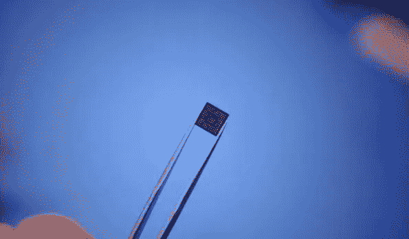

# 当“顶”是误导的时候

> 原文：<https://towardsdatascience.com/when-tops-are-misleading-70b53e280c39?source=collection_archive---------17----------------------->

## 神经加速器通常以性能特征“TOPS”为特征，即每秒万亿次运算。但仅此还不够。了解这些加速器是如何工作的，以及在进行比较时还应该考虑什么，这一点很重要。

SpaceX 在 [Unsplash](https://unsplash.com/photos/Zzc0vZE2JZI?utm_source=unsplash&utm_medium=referral&utm_content=creditCopyText) 上拍摄的

## 内容列表

**简介
什么是上衣？
通用还是专用？比较** –测量
–比较
**我什么时候需要很多陀螺？
总结
补遗**

## 介绍

人工智能的硬件加速器有很多名字。它们被称为神经加速器、AI 加速器、深度学习加速器、神经处理单元(NPU)、张量处理单元(TPU)、神经计算单元(NCU)等。所有这些都表示相同的东西:为矩阵运算而优化的电子设备，这是特别有效地计算人工神经网络所需要的。在下面的博客中，我们将坚持恩智浦的名称声明“NPU”。在前几年，主要是英伟达的 GPU 主导了人工智能(AI)领域。随着 AI 领域日益向边缘拓展(移动设备、工业端硬件等。)，edge 产品的专用硬件组件已经开发了好几年了。这些主要集中在低精度计算(主要是整数)、现代数据流架构和最佳内存连接。

## 什么是上衣？

为了能够以简单的方式比较不同的 NPU 架构，创建了“每秒万亿次运算”(TOPS)这一指标。在专家中，该指标不被认为是最佳指标，但它用一个易于理解和可比的数字抓住了一个复杂的问题:我的芯片一秒钟可以进行多少次数学运算？这个数字可以用来快速比较不同的芯片。没有考虑操作的质量，甚至没有考虑更详细地涉及哪些操作。在许多情况下，芯片还专注于一个特定的任务，在那里它们可以调用它们的最大性能。因此，直接比较并不总是合理的。

在大多数情况下，top 用经典的“ResNet50”来衡量，有时用“MobileNet”架构来衡量。在应用中，ResNet50 现在经常被更现代的网络所取代。然而，它为比较提供了一个良好的基础。

## 通用还是专用？比较

在这一部分中，我们将比较两个 npu，以展示需要注意的地方。一个侧重于工业应用和“低顶点”，另一个侧重于高速图像分析和“高顶点”。首先，我们展示一些测量，然后讨论一些利弊。

图 1 带有 i.MX 8M Plus 的 phy board-Pollux[图片由作者提供]

## —测量

phyBOARD-Pollux 单板计算机(图 1)是基于恩智浦 i.MX 8M Plus 四核处理器的工业板。i.MX 8M Plus 的 NPU 由恩智浦指定为 2.3 TOPS。然而，这本身并不能说明可以实现的推理时间。使用 ResNet50 对该 NPU 进行图像处理测试，结果每秒处理 60+帧(fps ),每张图像的平均推理时间为 16 毫秒(224×224 pxl)；在相同分辨率下，MobileNetV1(图 2)每幅图像平均 6 毫秒，每秒 159 帧。恩智浦自己的测试显示，MobilNet 架构的推断时间约为 3 毫秒。

图 2 在 i.MX 8M Plus NPU 上使用 MobileNetV1 (224x224)的推理[图片由作者提供]

还有其他标有名义上更高顶点的神经加速器。我们将看看 Gyrfalcon 的 Lightspeeur 2803s(图 3)，它可以提供高达 16.8 TOPS 的峰值。这导致使用图像输入分辨率为 448 x 448 pxl(来自他们的网站)的 MobilNet 的速率超过 100 fps。如果我们假设输入大小与 200.704 pxl 和 50.176 pxl 的推断时间成线性比例，我们可以直接比较 i.mx8 M Plus 的大约 40 fps 和 gyrfalcon 的 100 fps，从而得到大约 60 fps 的增量。因此，TOPS 中 7.3 倍的差异导致 fps 中 2.5 倍的差异。

*对于 Gyrfalcon，在撰写本报告时无法进行测量(*见附录)*

接下来，我们将讨论两种芯片的不同之处。

## —比较

将恩智浦的 i.MX 8M Plus 与 Gyrfalcon 的 Lightspeeur 2803s 进行比较，似乎很明显，Lightspeeur 在 TOPS 中明显优于 8M Plus。然而，当查看细节时，很明显不应仅根据 TOPS 来比较芯片，两者都有其合理的应用领域。

图 3 Gyrfalcon Lightspeeur 2803s [CC 许可]

*TOPS 到 fps*首先值得注意的是，推理速度仅快 2.5 倍，而 TOPS 是 7.3 倍。尽管我们不能肯定地说，但这似乎归结于集成到模块和/或测量应用代码中的芯片。芯片和嵌入式存储器之间的短连接对于避免数据传输瓶颈非常重要。

*NPU-Model Integration*
一般来说，i.MX 8M Plus 的一大亮点就是恩智浦提供的 *eIQ* 库。 *eIQ* 提供模型和 NPU 之间的**无缝连接**。eIQ 库支持 TensorFlow Lite 和 ONNX 模型，确保模型在嵌入式硬件上顺利、直接地实施。对于 *eIQ* ，例如 TensorFlow Lite 中的简单转换和量化足以向 NPU 提供模型。

Gyrfalcon 使用一个 **MDK 和 SDK** (模型和软件开发工具包)来实现模型，这更具挑战性(*见附录)。不应该低估一个简单的实现，因为模型的简单适应允许更多的时间用于应用程序和模型开发，从而在敏捷模式中实现更快的迭代。
提供用于模型转换的特殊 SDK/mdk 的一个问题是**客户依赖于**提供软件开发人员的分配和奉献。每个更新周期都依赖于它们；每次故障排除都必须由他们处理。可惜 SDK 尸体一次次出现。因此，软件越接近开源/社区解决方案，对个人开发者的依赖就越少。这是恩智浦 eIQ 库的一个优势，它非常接近 Google 的 NNAPI，直接使用 TF-Lite 和 ONNX 模型格式。

*标准还是自有模型架构？* 另一个区别是，i.MX 8M Plus 几乎支持当前所有的模型类型和**模型架构**。另一方面，Lightspeeur 2803s 专注于用于图像处理的卷积神经网络(CNN)。Lightspeeur 2803s 还仅支持三种最重要的模型架构:VGG、ResNet 和 MobileNet。这是三种常用的基础架构，但是这里忽略了适应性模型、现代架构以及其他类型的网络(例如，递归神经网络)。这种对 CNN 的关注使得 Lightspeeur 2803s 达到了最高的 top 数。

*综合还是 PCIe？* I . mx8 M Plus 的伟大之处还在于它作为片上系统(SOC)的集成，创造了一个“一体化”解决方案。因此，所有硬件组件直接共享存储器(直接存储器访问),并且不需要例如 CPU 和 NPU 之间的额外数据传输。这一点特别有趣，因为 i.mx8M Plus SOC 集成了其他几个非常特殊的硬件组件，如硬件图像预处理、图像和视频解码/压缩、原始传感器图像处理……这些组件可以直接集成到数据管道中，无需任何额外的数据传输。
gyr falcon 当然也可以设计成 SOC，但这需要大量的工作和专业知识才能完成。经典的 Gyrfalcon 是通过 PCIe 作为外部芯片添加的。这需要在开发阶段进行集成，并在推断阶段在硬件组件之间进行额外的数据传输。

*目标市场是什么？*
许多**工业应用**的决定性因素是 i.MX 8M Plus 的长期可用性。工业工厂中的边缘设备通常被期望在低维护和特殊条件下运行数年。在这里，Lightspeeur 2803s 更适合消费电子领域的应用，在正常的商业使用中，设备运行时间可以达到两到三年。Gyrfalcon 目前不保证两年后的可用性。假设新的 i.MX 8M Plus 的长期可用性超过 10 年。

图 4 恩智浦和 Gyrfalcon NPU 的对比[图片由作者提供]

*功耗*
两款芯片的**功耗**与 Lightspeeur 2803s 的 700mW 相当，i.mx8 M Plus(仅 NPU)的功耗也在 900mW 左右。在这种情况下，功耗并不是一个优于另一个，但是，在比较嵌入式设备的芯片时，功耗通常是一个重要的特征。

通过所描述的要点，您可以看到两种芯片都有不同的关注点和目标群体。在这里，通过 TOPS 进行纯粹的比较会产生误导。i.MX 8M Plus 更像是一种通用芯片，可以用于许多方面，而 Gyrfalcon 则适合于具有高性能要求的狭义应用。

## 我什么时候需要很多上衣？

这个问题是什么时候出现的 Lightspeeur 2803s 优于 i.MX 8M Plus？**高 fps** 很快浮现在脑海中，这里更多而不是更少的陀螺是首选。然而，我们必须意识到，大多数相机只能提供 30 到 60 帧/秒。在这里，i.MX 8M Plus，即使有一个有点重的 ResNet50，仍然是完全足够的。

**批处理**，处理图像流，也经常与 TOPS 相关联。然而，批处理更常用于训练神经网络。在经典推理中，一次处理一个图像，即一个图像一批。

真正需要大量 top 的是“**实时关键**应用。尤其是在自动驾驶领域。举例来说，如果您想要使用 360 度多流输入，在一毫秒内检测到一个孩子跑到马路上，则需要 TOPS 形式的大规模计算能力，并具有像素精度的检测。对于这项任务，像 Lightspeeur 2803s 这样的高顶芯片是正确的选择。

重要的是要记住，纯粹的推理并不是人工智能应用程序的唯一任务。在许多情况下，至少一个或多个数据预处理步骤发生在计算之前和之后。结果将用于指导进一步的过程。如果没有向 NPU 提供足够的数据，过多的 top 没有影响。目前，一个编程良好的**精益应用**比一个高度调优的 NPU 更有价值。
当然，这两者的结合将消除任何技术性能障碍。

## 总结—不同的任务，不同的硬件！

我们对比的两款芯片在各自的特定领域都非常优秀。然而，TOPS 并没有给出 NPU 是否适合计划应用的完整描述。对不同模型的支持，尤其是模型在芯片上的顺利实现，至少与纯粹的性能一样重要。

还必须考虑硬件以及周围的软件应用程序可以利用或服务于 NPU 性能。一个未优化的软件应用无法通过更多的 top 来补偿。基本上，NPU 必须符合整体概念。TOPS 只是众多参数中的一个。

为了更清楚地了解情况，可以提出以下问题:

*   我的输入数据类型和大小是什么？
    - *传感器数据，视频流，混合数据流，…*
*   我多快需要结果？
    *——时间关键还是性能关键？*
*   我们看到的计算难度是什么？
    - *“经典”ML，深度学习，分类，细分，…*
*   你的目标市场是什么？
    - *工业和消费市场有不同的要求。*
*   功耗是否至关重要？ *——手持设备，多个设备累加，或一个插电设备，…*

我需要一个 NPU 吗？
是否需要一个 NPU 可以基于以下几点:如果有一个任务可以被“经典机器学习”(支持向量机、树学习器、…)处理，那么在很多情况下使用一个 CPU 就足够了。一旦使用深度学习架构，我们建议使用 NPU。

表 1 不同输入和规格所需的顶部[表格由作者提供]

需要多少个 top 的问题可以大致基于以下准则:如果我们有大量的输入数据(例如，以 HD 图像作为输入的图像处理应用)，并且我们需要 1 ms 以下的结果，我们应该选择具有 5+top 的芯片。如果例如 10 ms 就足够了，那么具有 2 个顶部的芯片就足够了。同样重要的是手头的确切任务，例如分类与分割，其中需要不同的计算工作。此外，考虑网络/模型的复杂程度会影响决策。表 1 中的列表旨在给出不同考虑因素下需要多少顶部的粗略概述。请记住本文中提到的影响每个用例的芯片有用性的不同方面。

与数据科学一样，每个问题都需要量身定制的方法。

调查基于 PHYTEC AI 试剂盒:

<https://www.phytec.de/produkte/development-kits/phyboard-pollux-ki-kit/>  

以及回转隼的光速 2803s:

  

## 附录

从 Gyrfalcon 芯片上展示我们自己的测量结果会更好。然而，即使我们拥有来自 Gyrfalcon 的 Plai Plug 2803，调试仍然困难重重，导致我们无法生成自己的测量值。

我们在本文中提出的关于客户对开发人员时间、奉献和项目关注的依赖性的观点，在我们使用 Gyrfalcon 芯片的努力中得到了很好的体现。完成文章草稿后，我们试图用自己的数据更新 Gyrfalcon 的结果。当我们遇到自己无法解决的错误时，我们通过他们的 sdk 论坛联系 Gyrfalcon 开发者。截至发稿时，已是 12 天后(8 个工作日)，我们没有收到任何答复。
这并不是要抨击 Gyrfalcon，因为这种延迟有许多可能的理由，然而它很好地描绘了所描述的现象。想象一下，你正处于一个紧张的项目进度中，现在不得不依赖这个答案。8/12 天没有任何迹象表明是否会得到答复是不令人放心的。如上所述，问题是，我们可以询问的社区很少，甚至没有，因为 SDK 没有广泛传播。几天后，我们也在 Stackoverflow 上询问过，由于其独特的性质，也没有得到答复。
相比之下，我们在 i.mx8M Plus 尝试运行 TensorFlow lite 模型时也遇到了问题，然而，TFlite 社区非常庞大，我们几乎立即就从社区而不是恩智浦那里收到了我们的解决方案。

请自行检查我们的问题到目前为止是否得到了回答，以及花了多长时间才得到回答:

<https://dev.gyrfalcontech.ai/forums/topic/2083-plug-device-cannot-be-found/>  

2020 年 1 月发布了一个具有非常相似问题的主题，在撰写本文时尚未得到回复(2021 年 4 月 26 日):

<https://dev.gyrfalcontech.ai/forums/topic/bugreport-gti-sdk-4-5-0-0-cannot-find-2801-device/> 