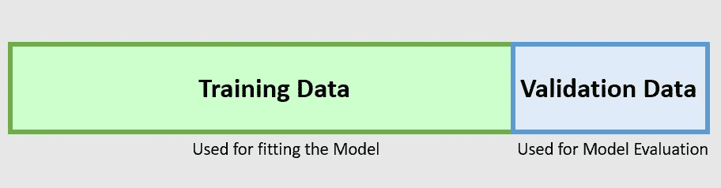
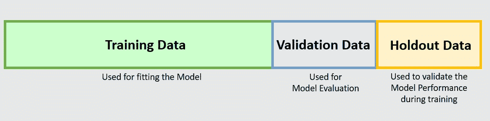
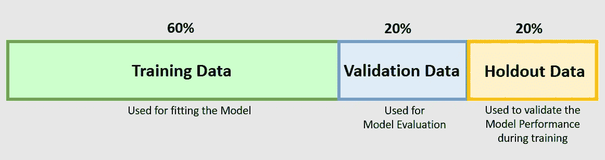

# 训练模型时，您将需要训练、验证和维持数据集

> 原文：<https://towardsdatascience.com/when-training-a-model-you-will-need-training-validation-and-holdout-datasets-7566b2eaad80?source=collection_archive---------16----------------------->

## 理解为什么需要 3 组独立的数据来建立模型

照片由 Amirali Mirhashemian 拍摄，来自 [Unsplash](https://unsplash.com/)

## 介绍

当我第一次开始建立机器学习模型时，我曾经用两组数据训练我的模型— *训练数据集和验证数据集*，使用通用的分裂规则(80%用于训练数据，20%用于验证数据)。然而，当模型被部署并应用于新的数据集时，模型性能开始下降。发生这种情况的原因之一是模型没有使用**维持数据** t 进行进一步验证，这一点很重要，因为它在训练过程中验证模型性能，从而对模型性能进行最终验证。

在本文中，让我们更多地了解为什么我们在开发机器学习模型时需要不同的数据集，包括每个数据集的功能和重要性— **训练数据集、验证数据集和维持数据集。**

## 数据分割

在您开始构建机器学习模型之前，如果您正在训练一个监督学习模型，则需要对数据进行分区。拥有不同数据集的目的是拥有可用于验证模型性能的数据子集。让我们了解一下您需要划分的 3 组数据:

(1)训练数据集

(2)验证数据集

(3)维持数据集(也称为测试数据集)

## 什么是训练数据集和验证数据集？

训练数据集和验证数据集(图片由作者提供)

**训练数据集**是用于训练模型的数据集，这也将是最大的数据集。这是模型将使用并从中学习行为的数据集。将基于训练数据集持续训练模型，以理解其中的行为和模式。

**验证数据集**用于模型评估，并在训练过程中微调模型超参数。该模型将基于这组数据验证其性能和准确性，但不从验证数据集学习。

## 什么是维持数据集？

添加维持数据集(按作者分类的图像)

**在模型训练过程**中不使用维持数据集，而的目的是在训练过程中提供模型性能的无偏估计。只有当模型使用训练数据集和验证数据集完成训练时，才会使用这组数据。维持数据集起着重要的作用，因为它确保模型可以很好地对看不见的数据进行归纳。因此，为了确保模型的准确性，确保维持数据集不包含任何定型或验证数据集非常重要。

此外，还应该将维持数据集上模型的准确性与训练期间的准确性进行比较，以确保模型不会过度拟合。如果与维持数据集的准确性相比，训练期间的准确性表现得明显更好，则这表明模型可能过拟合。

## 配置分流比

定型、验证和维持数据集的通用拆分比率(图片由作者提供)

通常，经常使用的拆分比率是 60:20:20 (60%用于定型数据，20%用于验证数据，20%用于维持数据)或 50:25:25。然而，这也取决于所用数据的大小和类型。重要的是要确保数据集被很好地划分，每组数据都包含原始数据的模式或趋势，否则我们最终可能会选择一个基于验证数据中的模式或趋势的模型。

## 结论

这篇短文总结了将数据分成三个不同数据集的重要性，这三个数据集分别是定型数据集、验证数据集和维持数据集。维持数据集用作模型性能的最终估计，仅应在模型完成基于验证数据集的定型和调整后使用。

感谢阅读这篇文章，我希望这对任何人来说都是很好的信息。

参考和链接:

[1][https://machine learning mastery . com/difference-test-validation-datasets/](https://machinelearningmastery.com/difference-test-validation-datasets/)

[2][https://sdsclub.com/how-to-train-and-test-data-like-a-pro](https://sdsclub.com/how-to-train-and-test-data-like-a-pro/)/

[3][https://towards data science . com/training-vs-testing-vs-validation-sets-a 44 bed 52 a0e 1](/training-vs-testing-vs-validation-sets-a44bed52a0e1)