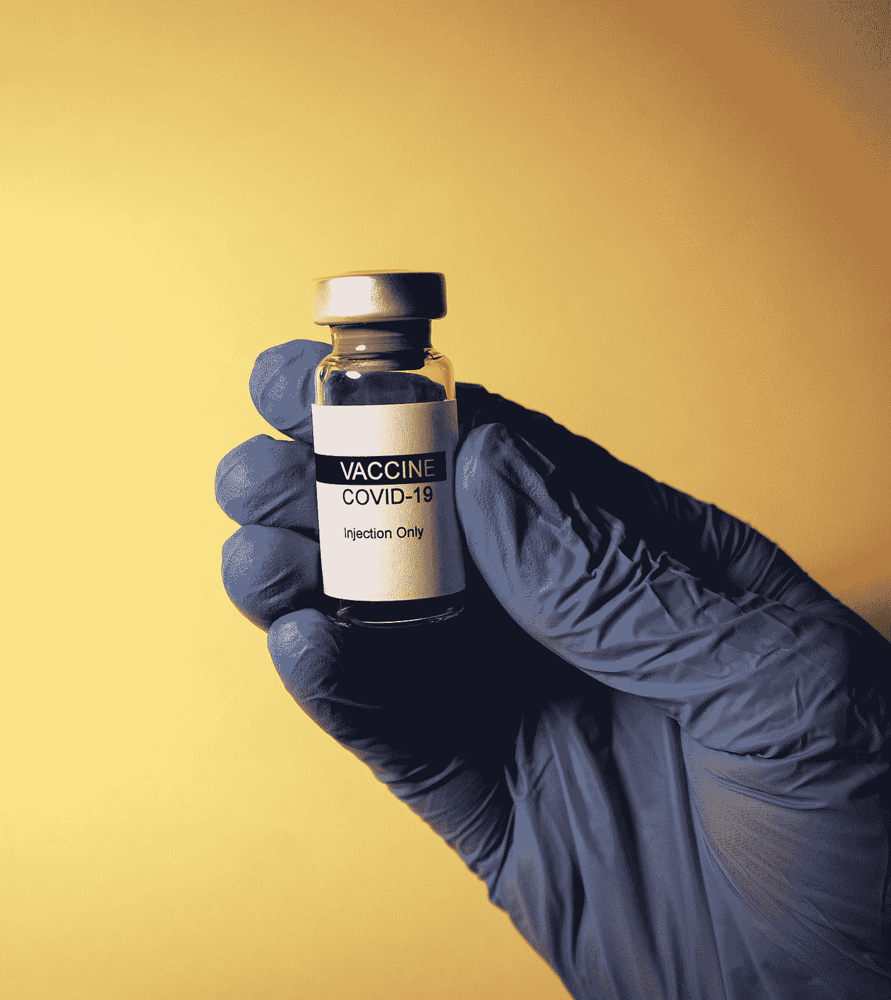
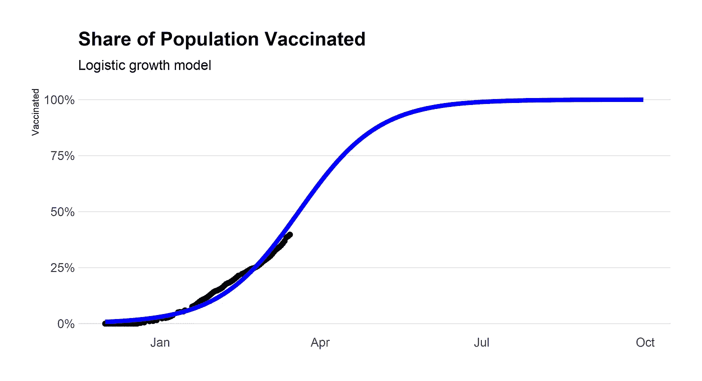
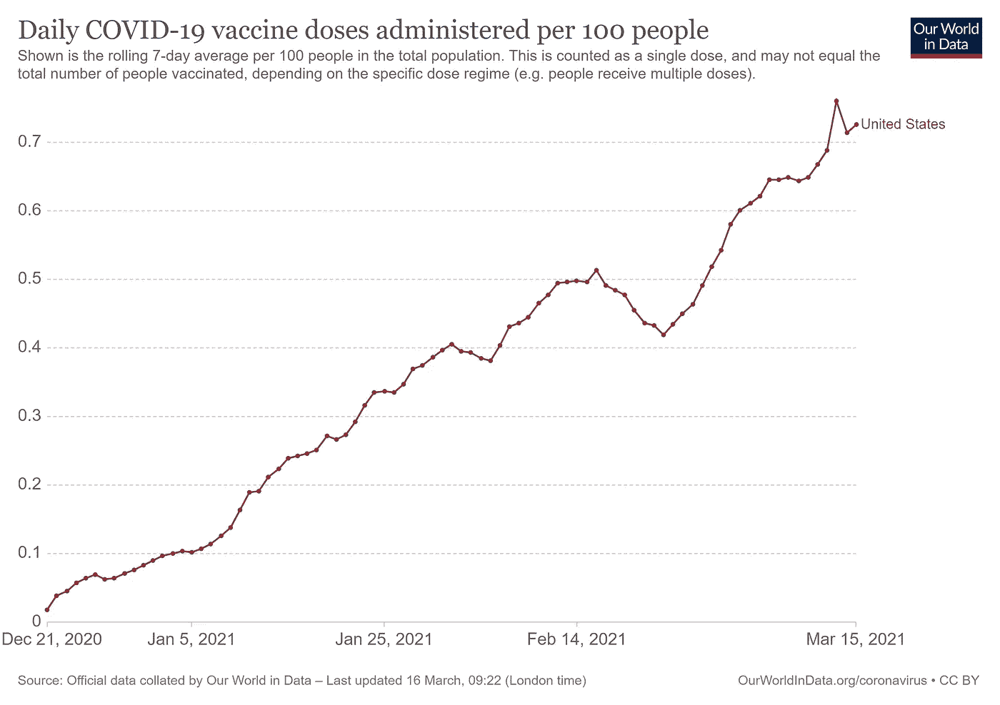
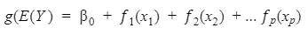
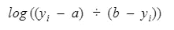
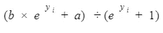
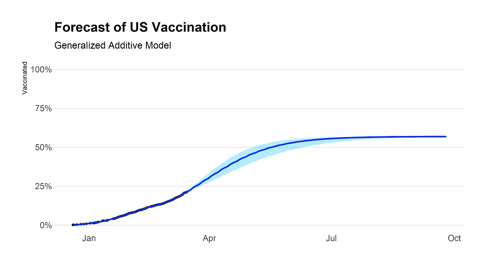

# 我是如何预测美国何时接种疫苗的

> 原文：<https://towardsdatascience.com/when-will-the-us-be-vaccinated-1b24890a8c38?source=collection_archive---------20----------------------->

## 使用广义加法模型预测美国疫苗接种何时不再受供应限制

照片由[哈坎·努拉尔](https://unsplash.com/@hakannural?utm_source=medium&utm_medium=referral)在 [Unsplash](https://unsplash.com?utm_source=medium&utm_medium=referral) 上拍摄

接种疫苗的竞赛开始了。虽然大多数发达国家只有百分之几的人口接种了疫苗，而发展中国家才刚刚开始，但美国是领先的国家之一，其 21%的人口至少接种了一剂疫苗。那么美国什么时候才能达到所有想要疫苗的人都有疫苗的地步呢？

为了回答这个问题，我决定对美国的疫苗接种工作做一个快速预测。虽然这绝不是详尽无遗的，但希望它能产生一个合理的猜测。

## 数据

数据取自[数据中的我们的世界](https://ourworldindata.org/covid-vaccinations)。我使用至少接种过一次疫苗的人口比例。真实数据的最后一天是 3 月 15 日。

## **代码**

分析是在 R. Code 中执行的，数据集[在我的 Github](https://github.com/braydengerrard/COVIDVaccineForecast) 中可用。

## 假设

进行了一些调整。目前没有疫苗被批准用于 16 岁以下的儿童。虽然疫苗最终会被批准用于它们，但这项分析并没有解决这个问题。第二，一部分人可能会因为各种原因拒绝接种疫苗。[最近的调查](https://www.pewresearch.org/science/2021/03/05/growing-share-of-americans-say-they-plan-to-get-a-covid-19-vaccine-or-already-have/)显示，目前约有 30%的成年人会拒绝接种疫苗，尽管这一数字在最近几个月呈下降趋势。

根据[人口普查局的数据](https://www.census.gov/data/tables/2019/demo/age-and-sex/2019-age-sex-composition.html)，在这个练习中，我剔除了 14 岁及以下人口的 18.74%(记录没有对 15 岁及以下的人口进行细分，所以这个比例可能会略有偏差)。然后我假设剩下的 30%的成年人会拒绝接种疫苗。据估计，还有大约 57%的人口能够并愿意接种疫苗。实际上，这个数字可能会有所不同。

## 天气预报

首先，我通常认为疫苗接种会遵循一条“S”曲线，开始时很慢，中间时疫苗接种量增加，最后随着希望接种疫苗的人数减少而逐渐减少。逻辑曲线非常接近这个形状。将数据放入逻辑回归，我得到以下输出:

y 轴代表有能力和愿意的人口

这些数据实际上并不符合逻辑曲线。在某些点上，回归始终低估了实际的疫苗接种。目前，回归结果将实际疫苗接种量高估了几个百分点，曲线显得有些过于陡峭。

这个问题是由于美国疫苗接种在二月中下旬的一个间歇。逻辑回归不够灵活，无法处理疫苗接种中的这种纠结。

图片由[我们的世界在数据](https://ourworldindata.org/covid-vaccinations)

因此，需要一个模型来解释这种扭结而不影响预测。为了对此进行建模，我使用了一个广义加法模型(GAM ),它可以表示如下:

其中 E(Y)是 Y 变量的期望值，g 是链接函数。鉴于线性回归具有β系数，在 GAM 中，每个预测变量(由 x 表示)具有可以是线性或非线性的平滑函数(f)。

GAM 是一个高度灵活的模型，可以处理各种模式和情况。虽然我不会详细介绍 GAM 的属性和优点，但是对于感兴趣的人来说，[是一本很好的读物](https://multithreaded.stitchfix.com/assets/files/gam.pdf)。

然而，GAM 并不直观地知道数据在 0%和 100%之间有界(或者在我的假设下是 57%)。如果我做一个预测，模型的预测将远远超过 100%，从而打破了概率定律。为了纠正这一点，首先需要通过将 Y 变量传递到以下等式来转换 Y 变量:

其中 a 是下限(0)，b 是上限(0.57)。

我使用 R 中的 [mgcv 包](https://cran.r-project.org/web/packages/mgcv/mgcv.pdf)来适应游戏。为了估计平滑参数，我通过限制最大似然(REML)使用混合模型方法。

该模型有两个预测因子:时间(以天为单位)和星期几，为此我为平滑函数指定了一个循环三次回归样条。在创建了一个仅使用时间作为预测因子的模型后，我在残差图中发现了一个循环模式，之后添加了工作日预测因子。95%的置信区间是用贝叶斯方法计算的。

拟合模型后，Y 数据以及预测值和置信区间现在需要转换回原始形式进行解释。为此，它们通过以下等式传递:

创建结果图，生成的预测如下:

总的来说，我对模型和预测很满意。预测符合预期的“S”模式，您可以看到预测中的小波动说明了每周的周期。

根据这一预测，超过 90%希望接种疫苗的符合条件的人应该在 5 月底接种疫苗。到 5 月 18 日，预计 50%的人口将接种一剂疫苗。这相当于大约一半的人口作为一个整体在该日期前接种了疫苗。这似乎与白宫提出的计划相一致，该计划承诺疫苗将在 5 月份提供给所有需要的人。

当然，对 COVID 疫苗态度的进一步改变可能会使这一问题复杂化，并稍微推迟这一时间表。也有可能——甚至很有可能——当更多的疫苗被批准时，这个预测将被证明过于保守。据报道，美国已经为 T2 储备了超过 3000 万剂的阿斯利康疫苗，他们正在等待 FDA 的批准，这可能会在下个月初到来。