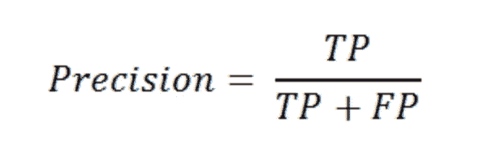
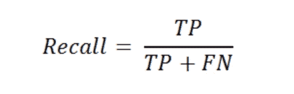

# 当你不应该用准确性来评估你的机器学习模型时

> 原文：<https://towardsdatascience.com/when-you-should-not-use-accuracy-to-evaluate-your-machine-learning-model-4d58f16968e6?source=collection_archive---------9----------------------->

## 以及有哪些选择。

米歇尔·玛特隆在 [Unsplash](https://unsplash.com/s/photos/wrong?utm_source=unsplash&utm_medium=referral&utm_content=creditCopyText) 上的照片

创建机器学习模型是一个迭代的过程。您将需要进行几次迭代，以获得一个健壮且体面的模型。此外，您可能需要在将模型部署到生产环境中之后对其进行更新。

这个过程中的一个重要部分是模型评估。这和创建模型一样重要。

有几种损失函数和度量来评估模型性能。使用哪一个取决于任务和数据。当谈到分类模型时，最简单和明显的选择似乎是分类精度。但是，在某些情况下，它不是最佳选择。

在本文中，我将解释什么时候应该避免使用分类精度，以及存在哪些替代方法。

分类准确度可能是最直观的度量。它显示了正确预测与所有预测的比率。

分类准确性(图片由作者提供)

那么这个基本指标有什么问题呢？

潜在的问题最好通过例子来解释。想一想垃圾邮件。由于高效的垃圾邮件检测算法，我们不必在这些问题上纠缠不休。

假设我们正在设计一个检测垃圾邮件的模型。与其他电子邮件相比，普通电子邮件地址收到的垃圾邮件非常少。因此，用于训练的数据集很可能是不平衡的。

假设数据集中垃圾邮件和普通邮件的比例是 5 比 95。如果一个模型预测每封邮件都不是垃圾邮件，它的准确率将达到 95%，这听起来不错。然而，它是一种无所作为的模式。

此外，垃圾邮件和其他电子邮件中的错误应该以不同的方式处理。错过一封垃圾邮件并让它进入收件箱并不是什么大问题。但是，将重要的电子邮件标记为垃圾邮件可能会产生严重的后果。

分类准确性没有为我们提供区分垃圾邮件和其他电子邮件错误所需的灵活性。

类似的情况可以是用于将肿瘤分类为恶性或良性的模型。将恶性肿瘤检测为良性是一个致命的错误。我们的模型应该更加集中于正确地检测恶性肿瘤。评估指标也应该相应地设置。

对于到目前为止所讨论的情况，我们需要一个比分类精度更高级或更具体的度量。有哪些替代方案？

我认为有些术语对于理解这些替代方案的工作原理很重要。我先解释一下。

## 混淆矩阵

它分别概述了不同类上的模型性能。在二元分类的情况下，我们可以观察模型在预测正类(或 1)和负类(或 1)方面的表现。

(图片由作者提供)

*   True positive (TP)表示实际类值和预测值都为正(或 1)。
*   真负值(TN)意味着实际类值和预测值都是负值(或 0)。
*   假阳性(FP)意味着预测值为正，但实际类值为负。
*   假阴性(FN)意味着预测值为负，但实际类值为正。

TP 和 TN 都是正确的预测，因此我们预计它们比 FP 和 FN 高。

现在，我们可以详细了解分类准确性的替代指标。

## 精确

精确的焦点是正面的预测。因此，它基于正面预测来评估模型。精度值是正确的肯定预测与所有肯定预测的比率。

(图片由作者提供)

在垃圾邮件检测模型的情况下，假设垃圾邮件代表肯定的类别，我们希望精确度尽可能高。

## 回忆

回忆的重点是正面类，而不是正面预测。它被计算为正确的正预测与整个正类的比率。

(图片由作者提供)

假阴性的实际类别是阳性，因此所有阳性类别的数量可以通过将真阳性和假阴性加在一起获得。

在肿瘤检测模型的情况下，我们希望最大化召回值，因为检测每个恶性细胞是至关重要的。

**注**:虽然精度和召回率多用于二分类问题，但也可用于评价多类分类任务。

## 结论

彻底的评估是机器学习的关键步骤。否则，改进你的模型将是一场艰苦的战斗。

评估过程中最重要的部分是选择合适的指标。对于目标变量不平衡的分类问题，分类精度不是最佳选择。

精确和回忆可以用在这样的任务中。您也可以使用 F1 得分，它是精确度和召回率的加权平均值。

感谢您的阅读。如果您有任何反馈，请告诉我。