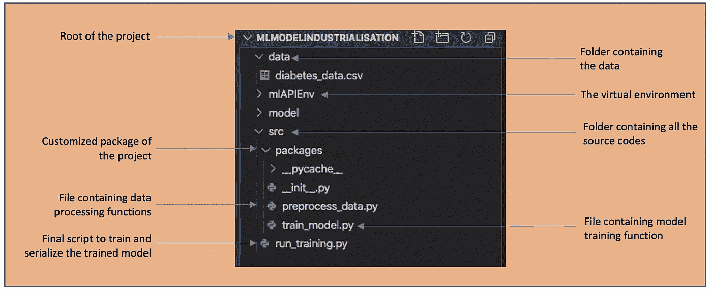
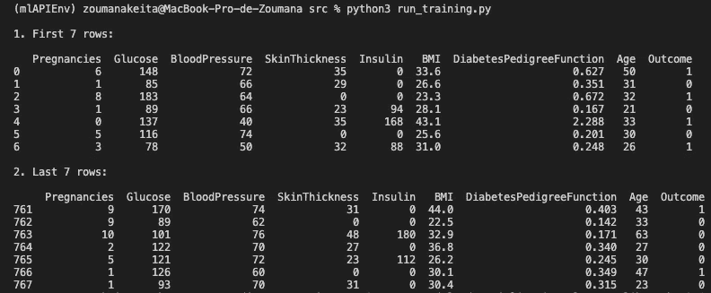
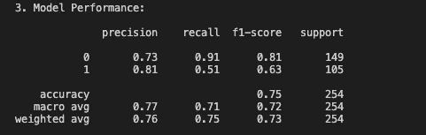
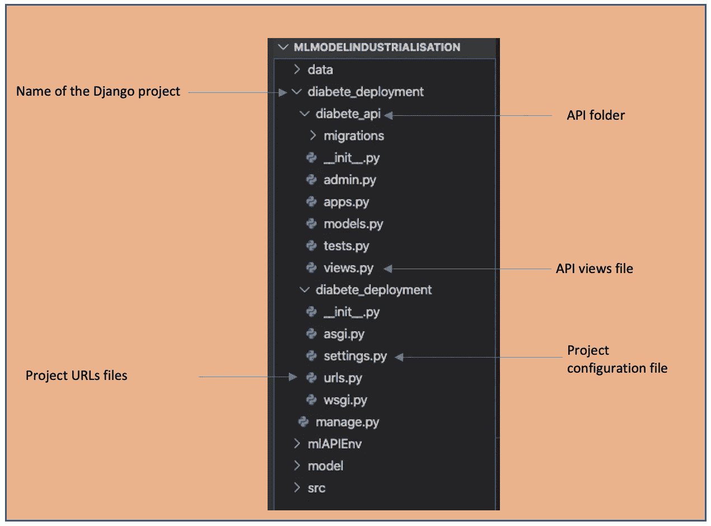
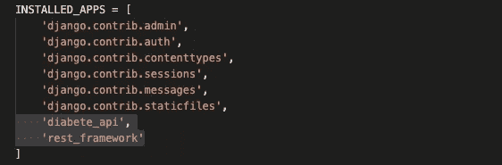
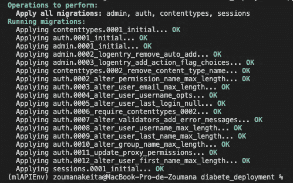
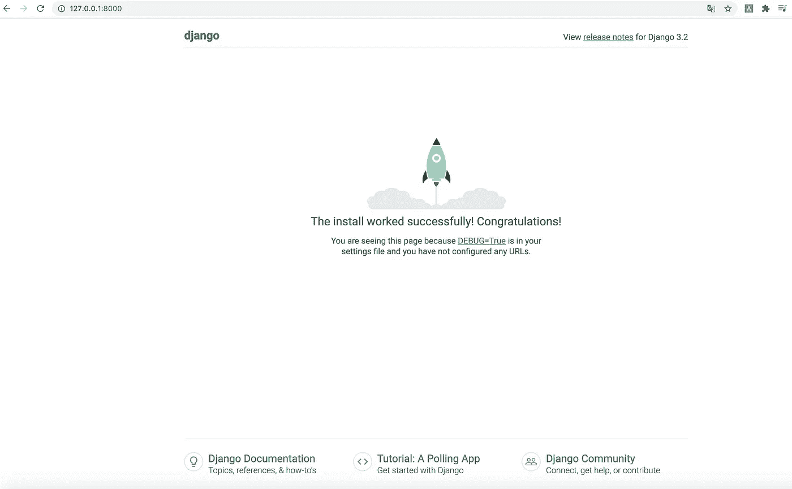
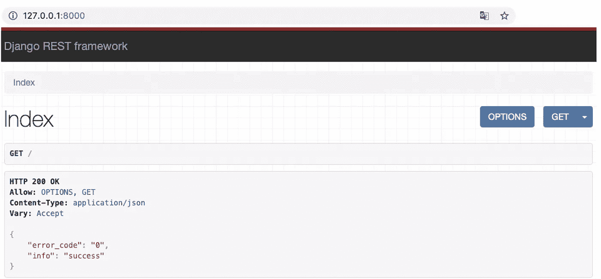
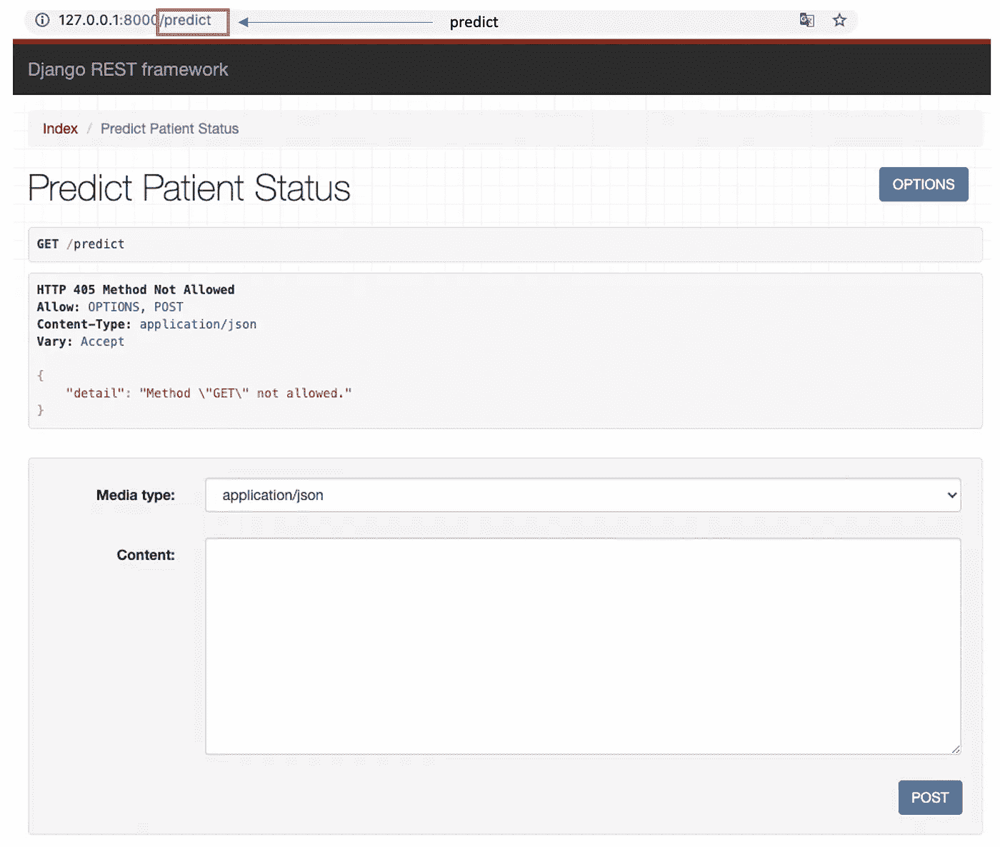
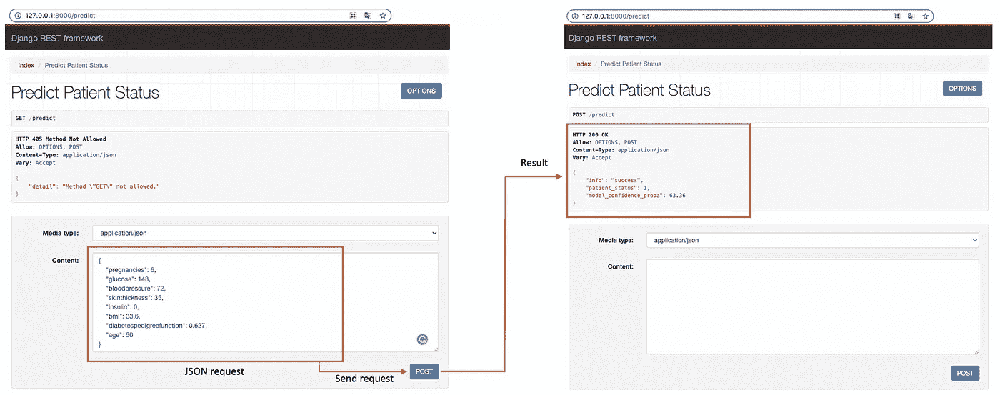

# 当您的机器学习模型与 Django REST API 合作时，成功地部署到了生产中

> 原文：<https://towardsdatascience.com/when-your-machine-learning-model-teams-up-with-django-rest-api-a-successful-deployment-into-2f720bd67ff1?source=collection_archive---------8----------------------->

## 关于如何构建机器学习模型并使用 Django REST API 部署它的完整概述


[SpaceX](https://unsplash.com/@spacex) 在[号航天飞机](https://unsplash.com/photos/uj3hvdfQujI)上拍摄的照片

# 介绍

让我们考虑一下下面的场景:您已经实现了一个出色的机器学习模型，该模型可以预测患者是否患有帕金森病。然后，您所在城市的医院希望将您的模型集成到他们的系统中，以供一般使用。但是这些系统是用完全不同的编程语言开发的。这是否意味着他们将不能再使用您的模型了？答案是否定的，因为有了 RESTful 服务，无论应用程序开发人员使用哪种编程语言，他们都可以使用您的模型。

本文分为两个部分:

*   构建一个机器学习模型，预测给定患者是否患有糖尿病。
*   演练 REST 的步骤-使用 Django REST APIs 启用您的机器学习模型。

# 第一部分:模型构建

目标不是拥有一个花哨的模型，而是快速拥有一个模型并将其序列化，以便创建最终的 REST API。

下图描述了模型构建项目的结构。



按作者列出的项目结构

## 先决条件

本节的目的是安装正确实现分类模型所需的所有库。

1-创建并激活虚拟环境

```
python3 -m venv mlAPIEnv   # Create the environment
source mlAPIEnv/bin/activate  # Activate the environment
```

2-安装 ***熊猫*** 进行数据读取

```
pip install pandas
```

3-安装 ***sklearn*** 导入机器学习模型

```
pip install -U scikit-learn
```

4-安装 ***作业库*** 以序列化最终模型

```
pip install joblib
```

## 每个文件的内容

运行以下命令后，您将看到下面的图像:前 7 行，后 7 行，以及分类报告中的模型性能。

```
cd src # move to the ***scr*** folderpython3 run_training.py # Run the model training
```



数据帧的头和尾



分类报告

现在，您应该在*模型**文件夹下找到一个新文件***diabete _ detector _ model . pkl***。*

您的机器学习模型已经准备好了。现在是时候休息了——用 Django REST API 启用它。

# 第 2 部分:应用编程接口的实现

## 先决条件

本节的目的是安装正确实现 REST API 所需的所有库。

1-安装姜戈

```
pip install django
```

2-安装 Django REST 框架

```
pip install djangorestframework
```

## Django 项目和 REST API

所有库都已安装。下一步是创建一个姜戈项目和姜戈 rest API。

1-从项目的根文件夹创建您的姜戈项目。

```
django-admin startproject diabete_deployment
```

运行前面的指令将创建一个名为 diabete_deployment 的新文件夹。移动到该文件夹并创建您的应用编程接口。

2-创建您的 API 文件夹

```
cd diabete_deployment # Move into the folderdjango-admin startapp diabete_api # Create your API folder
```

从下图中，我们可以看到前面的附加文件夹及其相应的文件。



按作者列出的带有附加文件夹的项目结构

对于构建我们的 API 很重要的文件是 ***settings.py*** ， ***diabete_api/views.py，*** 和***diabete _ deployment/URLs . py .***我们稍后需要创建额外的文件和文件夹。

*   ***settings.py*** :用于注册项目中的所有新应用/API。新信息注册在下面突出显示的 **INSTALLED_APPS** 变量下( **diabete_api** 和 **rest_framework** )。



settings.py 内容

每次更新设置文件时，进行迁移是很重要的，以便将更改传播到数据库模式中。确保在 ***manage.py*** 所在的 diabete_deployment 文件夹下运行该命令。

运行迁移

```
python manage.py makemigrations
```

b-迁移更改

```
python manage.py migrate
```

以下是运行 migrate 命令后的输出



运行服务器，检查到目前为止是否一切正常

```
python manage.py runserver
```

前面的命令生成以下信息来访问通向 Django 接口的 URL，这意味着到目前为止一切正常。

```
Watching for file changes with StatReloader
Performing system checks...System check identified no issues (0 silenced).
November 29, 2021 - 03:47:18
Django version 3.2.9, using settings 'diabete_deployment.settings'
Starting development server at [http://127.0.0.1:8000/](http://127.0.0.1:8000/)
```



Django web 界面，意味着配置是成功的

*   ***diabete _ API/views . py***:用于实现调用特定路线时会触发的所有功能。在我们的例子中，实现将基于预测函数。为了进行预测，我们的函数需要加载模型。为此:我们需要 ***在主***diabete _ deployment***文件夹下创建一个新的静态/模型*** 文件夹，该文件夹将包含序列化的 ***。pkl* 型号**型号。

diabete_api 文件夹的 views.py

*   **新建一个文件*****diabete _ API/URLs . py***，内容如下

*   ***diabete _ deployment/URLs . py***:用于将所有的 URL 链接到它们在 views.py 文件中实现的对应函数。

现在，所有重要的文件都已更新，新的文件也已创建，我们终于准备好重新启动网址，并确保一切正常！

运行服务器

```
python manage.py runserver
```

我们可以访问前面命令行生成的 url。

```
System check identified no issues (0 silenced).
November 29, 2021 - 16:23:24
Django version 3.2.9, using settings 'diabete_deployment.settings'
Starting development server at [http://127.0.0.1:8000/](http://127.0.0.1:8000/)
Quit the server with CONTROL-C.
```

这是我们得到的屏幕，它指向 ***索引*** 页面，显示视图文件内 ***索引*** 功能中指定的信息。

此页面显示 ***HTTP 200 OK*** 表示页面请求成功。



(图片由作者提供)

从该页面中，我们可以通过在 URL 中添加 ***/predict*** 来最终调用预测函数。



(图片由作者提供)

在上一页中，我们可以通过将以下 JSON 数据粘贴到 content 部分来模拟预测。



(图片由作者提供)

从前面的图像中，我们观察了从请求到预测的整体交互。

## 用 CURL 测试您令人敬畏的 API

下面是我们正在进行的 post 请求的语法

```
curl -d "param1=val1&param2=val2...paramN=valN" [URL]/funct_to_call
```

*   ***param1*** :第一个参数和 ***val1*** 是对应的值
*   ***param2*** :第二个参数和 ***val2*** 是对应的值
*   等等。
*   ***URL*** :要使用的 URL，在我们的例子中是 [http://127.0.0.1:8000](http://127.0.0.1:8000)
*   ***【funct _ to _ call】***:请求调用的函数，在我们这里是 ***/predict***

将所有内容相加，我们得到以下请求:

```
curl -d  'pregnancies=6&glucose=148&bloodpressure=72&skinthickness=35&insulin=0&bmi=33.6&diabetespedigreefunction=0.627&age=50' http://127.0.0.1:8000/predict
```

以下是请求的结果:

```
{"info":"success","patient_status":1,"model_confidence_proba":63.36}
```

# 文章结尾

从本文中，您已经学习了如何使用 Django 构建您的机器学习模型和创建 REST API。你现在可以将你的 API 提供给你所在城市的医院，从而拯救生命😃。

## 额外资源

[Django REST 框架](https://www.django-rest-framework.org/)

[用 Postman 和 curl 测试 REST API](https://svitla.com/blog/testing-rest-api-with-postman-and-curl)

再见🏃🏾