# 线性回归中的置信区间从何而来——最小二乘公式的例子

> 原文：<https://towardsdatascience.com/where-do-confidence-interval-in-linear-regression-come-from-the-case-of-least-square-formulation-78f3d3ac7117?source=collection_archive---------7----------------------->

## [实践教程](https://towardsdatascience.com/tagged/hands-on-tutorials)

## 了解线性回归中学习参数权重的标准误差，以及其他指标，如 t 指标和 P>|t| metic。

图片来自 [Pixabay](https://pixabay.com/photos/stare-power-line-birds-persevere-1680951/)

我一直认为我很了解线性回归，直到最近我的大脑对一个同事的问题一片空白——当使用 Python 的普通最小二乘类 OLS 时，参数置信区间来自哪里？我决定推导出线性回归的所有相关公式，并将这些推导汇编成一组文章。这是第一个。

# 线性回归模型

线性回归模型 *f(x)=xᵀ w* 是大多数人研究的第一个机器学习模型。在这个模型中:

*   *x* 是特征， *w* 是模型参数。 *x* 和 *w* 都是长度为 *p* 的向量，其中 *p* 是特征的数量。*是[矢量点积](https://en.wikipedia.org/wiki/Dot_product)。*
*   *我们需要从训练数据集 *(X，Y)* 中学习 *w* 的具体值，其中 *X* 是形状为 *n×p* 的特征矩阵，其中 *n* 是训练数据点的数量。 *Y* 是形状为 *n×1 的观测矩阵。**

*以下代码使用普通最小二乘类(OLS)来学习模型参数 *w* 的值:*

*第 4 ~ 6 行建立了一个线性回归模型，有三个特征*声望、教育*和一个常数特征(或偏差)，目标变量*收入*。*

*第 10 行打印了下表。在表格中:*

*   **coef* 栏(用黄色背景突出显示)显示了我们的特征的学习参数值— *声望*、*教育*和添加的*常量*特征。这是我们平时关注的。*
*   *有趣的是，该表还显示了一些概率度量(用粉红色背景突出显示):对于学习的系数， *std err* ， *t* ， *P > |t|* 和置信区间【0.025，0.975】。它们似乎是概率度量，它们意味着什么？*

**

*本文解释了这些概率度量的含义，以及它们是如何在线性回归模型的最小二乘公式中计算出来的。*

*但是在我们回答这些问题之前，我们首先需要了解如何从训练数据 *(X，Y)* 中学习我们的模型参数 *w* 的值。我们使用的方法叫做**最小二乘法**。*

# *最小二乘公式*

*在最小二乘法公式中，为了找到模型参数 *w、*的具体值，我们最小化以下损失函数*

**

*损失函数 *L(w)* 是观测值 *Y* 和模型预测值 *X w* 之间距离的平方。工作就是最小化这种损失——找到 w 的值，使得 *L(w)的*值最小，因此得名最小二乘法*。**

## *解正规方程求 w*

*由于 *L(w)* 是一个未知 *w* 的二次函数，找到最小化 *L(w)* 的 *w* 的值的显而易见的方法是:*

1.  *求 *L(w)* 相对于 *w 的导数*导数是另一个未知的函数 *w* 。*
2.  *将导数设置为 0。这就给了你著名的**法线方程**。*
3.  *求解法线方程以找到 *w* 的具体值。*

*形式上:*

*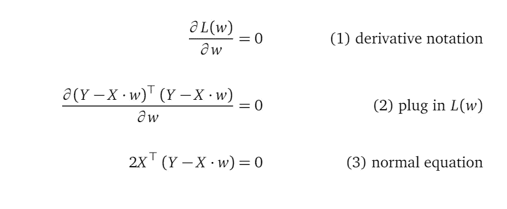*

*第(1)行左侧是损失函数 *L(w)* 相对于 *w* 的导数的符号。“ *∂* 这个符号反映了一个事实，即 *w* 是一个变量的向量，而不是单个变量，所以我们在偏导数的世界里。“偏导数”是指每个导数都与向量 *w* 中的单个变量相关，从而产生 *p* 偏导数，其中 *p* 是 *w* 向量的长度。我们将在本文后面更清楚地看到这一点。*

*线(2)插入 *L(w)* 的定义。*

*第(3)行应用向量微分规则来计算导数。将这个导数设为 0，我们就得到了正规方程。*

*为了求解法线方程，我们做:*

*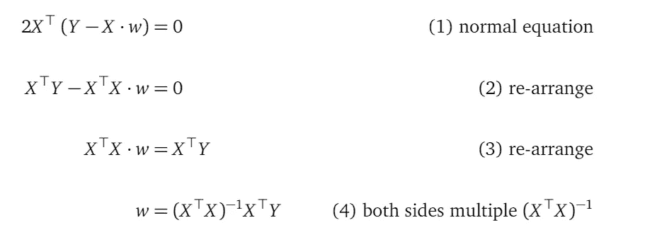*

*让我们用名字 *wₒₚₜ* 来指代使法线方程成立的 *w* 的值，换句话说:当 *w* 取值 *wₒₚₜ=(XᵀX)⁻ XᵀY* 时，法线方程的左侧计算结果为 0。所以我写 *w* 时，指的是未知模型参数的向量；而当我写 *wₒₚₜ* 的时候，我指的是 *w* 可以取的值，让正规方程成立:*

**

*注意在 *wₒₚₜ、*的表达式中，你不能用规则*(xᵀx)*⁻=*x*⁻(*xᵀ)*⁻来简化 *(XᵀX)⁻* ，因为 *X* 通常不是一个方阵。只有方阵才有逆。例如，如果有 *n=10 个*数据点，并且 *p=2 个*特征， *X* 的形状为 10×2；它不是一个正方形矩阵。*

## *向量微分*

*我认为以上所有的步骤都很简单，除了我们应用向量微分法则来推导正规方程的那一步。我可以背出 *∂(wᵀw) = 2w* 这样的向量微分法则，但结果似乎还是很神秘。*

*它看起来很神秘，因为使用了线性代数中引入的向量微分规则。这些规则提供了一定程度的抽象。一方面，它们允许你以简洁的方式写下冗长的表达；但另一方面，它们阻止你立即看到计算是如何进行的。*

*我们应该理解所有这些向量符号和线性代数规则只是为了记账。如果展开所有向量并应用非向量版本的微分规则，向量微分的结果应该是相同的。如果你想知道这是如何解正规方程的，请查阅本文的附录。*

*求解正规方程是对线性回归模型进行参数学习的一种方法。存在其他方法。[这里](/can-we-use-stochastic-gradient-descent-sgd-on-a-linear-regression-model-e50327b07d33)是关于如何通过另一种方法——随机梯度下降法找到线性回归参数值的好读物。*

# *最小二乘公式中的不确定性*

*直到现在，我们的线性模型 *f(x)=x w* 都是确定性模型，而不是概率性模型。要看这个:*

*   *学习的参数值 *wₒₚₜ=(XᵀX)⁻ XᵀY* 是确定性的，因为其成分 *X* 和 *Y* 是给定的训练数据集。 *wₒₚₜ* 是一个实标量的具体向量。*
*   *这个模型*ŷ= xwₒₚₜ*的预测是确定性的，因为 *X* 和 *wₒₚₜ* 都是确定性的*。**

*但是这里再次显示的模型拟合总结包括概率指标，如标准误差、置信区间。这是怎么回事？*

**

## *概率测度与随机变量一起存在*

*这些概率度量只与随机变量的概念一起存在。因此，为了讨论这些指标，我们需要在我们的模型中引入随机变量。具体地，由于标准推导，置信区间是用于学习的模型参数的。我们需要将学习到的模型参数值从一个标量，如 0.6237 的*声望*，变成一个随机变量。*

## *在线性模型中引入随机变量*

*我们按照以下步骤引入随机变量来表示可能的模型参数值:*

***第一步***

*引入一个随机变量向量 *y=X wₜᵣᵤₑ+ ε* ，其中 *wₜᵣᵤₑ* 代表我们永远不会知道的单一真实模型参数值。不要担心我们不知道 *wₜᵣᵤₑ* 的值，稍后，我们会估计它。 *ε* 是均值为零的多元高斯噪声，在每个数据点上是独立的，方差 *η。* *y* 为形状为 *n×1* 的随机变量向量，其中 *n* 为训练数据点的个数:*

**

*进一步理解 *y* 的定义:*

*   *随机变量向量 *y* 中的每一项 *yᵢ* 代表对应的训练数据点 *Yᵢ* 可能取的值。因此，我们训练数据集中的观察值 *Y* 向量可以被建模为来自随机变量向量 *y* 的样本。*
*   *在这个随机变量向量中，每一项 *yᵢ* 被定义为两部分之和: *yᵢ=Xᵢ wₜᵣᵤₑ+ εᵢ.**xᵢwₜᵣᵤₑ*部分是确定性的，因为 *Xᵢ* 和 *wₜᵣᵤₑ* 都是具体值。噪声部分 *εᵢ* 是随机的——是来自高斯分布 *N(0，η )* 的一维随机变量。如此定义， *yᵢ* 也是来自一维高斯分布的随机变量。*
*   *来自向量 *y* 的所有单个随机变量遵循相同的定义模式。我们有 *n* 个数据点，所以有 *n* 个独立噪声，它们都有零均值和方差 *η* 。*
*   *我们可以用一个多元高斯随机变量来更简洁地表示这些 *n* 独立噪声(但数学上等价): *ε~N(0，Iₙ η)。*所以 *ε* 是长度为 *n* 的随机变量向量， *Iₙ* 是 *n×n* 的单位矩阵。 *Iₙ η* 中的 *η* 部分表示 *ε* 中各单个随机变量的方差为*η*； *Iₙ* 部分表示所有这些单个随机变量都是独立的。*
*   *另一种写法 *y=X wₜᵣᵤₑ+ ε* 是 *y* ~ *N(X wₜᵣᵤₑ，Iₙ η)。**

***第二步***

*我们已经解出了得到 *wₒₚₜ=(XᵀX)⁻ XᵀY.* 的正规方程，这是理解这个公式的另一种方式:*

*   *揭示了具体值 *Y* 通过变换矩阵 *(XᵀX)⁻ Xᵀ，*)线性变换为 *wₒₚₜ.*注意 *wₒₚₜ* 与我们在步骤 1 中介绍的 *wₜᵣᵤₑ* 不同。 *wₜᵣᵤₑ* 是我们永远不会知道的真实系数的符号。 *wₒₚₜ* 当使用最小二乘法作为估计方法时，我们对 *wₜᵣᵤₑ* 的估计(或学习参数值)。*
*   *既然现在我们将 *Y* 建模为来自随机变量向量 *y* 的样本，该向量具有分布 *N(X wₜᵣᵤₑ，Iₙ η )* ，我们可以将*wₒₚₜ*=*(xᵀx)⁻xᵀy*建模为来自新的随机变量向量 *ŵ* ，定义为 *ŵ=(XᵀX)⁻ Xᵀ y.* 没错，随机变量向量*ŵ**
*   *从结构上看， *ŵ* 是由 *(XᵀX)⁻ Xᵀ* 对 *y* 的线性变换，正如 *wₒₚₜ* 是由 *Y.* 而来，甚至 *ŵ* 也是由 *y、*的线性变换，请注意 *w* 是 *p×1* 的形状，而*

**作为一个随机变量向量， *ŵ=(XᵀX)⁻ Xᵀ y* 代表我们的线性回归模型的参数的所有可能值及其概率密度。我们使用 *ŵ* 的概率密度函数，我们将在后面推导，来谈论我们的线性回归模型中的参数的那些概率概念，如标准差、置信区间。**

## ***ŵ，“学习参数值的*分布”是什么意思？**

**理解我们引入 *ŵ* 来表示学习参数值的分布是很重要的。但是短语“学习参数值的分布”是什么意思呢？**

**理解这个短语的最好方法是提醒我们自己，我们假设有一个**单真参数值 *wₜᵣᵤₑ*** 。并且我们想要通过从线性模型*x*t14】wₜᵣᵤₑ的透镜来查看训练数据集 *(X，Y)* 来弄清楚 *wₜᵣᵤₑ* 是什么。这适用于以下情况:**

1.  **观察值 *Y* 确实是使用公式*x*t22】wₜᵣᵤₑ从 *X* 生成的。**
2.  **当我们对 Y 的测量确实精确时。**

**然后我们可以通过解正规方程来计算出 *wₜᵣᵤₑ* 的值。**

**作为建模者，我们可以挑战上述两个条件。**

**我们可以挑战第一个条件，说 *X* 和 *Y* 之间的线性关系不正确，反而应该是指数关系。这很好，它将我们引向一个模型选择问题——我们到底应该考虑线性模型吗？或者我们应该考虑指数模型，或者神经网络，或者决策树？这个题目我再写一篇。现在，让我们保持线性。**

**我们可以挑战第二个条件，说由于一些测量上的困难，测得的观测值 *Y* 并不严格等于 *X* *wₜᵣᵤₑ.*取而代之的是被具有零均值*的高斯噪声 *ε* 破坏的 *X wₜᵣᵤₑ* 。*一种等价的说法是 *Y* 现在是随机变量 *y* 的一个样本，它被定义为 *y~ N(X wₜᵣᵤₑ，Iₙ η)。*这就是我们在这篇文章中所做的。**

*根据其定义 *Y* 是来自随机变量向量 *y* 的样本，我们必须将训练数据集中的具体观察值 *Y* 视为随机过程的结果——我们必须承认，下次采样时，我们将获得一组不同的观察值 *Y* (我说不同的组是因为 *Y* 是具有 *n* 标量的具体向量)。*

*由于学习到的参数值 *(XᵀX)⁻ XᵀY* 是从 *Y* 计算出来的，而 *Y* 因为来自于 *y* 所以现在具有随机性，所以学习到的参数值变成了一个随机变量。我们用 *ŵ* 来表示这个随机变量向量，定义为 *ŵ=(XᵀX)⁻ Xᵀy.* 根据定义，一个随机变量代表一个值的分布(具有不同的概率密度)，因此短语“ *ŵ* 代表学习参数值的分布”。*

## *推导出 *ŵ* 的概率密度函数*

*要谈概率性如 *ŵ* 的标准差，我们需要导出它的概率密度函数。推导很简单:*

1.  *因为随机变量向量 *y* 定义为 *y=X wₜᵣᵤₑ+ ε。*和 *ε* 是多元高斯随机变量 *ε~N(0，Iₙ η )* ， *y* 也是多元高斯随机变量: *y ~ N(X wₜᵣᵤₑ，Iₙ η)。我们只需要将平均值从 0 移动到 X wₜᵣᵤₑ.**
2.  *由于根据多元高斯线性变换规则， *ŵ* 被定义为 *y* : *ŵ=(XᵀX)⁻ Xᵀ y，*的线性变换， *ŵ* 也是多元高斯随机变量，规则告诉我们 *ŵ* 的概率密度函数是什么。*

***多元高斯线性变换规则***

*这个规则在机器学习里很多地方都会弹出来，比如[卡尔曼滤波](/demystifying-tensorflow-time-series-local-linear-trend-9bec0802b24a)、[高斯过程](/understanding-gaussian-process-the-socratic-way-ba02369d804)，所以请大家用心记住。形式上，它说:*

*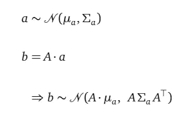*

*用英文说，如果一个多元高斯随机变量 *a* 有一个已知的概率密度函数，随机变量 *b* 是由 *a* 经变换矩阵 *A* 的线性变换，那么 *b* 就是与 *a* 形状相同的多元高斯随机变量。并且 *b* 的概率密度函数具有上述固定形式，即从 *a* 的分布中提及均值、协方差矩阵，以及变换矩阵 *A* 。*

*对于 *ŵ* ，我们有 *:**

*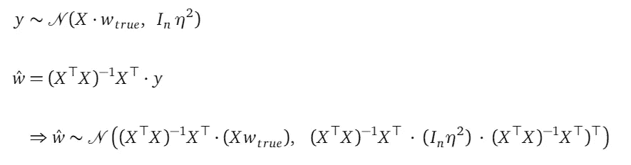*

*对于ŵ.来说，这是一个非常长的概率密度函数幸运的是，我们可以大大简化它:*

*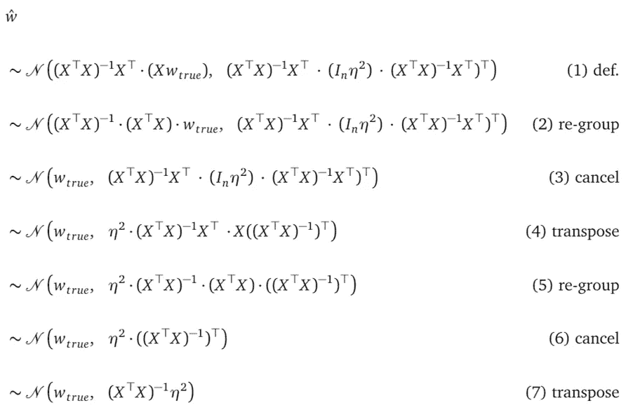*

*第(2)至(3)行简化了平均分量。第(4)～(7)行简化了协方差矩阵分量。需要注意的一点是从第(6)行到第(7)行的简化是有效的，因为 *(XᵀX)⁻* 是一个对称矩阵，它自己转置它。*

*从第(7)行我们注意到， *ŵ* 的平均值是真正的参数值 *wₜᵣᵤₑ* ，换句话说， *ŵ* 是**wₜᵣᵤₑ.*的无偏估计量****

## *估计 *ŵ* 的概率密度函数中的未知量*

*简化的概率密度函数， *ŵ~N(wₜᵣᵤₑ，**(xᵀx)*⁻*η)*有两个未知数， *wₜᵣᵤₑ* 和 *η* 。在使用这个概率密度函数来报告概率度量之前，我们需要给它们具体的值。*

*   *对于 *wₜᵣᵤₑ，*我们用 *wₒₚₜ=(XᵀX)⁻ XᵀY.**
*   *对于 *η，*我们使用以下公式，其中*ŷ= xwₒₚₜ*是来自我们的线性回归模型的样本内预测:*

**

***估计为*wₜᵣᵤₑ*t35】***

*我们先来理解一下为什么可以用 *wₒₚₜ=(XᵀX)⁻ XᵀY* 来估算 *wₜᵣᵤₑ.*从导出的 *ŵ~N(wₜᵣᵤₑ、**【xᵀx】*⁻*η)*的概率密度函数可知 *ŵ* 是 *wₜᵣᵤₑ.的无偏估计量*因此，如果我们从这个分布中抽取无限数量的样本，这些样本的平均值(或期望值)将等于 *wₜᵣᵤₑ.*换句话说，我们可以用样本的期望从 *ŵ* 到**估计**wₜᵣᵤₑ.*

**实际上，我们不能从这个分布中抽取无限的样本。其实我们只有一个样本，那就是 *wₒₚₜ=(XᵀX)⁻ XᵀY* ，它的平均值就是它自己。**

**首先，你可能会问为什么 *wₒₚₜ* 是 *ŵ* 分布的样本？这是**

**因为:**

*   ***ŵ* 定义为线性变换，用变换矩阵 *(XᵀX)⁻ Xᵀ* ，*，*从随机变量 *y.***
*   ***Y* 是来自 *y.* 的样本**
*   ***wₒₚₜ是通过对样本应用相同的变换而定义的***

**那么你可能会问，我们应该用 *ŵ* 分布的无限个样本的平均值来估计 *wₜᵣᵤₑ* ，但是我们只有一个样本。这样可以吗？嗯，不太理想，但我们只有这些了。**

****估计为*η*****

**现在让我们来理解对 *η* 的估计:**

****

***η* 是观测噪声随机变量的方差 *ε~N(0，Iₙ η)。*我们不直接观察噪音。相反，我们只从随机变量 *y=X wₜᵣᵤₑ+ ε中观察到一个样本 *Y* 。*根据定义， *y* 的方差等于噪声 *ε* 的方差，因为 *y* 中唯一的随机分量来自噪声。在 *y 的*定义中的 *X wₜᵣᵤₑ* 分量只是移动了 *y* 的平均值，而不是它的方差*。***

**y* 是包含 *n* 个随机变量的随机变量向量:*

*   *这些随机变量的平均值，即 *X wₜᵣᵤₑ，*我们用*ŷ=x*t30】wₒₚₜ.来估计*
*   *我们知道 *y* 的一个样本，那就是 *Y* 。这个观察 y 不等于*ŷ.*换句话说，拟合的线不会通过所有的观测值。我们使用引入的噪声分量来解释这些偏差——我们的模型接受实际观测值 *Y* 不等于其均值预测值*x*t42】wₒₚₜ因为在模型中，观测值 *Y* 只是来自高斯分布 *N(X wₜᵣᵤₑ，Iₙ η )* 的样本，在我们插入均值估计值后，它变成了*n(ŷ，Iₙ η )* 。样本不需要等于该分布的平均值*。*样本 y 与均值相差多少由噪声方差 *Iₙ η决定。**
*   *所以*y-ŷ*可以被看作是噪声的观测值。*y-ŷ*是一个长度为 *n* 的向量，代表噪声部分，每次观测一个。根据定义我们知道，所有这些噪声随机变量的均值为零，它们彼此独立，并且具有相同的方差 *η* 。*

*由于所有这些 *n* 噪声共享相同的方差值 *η* ，我们可以这样想:我们有一个单一的随机变量，它的均值为零，我们也有这个随机变量*的 *n* 个样本*y-ŷ*。*我们要估计这个随机变量的方差，也就是 *η。*回忆一下从样本中计算随机变量方差的公式(来自 [wiki](https://en.wikipedia.org/wiki/Bessel%27s_correction) ):*

*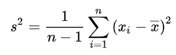*

*在我们的例子中，我们有一些类似的东西，其中*y-ŷ*是样本，0 是平均值。(*y-ŷ-0)ᵀ*(*y-ŷ-0)*为平方部分，简化为(*y-ŷ)ᵀ*(*y-ŷ)*)，所以估算 *η* 的公式(再次)为:*

**

*需要规格化器 *1/(n-p-1)* 来将结果转化为噪声方差的无偏估计量——还记得在估计样本总体方差时为什么我们使用 *n-1* 而不是 *n* 的讨论吗？这是同样的论点，部分 *-p* 反映了我们使用 *p* 特征来预测*ŷ.的事实*这导致了 *p* 自由度的减少。*

## *为 *ŵ* 完全指定概率密度函数*

*随着 *wₜᵣᵤₑ* 和 *η* 的估计，最终的、完全指定的 *ŵ* 的概率密度函数为:*

*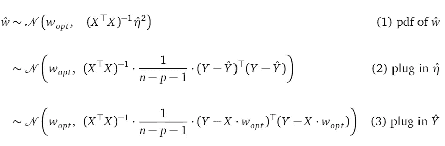*

*在我们插入 *wₒₚₜ=(XᵀX)⁻ XᵀY* 后，我们有一个学习模型参数 *ŵ* 的可评估(没有未知数)概率密度函数。我们可以使用它来报告学习参数值的那些概率度量。*

*随着ŵ完全指定的概率密度函数的推导，我们终于可以理解这些概率度量是如何计算的。*

# **的标准误差(或标准差)**

**汇总表中的*标准误差*栏报告了 *ŵ.中每个随机变量的标准偏差***

**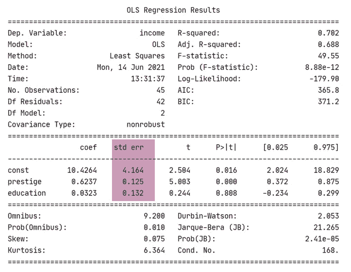**

**从 *ŵ* 的分布，也就是多元高斯*、*我们得到随机变量向量*ŵ—***【var(ŵ】*=*(xᵀx)*⁻*η的协方差矩阵。*是一个 *p×p* 矩阵*。*每个随机变量的方差在这个矩阵的主对角线上。所以每个随机变量的标准差就是那些主对角线元素的平方根。***

# *****ŵ*的置信区间*t69】*****

***现在来说说 *ŵ* 的置信区间，重点介绍如下:***

***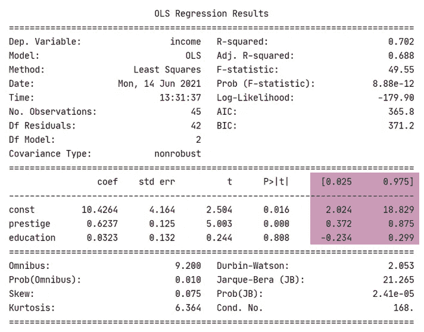***

***列名[0.025，0.975]定义了系数值的 95%范围—系数值的真实值有 95%的可能性位于该区间内。***

***由于 *ŵ* 是一个多变量高斯随机变量，每个单个随机变量的置信区间，如*声望*，在 *ŵ* 只是偏离其均值的一些标准偏差(上下)。[0.025，0.975]范围对应于偏离平均值 2 个标准偏差，因为我们讨论的是高斯分布。***

***为了报告突出显示的置信区间，我们需要找到学习参数值的平均值和标准偏差:***

*   ***我们用 *wₒₚₜ* 来估计 *ŵ* 的均值，并在*系数*栏中报告。***
*   ****ŵ* 中每个单变量随机变量的标准偏差已经在*标准误差*列中。这是因为[多元高斯边缘化规则](/understanding-gaussian-process-the-socratic-way-ba02369d804)。***

# *****特征重要性*****

***现在，让我们了解与功能重要性相关的列，如下所示:***

***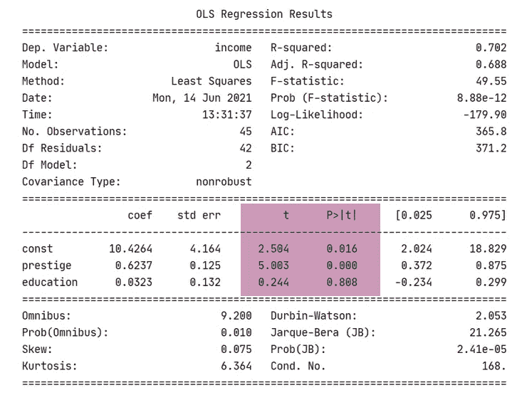***

***有两个相关的指标 *t* 和 *P > |t|。*P>| t |度量对 *t* 度量的假设检验。***

****P > |t|* 度量报告模型参数值为 0 的概率，不管 *coef* 列中报告的是什么。P > |t|度量的高值表示该特征的系数可能为 0，因此它对预测目标变量 *Y* 没有贡献。***

***从上面的汇总表中可以看出:***

*   ***对于特征*声望，*的 *P > |t|* 列报告有 0%的概率*声望*的系数为 0。换句话说，很有可能*声望*特征有助于预测目标变量。***
*   ***对于特征*教育*，**P>| t |*列报告有 80%的可能性*教育*的系数为 0。换句话说，*教育*功能不太可能有助于预测目标变量。****

***为了计算这个 0%或 80%的概率，我们需要引入 t 统计量。***

*****t 统计量*****

***对于 *ŵ* 中的*第 j 个*随机变量，我们表示为 *ŵⱼ，*我们从 *ŵ* 的概率密度函数中得到这个随机变量的均值和标准差:***

*   ***平均值是平均值向量*中的第*个*条目。*让我们用 *μⱼ、*来表示平均值，这是一个特性的报告*系数*值——0.6237 表示*声望*，0.0323 表示*教育。****
*   **标准差是协方差矩阵主对角线中第 *j 个*项的平方根。让我们用 *ηⱼ* 来表示标准偏差，这是一个特性的报告标准误差值——0.125 表示*声望*，0.132 表示*教育*。**

**那么第 *j 个*特征 *tⱼ* 的 t 统计量为**

****

**该统计测量估计参数 *ŵⱼ* 的平均值 *μⱼ* 到平均值 0 *之间的归一化距离。*该距离按分母中的标准偏差进行缩放。汇总表中的 *t* 栏报告该 *tⱼ* 数量。事实上， *t 统计量*是一个缩放的距离(也称为无标度度量),这一点很重要，它使得不同特征的 *t 统计量*具有可比性。**

*****P>| t |*公制****

**由于 *tⱼ* 统计被缩放，我们可以使用单位高斯概率密度函数来研究它。从现在开始，让我们使用 *t* 而不是 *tⱼ* 来与汇总表中的度量名称保持一致。**

***P > |t|* 指标报告单位高斯分布中两条阴影线的累积概率。这是[-∞，-t]和[t，+∞]中的紫色阴影区域，加在一起:**

**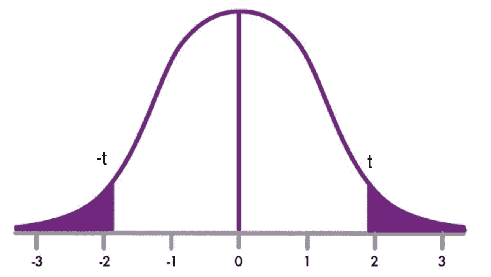**

**我们要问的问题是:如果一个特征的系数确实为零，那么(从单位高斯分布来看)具有由[-∞，-t]和[t，+∞]定义的两个尾部的概率是多少。**

***t-统计量*越大(如果*t-统计量*为负，则越小)，从-t 和 t 开始的两个尾部越小，因此计算出的*t-统计量*越不可能来自均值为零的单位高斯分布。**

**所以，如果我们看到一个具有大的 *t 统计量*的特征，我们就更确定那个特征的报告系数确实不为零。或者等价地，该特征更可能有助于预测目标变量，因此它更重要。**

**你可能会问，为什么我们把 *P > |t|* 度量定义为两个尾部的累积概率，而不是只看 *t* 位置的概率密度？这是因为我们想要报告一个概率，根据定义，概率是概率密度函数曲线下一系列值的面积。如果我们只看 *t* 位置，概率为 0，因为单位高斯是连续分布。**

**你可能还会问，为什么我们测量两条尾巴的面积而不是一条？我们使用双尾，因为我们正在进行一个双尾假设检验，其零假设是 *t 统计量*来自一个单位高斯分布。我们使用双尾假设检验，因为我们有兴趣知道计算出的*t-统计量*和零之间是否存在差异(或者是正的，由一个尾捕捉，或者是负的，由另一个尾捕捉)。**

**您可能会进一步问，我可以使用单尾假设检验来报告特性的重要性吗？是的，你可以，只是 OLS 班报告了一个双尾假设检验结果。**

# **结论**

**本文解释了如何将随机变量引入确定性最小二乘线性回归模型，以推断学习到的模型参数值的不确定性。我们使用随机变量，因为不确定性度量，如置信区间，只存在于随机变量中。**

**除了最小二乘法，线性回归还有其他公式，如完全贝叶斯公式、最大似然公式(MLE)和最大后验公式(MAP)公式。这些方法对不确定性有更自然推理方式。我将在以后的文章中介绍它们。**

# **支持我**

**如果你喜欢我的故事，如果你考虑通过这个链接成为一名灵媒会员来支持我，我将不胜感激:[https://jasonweiyi.medium.com/membership](https://jasonweiyi.medium.com/membership)。**

**我会继续写这些故事。**

# **附录:法线方程的梯度**

**让我们用一个例子来推导法线方程，其中我们有三个数据点，并且 *w* 是一个二维向量。形式上:**

**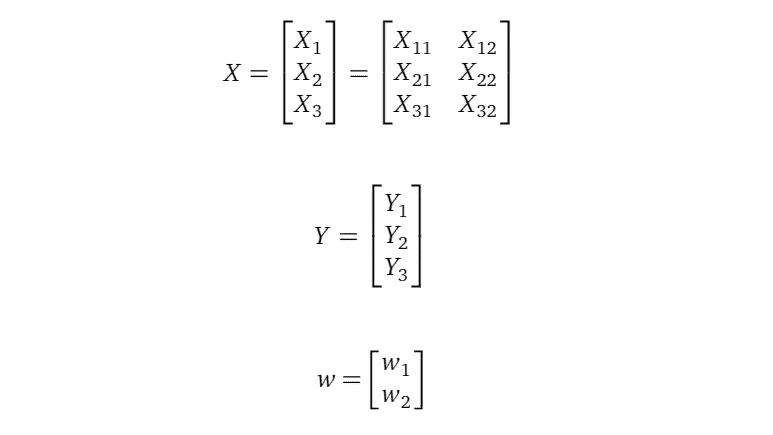**

**在上面:**

*   ***【x₁=[x₁₁、x₁₂】**【x₂=[x₂₁、x₂₂】**【x₃=[x₃₁、x₃₂】*。它们是 2×1 行向量*。***
*   ***X₁₁、X₁₂、X₂₁、X₂₂、X₃₁、X₃₂* 是标量*。***
*   **Y *₁* ，Y *₂* ，Y *₃* 都是标量*。***
*   ***w₁* 、 *w₂* 都是标量变量。**

**下面我们进一步介绍一下向量 *U* :**

****

**其中 *U₁、U₂、U₃* 都是标量根据他们对 *Uᵢ=Yᵢ-Xᵢ w.* 的定义可以清楚的看到 *U* 是 *w* 的函数。这为应用链式法则计算 *L(w)* 相对于 *w* 的导数铺平了道路。**

**现在让我们推导正常方程(再次显示):**

**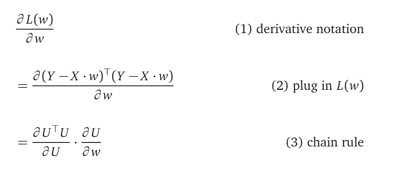**

**线(1)是损失函数 *L(w)* 相对于模型参数 *w* 的导数的符号。**

**线(2)插在 *L(w)* 的定义中。**

**第(3)行使用 *U* 简化公式，并应用微分中的链式法则将整个导数分成两部分。**

**让我们分别关注这两个部分。**

**第一部分首先:**

**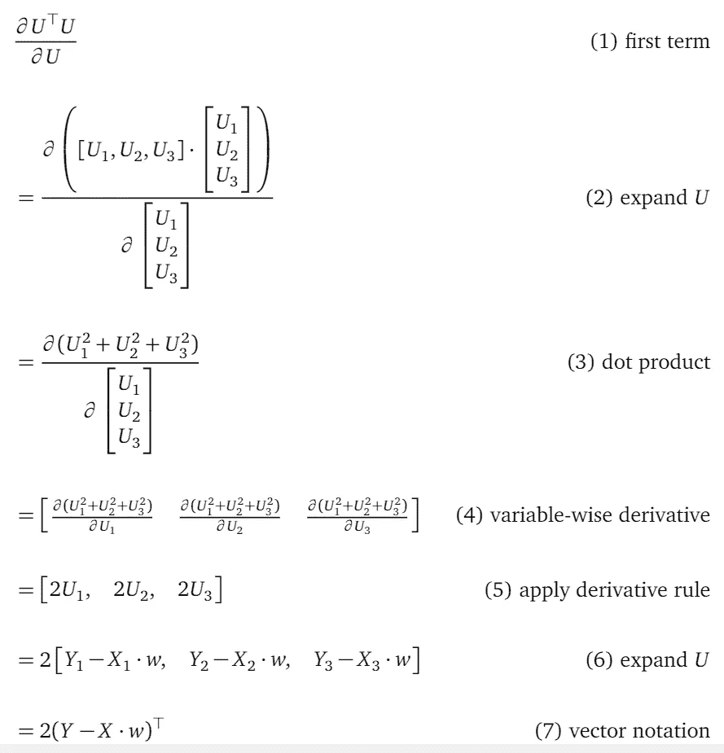**

**第(1)行是第一项。**

**第(2)行用基于元素的定义替换了向量 *U* 。**

**第(3)行对分子应用点积运算。**

**第(4)行明确写下了偏导数的定义——计算每个变量的导数，分别是 *U₁、*、*、*、**按照约定**将这三个导数组织成一行。**

**第(5)行应用求导规则。**

**第(6)行插入 u₁*、U₂* 和 u₃.*的定义***

**第(7)行使用向量符号来简化公式。这给了我们一个接近正态方程中团队的项。**

**现在我们研究第二个术语:**

**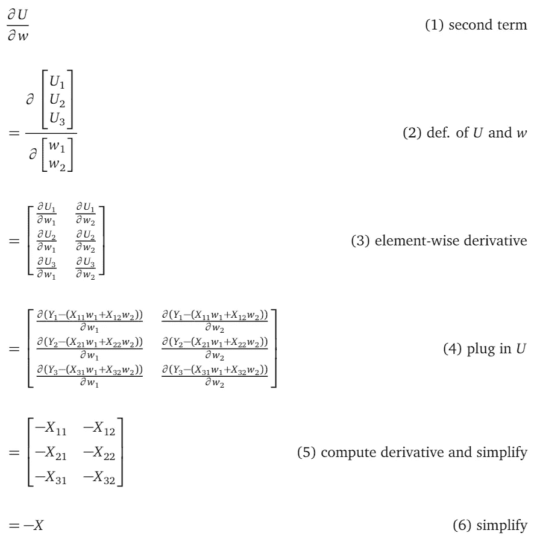**

**第(1)行是第二项。**

**第(2)行扩展了 *U* 和 *w* 的元素式定义。**

**第(3)行应用向量偏导数规则，**遵循行越过 *U* 列越过 *w* 的约定**。**

**第(4)行扩展了 *U* 的定义。**

**第(5)行计算导数。**

**Lien (6)使用向量符号简化了公式。**

**现在我们可以将这两项相乘:**

**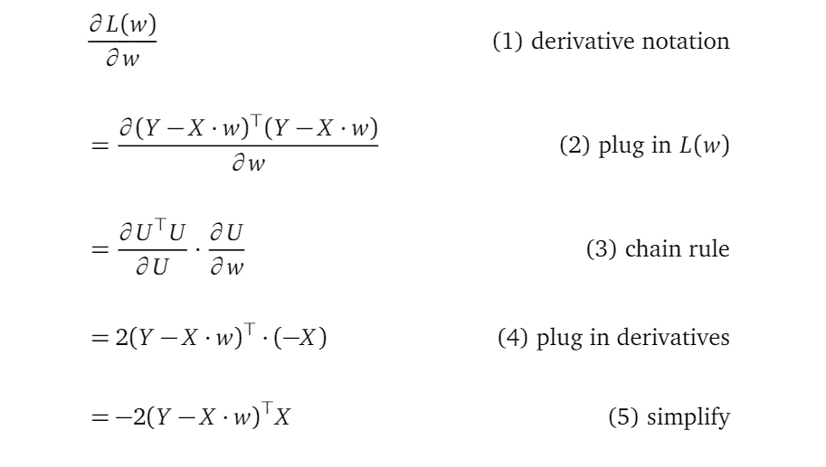**

**注意，在第(5)行，我们有一个行向量——记住，当我们做 *∂w* 时，我们遵循惯例，在一个行向量中写下关于 *w* 的每个元素的偏导数。为了把 *∂L(w)/∂w* 变成一个列向量，我们转置它得到法线方程 *-2Xᵀ(Y-X w)* 的左手边大小，我们也可以 drop -2，因为我们有一个方程*。***