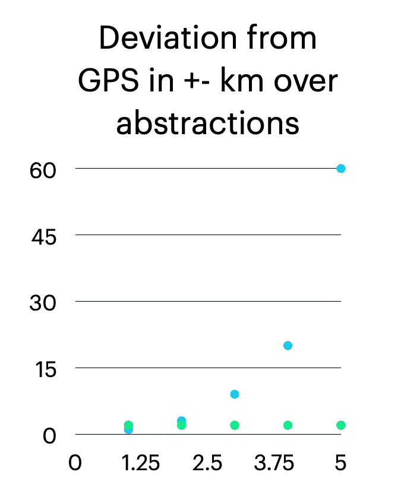

# “隐私第一”失败的地方

> 原文：<https://towardsdatascience.com/where-privacy-first-fails-ec24fe47a678?source=collection_archive---------39----------------------->

## 数据最小化、粒度和分散处理的挑战

“我们是一家隐私至上的公司”。今天你经常听到这句话。“我们根据设计原则使用隐私”。“我们实行数据最小化”。这些都是善意的声明，并且通常它们的实现也是完全正确的，但是这种方法经常会留下一些问题，如数据完整性的损失或缺乏真正的去身份验证，这导致“隐私第一”失败。让我们将这些概念分解，并探索一些替代方案。

为了本文的目的，让我们使用一个疲劳应用程序的实际用例。这个疲劳应用程序使用 24 小时的时间序列心率数据，从中生成一个疲劳分数。该疲劳分数可用于管理例如驾驶员的疲劳，以降低事故。


由[雅罗斯拉夫·德维亚](https://unsplash.com/@jarosphoto?utm_source=medium&utm_medium=referral)在 [Unsplash](https://unsplash.com?utm_source=medium&utm_medium=referral) 上拍摄的照片

# “我们匿名处理所有数据”

好的。所以我们来考虑一下这个。你有可穿戴数据，例如你的个人客户的活动数据。您可以去掉个人身份信息等唯一标识符，用假名“Mary Adams”称呼用户，但这对于属性级别意味着什么呢？

作为一个例子，考虑这个完全合理的输出，它实际上是完全合成的。

```
{“data”: {
“person”: {
“sex”: “Female”,
“device”: “Android”
},“deviceLocation”: {
“coordinates”: {
“latitude”: 51.5072682,
“longitude”: -0.1657303
},“altitude”: 16,
“accuracy”: 95,
“verticalAccuracy”: 90,
“velocity”: 4
},“activity”: {
“timestamp”: “2021–01–02T23:37:00+00:00”,
“type”: “Sleeping”
},“heartRate”: {
“currentHeartRate”: 58,
“minHeartRate”: 45,
“maxHeartRate”: 83},
 }
 }
```

你可能把用户名匿名了，但是怎么把 GPS 坐标匿名呢？上面的数据清楚地显示了你的用户睡在哪里。只有这么多的人会花大量的时间在你的家庭住址或工作地址，所以结合这些信息在事后识别这个人(这个过程叫做再识别)真的是幼儿园水平。

《纽约时报》发表了一篇很棒的文章，并附有关于这个话题的例子，展示了匿名位置数据如何能够轻易地[识别在最安全的地点工作的军事官员](https://www.nytimes.com/interactive/2019/12/19/opinion/location-tracking-cell-phone.html)。如果五角大楼不能做到这一点，你会相信你的普通公司吗？

# 解决方案:让我们删除敏感的数据对象

在清理数据时，可以采取剥离数据对象和属性的方法(通常都是这样做的),比如位置历史，以后很容易重新识别。这似乎是一个解决方案，但是它有明显的缺点:我们丢失了用户和应用程序的有价值的数据。

您的输出如下所示。它的确远没有那么具有侵略性，但也远没有那么丰富。说白了，你把你的“玛丽·亚当斯”丢在地图上了。

```
{“data”: {
“person”: {
“sex”: “Female”,
“device”: “Android”
},“altitude”: 16,
“accuracy”: 95,
“verticalAccuracy”: 90,
“velocity”: 4
},“activity”: {
“timestamp”: “2021–01–02T23:37:00+00:00”,
“type”: “Sleeping”
},“heartRate”: {
“currentHeartRate”: 58,
“minHeartRate”: 45,
“maxHeartRate”: 83},
 }
 }
```

等等:现在我们丢失了所有的 GPS 定位数据！对于需要复杂数据集和上下文信息的更复杂的应用程序或用例，删除数据不是最佳解决方案，因此我们可以采取另一种方法来调整数据粒度。

# 关于数据粒度的一点注记

数据粒度是一个光谱，从绝对、详细的度量开始，一直延伸到没有信息价值的无用抽象。但是，作为一个频谱，您可以上下调整粒度。



作者图片

一组 GPS 坐标是数据的一个极端的很好的例子，非常精确和丰富，而邮政编码仍然是关于位置的信息，但是远没有精确到一个人那么独特。

```
“deviceLocation”: {
“coordinates”: {
“place": 94105
},
```

同样的逻辑可以应用于几乎所有的数据对象，您可以在属性级别上创建一个分组，比如收入范围或年龄组。然而，在有些领域，这变得更加二元，如个人是否属于少数群体或报告了收入。这些二进制分组中的一些也可能成为不成比例的信号，例如用户是否有任何疾病或报告的犯罪行为。它们也是强标识符。

*考虑到我们的个人疲劳应用，该时间序列数据对于确定疲劳至关重要，以便能够判断过去 24 小时的变化以及心率强度的相对偏差。使用更小粒度的数据(总结过去 24 小时)不会产生有意义或准确的疲劳评分。虽然心率很难与个人联系起来，但降低数据质量不是一个选项。*

# 数据结果不应显示 N<50 的组群

不同的法规和行业有不同的规则。经常使用的一种方法是限制结果群体的大小，以保证去识别。该限制可以是 50 人的群体，在这种情况下，您的算法不能在结果中显示比该群体更小的群体。

然而现实并非如此简单。如果您正在利用位置数据，有多少人有可比较的位置模式呢？然后，您必须将属性抽象或聚合到组中，例如处理邮政编码。但即使这样也不足以保证 N<50。

其他数据点呢，比如健康数据？个体模式要具体得多，尤其是考虑到糖尿病或损伤等情况时。例如，通过简单地记录“条件”是否存在来进行抽象，可能有助于避免小组规模变小。

# 使用主观属性而非绝对属性

bpm 中的心率等客观属性很容易理解，类似的还有经纬度坐标中的位置。然而，静息心率的±15%的相对心率或距离旧金山 1 条市场街 5 公里的相对位置都是有意义的，但是相对难以从外部联系到特定的个人。

```
“deviceLocation”: {
“coordinates”: {
“distanceFromHome": 1-5km
},
```

因此，将数据抽象为主观属性可能很有吸引力，但在管理大型数据集时，这将显著增加开销，而且这也不是微不足道的，因为主观测量的组合将越来越多地集中于特定的个人。

# 管理组合数据的群组是很棘手的

即使您将基础属性抽象成组，如果有足够的数据点，群体大小也很容易识别。例如，考虑位置历史(抽象到邮政编码级别)和活动数据(抽象到用户是否活动)的时间序列。即使这个相当模糊的数据集也能很容易地创造出小于 50 的人口。

你很容易得到数据最小化的概念。为了实现这些限制数据敏感性的目标，我们限制了数据本身的质量，甚至是我们包含的数据维度，从而潜在地降低了我们可以提供的价值。

# 使用合成数据集来保证隐私

数据市场中令人兴奋的方法之一是合成数据，它允许开发人员和数据工程师基于真实数据集创建合成数据集，允许数据工程师保留数据隐私。这方面的先驱公司的一个例子是格雷特尔。

这种方法处理数据隐私的一个更基本的方面，即底层数据集可能无法匿名化或剥离个人身份信息。因此，创建一个可比较的(注意:数据完整性问题取决于对正在讨论的用例的理解)合成数据集，是一个概念上有吸引力的选择。

现在这个选项有它的局限性，主要与它实际上适合什么类型的用例并产生足够的结果有关。人们还经常对保持数据的统计完整性持怀疑态度，因为即使稍微修改数据，也可能会失去许多联系和意义。

合成数据可以作为一个起点，但是不能代替与要回答的问题密切相关的真实数据。理解如何生成合成数据取决于对真实数据的理解，这对于每个不同的数据对象和源来说，复杂性增加了几个数量级。

正如一位合作伙伴所说，“我们不喜欢使用合成数据来预测心脏病发作”，强调在健康相关的使用案例中，真实数据是唯一真实的选择。

# 作为一种选择的分散数据处理

分散数据处理是指在中央服务器之外处理数据，例如在用户自己的设备、计算机、电话或浏览器上。分散处理还可以受益于没有外部共享，这意味着除了用户自己的设备之外没有共享日志。因此，数据和数据的使用属于个人。

在一些个人数据用例中，我们可以观察中央服务器之外的数据处理(“在用户侧”)。由于能够在不从用户处删除数据的情况下处理数据，这也使得关于数据隐私的争论大相径庭。作为一种操作，它是个人优先的，个人自己从数据中获得代理和效用。

# 默认情况下，分散式应用提供了更多隐私

同样重要的是要记住，并非所有的隐私都来自于数据处理，其中一些来自于更平凡的方面，比如你的用户如何连接到你的应用程序或服务器。无论您如何解构数据，如果您的最终用户通过他们的 IP 地址直接与您通信，匿名性可能会丧失。是的，有 VPN 部分地解决了这个问题，但是，VPN 的使用远远没有达到正常水平，大多数用户可以通过他们的直接网络连接来识别。

# 从用户处删除数据需要正当理由

有各种各样的数据工程方法用于处理数据以及在节点上部署和训练算法，例如联邦学习。假设可以在用户侧以分散的方式处理高清晰度数据，将数据从用户传输到集中的服务器需要证明，这不仅是因为这不可避免地使用户暴露于更大的风险，而且由于隐私和伦理问题，还需要降低数据粒度。

我们已经在各种论坛上讨论过数据工程，例如在 Liberty Equality Data 播客上与 [Privacy By Design 的发明者 Ann Cavoukian 博士](https://medium.com/prifina/liberty-equality-data-podcast-episode-6-with-ann-cavoukian-71a7b92dd79d)讨论，我们经常得出这样的结论:存在许多方法，默认采用集中处理可能只是因为不熟悉。

*对于我们的疲劳应用程序，我们打印出一个绿灯/红灯类型的结果(是否太累)，根据用户的疲劳分数显示给用户。然而，利用过去 24 小时的时间序列心率数据，我们不仅可以确定疲劳，还可以确定酒精和物质的使用。*

*共享绿灯/红灯类型的结果有效地共享了个人的疲劳分数。然而，共享整个数据集(时间序列心率数据)也会暴露嵌入到结果中的其他因素，例如饮酒。*

*这意味着远离用户传输原始数据可能会给双方带来额外的风险，而疲劳评分或红灯或绿灯系统的最终结果可以在不泄露底层数据的情况下交付。*

# 复杂的应用需要数据完整性

当然，我们不能得出一种方法适合所有用例的结论。

复杂的应用程序依赖于高清晰度的上下文数据可用性，剥离敏感数据可能会破坏整体数据的完整性。对合成数据集进行数据工程以获得初始假设集，对于某些用例以及构建模型来说是一个非常有价值的选择，但是它不能替代真实数据。当部署模型或启动应用程序时，通过限制共享，能够采取不同的方法来利用数据，这具有巨大的适用性。