# 疫情之后我应该在哪里吃饭？(第 1/2 部分)

> 原文：<https://towardsdatascience.com/where-should-i-eat-after-the-pandemic-895731933841?source=collection_archive---------44----------------------->

## 使用变压器进行基于方面的情感分析进行决策。

我们以前都遇到过这种情况:查找我们感兴趣的新产品或我们想尝试的餐馆的评论。我们从一篇评论到下一篇评论收集信息，每篇评论都更精确地再现了产品。我们不停地翻啊翻，突然一个小时过去了，而我们并没有比以前更接近答案。我们意识到这是一种徒劳的努力，我们将无休止地寻找决定如何使用我们辛苦赚来的钱的决定性因素。那么，在本教程中，我将使用基于方面的情感分析(ABSA)来解决这个西西弗式的任务。花更少的时间筛选评论，花更多的时间享受产品或服务。我们开始吧！


在 [Unsplash](https://unsplash.com?utm_source=medium&utm_medium=referral) 上由[夏月](https://unsplash.com/@myr0326?utm_source=medium&utm_medium=referral)拍摄的照片

# 介绍

由于疫情，我对旅行和美食有着无法满足的渴望。我没有花时间在网上搜索，而是想弄清楚一旦情况允许，我应该去哪里。通过自动化上述过程，我分析了超过 100 万条评论，以选择最适合我个人偏好的餐厅。在我们进入细节之前，让我们从一个更简单的例子开始。


奥米德·阿明在 Unsplash 上拍摄的照片

## 例子

我想买无线耳机，我想在 AirPod Pros 和 Powerbeats Pros 之间做出选择。以下是购买前需要考虑的一些特性:音质、舒适度、降噪质量和电池寿命。我为每个组成部分分配了一个重要性权重，并着手梳理评估每个产品表现的评论，以创建一个如下所示的表格:

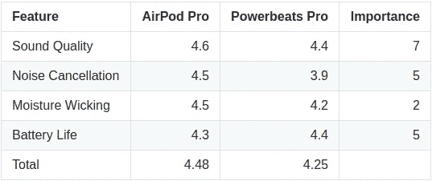

耳塞比较

方便的是，这些特性和相应的特性评级都在 Amazon 上，所以我不必做自己想出这些值的繁重工作。通过将每个特性评级乘以重要性，并对所有特性求和，我可以得到每个产品的最终得分。例如，对 AirPod Pros 的评估如下所示:

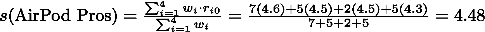

对比最后的分数，我们可以看到 AirPod Pros *击败*出局(哈！)Powerbeats Pros。有一个系统的方法来达成我的决定是非凡的，但是有一些实际的问题。例如，这个分析花了我不到 10 分钟的时间，但也是在亚马逊上已经有基于方面的评级的产品之间进行的。由于这些是*而不是*其他大多数产品容易得到的，我将不得不筛选大量的评论来为每个产品产生基于方面的评级。另一件要考虑的事情是，在这种情况下只有两种产品；以这种方式比较更多的产品会让我 10 分钟的分析变成 2-3 个小时的冗长努力。

那么，我们如何协调我们的系统决策和效率呢？*自动化*。通过自动化这个过程，我们可以更快地做出决策。下面定义了我们将在其中工作的框架:

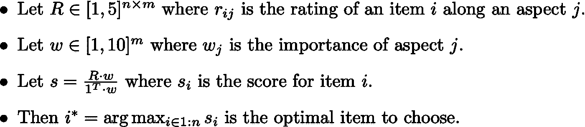

由于这一过程适用于任何产品或服务，我决定在 Yelp 数据集中的餐馆中进行尝试。我总是很难决定我想去哪里吃饭，经常花太多时间在 Yelp 上，以至于已经过了晚餐时间。鉴于疫情，现在外出就餐不是一个很好的选择，所以我想在一切结束后找到一个最好的地方吃一顿令人难以置信的饭。不要再拖延了，让我们开始吧！

# 数据集

首先，让我们导入我们将使用的所有库。

## 塞姆瓦尔-2014 年

对于教程的这一部分，我们只需要 [SemEval-2014](https://alt.qcri.org/semeval2014/task4/) 数据集。在 SemEval-2014 数据集中，餐厅的各个方面是食物、服务、价格、氛围和轶事。对于每个方面，只有一个相关的标签:积极、消极、冲突或中立。您可以从我的 GitHub 中检索该数据集；然而，这已经在我们将要构建的预处理函数中考虑到了。

我们所有的数据都准备好了，让我们继续训练吧！

# 模型

这项任务可以选择几种不同的模型，从基于规则的模型到深度学习。在翻阅文献之后，我看到了一篇利用变形金刚完成 ABSA 任务的论文。作者将 ABSA 任务转换为句子对分类任务，使他们能够使用 BERT 作为他们的模型。下表显示了论文的结果:

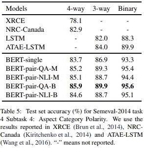

来源:转载自“利用 BERT 通过构造辅助句进行基于体的情感分析”，作者:孙，黄，邱，2019，arXiv。

作者对来自`transformers`库的`bert-base-uncased`模型进行了微调，报告伯特-对-NLI-M 模型的准确率为 85.1%，伯特-对-QA-B 模型的准确率为 85.9%。由于两者之间的唯一区别是预处理的方法，我选择伯特-对-NLI-M。虽然这不是最高的性能，但它比伯特-对-QA-B 更快。伯特-对-QA-B 模型需要构建 25 个句子来执行评论的全方面分类。相比之下，伯特-对-NLI-M 只需要五个句子，每个句子都是一个单词，就可以完成同样的任务。就我的目的而言，这两个模型之间的精确度差异可以忽略不计。换句话说，精度提高 0.08%不足以保证速度降低 5 倍。

## 预处理

对于句子对分类任务，该模型将两个句子作为输入，并输出单个标签。我们把感兴趣的方面作为第二个输入句子。因此，预处理如下:

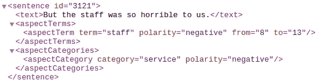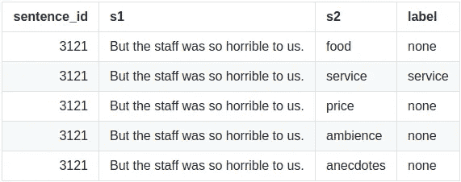

预处理示例

为了准备用于训练和评估的数据集，我使用以下代码从我的 GitHub 存储库中加载 SemEval-2014 数据集，并为 PyTorch 准备它:

## 火车

现在我们已经使用 transformers 结合上面定义的预处理方法将模型的范围缩小到句子对分类，对于我们想要微调的特定模型，我们仍然有几个选项。鉴于最近在用更少的参数逼近 BERT 方面的进展，我想看看这些模型中是否有比 BERT 表现更好的。如果较小的模型可以达到相同或更高的精度，我将能够更快地处理 Yelp 数据集，而不会牺牲性能。以下是变压器库中的模型列表，以及训练时使用的相应超参数:

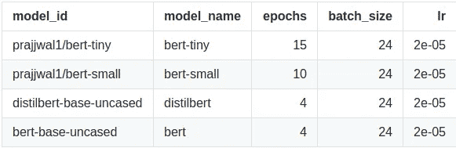

模型比较

为每个模型设置的时期是验证损失达到平稳状态所需的数量。我将使用以下代码来训练每个模型:

## 评价

在训练完所有模型后，我根据精确度和马修相关系数(MCC)对每个模型进行评估。可以包括其他指标，如宏观 F1 分数，但 MCC 比其他单一分数指标更能提供信息。关于 MCC 的更多细节，你可以访问它的维基百科[页面](https://en.wikipedia.org/wiki/Matthews_correlation_coefficient)。在多变量情况下，混淆矩阵用于计算 MCC。

除了质量度量之外，我还将计算每个模型评估测试集所花费的时间。以下是我将用来评估每个模型的代码:

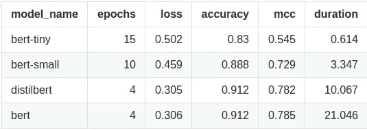

模型比较

从表中我们可以看出，bert-tiny 虽然速度很快，但精度或 MCC 不够高，无法与其他模型相媲美。然而，从其他方面来看，我们可以看到 bert-small 在 88.8%的准确率方面做得非常好，并且比 bert 快大约 7 倍，比 distilbert 快大约 3 倍。有趣的是，在所有显示的指标中，distilbert 的表现略好于 bert，除了 MCC 之外，其表现微不足道。本质上，我们发现在这个任务上，distilbert 总体上比 bert 好，并且快了大约 2 倍！因此，选择真的归结为伯特-小或蒸馏伯特。作为一个主观的决定，我将选择 distilbert，因为我重视精度提高 2.4%，而不是速度降低。下面快速浏览一下 distilbert 的混淆矩阵:

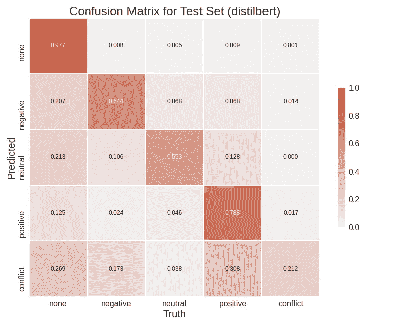

混乱矩阵热图

我们可以看到，该模型很好地预测了无标签和正标签，同时在负标签和中性标签上具有低于标准的性能。然而，冲突标签似乎给这个模型带来了最大的麻烦。这可能很难克服，因为如果句子是矛盾的，就会有积极和消极的情绪嵌入其中。如果没有足够数量的例子来说明一个句子何时是冲突的，那么该模型将不会学习如何区分肯定和否定。然而，我们将继续使用 distilbert。

## 例子

为了了解我们的分类器是如何做出决策的，让我们看几个例子，看看它是如何执行的，从下面我写的综述开始，然后是模型的分类。

```
We had a good time at the restaurant.
```

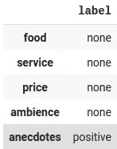

示例 1

这个例子中的模型是正确的；句子中没有具体关于食物、服务、价格或环境的内容。然而，对于去那里的一次特殊的轶事经历，人们有一种积极的情绪。这个例子很简单，所以我将添加另一个讨论食物的句子。

```
We had a good time at the restaurant. The food was delicious.
```

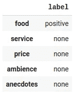

示例 2

在这种情况下，模型正确地将食物分类为好的。然而，它错过了积极的轶事部分的审查。我试着用颠倒的句子运行它，但是分类器犯了同样的错误。

现在，我将添加一些关于该服务的信息。

```
The waiter we had was horrible, but the food was amazing.
```

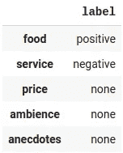

示例 3

这是一个很好的测试例子，因为它在同一个句子中包含了对两个不同类别的积极和消极情绪。该模型正确地识别了两个类别的情感。

最后，我将尝试一个更长的审查，并添加另一个类别。

```
My girlfriend is still not even speaking to me after I took her on a date here last week. The atmosphere was nice, but the food here was disgusting and the service was even worse. I will never in my life go back to this pizzeria.
```

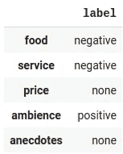

实例 4

该模型对所有类别都是正确的，除了轶事，它被认为是负面的。然而，考虑到评论是多个句子，这个模型做得很好。尽管它在这个评论上表现良好，但当评论超过几个句子时，该模型表现不佳。然而，有办法处理这个问题。就我个人而言，我已经对数据集中的所有评论运行了该模型。我采用的方法是使用`spacy`将评论分成多个句子，对每个句子运行模型，然后通过取平均值将它们聚合回一个输出。如果你准备好了，也试着迈出下一步。然而，由于时间关系，我们不会在这里展示。

# 结论

现在我们对模型的行为有了更多的了解，是时候探索 Yelp 数据集了！在下一篇文章中，我将深入研究使用 Yelp 数据集来决定在疫情之后去哪里吃饭。

敬请期待！

# **代号**

*   [GitHub](https://github.com/mwbrulhardt/yelp-absa)
*   [Google Colab](https://colab.research.google.com/drive/1CBieQ95qacyCXKFT4L9FknKzktvI3YnG?usp=sharing)

# 链接

*   [https://alt.qcri.org/semeval2014/task4/index.php?id =数据和工具](https://alt.qcri.org/semeval2014/task4/index.php?id=data-and-tools)
*   [https://github.com/HSLCY/ABSA-BERT-pair](https://github.com/HSLCY/ABSA-BERT-pair)

# 参考

[1]孙驰，黄，邱希鹏，[利用 BERT 通过构造辅助句进行基于体的情感分析](https://arxiv.org/pdf/1903.09588v1.pdf)(2019)*arXiv 预印本 arXiv:1903.09588*