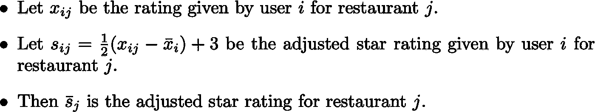
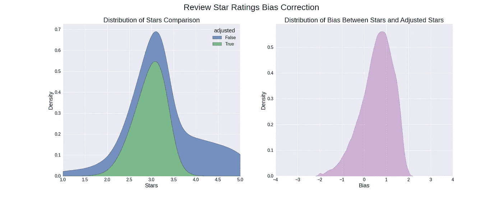

# 疫情之后我应该在哪里吃饭？(第二部分)

> 原文：<https://towardsdatascience.com/where-should-i-eat-after-the-pandemic-part-2-2-3b3498523757?source=collection_archive---------32----------------------->

## 使用变压器进行基于方面的情感分析进行决策。

在上一篇[文章](/where-should-i-eat-after-the-pandemic-895731933841)中，我从 SemEval-2014 数据集训练了一个关于 ABSA 任务的模型，并分析了它的性能、速度和行为。本文详细介绍了我如何使用这个模型从 Yelp 数据集中选择一家餐馆就餐。不要再拖延了，让我们开始吧！

## Yelp 数据集

我们可以通过两种方式下载 Yelp 数据集:

*   [Yelp](https://www.yelp.com/dataset)
*   [卡格尔](https://www.kaggle.com/yelp-dataset/yelp-dataset)

第一种要求与 Yelp 签署协议，之后数据集可以作为 zip 文件下载。Kaggle 方法需要一个在本地~/设置了用户名和 API 密钥的帐户。kaggle/kaggle.json。以下链接可以帮助您设置 kaggle:

*   [https://adityashrm21.github.io/Setting-Up-Kaggle/](https://adityashrm21.github.io/Setting-Up-Kaggle/)

如果你使用 Yelp，你必须下载 zip 文件，然后上传到 Google Colab。然而，如果你使用 Kaggle，你可以避免额外的步骤，直接将数据传输到 Google Colab。对于我自己，我将在本教程中使用 Kaggle 方法。以下代码从 Kaggle 下载数据集:

## 极性

为了给每篇评论打分，我们需要将每个标签映射到一个极性范围[-1，1]。

极性映射

与其拿分类器的硬分类，不如处理它的软会更有信息量。软分类将提供关于*如何*评价的正面或负面方面的信息。通过利用模型产生的概率向量和我们上面定义的极性图，我们可以找到一个方面在审查中的预期极性。例如，假设我们向模型中输入一个评论，并沿着食品方面进行评估，得到以下输出:

示例输出

我们没有将食物的极性指定为-1，而是发现这些标签的预期极性如下:

正如我们所看到的，这种方法更加实用，因为我们可以获得正负极性之间的梯度，从而为每个类别呈现更具代表性的情绪。

## 技巧

在运行我们的算法之前，有一件重要的事情需要注意。数据集中有两个评论来源:`reviews`和`tips`。提示比评论更紧凑；它们通常只有一句话。这是有帮助的，因为我们的模型的缺点之一是对较大的文本进行分类，正如我们在上一篇文章中看到的。以下是每种类型评论的文本中发现的单词数量的累积分布比较:

分布比较

显然，一个提示的字数比一篇评论的字数少得多。因此，小费将在模型的范围内很好地工作。考虑到这一点，我还将筛选未倒闭且相关小费超过或等于 100 的餐馆。这增加了有足够的信息为每个方面生成评级的可能性。下面的代码将对我们筛选出的所有提示进行批量预测，并将它们写入一个 JSON 文件，以便在下一步中进行处理。

此外，我将为我们的设置添加一个方面:餐厅的总体星级。我不会直接用星，我会考虑每个用户的平均星，做一个调整后的星系统。

在评估评论时，偏见分布是向左倾斜的。也就是说，在适当的 1-5 星评级系统中，人们倾向于给出比预期更多的星。

星级偏差修正

在做了这个修正后，我们现在可以根据我的偏好对每个提示进行个人重要性加权，从而对餐馆进行评分。

# 结果

运行完上面的代码后，我终于来到了我的餐馆列表🎉。看来我要去*唱歌熊猫亚洲餐厅&酒吧用餐了！*

结果

在谷歌上搜索了这个地方之后，我非常兴奋，准备在合适的时候尝试一下。看了一眼评论，我只看到了对这个地方的正面评价。以下是我谷歌搜索结果的截图:

来源:谷歌搜索“唱歌熊猫亚洲餐厅&酒吧”

现在我有了结果，我想尝试一些不同的权重。尝试了几种不同的重要性权重配置，我得到了非常相似的答案，这让我质疑结果中有多少变化。为了测试这一点，我从狄利克雷分布中生成了 100，000 个随机重要性权重并进行分析。这是我想到的:

根据这些发现，看起来你们中的很多人可能会和我一起去*歌唱熊猫亚洲餐厅&酒吧*！显然，对于大多数人来说，使用权重相对相同的方面的警告是，结果可能缺乏多样性。也就是说，有许多方法可以获得更个性化的结果。例如，您可以尝试添加更多方面，或者通过使用数据集业务表中的*类别*属性，尝试对您想吃的食物类型进行过滤。至于我，我对我的结果很满意，所以我会在我的晚餐时间结束之前停止我的分析😉。

# 结论

总之，本文的目的是展示如果我们采用机器学习的方法来为我们工作，我们如何利用大量的评论对我们有利。

在这种意见挖掘中可以做的一个改进是开发非特定领域的模型。换句话说，拥有一个框架，在从相应的评论中预测每个特征的极性的同时，衍生出任何产品的特征，将是一个明显的进步。

无论是您应该购买什么样的耳塞、应该穿什么样的鞋，还是应该在什么样的餐厅用餐，基于方面的情感分析都可以为我们节省普通决策所需要的时间和精力，是一个很好的决策工具。本文到此为止，我希望在这个疫情，每个人都保持安全和健康。当一切都结束了，希望你能看到我在亚利桑那州钱德勒的*歌唱熊猫亚洲餐厅&酒吧*用中国菜填饱我的脸！

下次见！

# 密码

*   [GitHub](https://github.com/mwbrulhardt/yelp-absa)
*   [谷歌可乐](https://colab.research.google.com/drive/1vbTqmq8wDN0Z9WnwWTUwt_6dbr4LqGbW?usp=sharing)

# 链接

*   [https://www.yelp.com/dataset](https://www.yelp.com/dataset)
*   [https://www.kaggle.com/yelp-dataset/yelp-dataset](https://www.kaggle.com/yelp-dataset/yelp-dataset)
*   [https://alt.qcri.org/semeval2014/task4/index.php?id =数据和工具](https://alt.qcri.org/semeval2014/task4/index.php?id=data-and-tools)

# 参考

[1]池孙，黄，邱锡鹏，[利用 BERT 构建辅助句进行基于方面的情感分析](https://arxiv.org/pdf/1903.09588v1.pdf) (2019)， *arXiv 预印本 arXiv:1903.09588*