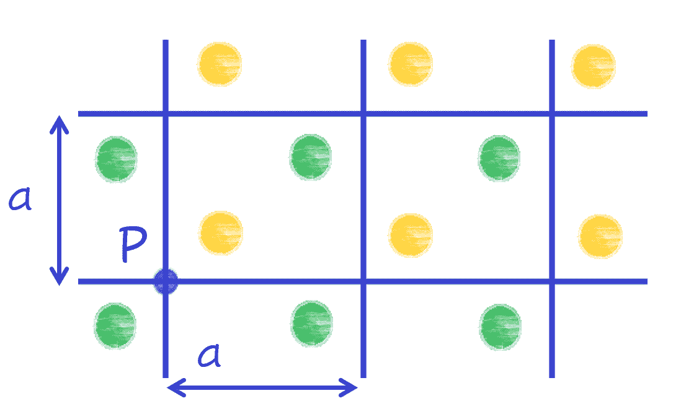

# 机器学习和量子力学之间的对称性改善了模拟

> 原文：<https://towardsdatascience.com/where-symmetries-between-machine-learning-and-quantum-mechanics-improve-simulations-e77e2f4d4d19?source=collection_archive---------29----------------------->

## [思想和理论](https://towardsdatascience.com/tagged/thoughts-and-theory)

## UT 奥斯汀物理学研究生克里斯·罗斯用对称的力量解决奇异的量子问题。

以不直观著称的量子力学定律预言了一系列奇怪的效应。许多奇异的材料，如超导体，具有如此复杂的行为，即使是最强大的计算机也无法处理它们的计算[1]。因此，一些系统必须通过创新的大规模模拟来征服[2]。UT Austin 的研究人员 Chris Roth 开发了一种机器学习算法，使用两种对称来使这个问题更容易处理[3]。首先，他的周期系统在输入结构中找到一个模拟。第二，粒子之间的力方便地服从算法输出的一种依赖性特征。

对称性的概念在物理学中不断出现；它简化了问题，突出了不同属性之间的关系。引用先驱量子物理学家菲利普·安德森的话:“说物理学是对对称性的研究只是稍微夸大了一点。”它可以采取多种形式，比如一片叶子的两面是彼此的反射，或者是时间上的循环模式。晶体的定义是展现对称性:当你以不连续的步骤穿过一种材料时，你会发现任何地方的局部环境都是一样的。这被称为“平移不变性”，如图 1 所示。

图一。二维晶体的一部分。对于长度 *a* 的垂直或水平方向上的每次平移，左下角的橙色点和右上角的绿色点的图案会重复自身。在这种情况下，晶胞是长度为 *a* 的平方，其中有一个橙色原子和一个绿色原子。因此，只要你在这些类型的离散位移中移动，从 P 点的视图将是相同的。图片作者。

在固体中，带正电的原子核固定在一个周期模式中，电子或多或少可以自由漫游。因此，模拟只专注于模拟电子之间的相互作用[4]。库仑力导致同性粒子相互排斥，并不取决于电子的确切位置，而是取决于它们之间的距离。这种只关心相对距离而不是精确位置的特性也出现在递归神经网络(RNN)中，这是一种机器学习算法。然而，在 RNN 的情况下，该距离是输入步骤的索引之间的距离，而不是实际空间。输入被分解成离散的、连续的片段，每一个片段都被编码以产生自己的输出。RNN 允许更早的输入被向前传递以告知结果，因此最终的输出依赖于所有的输入[5]。该过程如图 2 所示。三个彩色圆圈代表这个“隐藏状态”，即输入和输出之间的步骤。在本例中，有三条输入，索引为 1-3。输入 1 (i1)被馈送给算法，该算法将特定于 RNN 试图解决的问题。然后，i2 和先前的隐藏状态被馈送给算法。它们产生 o2，这就更有料了。这将传播许多步骤，直到考虑了所有的输入。在此图中，只多了一个步骤，即生成最终输出 o3。

图二。具有三个输入和输出的递归神经网络。与以前的投入相比，最近的投入对产出的影响更大。图片作者。

如图所示，并非所有的输入都同等重要——最近的输入对输出的影响最大。这被称为“短期记忆丧失”，RNN 氏症的形成方式导致了这种效果。在具有输入和正确输出的数据集上训练模型。训练模型微调每个隐藏状态中的参数，以产生正确的最终值。预测后，根据与已知答案的比较计算误差，并调整每层的参数。这个调整就是机器学习的方式！每一层中的更新取决于前一层必须改变多少。通常，调整随着每一层而减少，从末端向后传播。因此，第一层几乎没有经历任何调整，也没有学到太多东西。

虽然短期失忆在某些情况下是一种缺点，但在其他情况下，它实际上反映了自然。电子有一种叫做自旋的性质，自旋是内部角动量的度量。一个电子处于某一位置的概率可以从一种叫做波函数的东西中预测出来[4]。在 Roth 的情况下，输入是每个晶胞的自旋态，输出是波函数。如果电子只关心其他附近的，那么短期记忆丧失不是问题——答案应该更少依赖于远处的电子输入！因此，RNN 重视本地输入多于进一步输入的特性模拟了系统的物理特性。但是，需要注意的一点是，每个输出只考虑前面的输入，实际上忽略了后面的输入，即使它同样在附近。这相当于支持一个方向，尽管电子排斥应该是空间对称的。为了说明 RNN 架构中的这种不对称，可以对输出取平均值，以获得精确的结果。系统之间的第二个模拟出现在 RNN 离散输入格式中，这在晶体中是合适的，因为它们的属性仅适用于离散空间平移。

计算几个晶胞的波函数在定性上可能很有趣，但接近实验中使用的实际晶体大小将提供关于新量子行为的更确定的答案。Roth 的方法不仅适用于小系统，而且随着输入量的增加，计算质量也会提高。这表明 RNN 能够学习系统的物理学，也许能够捕捉到使用具有相似对称性的算法来模拟一个系统是多么自然。如果物理学家要理解我们这个时代一些最有趣的量子现象，如超导、相互作用的磁场和电场效应(量子霍尔效应)和纠缠，这样的计算进步是必要的。

参考

[1][https://www.nature.com/articles/s41524-018-0085-8](https://www.nature.com/articles/s41524-018-0085-8)

[2]https://www.nature.com/articles/s41567-018-0048-5

[3]https://arxiv.org/abs/2003.06228

[4] R. M. Martin，*《电子结构:基本理论与实践方法*(剑桥大学出版社，英国剑桥，2004)。

[5][https://towards data science . com/illustrated-guide-to-recurrent-neural-networks-79 E5 EB 8049 c 9](/illustrated-guide-to-recurrent-neural-networks-79e5eb8049c9)