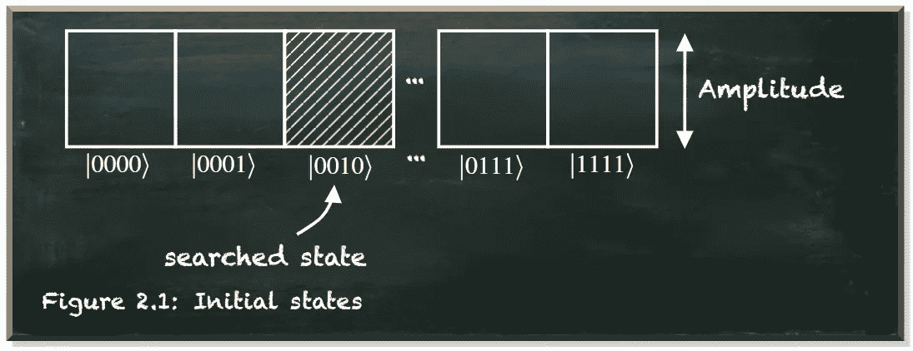
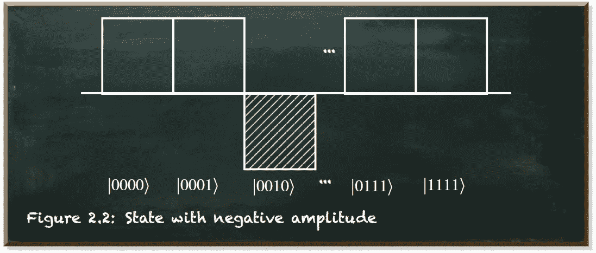
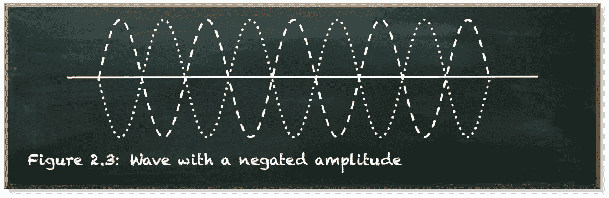
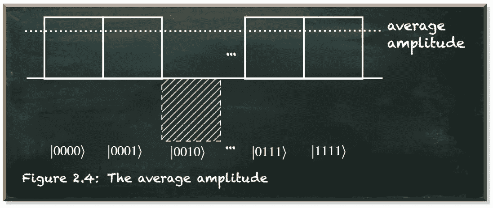
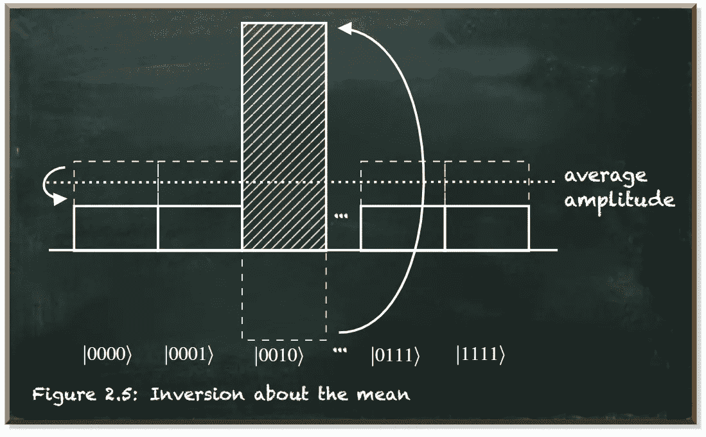

# 量子优势从何而来

> 原文：<https://towardsdatascience.com/where-the-quantum-advantage-comes-from-5accd926eb7a?source=collection_archive---------24----------------------->

## 格罗弗算法的直觉

本帖是本书的一部分: [**用 Python 动手做量子机器学习**](https://www.pyqml.com/page?ref=medium_advantage&dest=/) **。**

在许多情况下，我们需要在一组项目中找到一个特定的项目。毫不奇怪，搜索算法是计算机科学中最突出和最有用的算法之一。

让我们想象一下，你需要给一个著名的量子计算先驱打电话，格罗弗先生。你在电话簿里搜索他的号码，因为你还没有。你在中间打开这本书，你会看到以 L 开头的名字，因为 G 在 L 之前，你拿起书的前半部分，再在中间打开。你会看到有 E 的名字，因为 G 在 E 后面，你翻开书，在 E 和 l 中间，你会看到 Grover 先生的号码。

我们把这种搜索算法称为二分搜索法。该算法重复地将搜索间隔分成两半。如果搜索的项目低于区间中间的项目，它会将区间缩小到下半部分。否则，它会将范围缩小到上半部分。它会重复，直到找到值或间隔为空。二分搜索法算法缩小了搜索空间非常快，收敛到一个解决方案。唯一的问题是，该算法依赖于你搜索的数据进行排序。如果数据没有排序，算法就不起作用。

这是一个大问题，因为不仅二分搜索法依赖于分类数据，几乎所有的搜索算法都是如此。

如果数据没有以任何其他方式排序或结构化，唯一有效的搜索算法是线性搜索。在线性搜索中，我们必须评估每一个条目，以验证它是否是要搜索的条目。虽然这种方法适用于小数据，但不适用于大数据集。

这就是格罗弗算法发挥作用的地方。在[这篇文章](/how-to-solve-a-problem-with-quantum-computing-4b04f3f882d9)中，我们了解了 Deutsch 的算法，该算法可以计算两个输入参数的函数，而只运行一次。Grover 的算法告诉我们如何在一个无序列表中搜索一个项目，而不需要逐个查看每个项目，而是一次查看所有项目。它使用两种技术来实现。首先，它使用量子神谕来标记被搜索的状态。第二，它使用一个扩散器来放大被标记状态的幅度，以增加其测量概率。

我们可以用状态、振幅和测量概率来描述量子系统。但这些都是我们无法直接观察到的内在描述。每当我们测量一个量子系统时，我们都会得到一个单一的值——这个特定系统所处的状态。

如果我们测量两个相似的系统，我们可能会测量不同的值。然后，我们知道这个特殊的系统可以处于不同的状态。如果我们有许多相似的系统，我们可能在某些州比在其他州更频繁地测量系统。我们测量一个量子系统在某个状态下的频率取决于概率。量子系统的每个状态都有一定的测量概率。它越高，我们就越有可能在这种状态下测量系统。

一个状态的测量概率取决于这个特定状态的幅度。数学上，测量概率是振幅的绝对值的平方。我们马上就会明白这意味着什么。

格罗弗的搜索算法从一组相等叠加的量子位开始。这意味着所有状态的振幅相等。因此，它们都具有相同的测量概率。如果我们只测量这个系统一次，我们会发现它处于任何状态。哪一个取决于运气。如果我们测量这个系统无数次，我们会看到它在每一个国家同样频繁。

作者弗兰克·齐克特的图片

我们要寻找的州就在这些州中。目标是以一种方式改变系统，如果被测量，我们会发现系统处于这一状态。一直都是。

量子预言机的任务是识别被搜索的状态。量子神谕不是一种神奇的成分，而是一种控制结构。它是一个量子算符。该运算符对搜索状态的幅度求反。

当然，重要的问题是:*“神谕如何识别被搜索的状态？”*

先知使用被搜索的量子态的任何特征。如果我们从一组相等的状态开始，那么根据定义，这些状态只是在枚举方面不同。它们的不同之处在于，我们测量(如果我们测量的话)某个量子位是 0 还是 1。例如，如果我们使用四个量子位，那么就有不同的 2^4=16 态。从|0000⟩出发，到|0001⟩，在|1111⟩.结束

每个量子位可以有特定的意义。我们可以把它理解为一封信。这封信没有 26 个不同的选项，只有两个，|0⟩和|1⟩.有了足够数量的量子位，我们可以代表所有活着的人。有了 33 个量子位，我们可以代表大约 85 亿个不同的状态。人类的电话簿。我们还没有分类。

现在，假设四个量子位就足够了，格罗弗先生被称为|0010⟩.oracle 使用该状态的特定特征来识别它。也就是说，这个州有一个|1⟩在第三位，而|0⟩在第三位。

由于量子预言机将所有量子位作为输入，它可以很容易地应用这种精确状态的转换。我们用 4 个量子位还是 33 个都没关系。先知一下子就认出了格罗弗先生。

神谕应用于被搜索状态的变换是振幅的反转。

作者弗兰克·齐克特的图片

在振幅的这种表示中，我们可以清楚地看到被搜索状态和所有其它状态之间的差别。我们可以过早地宣布搜索结束。

唯一的区别是振幅的符号。对于来自振幅的绝对平方的测量概率结果，符号根本不重要。

振幅源于这样一个概念，即每个量子实体不仅可以描述为粒子，也可以描述为波。波浪的主要特征是它在运动时上下起伏。振幅是波的中心和波峰之间的距离。

如果我们颠倒一个波在所有位置的振幅，结果是同一个波偏移了其波长的一半。

这两种波的不同之处仅在于它们的相对位置。这是波的相位。对于外界来说，波的相位是不可观测的。单独观察，这两个波看起来是一样的。所以，问题是我们无法区分这两种波。

作者弗兰克·齐克特的图片

因此，该系统从外部看起来没有任何不同。即使神谕标记了被搜索的状态，因此它不同于其他状态，所有状态仍然具有相同的测量概率。

我们需要将差异转化为可衡量的东西。我们需要增加标记状态的测量概率。这是扩散器的任务。扩散器应用关于平均振幅的反转。

我们来看看平均振幅。

作者弗兰克·齐克特的图片

有了四个量子位，我们就有了 16 种不同的状态。每个状态的幅度为 1/sqrt(16)=1/4。事实上，除了一个状态之外，每个被搜索的状态都有这个振幅。搜索状态的幅度为 1/4。因此，平均值为(15÷1/4 1/4)/16 = 0.21875。

平均值比我们没有标记的所有状态的振幅小一点。如果我们用这个平均值来反转这些振幅，它们最终会比平均值低一点，为 0.1875。

因为标记状态的振幅是负的，它离平均值相当远。均值的反转有更大的影响。它将幅度从 0.25 乘以 2(0.25+0.21875)翻转到 0.6875。

作者弗兰克·齐克特的图片

如果我们在许多正振幅中寻找单个或几个负振幅，关于平均值的反演工作得很好。然后，这个操作增加了我们知道是正确的负振幅。这个操作减少了正振幅，我们知道这是错误的。

该操作将负振幅增加一个大的量，同时将正振幅减少一个小的量。

但是我们拥有的状态越多，整体效果就越低。在我们的例子中，我们计算出被搜索状态的新振幅为 0.6875。相应的测量概率是 0.6875^2=0.47265625.因此，在我们寻找的状态下，我们大约每隔一段时间才测量这个系统。否则，我们在任何其他情况下测量它。

当然，我们现在可以多次测量系统，并将我们搜索到的状态视为最有可能的状态。但是运行这个算法这么多次将会失去我们从不搜索所有状态中获得的任何优势。

相反，我们重复算法。我们用同样的神谕来否定被搜索状态的幅度。然后我们再次反转平均值附近的所有振幅。

然而，我们不能重复这个过程太多次。有一个重复这个过程的最佳次数，以获得测量正确答案的最大机会。获得正确结果的概率增长，直到我们达到大约π/4*sqrt(N)其中 N 是量子系统的状态数。超过这个数字，测量正确结果的概率再次降低。

在我们有四个量子位和 N=16 个状态的例子中，最佳迭代次数是 3。

# 结论

格罗弗的算法搜索未排序的数据。它遵循一个简单的程序。量子预言反转了被搜索状态的振幅。然后，扩散器反转关于平均振幅的所有状态，因此，放大搜索的状态。该算法重复这些步骤，直到解决方案具有接近 100%的测量概率。

重复的次数取决于它需要考虑的状态的数量。由于重复次数只增加了大约状态数的平方根，与经典的线性搜索相比，该算法提供了二次加速，这是唯一能够搜索未排序数据的经典方法。

然而，像所有的量子计算机算法一样，格罗弗的算法是概率性的。它以很高但不是绝对的概率返回正确答案。因此，我们可能需要重复该算法，以尽量减少失败的机会。

本帖是本书的一部分: [**用 Python 动手做量子机器学习**](https://www.pyqml.com/page?ref=medium_advantage&dest=/) **。**

在这里免费获得前三章。