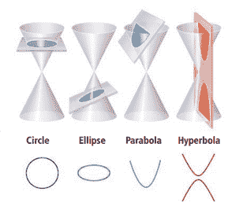
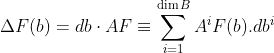
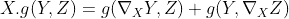
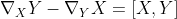
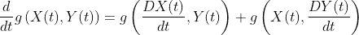
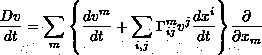
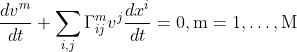
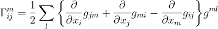

# 哪里有物质，哪里就有几何…

> 原文：<https://towardsdatascience.com/where-there-is-matter-there-is-geometry-8560d36c9ce6?source=collection_archive---------33----------------------->

## 规范理论、对称性、机器学习等等

***目的:*** *对于这篇初始帖子，我想简要介绍一下微分(黎曼)几何中的关键概念，这是理解即将到来的帖子所必需的，这些帖子位于机器学习、能效、拓扑和几何的交叉点。然而，与其直接推动机器学习，我希望科学家和工程师们思考一下—* ***为什么要利用几何来理解统计推断*** *？总是从为什么开始！我们使用几何学，不是因为它很酷，相反它是必要的。*

*在 ubi materia，ibi Geometria* 是约翰尼斯·开普勒的原话。看看你的周围；世界充满了不同的形状和空间——橙子(圆形)、马鞍(双曲线)、地球(椭圆形)以及许多其他形状。随着复杂算法的出现，我们可以很容易地推断出纽约离伦敦有多远，或者如果你是一个机器学习爱好者，你可以测量分布之间的距离和散度(Kullback-Leibler，Jensen-Shannon 等)。).为我们提供这种洞察力的纯数学部分是几何学。几何本身以不同的形式出现——从欧几里得几何、解析几何、代数几何等等。作为剑桥大学的一名研究生，我非常幸运地在伊萨克牛顿数学科学研究所呆了很长时间，学习了许多不同类型的几何知识。然而，直到我遇到了[甘利顺一](https://en.wikipedia.org/wiki/Shun%27ichi_Amari)，我对信息几何(基本上是用来理解概率分布的几何)及其与统计物理的联系的兴趣才被激发起来。Amari-san 的眼睛里有一种明亮的火花，我总是喜欢去听他的讲座。说够了。



我们周围物体的常见形状。来源:[科学杂志](http://www.science4all.org/article/ellipses-parabolas-hyperbolas/)

机器学习特别感兴趣的是微分几何。为什么？因为它集合了微积分和多元线性代数的工具来研究各种流形。微分几何着眼于**黎曼**流形——这些是带有度量的光滑流形(就像信息几何中的那些),**洛伦兹**流形——这是爱因斯坦广义相对论的基础，芬斯勒流形，**克勒**几何——用于复杂流形，等等。正如你所看到的，有很多东西要学，我们从某种东西开始怎么样，这种东西为我们理解我们周围的任何物理现象提供了一个平台——规范理论。

**规范理论**是预测一个或多个物理场如何与物质相互作用的物理理论。每一个规范理论都有一个关联的**拉格朗日量**(即一个概括了所讨论的系统动力学的函数)，它在一组局部变换下是不变的。考虑惯性参考系中的牛顿运动定律(例如，一个球在一个空房间中)。这些定律在房间的任何地方都有效。这意味着动力学和拉格朗日不依赖于球的位置。在这个系统中，在空间平移下，动力学将是不变的。这些变换——保持了拉格朗日——据说配备了**规范对称性**。简而言之，对称只不过是对参照系变化的不变性或免疫。

取一个旋转的参照系(如地球)，称之为系统。在地球自转的过程中，每个城镇之间的距离保持不变。随着地球的旋转，我们可以说我们有一个**规范转换**，它不会改变城市的距离。这意味着系统保持其对称性(*，自然法则)，尽管全局力(作用于系统的每一点)的作用(或规范变换)。这个动作对应于系统的全局变换——保持不变的变换；在这种情况下，距离。然而，还有另一种可能性:例如，比较地球和其表面的运动物体(例如，海洋中的水)。当相对于地球描述水的运动时，它的惯性(即它沿直线运动的趋势)扭曲了它的运动。这种现象被称为科里奥利效应:电流在北半球往往以顺时针方向(相对于行进方向)流动，而在南半球则以逆时针方向流动，而不是像在非旋转世界那样直接从高压区流向低压区。因此，科里奥利效应是旋转(非惯性系)参照系中的曲线运动。不恒定的规范变换，即随空间位置变化的规范变换，被称为**局部对称性**。一个或多个局部力只作用于系统的几个部分，产生局部变化。*

*尽管有局部力的扰动作用，为什么对称性仍然存在？这是因为局部力被另一个力平衡了——称为**规范场**。注意，当系统的整体对称性在局部力的作用下保持不变时，就会出现局部变形，这种对称性被称为局部破坏，或者充其量是**隐藏**。在一个具有整体对称性的系统中，有可能找到一个可以被规范场“修复”的局部对称性破缺。让我们再次以科里奥利力为例。对于只使用惯性参考系的人来说，科里奥利力不存在；它们只是我们发明的力，用来假装我们在一个惯性系统中，而事实上我们并不在:它们是实用的，因为它们允许我们继续使用牛顿定律。阿尔伯特·爱因斯坦发现了类似的东西；当重力(由能量和动量引起)存在时，狭义相对论就不成立。然而，通过允许能量和动量弯曲时空，他可以保留狭义相对论，至少在局部，使引力消失。对爱因斯坦来说，重力和科里奥利力一样不真实；当选择一个不合适的参照系时，它们是我们必须发明的力量。让我用一个单摆的例子来说明这些想法:*

```
*Consider a simple pendulum that oscillates with the same frequency  **ω** in ***x***and ***y*** coordinates. It is usually convenient to use polar coordinates, where **z = x + iy**, such that the motion can be described by a (second order) differential equation **∂ₜₜz + ω²z = 0** and the direction or angle satisfies **tan θ  = y/x**. In terms of the motion, the absolute coordinates (the ***x*** and ***y*** axes) are simply irrelevant; for example, we can rotate the axes by **a** to represent the motion in new coordinates **x'** and **y'**. The differential equation remains the same (although we need to replace **θ** by **θ−α**. This amounts to multiplying the differential equation by **exp(-iα)** and redefining **z'=zexp(-iα)**. This means that although we have rotated the frame of reference, the equation of motion is unchanged. This is **global gauge invariance**. It is global because the entire frame of reference was rotated by the same amount, irrespective of where or when we describe the motion.Now imagine we rotate the ***x*** and ***y*** co-ordinates by an angle that depends on time: i.e., the rotation **α** now becomes **α(t)**. With this local transformation (local with respect to a particular time), multiplying by **exp(-iα)** does not ensure the invariance of the differential equation. How could we then retain the laws of motion? Remarkably, we can do so by replacing the time derivatives by **∂ₜ − iA(t)**. The field **A(t)** is the compensatory **gauge field** that ensures the equation of motion holds, locally. This is **local gauge invariance**. This amounts to rotating our coordinate system with an angular velocity **∂ₜa(t)** creating a fictitious force (like a Coriolis force). In short, the gauge field  **A(t)** induces compensatory yet fictitious forces, necessary to retain invariance under a local gauge transformation. From a local perspective, the pendulum will appear to move erratically in response to the gauge field; while, from a global perspective, nothing has changed.*
```

*简而言之，规范理论相对简单:有一个描述运动方程式的拉格朗日量。这些运动方程在空间参考系的变化下通常是不变的(例如，一条直线在一张纸上的任何地方都是直线)；然而，如果我们退后一步，看到运动(时空中的一条线)随着位置而改变(例如，一张弯曲的纸上的一条直线)，我们可以通过引入补偿场或力——规范场，将整体对称性扩展为**局部对称性**。这里弯曲或曲率的概念很重要，因为在概率分布空间中形成轨迹的流形必然是弯曲的。*

## *微分几何*

*我们所有人都沉浸在一个 4 维的世界里，3 个空间坐标和 1 个时间坐标构成了参照系。**纤维束**是微分几何的构造，它提供了这种参考系的一般公式。直观地说，通过将一组相同的一维线粘合在一起，例如堆叠在 x 轴上，可以对二维薄片进行采样。然后，这些线被称为纤维( ***F*** )，将它们粘合在一起的子空间被称为基底(***b***)——合在一起，这些线形成了一个纤维束( ***F̄*** )。用圆柱体代替二维薄片只是改变了基底；其中纤维附着在一个圆上，一条线的坐标在正负无穷之间，而圆上的坐标取值在 0 和 2π之间。在这种情况下——很容易找到一个全局坐标系——我们称相应的束 ***平凡*** 。一个重要的束可能是一个莫比乌斯带，其中不可能实例化一个全局坐标系。这种情况经常发生。在这些情况下，可以使用局部坐标系网络。唯一的要求是建立一些规则来描述局部坐标如何在相邻的面片之间变化。一个**连接域**——也称为规范域——满足了这一要求，并协调了粘合到基底附近点的光纤坐标系之间的明显不一致。*

*因此，规范场是一个由独立的底坐标组成的向量场。对于两个坐标系统(两个局部点)的比较，只需构建一个框架调整规则以及独立的基座坐标即可。这种差异可以通过沿着独立方向的一系列转变来说明(比如说 ***b*** )。在数学上，计算基数 ***db*** 和规范域*的点之间的差的标量积。**

****

**这里的规范域 **A** 是**F(b)**和 ***F(b + db)*** 坐标系之间的转换。和之间的路线定义了一条曲线；连同轨距字段，这些定义了沿曲线的**平行传输**。当我们用一个连接场来比较一根纤维中两个相距很远的元素时——没有发现差异——我们可以说第二个元素是第一个元素沿曲线平行传输的结果。现在让我们将我们到目前为止所描述的概念形式化:**

****定义 1。**一个**光滑纤维丛**是一个复合对象，由——( a)一个光滑流形 ***F̄*** 组成，称为全(丛)空间，(b)一个光滑流形 **B** 称为基空间，(c)一个光滑映射 ***w: F̄ → B*** 称为投影，要求它的雅可比矩阵在每一点都具有最大秩， (d)称为纤维的光滑流形 ***F*** 和(e)称为纤维束的**结构群**的纤维 ***F*** 的光滑变换群 ***G*** 。 **相切**和**共切**束是纤维束的特例。总结动力学的拉格朗日函数是切线束上的自然能量函数，而哈密顿函数是**共切线**束上的自然能量函数。一个**喷射束**概括了切线束和余切束。**

****定义 2。**如果我们可以引入全局坐标系，使得任何点都可以使用一对坐标 ***(x，f)*** 来识别，则光纤束被表征为 ***平凡的*** ，其中 ***f*** 是光纤上的一组坐标， ***x*** 是基底上的一组坐标。同样， ***主纤维丛*** 是一种特殊的纤维丛，其纤维是群 ***G*** 。**

****定义 3。**对于底座上的一条曲线 **γ** ，一条**连线**是光纤*在点 ***γ(m)*** 到光纤*在点 ***γ(n)*** 的映射 (b) ***ϕᵧ*** 与路径的参数化无关——平行输送是由路径而不是函数 ***γ(⋅)*** ，(c ) ***ϕᵧ*** 是恒等映射如果***【t】***γ(t)【d】沿两条连续曲线的平行输送是等价的 其推论表明，在相反方向的运输产生反向平行运输。如果映射 ***ϕᵧ*** 是基中任意曲线的结构组的一个元素，则称一个连接为**g-连接**。综上所述，端点相同但路径不同的并行传输的结果可以不同。纤维束的**曲率**测量这种差异。****

**出于我们的目的，我们将把自己限制在一个**黎曼流形**——一个解析的流形，其中每个切空间都配有一个内积，从点到点平滑变化。这个内积采用局部逼近流形的切丛上的度量的形式。这使我们能够定义各种概念，如长度、角度、体积等。**

****定义 4。**流形 ***上的**黎曼度量**是共变的 2 张量 ***g*** ，它将流形上的每个点与切空间 ***Tₓℳ*** 上的内积***g =<->ₓ*。度量是双线性的、对称的和正定的，因此定义了切空间上的欧几里德距离。在局部坐标方面，度量由矩阵 ***给出 gᵢⱼ = < Xᵢ，> ₓ*** 其中 ***Xᵢ*** 和 ***Xⱼ*** 是 ***ℳ*** 在*处的切向量，并且随着 ***x*** 平滑变化**测地线**曲线是用黎曼度量计算的弧长的局部最小值。********

***定义 5。**在黎曼几何中， **Levi-Civita 连接**是保持黎曼度量的切丛的挠率或曲率自由连接。更具体地说，它是一个独特的仿射连接 ***∇*** 使得它是*

*兼容公制，即:*

**

*具有对称性，即，*

**

*其中***【X，Y】***为**卧括号**。*

*相容条件可以用协变导数来表示，即如果 ***X(t) = X(γ(t))*** 和 ***Y(t) = Y(γ(t))*** 是沿曲线 ***γ*** 和 ***D/dt*** 的两个向量场*

**

***定义 6。**在已经参数化的流形中，曲线 ***γ(t)*** 表示为 ***({x }(t)，…,{xᴹ}(t))*** ，向量场 ***v*** 的协变导数可以写成:*

**

*在这里，连接***γᵢⱼᵐ***的系数被称为**克里斯托夫符号**。简单地说，沿曲线的平行输送变成一阶线性系统，*

**

*在这种情况下，克里斯托夫符号由下式给出:*

**

***gᵐˡ** 代表公制倒数。测地线方程现在可以写成一个二阶系统，*

**

*今天就到此为止。*

**注:我不得不承认，在介质上使用* LaTeX *写数学并不简单，因为需要将所有内嵌的* LaTeX *方程转换成 Unicode* 🤐。因此，请原谅这篇文章中的数学排版。*

**我打算写一些帖子，要么是(a)数学的(就像这里的这个)，要么是(b)机器学习的商业用例(这里的这个关于* [*人工智能产品-市场契合度*](https://biswasengupta.medium.com/the-product-market-fit-of-ai-technologies-ffbf3c618720) *)。我会试着将每篇文章交错，以保持不同受众群体的博客文章之间的平衡。**