# DOTA2 中在哪里放置选区

> 原文：<https://towardsdatascience.com/where-to-place-wards-in-dota2-84f534b9b64e?source=collection_archive---------10----------------------->

## [实践教程](https://towardsdatascience.com/tagged/hands-on-tutorials)

## 向职业玩家学习

由[叶夫根尼·切尔卡斯基](https://unsplash.com/@evgenit?utm_source=medium&utm_medium=referral)在 [Unsplash](https://unsplash.com?utm_source=medium&utm_medium=referral) 上拍摄的照片

*TL；博士:购买病房并把它们放在战略位置*

# 成为 DOTA 中的支援英雄

DOTA2 是一款 MOBA 游戏，有许多有趣且有时隐藏的机制。这是一项团队运动，每个队员都要扮演各自的角色。例如，支援英雄被期望为农场依赖英雄创造喘息空间，[堆叠营地](https://dota2.fandom.com/wiki/Creep_Stacking)，并购买支援物品。

当我学习扮演支援英雄时，一个重要的角色是地图视觉。事实上，正确的愿景可以帮助团队实现关键目标。此外，视觉创造了地图感知和空间，让你的队友相对安全地漫游或伏击( *gank* )。

该员额的目标是:

*   借助一些数据科学工具，探索职业玩家在何时何地使用视觉。
*   作为休闲玩家的向导，改善他们的游戏体验。
*   推断一下像 [Dota Plus](https://www.dota2.com/plus) 这样的付费订阅是如何做病房建议的。

完整的代码可以在这里找到:

 [## GitHub-NadimKawwa/DOTAWardFinder:在 DOTA 中查找 ward 集群

### 在 DOTA 中查找 ward 集群。在 GitHub 上创建一个帐户，为 NadimKawwa/DOTAWardFinder 的开发做出贡献。

github.com](https://github.com/NadimKawwa/DOTAWardFinder) 

# 定义愿景

第一种是[观察区](https://dota2.fandom.com/wiki/Observer_Ward)，提供一个区域的视野。他们的视线被树线挡住了，一个放置在山顶上的观察病房提供了飞行视野。注意观察结界不会暴露隐形单位。

另一方面，哨兵病房没有自己的视野。然而，站在岗哨旁边的玩家可以看到隐形单位。

两种类型的结界对敌人来说都是不可见的，除非设置了岗哨结界。在战略要地放置结界的行为称为 ***守卫*** ，移除敌方队伍放置的结界称为 ***去守卫*** 。

# 地图概述

下图显示了完整的 DOTA 地图，辐射队在左下方，可怕队在右上方。更多详情，请参见这篇[维基文章](https://dota2.fandom.com/wiki/Map)。

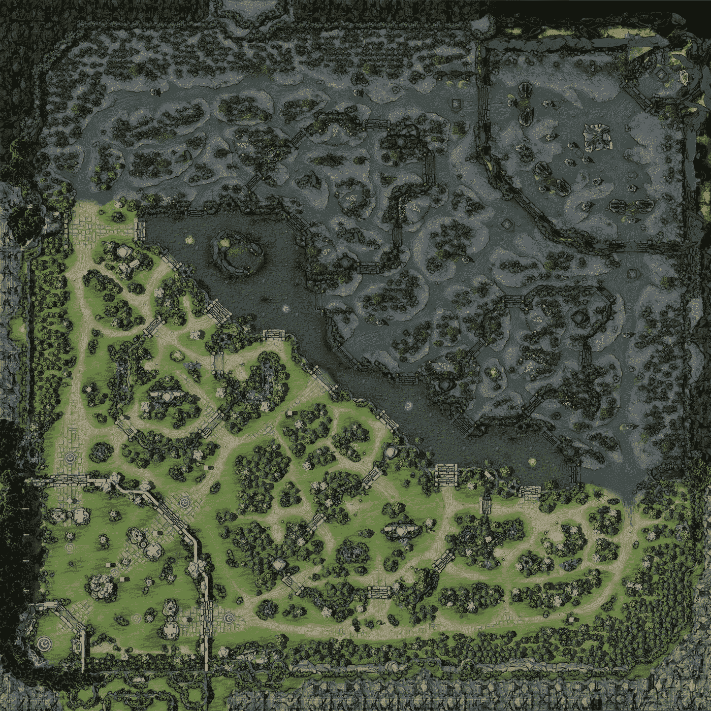

来源: [CC BY-NC-SA 3.0](https://www.fandom.com/licensing) 牌照下的【https://dota2.fandom.com/wiki/Map】T2

OpenDota 项目允许玩家查看比赛概要和有用的情节，如下图取自一场[样本比赛](https://www.opendota.com/matches/6169617852/vision):

*   绿色光芒四射
*   红色是可怕的
*   带虹膜的椭圆形是一个观察病房
*   没有虹膜的椭圆形是一个哨兵病房

请注意，观察员病房有一个更大的视线，地图没有考虑到由于树木或高地上的障碍。

由 [OpenDota](https://www.opendota.com/matches/6169617852/vision) 制作的病房地图样本在麻省理工学院许可下提供

# 数据收集

OpenDota 的任何人都可以免费查询这些数据:

 [## 数据浏览器-专业 Dota 2 统计-开放 Dota - Dota 2 统计

### 开源 Dota 2 比赛数据和玩家统计

www.opendota.com](https://www.opendota.com/explorer) 

## 用于解析数据的 SQL

以下 SQL 查询返回专业比赛的日志数据。时间框架被任意设定为 2021 年 1 月 1 日及以后。此外，25000 个匹配应该足以满足我们的目的。

## 数据格式

下图显示了感兴趣的两个主要列。这些日志是 JSON 格式的，为了更好地接收数据，它们将被扁平化。以下信息与本项目相关:

*   (x，y)病房的位置。
*   哨兵或观察者。
*   时间安排。
*   如果由辐射或可怕的团队放置。

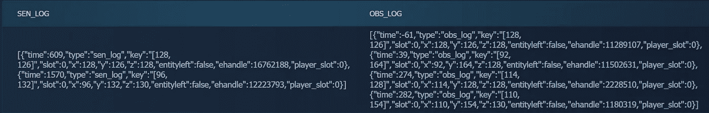

作者截屏

## OpenDota 坐标系

OpenDota 使用的坐标系与实际地图尺寸不同。实际上，地图的左下角对应于坐标(64，64)，并且地图被分成从 0 到 127 编号的象限。因此，地图的右上角有坐标(192，192)。

# 数据一览

数据看起来怎么样？下图显示了数据集中所有观察区的分布情况，以及按高度显示的地图颜色。蓝色点(z=132)对应于一座小山，因此位于山顶的病房视野开阔。此外，还添加了一个红色边界框来显示地图的范围。

有趣的事实:( 100，150)处的灰色空白点对应[罗山的坑](https://dota2.fandom.com/wiki/Roshan)，里面不能放置任何结界。

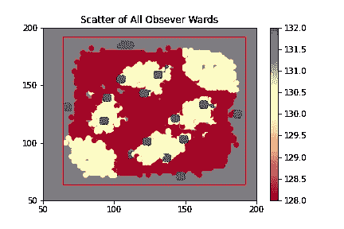

作者的情节

之前的剧情很乱，没有透露太多。因此，让我们来看看所有病房的安置时间:

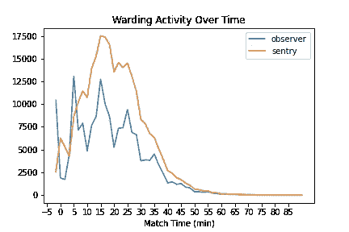

作者的情节

有人可能会问:两个团队的守卫活动是一样的吗？下图证实了这一点，没错，不管是哪个团队，活动都是一样的。

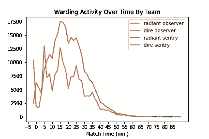

作者的情节

此外，让我们看看下图中山丘的守卫活动。它遵循与整体防护活动相同的趋势，并在游戏的第 40 分钟后下降。

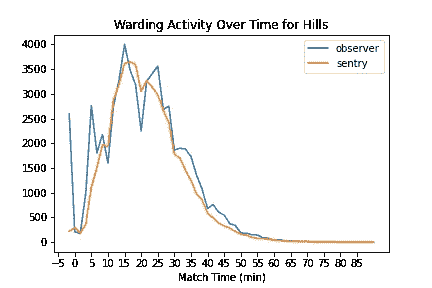

作者的情节

# 如何识别病房群集

考虑下面的情节，它显示了游戏开始前放置的所有观察者的病房。一眼我们就能推断出玩家想要在哪里放置结界，但不知道他们优先选择在哪里放置。

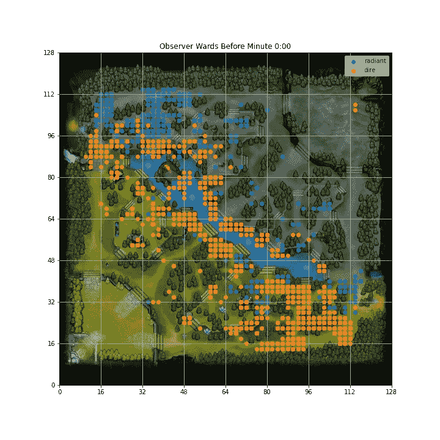

作者的情节

如果我们想要识别具有激烈竞争视觉的位置呢？团队在哪里优先考虑守卫？我们可以使用下一节中解释的聚类算法来回答这些问题。

## 选择的型号:DBSCAN

[DBSCAN](https://scikit-learn.org/stable/modules/clustering.html#dbscan) 由两个关键参数控制:

*   ε:两个样本之间的最大距离，其中一个被认为是另一个的邻域。
*   min_samples:一个点的邻域中被认为是核心点的样本数。

DBSCAN 的一个优点是它不需要指定簇的数量，并且它可以找到任意形状的簇。此外，它有一个噪声的概念，是健全的离群值。因此，一些病房将不会被分配到一个集群，并作为离群值。

## 为什么不使用 KMeans？

[KMeans](https://scikit-learn.org/stable/modules/clustering.html#k-means) 可以作为一种替代的聚类算法。然而，它依赖于三个假设:

*   每个变量分布的方差是球形的(KMeans 喜欢球形斑点)。
*   所有变量都有相同的方差。
*   每个聚类都有大致相等数量的观察值。

这是第三个最严重阻碍知识手段的假设。事实上，有些地方有几个病房就可以了，比如中间的车道，而其他地方经常会有争议，比如安全车道。

## 时间的影响:后期游戏 Vs 早期游戏

DOTA 是一个分秒必争的游戏，每一刻都是创造新事物的机会。事实上，时间(游戏的阶段)的影响是制定策略的一个主要因素。

如果一级塔还在的话，在你的基地里放置一个守卫区是没有意义的。因此，根据任意的时间框架对病房进行分组比忽略时间的影响更有见地。

# 每个阶段的地图视觉集群

这一部分包含了由哨兵/观察者和辐射者/恐怖分子划分的守卫图。此外，还提供了一个注释来解释集群如何反映玩家的策略。

## 赛前—0:00 分钟前

在第一波蠕动波离开基地之前，玩家会争夺金色符文。因此，玩家在河流附近的地图中心放置观察哨，以便观察敌人在做什么。此外，有些人会在敌人有时间撤退之前，在敌人的丛林深处安置观察员。

最后，红色显示的岗哨对应的是经济战。事实上，在一个中立的爬行动物营地的边界内放置一个岗哨可以防止后者产卵。因此，敌人的团队被剥夺了黄金和拉蠕变波的能力。

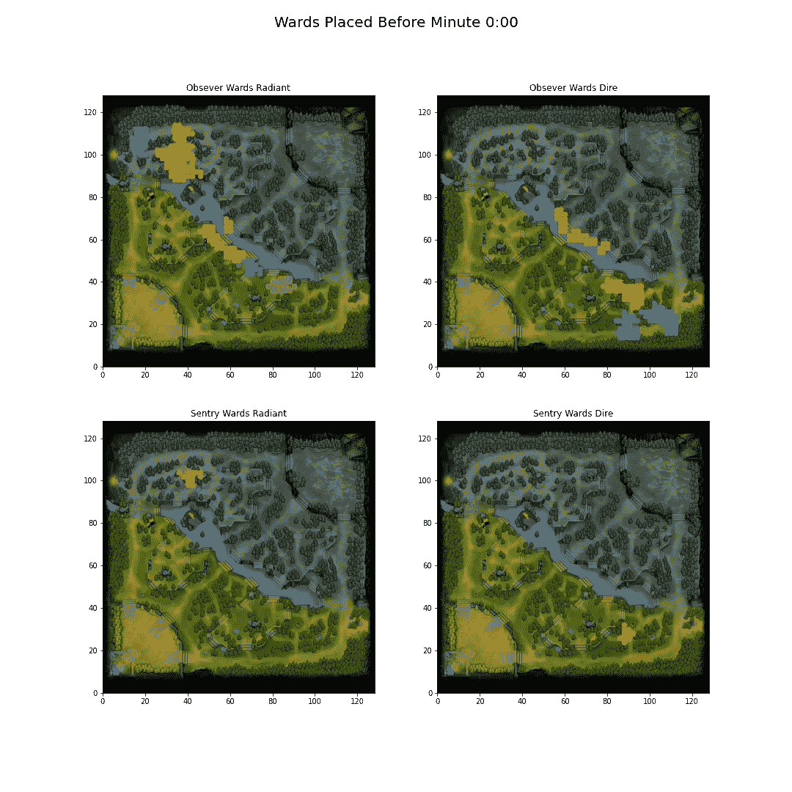

## 早期游戏— 0 点到 10 点

在早期的游戏中，中线和安全丛林仍然是有争议的。因为一级塔可能还在，所以优先视野在丛林入口附近。

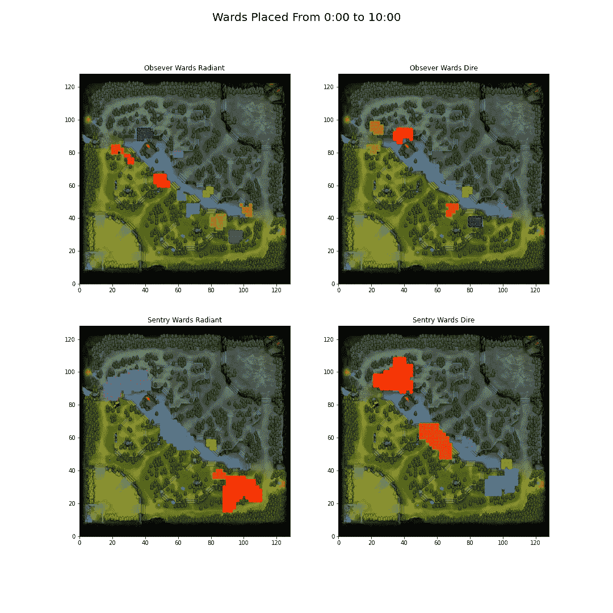

## 游戏早期到中期— 10:00 到 20:00

在游戏的早期到中期，恐怖和光辉都试图将观察者的守卫放在敌人安全的丛林深处。在游戏的这个阶段，三角形开始变成一个有争议的区域。

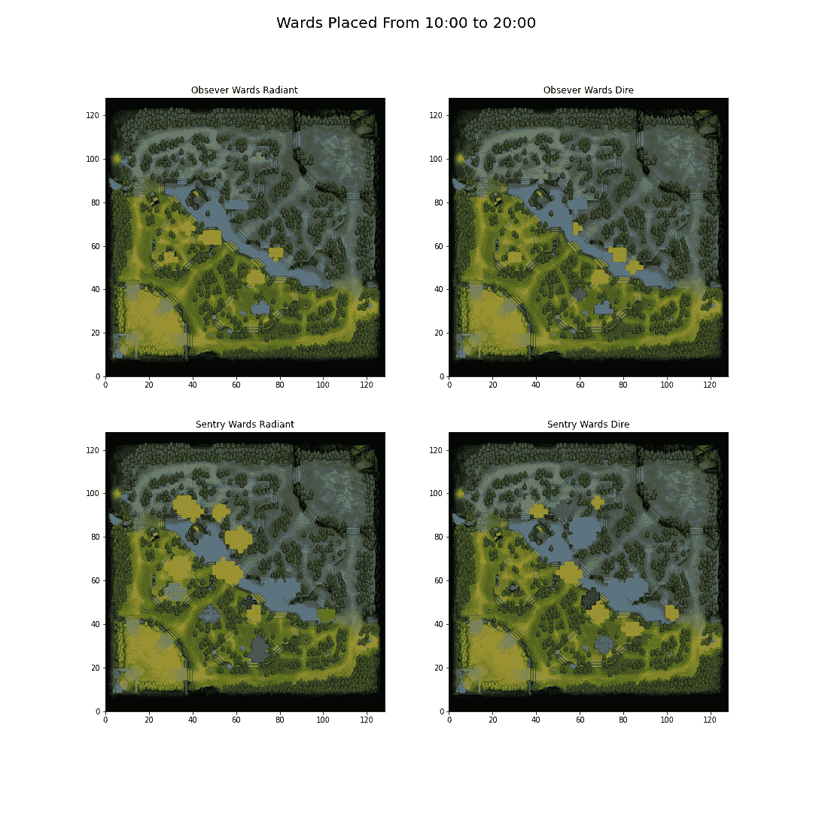

## 游戏中期— 20:00 到 30:00

视觉主要集中在三角形和山顶上。

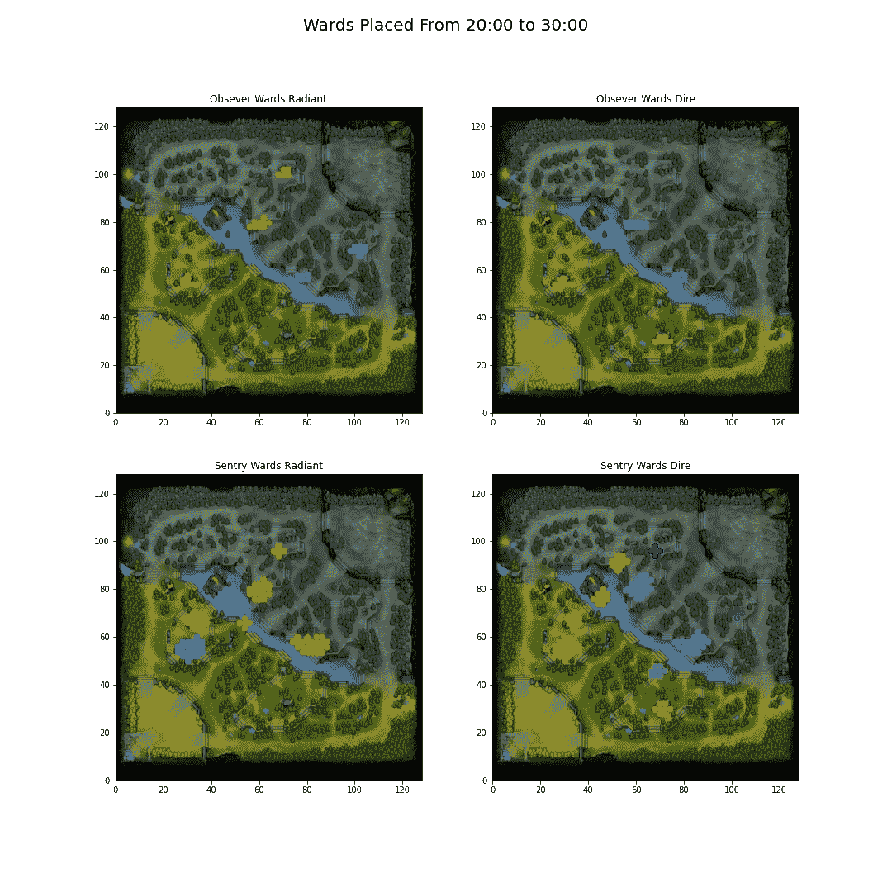

## 游戏中后期— 30:00 到 40:00

比赛中后期，队伍可以把注意力转向罗山的坑。这表现在矿坑附近的山顶上布满了观察哨和岗哨，它们被放置在入口处，用来探测抢夺神盾的企图。

## 游戏后期— 40:00 到 60:00

现阶段罗山的坑还是一个相关的客观。重点是三角形。一些岗哨被安置在基地附近。

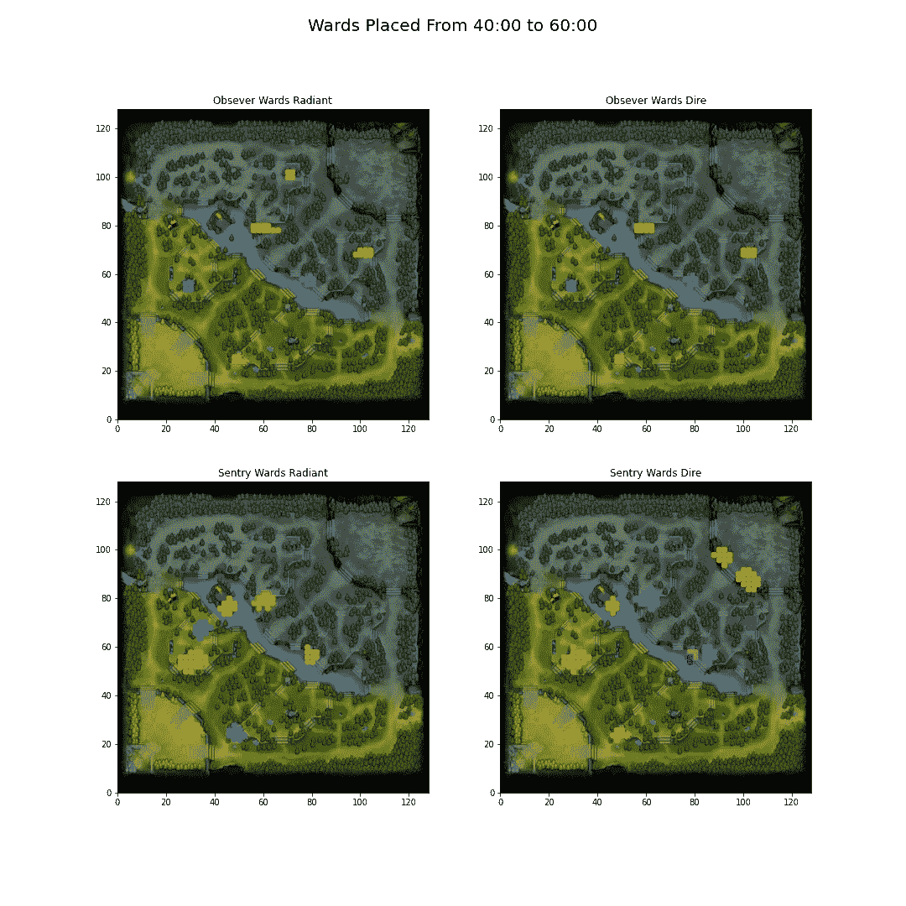

## 非常晚的游戏— 60:00 及以后

在游戏的最后阶段，兵营和三级塔可能已经没有了。为了弥补塔楼视野的损失，在基地内部安置了病房。

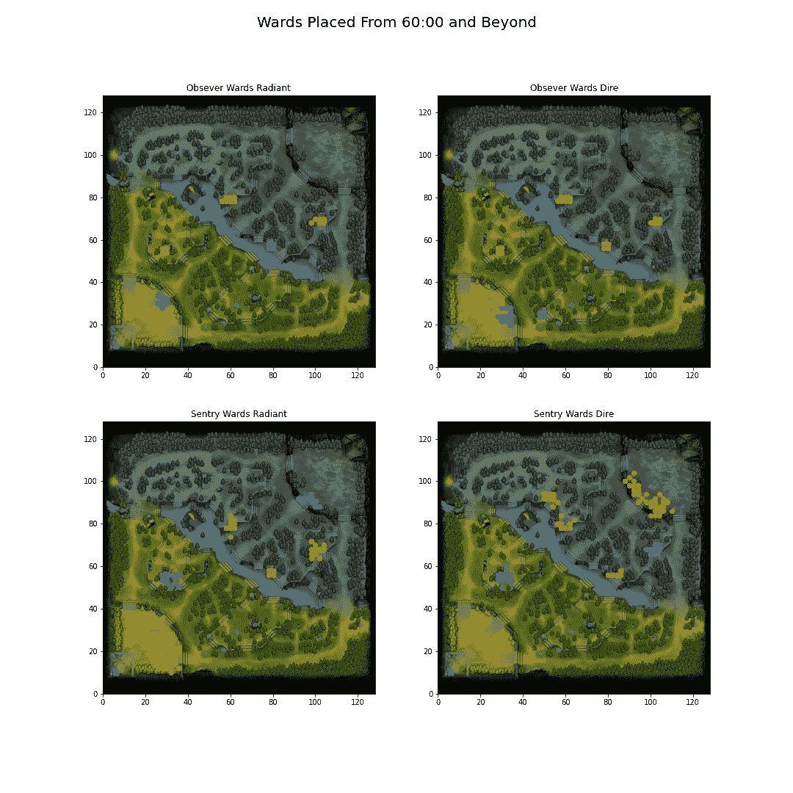

# 创建交互式浏览器

图的输入和参数是任意的，并且基于领域知识(即，数百小时的游戏)。如果你想调整数据，请使用下面的 streamlit 应用程序:

[https://share . streamlit . io/nadimkawwa/dotawardfinder/main/appwardfinder . py](https://share.streamlit.io/nadimkawwa/dotawardfinder/main/appWardFinder.py)

下面的截图显示了该应用程序，并要求用户输入 3 个信息:

*   ε值
*   时间范围
*   每个聚类的最小样本数

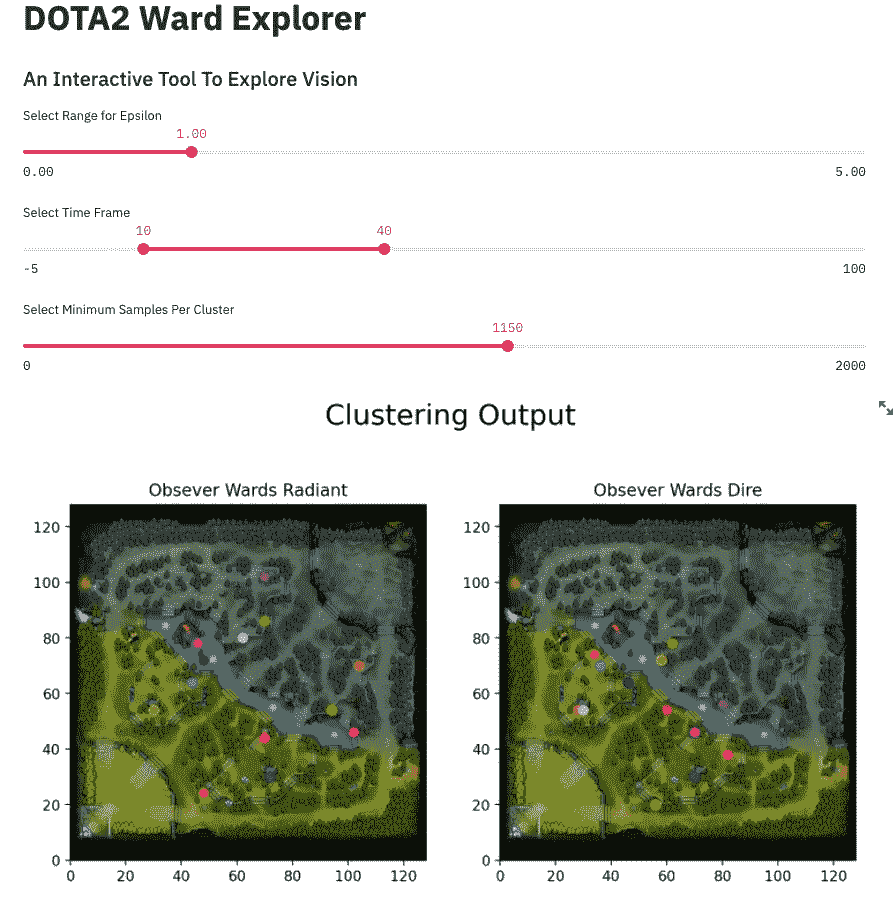

# 本项目的优势

这个项目使用真实可靠的大规模数据。因此，它可能会捕捉职业玩家的最佳实践，并跟上战略和游戏机制的变化。

此外，这里使用的方法与地图的变化无关。因此，输出中已经考虑了对地图布局或高程的任何更改。

# 固有的局限性

这个项目不评估一个病房的寿命。玩家面临着决斗的优先权:

*   守卫一个敌人可能会向其开火的区域，因为它提供了有利的视野。
*   守卫一个鲜为人知的地点，失去关键视野，但敌人不太可能放弃它。

此外，一个岗哨守卫需要 50 金币，如果被摧毁将不会得到任何奖励。另一方面，观察结界是免费的，但是提供 100 金币奖励，并且每 15 秒额外提供 1 金币。因此，有一个成本/收益比方面的 warding，这个职位没有解决。

# 结论

有可能查询数据和识别关键地图位置，在那里病房可以帮助团队安全杀死或关键目标。这篇文章的方法的优点是它跟上了地图布局和游戏机制的变化。因此，通过观察大量的比赛，我们可以发现关键位置，并在我们的游戏中实现它们。

# 参考

 [## OpenDota 项目

### 社区维护的开源 Dota 2 数据平台开源 Dota 2 数据平台 JavaScript 1.3k 302 React web…

github.com](https://github.com/odota)  [## K-means 聚类不是免费的午餐

### 我最近在交叉验证上遇到了这个问题，我认为它提供了一个使用 R 和…

varianceexplained.org](http://varianceexplained.org/r/kmeans-free-lunch/)  [## DBSCAN -维基百科

### 基于密度的含噪声应用空间聚类(DBSCAN)是由 Martin…

en.wikipedia.org](https://en.wikipedia.org/wiki/DBSCAN#Disadvantages)  [## 英雄死亡坐标问题# 1473 odata/core

### 此时您不能执行该操作。您已使用另一个标签页或窗口登录。您已在另一个选项卡中注销，或者…

github.com](https://github.com/odota/core/issues/1473)