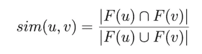
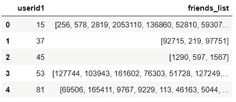
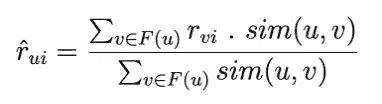
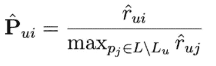
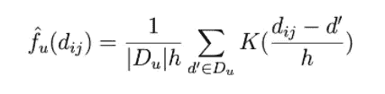
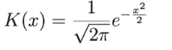
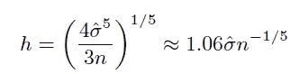
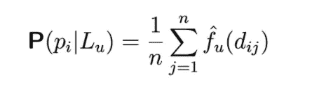

# 接下来去哪里旅游？兴趣点推荐系统构建指南

> 原文：<https://towardsdatascience.com/where-to-travel-next-a-guide-to-building-a-recommender-system-for-pois-5116adde6db?source=collection_archive---------16----------------------->

[来源](https://unsplash.com/photos/CJOO0QhCmQM$)

在[的上一篇文章](/make-your-own-book-and-movie-recommender-system-using-surprise-42cc1c840a19)中，我写了如何制作你自己的电影和书籍推荐系统。在下文中，我将一步一步地描述如何构建一个推荐系统，该系统基于用户偏好、地理影响和社会影响来建议新的游览地点。

推荐方法在文章 [iGSLR:个性化地理社交位置推荐:一种核密度估计方法】中介绍，张和周，SIGSPATIAL'13。](https://dl.acm.org/doi/10.1145/2525314.2525339)

我将使用 Surprise Library 一步一步地介绍他们方法的实现。

# 加载数据集和预处理

我使用的数据集是从社交媒体 Gowalla 收集的。它由 2，724，891 个兴趣点中的 407，533 个用户的 36，001，959 次签到组成。

它包括用户签到信息、用户朋友信息、位置信息和用户信息的数据集。

为了减少计算时间，我只选择了拥有 5 次以上 50 次以下签到的用户，但是你当然可以处理所有的数据。

最终的训练数据集应包含所有兴趣点信息和用户信息，没有冗余信息，为此:

1.  我使用地点 id 连接了签到数据框和位置数据框

2.我从获得的数据帧 df_checkins_location 中计算了被访问位置的频率，以去除冗余的行

3.我连接了测向频率和测向位置，以获得最终的训练数据集

然后，整个数据集被意外加载

这篇文章的作者设计了一个推荐系统，利用社会和地理影响来表达用户的偏好。

# 社会影响

作者观察到，用户通常会向朋友寻求书籍、电影或兴趣点的推荐。他们通常更喜欢去朋友们强烈推荐的景点，而不是随便去一个地方。

他们建议使用以下步骤来计算用户的社会影响力:

(1)测量她/他与她/他的每个朋友的相似性。

两个用户之间的社会相似性

*   F(u)是用户 u 的朋友的集合

***实现***

首先，我创建了一个数据框，将每个用户与她/他的朋友联系起来。

数据集中每个用户的朋友列表

(2)在协同过滤公式中使用这种相似性

社交协同过滤评级预测

*   r_vi 是用户 v 访问 POI i 的频率

为了获得 r_vi，我们需要使用下面的函数:

使用以下函数计算预测评级的实施情况:

(3)将 POI 的预测转换成概率得分

在哪里

*   l 是所有 POI 的列表

# 位置的地理影响

作者建议利用同一用户访问的每对位置之间的距离。例如，曾经在世界各地旅行的用户希望得到国外的兴趣点的建议，相反，经常访问其生活区域周围的兴趣点的用户希望得到附近兴趣点的建议。

随着距离分布从一个用户到另一个用户的变化，其计算如下:

距离分布估计

在哪里

*   d_ij 是要推荐的 POI 和用户已经访问过的 POI 之间的距离

*   D_u 是用户 u 访问的所有 POI 对的距离列表
*   k(。)是一个普通的核函数

正常核函数

*   h 是作为最佳带宽的平滑参数。

最佳带宽

用户访问新 POI 的最终概率计算如下:

用户访问新位置的地理概率(POI)

# 最终公式

将社会影响和地理影响概率相加，以为用户 u 估计 POI 的相关性分数。

# 结论

就是这样！这个推荐系统可以帮助你决定你的下一次旅行，以防你认为离 POI 的距离和你朋友的推荐是选择的重要因素。你可以通过 [LinkedIn](https://www.linkedin.com/in/maha-amami-088b42b2/) 给我发消息获取完整的代码。请继续关注推荐系统的更多代码。

由[吉菲](https://giphy.com/gifs/matt-courteney-schwimmer-128PxwIB1pgN8s)演出

