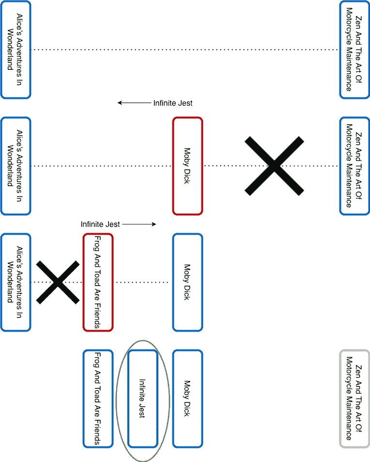
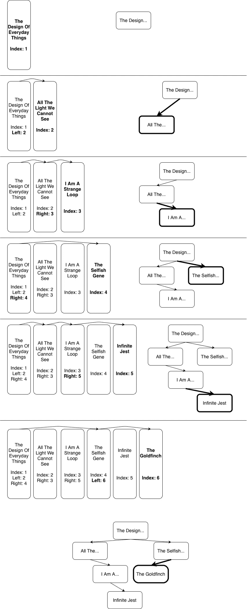
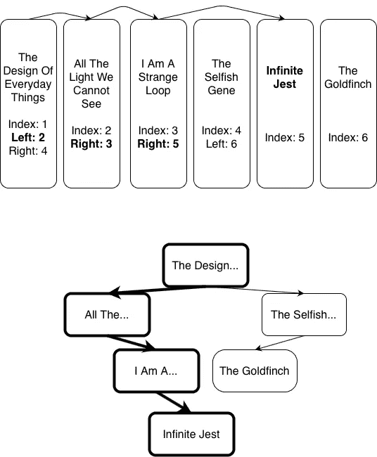
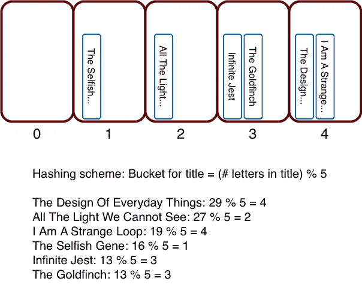
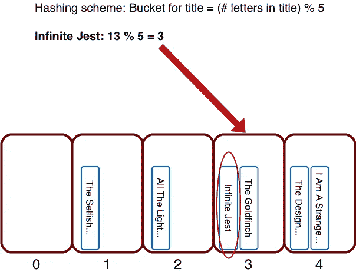

# 沃尔多在哪？

> 原文：<https://towardsdatascience.com/wheres-waldo-3dcd3c3b199f?source=collection_archive---------33----------------------->

## [实践教程](https://towardsdatascience.com/tagged/hands-on-tutorials)

## 物理世界中的搜索算法

由[凯莉·米歇尔](https://unsplash.com/@karlie_may?utm_source=medium&utm_medium=referral)在 [Unsplash](https://unsplash.com?utm_source=medium&utm_medium=referral) 上拍摄的照片

想象你想读(或重读)你的《无限玩笑》。你家里的书架上摆放着成千上万本书。你如何找到那本特别的书？

# 蛮力

你可以在房子里走来走去，浏览每一个书架上的每一本书，直到你发现无限的笑话。这是可行的，但会相当令人厌倦和费时。这样的策略在计算机科学中被称为*蛮力* *算法*。它确定了解决方案的存在以及最坏的情况是什么。除了放弃暴力策略，别无选择。

这种算法显然很麻烦，但到底有多麻烦呢？在最好的情况下,《无限的玩笑》碰巧在你浏览的前几本书里，你会很快找到它。在最坏的情况下，你只有在看完所有其他的书之后才会碰到它。当你在生活中反复使用蛮力搜索时，你会发现平均来说你必须翻完一半的书才能找到一本特定的书。用计算机科学的说法，这个算法的*运行时间是 N* ，其中 N 是图书总数。粗略地说，这意味着平均来说，找到一本书需要的时间与书的数量成正比。如果你把书的数量增加一倍，你就要花两倍的时间去找一本具体的。

你怎么能比蛮力搜索做得更好呢？通过整理书籍！在计算机科学中，解决问题的数据组织被称为使用数据结构。

# 二进位检索

让我们从一个常见且熟悉的组织策略开始:a *按照书名的字母升序排列书籍*。

按字母顺序排列的书籍(图片由作者提供)

显然，你将能够比必须检查每一本书更快地找到 Infinite Jest。你知道如何在一个按字母顺序排列的列表中找到一些东西，甚至不用考虑你正在使用的算法。您隐式使用的关键属性是，如果您检查一本书，并且它的标题按字母顺序比您要查找的书大(小)，那么您想要的书必须在该书之前(之后)。通过这种方式，您可以利用图书的排序来反复缩小目标图书的范围。

算法到底是什么？它叫做*二分搜索法*。事情是这样的。你在一套排列好的书中间粗略地检查了一本书，你发现它是莫比·迪克。《无限的玩笑》按字母顺序排在莫比·迪克之前，所以你知道它一定在第一本书和莫比·迪克之间。您刚刚将要搜索的帐套减少了一半。然后，在新范围的中间位置(第一本书和莫比·迪克之间)检查这本书。原来青蛙和蟾蜍是朋友。所以你知道，青蛙和蟾蜍是朋友，莫比·迪克之间肯定是无限的玩笑。你又一次将书籍的范围缩小了一半。继续这样下去，你最终会发现无限的玩笑。

无限玩笑的二分搜索法(图片由作者提供)

二分搜索法比强力全扫描搜索快多少？如果有 N 本书要搜索，在第一次比较之后，要搜索的书的数量减少到 N/2。在下一次比较之后，该集合的大小是 N/4，然后是 N/8，以此类推，直到只剩下一本书:《无限的玩笑》。如果 k 是查找一本书所需的比较次数，那么 2^K = N。换句话说，*二分搜索法的运行时间是 log N* 。所以如果你把书的数量增加一倍，你只需要做一次额外的比较就可以找到特定的一本。这确实比随着书籍数量线性增长的蛮力运行时间要好得多。

带有二分搜索法的排序数组似乎是一个好的解决方案，但是它有两个严重的问题:

1.  对大量的书籍进行分类是很困难的。有一些聪明的排序算法可以帮助你做到这一点，但是有一个事实是无法回避的，那就是你必须进行大量的图书交换才能正确排序。
2.  很难在已分类的藏书中添加或删除书籍。例如，如果你买了一本新书，根据书名排序，它属于书架上的特定位置，如果书架上没有空间，你必须将许多/所有的书移到那个位置之后，为它腾出空间。

# 二叉查找树

这里有一种不同的方式来组织书籍，以解决排序和添加/删除书籍的问题。把书按书架上的顺序放好。在每本书里插入一张索引卡。每个索引卡将包含一些对数据结构进行编码的信息。

索引卡上的第一条信息是书的位置。第一本书的索引卡将把它的位置记为 1，下一本书记为 2，依此类推。

每个索引卡还将包含*右子*和*左子*的位置。这个*指针*的结构定义了一个*二叉树*。第一本书是二叉树的*根*。第二本书是根的左边或右边的孩子，这取决于它的标题在字母顺序上是低还是高。诸如此类。右边的子树只包含字母顺序大的标题，左边的子树只包含字母顺序小的标题，这种排序特性使得二叉树成为一个*二叉查找树*。

要添加新书，从第一本书(根)开始，根据新书的标题是在根的标题之前还是之后，跟踪左边或右边的孩子，沿着树不断重复遍历，最后当要跟踪的孩子不存在时，使新书成为孩子。请注意，为了简单起见，我们在书名中包含了任何主要文章(the，a，an)。下图中的一个示例概括了这一点:

在二叉查找树中添加图书(图片由作者提供)

要查找一本书，从第一本书(根目录)开始，沿着相应的子目录(取决于书名的顺序)直到找到所需的书。以下是如何在我们上面构建的二叉查找树中找到无限玩笑的示例:

在二叉查找树找到无限的玩笑(作者图片)

使用这种二叉搜索树算法查找一本书的运行时间是多少？因为我们沿着树向下遍历，要么选择左边的孩子，要么选择右边的孩子，所以在每一步之后，我们基本上将搜索空间减少了一半，类似于二分搜索法算法。所以，就像前面的结果一样，需要 *log N* comparisons 才能找到一本书。

我们忽略了几个细节:

1.  为了在每次比较后将搜索空间减少一半，树应该是平衡的，即右边和左边的子树应该是大致相同高度的子树。通常，当标题以随机顺序插入树中时，树应该足够平衡。如果做不到这一点，还有算法技术(比如树旋转)来平衡一棵树(但这超出了本文的范围)。
2.  要在特定的位置找到孩子，你必须依靠按位置分类的书籍，并使用二分搜索法在指定的位置找到孩子。因此，沿着树向下的每一个 log N 跳本身都需要对索引卡上的位置进行 log N 次比较来找到这本书。这导致运行时间为(log N)。

二叉查找树解决方案是正确的、可行的和有效的。但这是矫枉过正。它引导我们跟踪索引卡中的元数据，以便可以使用搜索树数据结构将书名按排序顺序链接在一起。如果我们真的需要把书按顺序排列，那就好了。但是不需要仅仅为了搜索而排序。有没有更简单的方法至少同样有效？

# 散列法

如果我们放弃对书籍进行分类的努力(无论是直接分类，还是通过搜索树间接分类)，我们确实可以提出一个更简单、更有效的解决方案。它涉及到一种被称为*哈希*的计算机科学技术。

哈希是什么？你将架子分成数百个更小的*桶*，并将桶标为 0、1、2、3 等等。通过以可重复的方式从标题计算桶号，将每本书散列到一个桶中。例如，使用手机键盘上的 T9 系统从书名的最后 4 个字母生成一个 4 位数，用 4 位数除以桶数，将余数作为书的桶数。所以，《无限 Jest》对应的是 T9 编号 5378。如果有 101 个存储桶，它散列到存储桶 25(因为 5378 = 25 + 101*53)。

通过将每本书放入它所指向的桶中来组织书籍。假设数千本书大致平均分布在数百个桶中(如果您的哈希方案足够健壮，就会出现这种情况)，每个桶应该只包含几十本书。

通过哈希组织图书(作者图片)

你如何发现无限的玩笑？您将标题散列到它的桶中(使用与组织书籍完全相同的散列方案)，进入那个桶，从那里的几十本书中挑选出一本书。

通过哈希找到无限的笑话(作者图片)

通过哈希查找一本书有多快？速度极快。它本质上只需要一个步骤，不管书的总数是多少！你所要做的就是计算你要找的书名的哈希值，这就把你的搜索范围缩小到一桶书中的几本书。这就是所谓的*常数时间*算法。如果你把书的总数增加一倍，你最终会发现每个桶里的书的数量也增加了一倍。但是，如果有足够多的桶，每个桶应该只包含几十本书，所以在恒定的时间内找到特定的书仍然很容易。

对于在一大堆书中寻找一本书来说，散列似乎是一个很好的解决方案。尽管它并不完美。它有一些相对较小的缺点，包括以下几点:

1.  假设你的藏书越来越多，书架空间开始不够用了。你买更多的架子。但是现在你的散列方案有了更多的桶，你必须将每本书重新散列到新的桶中。多痛苦啊！如果改变搁置是一个罕见的事件，也许你可以忍受。但如果不是呢，或者你做不到呢？
2.  如果您希望存储桶的大小不相等，也就是说，将更多的书散列到更大的存储桶中，将更少的书散列到更小的存储桶中，该怎么办？例如，每个搁板可以是一个桶，不同尺寸的搁板上有不同的书柜。这里介绍的散列算法似乎不能适应不同大小的桶。

这两个问题都可以解决。但这需要使用更复杂的基于哈希的算法，如*一致哈希*或*会合哈希*。我将让这篇文章立足于基础，避免讨论这些迷人的技术。如果你有兴趣了解他们，请留下评论，我会写一篇后续文章。