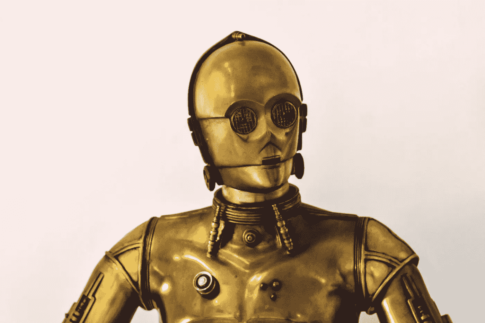
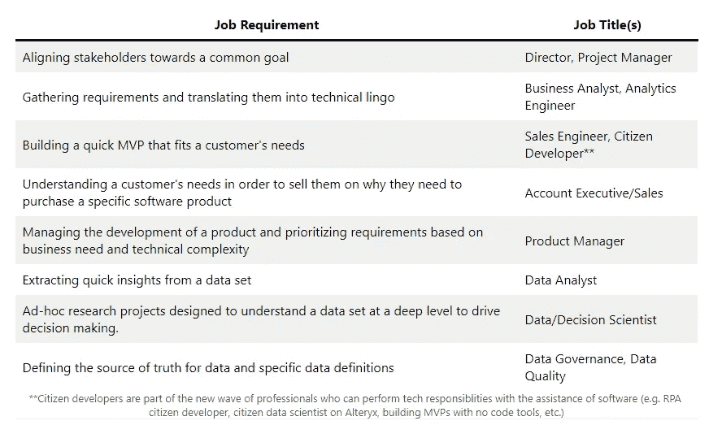
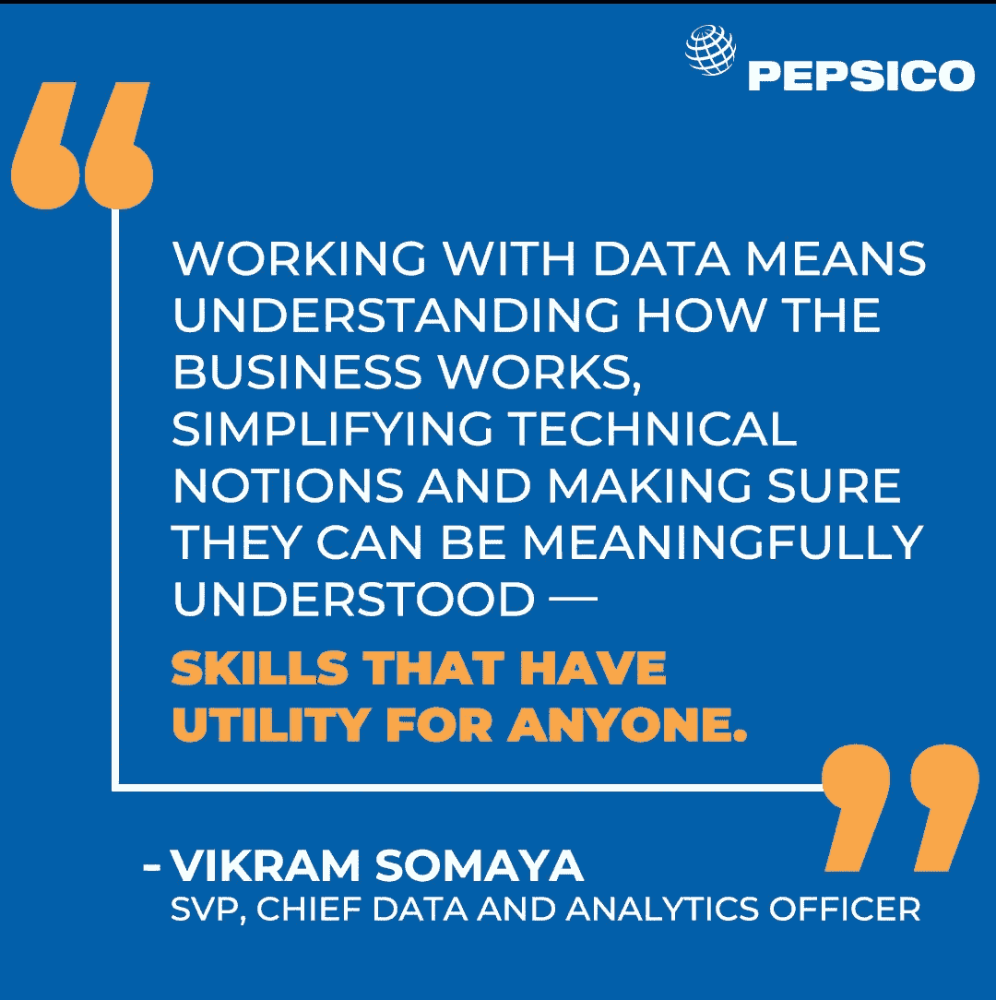

# 哪些科技工作是 AI 无法替代的？

> 原文：<https://towardsdatascience.com/which-data-professional-roles-cannot-be-replaced-by-ai-c7abd6d10f54?source=collection_archive---------36----------------------->

## 试图预测即使人工智能变得越来越普遍，仍然以人类为中心的领域

来源: [@lhgerona on Unsplash](https://unsplash.com/@lhgerona)

扩展我的[先前预测](/the-future-of-data-scientists-7b075c45f7f?source=your_stories_page-------------------------------------)的灵感来自于我最近听到的一句话，“任何可以自动化的都将被自动化”。有了这些明显的金钱激励，组织自动化，百万美元的问题是，技术专业人员应该如何最好地为未来做准备。为了回答这个问题，我们需要深入了解哪些流程可以自动化，这对技术专业人员意味着什么。

# 什么可以自动化？

机器人流程自动化的领导者 UiPath 概述了[五套标准](https://www.uipath.com/blog/rpa/5-factors-in-choosing-which-processes-to-automate)来决定一个流程是否应该自动化。虽然他们的标准侧重于 RPA，但这些概念也适用于可以自动化的其他领域。

## 标准#1:员工参与

耗时或严重依赖人工。手动操作会导致流程出错。

## 标准 2:复杂性

在考虑自动化时，复杂性可能是一件好事，也可能是一件坏事。评估复杂性可以基于所涉及的应用程序/系统的数量、人工干预的频率以及完成该过程所需的步骤数量。更复杂的流程可能更希望自动化，但也可能更难以自动化。

## 标准 3:数量

高容量的活动需要更多考虑自动化，因为它们会带来更高的 ROI。

## 标准#4:标准化和稳定性

人工智能应用主要集中在狭义人工智能上。因此，自动化要求过程依赖于基于规则的决策，而不需要计算机做出主观选择。在可预见的未来，主观选择是人类的事情。

## 标准 5:外包的难度

需要更多控制和自主权的流程不能外包。如果准确性和控制是重中之重，内部自动化策略可能是合适的。

## 摘要

一般来说，自动化非常适合可重复、高容量、耗时、基于规则的流程，并且将证明设置和维护自动化的费用是合理的。

# 自动化将如何发生？

人工智能一点也不像电影。我们还没有接近这样一个时代，你可以和 Siri 对话，让她即时创建一个“类似优步”的移动应用。人工智能和智能自动化的浪潮将增加计算机与计算机之间的交互数量，而不是人与计算机之间的交互。一个滑稽的例子是谷歌 Android 操作系统的自动来电过滤。当我收到一个烦人的机器人电话时，Android 会为我屏蔽电话并接听。结果是两个软件机器人进行了对话。听起来像是瑞克&莫蒂剧集中的一个笑话。

在商业意义上，这通常以脚本的形式调用[应用程序接口(API)](https://technically.dev/posts/apis-for-the-rest-of-us?utm_source=pocket-app&utm_medium=share) 来执行动作。脚本是一组指令，告诉一台计算机联系另一台计算机来执行所需的操作。常见的 API 包括 Twlio 的 SendGrid 和 Okta，前者根据特定规则发送电子邮件，后者在登录 web 应用程序时实现用户身份验证。API 变得如此重要，以至于它们支持着数十亿美元的公司(例如 Twilio、Okta、Stripe)。

谈到数据科学，谷歌发布了[机器学习算法](https://cloud.google.com/ai-platform/training/docs/algorithms)，比如他们的图像分类器，可以很容易地集成到软件中。微软有[Azure Machine Learning Studio](https://docs.microsoft.com/en-us/azure/machine-learning/overview-what-is-machine-learning-studio)，这是 Azure 中的一个无代码工具，可以构建简单的机器学习模型。

说到无代码工具，这些工具到处都是。如果您想构建一个简单的 web 应用程序，您不再需要成为一名程序员。像 Adobe XD 这样的工具让任何人都可以很容易地为数据产品或 web 应用程序创建快速 MVP。

最酷的无代码软件之一是运行 [GPT-3 模型的应用程序。这种人工智能模型允许用户键入问题作为输入，并接收大块的计算机代码作为输出。无论是 GPT-3 还是另一个工具，如果低复杂性功能或应用程序中的代码主要是由狭义人工智能编写的，我们都不应该感到惊讶。这些工具和开源算法只会随着时间的推移而改进。](https://www.forbes.com/sites/bernardmarr/2020/10/05/what-is-gpt-3-and-why-is-it-revolutionizing-artificial-intelligence/)

来源:南方公园推特

# 哪些工作职责是安全的？

RPA 和 API 将接管大量可重复的流程，这就引出了一个问题，技术专业人员将承担哪些工作职责？在未来 5 到 10 年内，有三种主要的工作职责看起来不会受到自动化的影响。这些预测的一个重要前提是假设我们仍然处于企业向云迁移的早期阶段。

## 流#1:自动化创建者和支持团队

自动化不是瞬间产生的，也不是免费的。所有自动化都是由大量数据和技术专业人员创建和维护的，不管你是否看到他们*。如前所述，API 优先的公司雇佣了数千名数据和技术专业人员。随着对这些接口的依赖越来越大，我预计对这些职位的需求只会增加。看看 [Stripe 的职位空缺](https://stripe.com/jobs/search)，你会看到数百个软件工程师的职位(如后端工程师、fullstack 等。).需要软件工程师来构建、维护开源算法和 API，并将其集成到数据产品或 web 应用程序中。

如果机器人过程自动化起飞，对 RPA 专家的需求将激增。生产一个 UiPath 工作流需要需求收集、开发自动化过程和生产自动化过程方面的专家。UiPath 列出了他们在 [UiPath 学院](https://academy.uipath.com/static-page/5)的几条不同的职业道路。几年后，人们可以看到 UiPath 在招聘信息中的应用会像现在的 Tableau 或 PowerBI 一样无处不在。

对于这个群体来说，一个很好的经验法则是，任何头衔中带有“工程师”或“开发人员”的人都更安全，不会受到自动化的威胁，因为他们是*构建者*。除了建筑工人，你还需要专业人员来支持和促进他们的工作。我们将它们称为使能因素。我们将需要以下的建设者和推动者:

*   **建筑商**
*   构建和维护支持构建或自动化流程的工具(如 UiPath、API 等)。)
*   将 API 和开源算法集成到 web 应用程序/数据产品中
*   构建、生产 RPA 工作流并为其提供支持
*   **使能器**
*   自动化需求的需求收集
*   自动化用例的决策者和预算决策
*   自动化开发的项目和产品经理
*   数据质量和数据治理专家确保数据(和自动化触发器)准确可靠

## 流程#2:不符合自动化标准的流程

并不是每一个过程都符合设置和维护自动化版本的标准。对于数量少、定义模糊、需要主观决策和/或不容易标准化的流程，自动化不值得花费成本。以下是一些难以自动化的工作职责和潜在的职称:

作者图片

## 流程#3:数字化转型团队

因为我们正处于向云转变的早期阶段，所以可以预期对实现这种数字化转型的专业人员或自动化的需求会很高。数字转换可以分为三层:

1.  **云基础设施**
2.  **数据工程**
3.  **数据科学**

行业向云的转移将需要能够建立云基础设施、支持持续维护并保持其安全性的技术专业人员。这将要求对云专业知识、开发运维以及网络安全的需求水平不断提高。

基础设施之上的下一层是数据工程。随着数据量[呈指数级增长](https://www.statista.com/statistics/871513/worldwide-data-created/)，对获取、清理、存储和移动这些数据的专业技能的需求将会持续增长。在保持质量的同时，快速移动大量数据将是组织多年来的一项需求。这方面的职位头衔通常包括数据工程师、分析工程师、BI 工程师、分析经理和数据经理。

一旦你有了值得信赖的数据，你将需要熟练操作、分析、可视化和建模数据的人。如果不全面了解可以从数据和数据之外的*得出什么样的见解，你就无法做出数据驱动的决策。*

虽然数字化转型团队的工作职责至少在未来五年内仍将是必要的，但人们可以很容易地想象自动化会减少需求。软件很可能会减少在这个流程中执行许多过程所需的人工劳动的总时间。例子包括如下:

*   加速探索性数据分析的软件
*   通过无代码工具(如 H2O、数据机器人)运行 ML 模型
*   人工智能算法使一些数据清理/工程过程自动化(例如，完美)
*   软件可以自动创建数据可视化
*   监控和检测软件可以实现云工程和网络安全的自动化

这个流程的工作职责是(三个中)最容易被自动化替代的。

# 谁来负责？

在思考未来的时候，考虑工作职责比考虑职称更有益。职称变动频繁，而工作职责更稳定。后者有更多的信号。这类似于在做出长期投资决策时，只关注股票的市场价格，而非其背后的基本面。

五年前，一个称职的数据分析师只需要是 Excel 和/或 SQL 方面的专家。如今，最好的数据分析师应该能够胜任一套技术和方法。这个列表通常包括 Python、R、SQL、Tableau、PowerBI 和机器学习概念。

数据科学家的职位发布终于开始找到一些稳定性。正如我在[上一篇文章](https://thedatageneralist.com/the-future-of-data-scientists/)中提到的，将工作职责分为决策科学家/分析师和软件工程师的趋势仍在继续。

普通的“商业”角色将变得更加技术化。我注意到我的许多没有传统 STEM 背景(或职称)的朋友正在承担更多以数据为中心的责任。由于对理解数据的压倒性需求，典型的“商业”专业人员将被要求学习更多关于软件开发和数据科学的概念和工具。对于商科本科生来说，仅仅胜任基本的 Excel 和描述性统计已经不够了。数据分析、数据科学和信息技术课程变得更加基础。

来源:百事可乐 Linkedin

# 最后的想法

引导我对未来技术专业人员角色进行预测的两个主要驱动因素是向云的长期转变，以及组织希望通过尽可能自动化来减少劳动力支出。在接下来的十年里，我设想这样一个世界:自动化带来的最安全的工作职责将是那些从这两项技术变革中受益的人。主要受益者将是那些构建和维护自动化的人，那些支持数字化转型的人，以及那些角色需要主观决策的人。将这些流转化为职称，我认为以下技术专业人员的职业道路是自动化最安全的。

*   软件工程师
*   软件销售工程师/其他销售角色
*   技术项目/产品经理

在投资界，讨论一家公司是否有护城河是很常见的，护城河是指他们相对于竞争对手保持竞争优势的能力。数据和技术专业人员拥有的最大护城河是他们对继续学习和提高技能的强烈渴望。如果你想避免 AI 取代你，我建议你[让学习成为你生活中的一个常数](https://thedatageneralist.com/)。

~ [数据通才](https://twitter.com/datageneralist)
数据分析职业顾问

*在 IT 群体中有一个流传已久的笑话，即没有人认识或看到 IT 团队。这是因为他们的办公室在地下室。

* *公民开发人员是新一波专业人员的一部分，他们可以在软件的帮助下履行技术职责(例如 RPA 公民开发人员、Alteryx 上的公民数据科学家、不用代码工具构建 MVP 等)。)