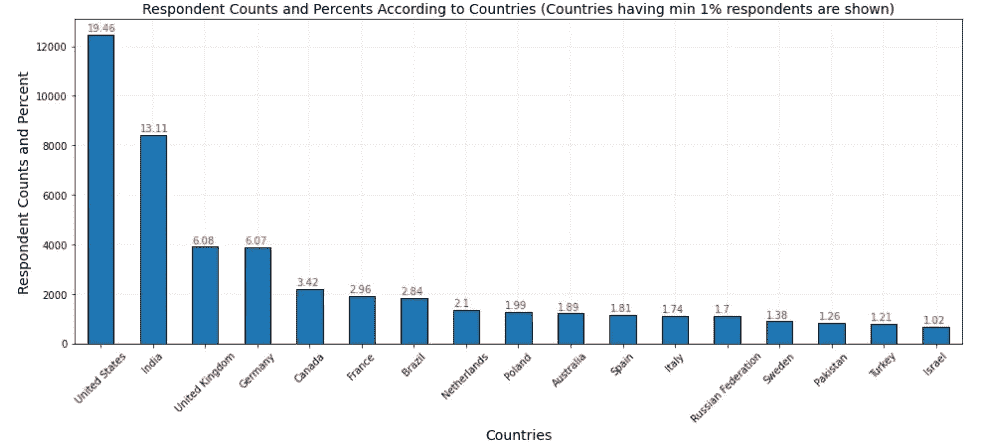
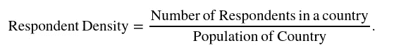
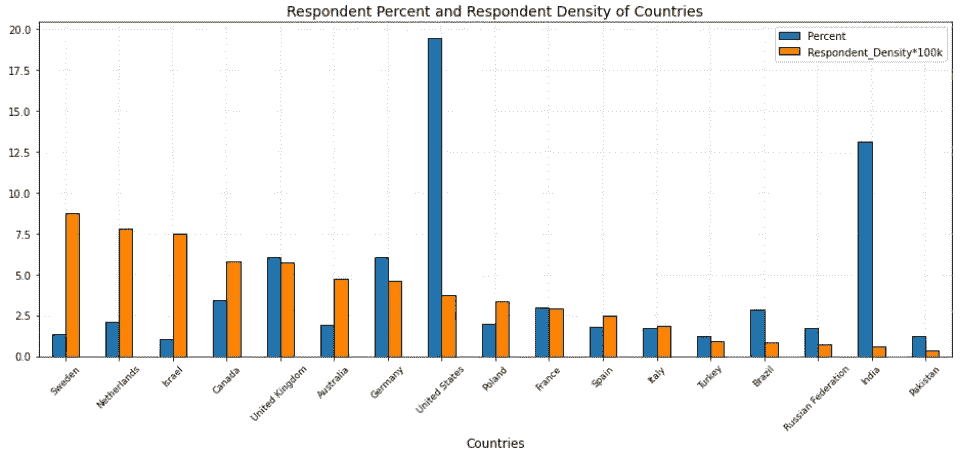
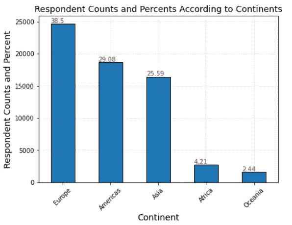
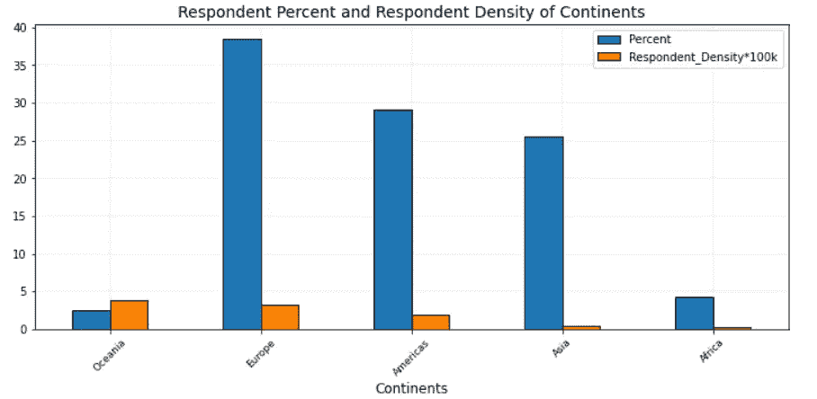
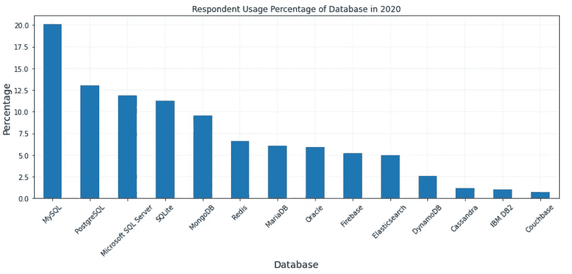
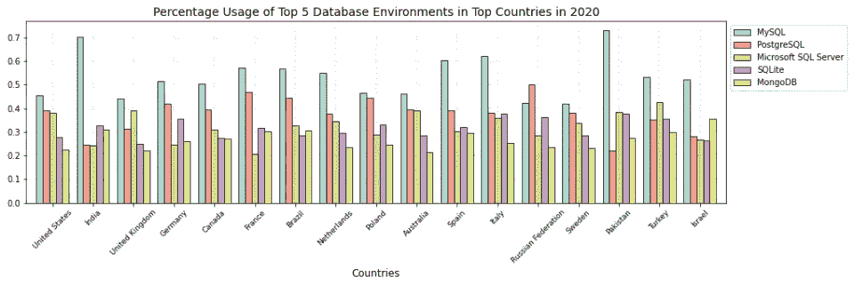
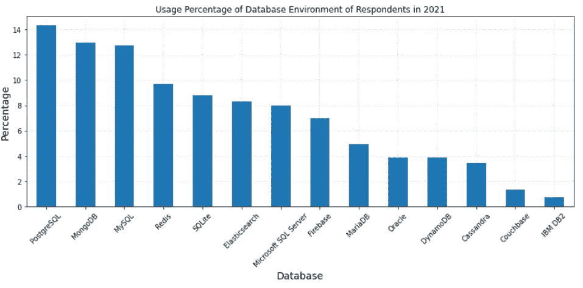
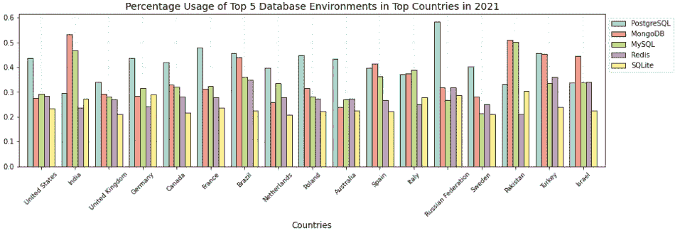

# 2021 年开发者对哪些数据库环境感兴趣？

> 原文：<https://towardsdatascience.com/which-database-environments-are-of-interest-to-developers-in-2021-7482f718f47a?source=collection_archive---------51----------------------->

## 2021 年开发人员对数据库环境的预期使用分析

2021 年数据库管理系统使用统计的词云—作者图片

# 介绍

近年来，世界上人工智能在工业和研究中的使用都有所增加。毫无疑问，人工智能日益增长的相关性导致了对不同人工智能应用领域专家的需求。这些专家需求领域包括软件开发人员、机器学习工程师、数据科学家和数据库管理员。此外，上述专业领域的工作需要计算机编程、数据库管理系统、统计学和矩阵代数等领域的技术知识，这是必不可少的。在本文中，我只关注数据库管理系统的使用。更准确地说，我让人们知道了预计在 2021 年将在软件开发者中流行的数据库环境。

在揭示数据库环境将如何流行时，我使用了 2020 年的 [Stack Overflow 年度开发者调查数据集。我使用这些数据集的原因是，在过去的十年中，Stack Overflow 年度开发者调查已经成为世界上最大、最值得信赖的专业软件开发人员社区。因此，有必要了解这些软件开发人员对 2021 年软件开发人员中流行的数据库环境的看法。](https://drive.google.com/file/d/1dfGerWeWkcyQ9GX9x20rdSGj7WtEpzBB/view?usp=sharing)

进行的调查有来自 182 个国家和地区的 64，461 名受访者。调查问题分为以下几个部分:基本信息、教育、工作和职业、技术和技术文化、堆栈溢出使用以及社区和人口统计。调查中提出了 61 个问题。一些问题包括:

> 你住在哪里？
> 
> 在过去的一年中，您在哪些协作工具上做了大量的开发工作，在接下来的一年中，您希望在哪些工具上工作？(如果您已经使用了该工具，并希望继续使用，请选中该行中的两个框。)

但是我最感兴趣的问题是

> 在过去的一年中，您在哪些数据库环境中做了大量的开发工作，接下来的一年您希望在哪些环境中工作？(如果你们都使用过数据库，并且希望继续使用，请勾选该行的两个框。)

# 按国家和大洲分列的调查对象分布情况

在回答兴趣问题之前，我想了解一下

> 调查中回答者的分布如何与其国家相对应(分别为。以及这种分布是否很好地代表了这些国家的人口。大洲)？

在第一小节(调查对象在各国的分布情况)，我根据调查对象所在的国家介绍了我的调查结果。第二小节(按国家分列的调查对象分布情况)给出了与调查对象所在大洲相对应的调查结果。

## 按国家分列的调查对象分布情况

在这一小节中，我将对下面的问题提出我的发现。

> 调查对象的分布如何与其国家相对应？

用来回答这个问题的数据集部分是*国家*列，询问受访者他们住在哪里？

下图 1 显示了按居住国降序排列的调查受访者的百分比。人们可以看到，美国记录的最高调查受访者人数为 19.46%。接下来的四个国家依次是印度、英国、德国和加拿大，分别为 13.11%、6.08 %、6.07%和 3.42%。

图 1:根据国家的调查受访者数量和百分比(仅显示至少 1%的受访者的国家)—按作者分类的图片

提出了一个后续问题，以了解调查对象的分布如何与其居住国相对应。这是通过了解

> 答卷人数最多的国家在多大程度上代表了各自国家的人口？

为了回答上述问题，我引入了一个新的量，称为*受访者密度*，它衡量的是给定各自国家人口后受访者的密度。准确地说，它由下面的公式给出:

图 2:回答者密度公式——作者图片

我使用由 [Tanu N Prabhu](https://www.kaggle.com/tanuprabhu) 提供的 [2020 年人口数据集](https://www.kaggle.com/tanuprabhu/population-by-country-2020)来获得 Stack Overflow 年度调查数据集中所代表的国家的人口。

下面的图 3 显示了我的分析结果。从中可以看出，有趣的是，瑞典、荷兰、以色列、加拿大和英国是受访者密度排名前五的国家。因此，可以说来自这些国家的调查答卷人的数量很好地代表了他们国家的人口。

图 3:调查受访者在受访国家的百分比和受访者密度(仅显示受访者至少占 1%的国家)——按作者分类的图片

另一方面，美国虽然记录了 19.46%的调查受访者，但根据受访者的密度衡量，排名第八位。印度占调查受访者的 13.11%，按受访者密度衡量排在第 16 位。在这两个国家，人们可以假设那里的软件开发人员对调查不感兴趣。也可以说，从这两个国家的结果来看，在本次调查中，没有多少软件开发商能够很好地代表他们各自的国家。虽然这些可能是明智的猜测，但我想知道我得出这个结果的简明原因。或许在进行进一步的研究以获得一个具体的答案，为什么这是一个明显的例子，我将是出路。

## 调查对象在各大洲的分布情况

在这一小节中，我将呈现我对上一小节中讨论的可能的后续问题的分析结果。即，

> 哪个洲的受访者人数最多？

我使用了由[柴坦尼亚·戈卡莱](https://www.kaggle.com/statchaitya)创建的[国家大陆数据集](https://www.kaggle.com/statchaitya/country-to-continent)，将调查受访者所在的国家按照各自的大陆进行分组。

调查结果见下图 4。

图 4:各大洲的调查受访者数量和百分比——按作者分类的图片

从上面的图 4 中可以看出，接受调查人数最多的是欧洲大陆，占 38.5%，其次是美洲、亚洲、非洲和大洋洲，分别占 29.08%、25.59%、4.21%和 2.44%。

与上一小节中提出的第二个问题一样，我引入了*受访者密度*度量，将其限制为调查受访者在各大洲的人口。这里感兴趣的问题如下:

> 前一个问题的结果在多大程度上代表了调查对象所在的大陆？

从下图 5 可以看出，大洋洲的答卷密度最高。因此，来自该大陆的受访者比来自其他被调查大陆的受访者对调查更感兴趣。

图 5:各大洲的调查受访者百分比和受访者密度——按作者分类的图片

# 调查受访者对数据库环境的使用情况

在本节中，我将介绍我对以下主要问题的调查结果:

> 在过去的一年中，您在哪些数据库环境中做了大量的开发工作，接下来的一年您希望在哪些环境中工作？(如果你们都使用过数据库，并且希望继续使用，请勾选该行的两个框。)

在调查数据集中，对于标有 *DatabaseWorkedWith* 和*databasedesinerextyear 的列，也提出了同样的问题。*调查受访者的回答显示，在全球范围内，有 14 种不同的数据库管理系统(DBMS)受到软件开发人员的欢迎。其中包括:

[Cassandra](https://cassandra.apache.org/)
[couch base](https://www.couchbase.com/)
[DynamoDB](https://aws.amazon.com/dynamodb/)
[elastic search](https://www.elastic.co/)
[Firebase](https://firebase.google.com/)
[IBM DB2](https://www.ibm.com/products/db2-database) [Maria db](https://mariadb.org/)
[微软 SQL Server](https://www.microsoft.com/en-au/sql-server/sql-server-downloads) [MongoDB](https://www.mongodb.com/)
[MySQL](https://www.mysql.com/)
[Oracle](https://www.oracle.com/database/)

本节的其余部分分为两个小节。在第一小节(2020 年调查受访者对数据库环境的使用情况)中，我介绍了我对 2020 年之前感兴趣的问题的调查结果，第二小节重点介绍了 2021 年的调查结果。

## 2020 年受访者对数据库环境的使用情况

在这一节中，我将展示我对标有 *DatabaseWorkedWith 的专栏中感兴趣的问题的发现。*在这一栏中，调查受访者被要求指出他们在 2020 年之前进行了大量开发工作的数据库环境。换句话说，我对下面这个问题感兴趣。

> 调查对象中最受欢迎的数据库环境是什么？

下面的图 6 显示了截至 2020 年底所有调查对象对各种数据库管理系统的使用情况。

图 6:截至 2020 年底，调查受访者使用数据库环境的百分比—按作者分类的图片

从上面的图 6 中可以看出，受访者在过去一年(即 2020 年底前)进行了大量开发工作的五大流行数据库环境是

[**MySQL**](https://www.mysql.com/)**—20.07%
[**PostgreSQL**](https://www.postgresql.org/)**—13.03% **[**微软 SQL Server**](https://www.microsoft.com/en-au/sql-server/sql-server-downloads)**—11.90%
[**SQLite**](https://www.sqlite.org/index.html)**—11.24**********

******有趣的是，尽管 **MongoDB** 与其他数据库环境(如 **Oracle DBMS** )相比，是最近数据库社区的新产物之一，但在调查受访者中，它已经上升到前五名 DBMS。在下一小节中，我将探究一下 2021 年 **MongoDB** 可能会有多流行。******

****在下面的图 7 中，我们可以看到这五大数据库管理系统在最具代表性的国家中的排名。****

********

****图 7:2020 年排名前五位的国家/地区的数据库管理系统使用百分比——按作者分类的图片****

****从上面的图 7 可以看出， **MySQL** 仍然是排名靠前的国家中使用最广泛的数据库环境，除了俄罗斯联邦，在俄罗斯联邦 **PostgreSQL** 排名第一，其竞争对手 **MySQL** 排名第二。人们还可以看到，MySQL 在巴基斯坦、印度和意大利被广泛使用。****

****在所有这些国家，五大数据库管理系统中至少有两个存在竞争。波兰是 MySQL 有竞争对手的唯一国家。它的竞争对手是 **PostgreSQL** 。在美国、印度、荷兰、澳大利亚和意大利, **PostgreSQL** 和**微软 SQL Server** 的使用存在竞争。 **MongoDB** 在以色列排名第二，在加拿大和法国与 **SQLite** 竞争。****

## ****2021 年受访者对数据库环境的使用情况****

****最后，我根据调查对象在数据集中标为 *DatabaseDesireNextYear* 的一栏中给出的答案展示了我的发现。这里有趣的问题是****

> ****明年，也就是 2021 年，受访者希望在哪些数据库环境中工作？****

****下图 8 显示了 2021 年数据库管理系统使用情况的预期排名。****

********

****图 8:截至 2021 年底，调查受访者使用数据库环境的百分比—按作者分类的图片****

****从上面的图 8 可以看出，2021 年最受软件开发人员欢迎的五大数据库环境是:****

****[**PostgreSQL**](https://www.postgresql.org/)—14.30%
[**MongoDB**](https://www.mongodb.com/)**—12.96% **[**MySQL**](https://www.mysql.com/)**—12.73%
[**Redis**](https://redis.io/)**—9.69%************ 

******将此处看到的 2021 年的结果与上一小节中显示的 2020 年的数据进行比较，可以看出 **PostgreSQL** 很有可能在 2021 年受到来自世界各地的受访者的欢迎。得出这一结论的原因是，其使用量预计将增长 1.27%。从而以 14.30%的排名从 2020 年的 13.03%的第二名上升至第一名。******

****接下来是 **MongoDB** ，令人印象深刻地从 2020 年的第五位上升到 2021 年的第二位，上升幅度为 3.43%。这是一个很好的进步。考虑到 MongoDB**在 2020 年和 2021 年之间仅上升了三位，一个可能要探讨的问题是，MongoDB** 在未来几年是否会成为全球受访者中最受欢迎的数据库环境。****

******MySQL** 从 2020 年的第一位下降到 2021 年的第三位，降幅为 7.36%。因此，在世界范围内，MySQL 很有可能在 2021 年变得不那么受欢迎。****

****接下来是 2020 年受访者中排名第六的 **Redis** 。它以 3.09%的增幅排名第四，预计将于 2021 年在全球范围内受到软件开发商的欢迎。它在 **MongoBD** 之后排名第二，预计在 2021 年也会大受欢迎。****

****最后， **SQLite** 下降了 2.41%，从 2020 年的第四位跌至 2021 年的第五位。调查对象也认为数据库管理系统在世界范围内失去了受欢迎的程度。****

****从调查结果可以明显看出，在全球范围内， **Microsoft SQL Server** 很有可能不受调查对象的欢迎。我之所以得出这个结论，是因为微软 SQL Server 以 3.91%的差距从 2020 年的第三位跌落到 2021 年的第七位。****

****图 9 显示了调查中代表性最强的国家对同一问题的调查结果。****

********

****图 9:2021 年排名前五位的国家/地区的数据库管理系统使用百分比——按作者分类的图片****

****将上面的图 9 与图 7 相比较，我们可以观察到 **PostgreSQL** 在 2021 年仍然会在俄罗斯流行。对于美国、英国、德国、加拿大、法国、巴西、荷兰、波兰、澳大利亚、瑞典和土耳其，也可以预测 PostgreSQL 的受欢迎程度。也就是说， **PostgreSQL** 很有可能在 2021 年在这些国家的受访者中流行起来。****

****在印度、西班牙、巴基斯坦和以色列的受访者中，MongoDB 预计将成为 2021 年最受欢迎的 DBMS。在土耳其、巴西、西班牙和意大利， **MongoBD** 与 **PostgreSQL** 竞争。印度和巴基斯坦是个例外，在那里你可以看到 **MongoDB** 正在与 **MySQL 竞争。******

****有趣的是，意大利是唯一一个预计 MySQL 在 2021 年保持流行的国家。比较 2020 年和 2021 年的 **MySQL** 和 **PostgreSQL** 以及 **MySQL** 和 **MongoDB** 之间的差异，可以说，在意大利， **MySQL** 的密切竞争对手，即 **PostgreSQL** 和 **MongoDB** 可能会在 2021 年接管。****

## ****结论****

****这项调查的大多数受访者居住在以下国家之一:美国、印度、英国、德国和加拿大。****

****使用受访者密度测量，我发现来自以下国家的受访者对调查最感兴趣:瑞典、荷兰、以色列、加拿大和英国。也就是说，他们很好地代表了他们的人口。尽管美国和印度有更多的受访者，但其受访者的密度值表明，他们没有像预期的那样很好地代表其人口。****

****在洲一级，欧洲成为接受调查人数最多的洲。另一方面，根据答复者密度衡量，大洋洲是唯一得到充分代表的大陆。****

****在全球范围内， **MySQL** 在 2020 年底之前一直是受访者中最受欢迎的数据库环境。尽管 2020 年有这个记录，但是 **PostgreSQL** 很有可能在 2021 年超过 **MySQL** 。此外，人们对 2021 年的 **MongoDB** 和 **Redis** 的兴趣预计会上升。这项研究中没有探究产生这种兴趣的原因。尽管如此，了解这个原因还是很有趣的。我的调查结果还显示，预计 2021 年微软 SQL Server 将不再受调查对象的欢迎。****

****值得注意的是，这项研究的发现是观察性的，而不是彻底的正式研究。然而，它们引出了有趣的面向商业的研究问题，这些问题不仅指向软件开发者，而且指向生产这些数据库管理系统的公司。无论您属于哪一类，是软件开发人员还是数据库管理系统的生产者，问题仍然存在:****

> ****你认为什么样的数据库管理系统会在 2021 年流行起来？****

****关于这些分析和更多的技术细节，请点击这里查看我的 Github 链接。****