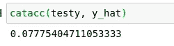
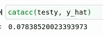

# 哪种编码器最适合随机森林精度？浮点数还是序数？

> 原文：<https://towardsdatascience.com/which-encoder-is-the-best-for-random-forest-accuracy-float-or-ordinal-ea7ba7ee697d?source=collection_archive---------19----------------------->

## 基尼指数随机森林分类器上分类编码器的比较。


(src =[https://unsplash.com/photos/50bzI1F6urA](https://unsplash.com/photos/50bzI1F6urA)

# 介绍

O 处理分类数据和问题的最常见模型类型之一是随机森林分类器。这是有充分理由的，因为它相对容易使用，不需要太多努力就可以产生一些非常惊人的结果。随机森林分类器使用一种称为基尼指数的统计指标来种植节点，以分析数据和结果之间的某些一致性。

处理这类数据时，需要处理连续的要素是很常见的，但在不是这种情况的情况下，我们需要将分类值转换成某种数字形式，以便计算机可以实际分析它。为此，通常使用编码器。编码器获取典型的文本或分类数据，并将其转换成一种新的形式，有时具有惊人的准确性性能，这取决于用什么模型对什么数据处理什么类别。也就是说，我真的想尝试一下，了解一下哪些不同类型的编码器可以更好地处理基尼指数，以便在我们的随机森林分类模型中获得最高的准确性。

> [笔记本](https://github.com/emmettgb/Lathe-Books/blob/main/models/Gini%20Encoder%20Comparison%20(0.1.7).ipynb)

我的预测是，顺序编码器的性能将超过浮点和标签编码器。我之所以估计这个案例，部分是因为我在这个课题上的经验。以我的经验来看，顺序编码对于基于基尼指数的预测非常有效，而在许多其他分类模型中，一种热编码可能是最合适的解决方案。我估计这是因为一个热点将创建更多的特征来作为我们节点的基础，这将把我们的胡萝卜放入几个基于布尔的篮子中，而不是只保留一个集合编码的特征。另一方面，float 编码器只是简单地将字符转换成数字，所以本质上它要做的事情和 ordinal 编码器一样，对每个类别应用唯一的值。我认为序数编码器在这方面仍将领先的原因是，序数编码器不会有可能具有高方差且本质上是任意的高数字，它不会浪费任何连续的空间，使我们的评估者更容易跟踪我们总体中的数字。如果你想了解更多关于这三种编码器的信息，你可以在这里查阅我写的这篇关于这三种编码器的文章，甚至是如何用 Julia 编写它们:

[](/encoders-how-to-write-them-how-to-use-them-d8dd70f45e39) [## 编码器——如何编写，如何使用

### 通过这个“从头开始”的演练，探索编码器在机器学习中的多种用途！

towardsdatascience.com](/encoders-how-to-write-them-how-to-use-them-d8dd70f45e39) 

# 依赖性和数据

对于这个项目，我们将使用模型和编码器的 Lathe.jl 实现。这将有助于降低依赖性，并为我们将要使用的每个工具提供一致的方法。此外，我们将使用 DataFrames.jl 和 CSV.jl 来读入我们要处理的数据。

这个过程的第一步是读入我们的数据。为此，我们将使用 sink 参数和 CSV.read()方法。如果你想了解更多关于水槽的论点，我也有一篇关于它的文章，你可以在这里找到:

[](/what-is-a-sink-argument-caf77dab6ac5) [## 什么是“下沉”论点？

### 关于在 Julia 编程语言中使用接收器参数的介绍。

towardsdatascience.com](/what-is-a-sink-argument-caf77dab6ac5) 

我为这个项目选择的数据是 2008 年发生在亚特兰大的犯罪数据集。让我们继续往下读:

```
using CSV
using DataFrames; df = CSV.read("atlcrime.csv", DataFrame)
```

现在我们已经有了数据，我删除了缺失的值，然后继续使用我为此项目选择的两个要素创建了一个新的数据框:

```
df = dropmissing(df)
df = DataFrame(:crime => df[!, :crime], :neighborhood => df[!, :neighborhood])
```

现在，为了了解我们将在这里处理多少个类别，我将集合类型转换为数组。然后，我打印了这些内容的长度，给出了一些类别，因为我们可能不希望我们的目标有比我们的功能更多的类别:

```
println(length(Set(df[!, :crime])))
```

犯罪特写最终有 11 个不同的类别。

```
println(length(Set(df[!, :neighborhood])))
```

邻域要素最终有 243 个不同的类别，因此对于我的目标，我最终选择了犯罪要素。现在，我们可以使用 Lathe.preprocess 中的 TrainTestSplit()方法将我们的特征分成两个不同的集合，以便使用以下内容进行训练和测试:

```
using Lathe.preprocess: TrainTestSplit
train, test = TrainTestSplit(df)
```

现在，我要让我们的火车和测试 x 和 y 的数据框架，并进入一维数组:

```
target = :neighborhood
feature = :crime
trainX = train[!, feature]
trainy = train[!, target]
testX = test[!, feature]
testy = test[!, target]
```

请注意，在 DataFrames.jl 的新版本中，这些调用将返回 PooledDataArray 类型。Lathe 专门处理 Julian 数组类型，而不是抽象数组类型，所以这意味着我们肯定需要改变这一点。当然，我们可以通过简单地将数组类型转换成它们来实现:

```
trainX = Array(trainX)
```

# 浮点/标签编码器

现在我们将使用 Lathe.preprocess 的 FloatEncoder 对这个新数组中的标签进行编码。

```
using Lathe.preprocess: FloatEncoder
```

FloatEncoder 是车床内部的一种类型，是编码器类型的子类型。更进一步，我们也可以说这是一个车床预处理器。这意味着我们可以期望从这个调用中返回一个类型，而不是结果编码数组。为了获得数组，我们需要从类型内部调用 predict()函数:

```
fetX = FloatEncoder().predict(trainX)
```

现在我们有了我们的特性，我们还需要将数组类型转换到我们的目标上:

```
trainy = Array(trainy)
```

最后，我们将使用来自 Lathe.models 的 RandomForestClassifier 类型。与编码器一样，我们将使用新类型调用 predict 方法。当然，我们也想对我们的测试 X 进行编码:

```
using Lathe.models: RandomForestClassifier
model = RandomForestClassifier(fetX, trainy)feteX = FloatEncoder().predict(Array(testX))
y_hat = model.predict(feteX)
```

现在，我们可以使用 Lathe.stats 中的 catacc 方法以基于百分比的精度验证该模型:

```
using Lathe.stats: catacc
catacc(y_hat, testy)
```



低得可笑(图片由作者提供)

# 顺序编码器

与 float 编码器一样，这个过程的第一步是初始化编码器，并在我们的数组上调用 predict()函数。唯一的区别是，这一次我们需要提供数组作为参数来创建类型。这将创建查找字典，稍后用于对结果进行编号。

```
using Lathe.preprocess: OrdinalEncoder
ordenc = OrdinalEncoder(trainX)
oetX = ordenc.predict(trainX)
```

和以前一样，我们将使用这些数据来拟合 RandomForestClassifier:

```
model = RandomForestClassifier(oetX, trainy)
```

然后在使用相同的序号编码器对特征进行编码后调用预测函数:

```
oeteX = ordenc.predict(testX)
y_hat = model.predict(oeteX)
```

现在我们将像以前一样使用 Lathe.stats.catacc 验证结果:

```
catacc(testy, y_hat)
```



作者图片

# 结论

虽然我们用顺序编码器得到了基本的精度提升，但这还在误差范围内。也就是说，这不应该是一个巨大的惊喜。这两种编码器做的事情基本相同，但方式不同。我最初的意图是将这些预测与来自一键编码器的结果进行比较，但是在这方面仍然有一些问题需要解决。谢谢你看我的文章！