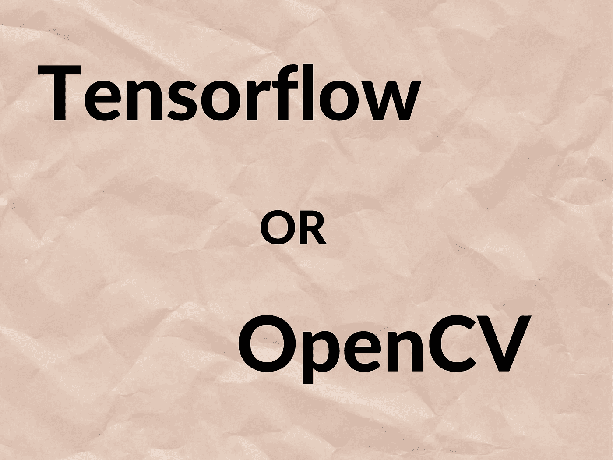

# OpenCV 和 TensorFlow 哪个更适合你的机器学习任务？

> 原文：<https://towardsdatascience.com/which-is-better-for-your-machine-learning-task-opencv-or-tensorflow-ed16403c5799?source=collection_archive---------4----------------------->

## 其中一个真的比另一个好吗？一位同时使用这两种框架的 ML 工程师的解释。

由作者制作

# 背景

我每天上网寻找机器学习和计算机视觉的内容。我喜欢了解 ML 领域的最新动态，因为这是一个几乎每天都能给你带来惊喜的领域！

我遇到过几次的一个问题是:

> OpenCV 和 Tensorflow 哪个好？

对一些人来说，这不是一个合理的问题。

对其他人来说，这是一个值得思考的问题。

最简单的回答就是 Tensorflow 比 OpenCV 好，OpenCV 比 Tensorflow 好！

希望没有让你困惑！如果我知道，请继续读下去！

事实是，这些框架中的每一个都注定要用于机器学习和计算机视觉的特定领域。所以，直接说一个比一个好，就是没有意义。

但是我们可以说，在某些方面，一个比另一个好，反之亦然。

其实 Tensorflow 是一个机器学习框架，帮助你建立机器学习模型。它更出名的是建立神经网络，这是机器学习中的一种算法和方法，称为深度学习。

因此，Tensorflow 已经发布，以服务于一个主要目的，即建立机器学习模型。在这里，我说机器学习而不仅仅是深度学习，因为已经有一些努力让 Tensorflow 能够训练非深度机器学习模型，如[决策森林](https://www.tensorflow.org/decision_forests)。

另一方面，OpenCV 是一个计算机视觉框架，可以帮助你对图像和视频进行各种处理。自发布以来，它一直是图像处理任务中广泛使用的工具。它使您能够轻松地操作像素，因此如果您愿意，您可以构建自己的图像和视频处理算法。

随着深度学习的兴起，OpenCV 通过引入一个名为**(深度神经网络)的新模块，开始集成更多支持基于深度学习的任务的功能。**

**这个 DNN 模块旨在使其易于集成已经训练过的深度学习模型。这就是为什么你会在 OpenCV 中找到如何整合深度学习模型的例子:图像分类、图像对象检测和图像分割。**

**现在，正如你所看到的，所有这些例子都是专注于计算机视觉任务的深度学习模型。**

**据我所知，没有对语言模型的支持，例如(如 [BERT](https://arxiv.org/abs/1810.04805) )。**

**现在，这两个框架在特定情况下可以有一些相似之处。例如，使用 Tensorflow，您可以操作图像，并为训练您的机器学习模型做准备。**

**OpenCV 也可以用来做一些机器学习的任务。例如，您可以在 OpenCV 中训练 SVM 模型、逻辑回归模型或视觉单词包模型。**

# **何时使用哪个**

****

**来源:pexels.com**

**现在，来看看这两个广泛使用的框架的用例。**

**如果你正在为一些特定的任务和自定义数据集建立一个新的深度学习模型，那么 Tensorflow 应该是你的选择。**

**如果你已经完成了为计算机视觉任务训练深度学习模型，特别是:图像分类，物体检测和图像分割，并且你正在寻找部署你的模型，那么 OpenCV ***可能是一个不错的选择。*****

**Tensorflow 和 OpenCV 都有 C++和 Python APIs。**

**在 Tensorflow 中，机器学习工程师使用 Python API 进行训练，他们使用 C++ API 在 C++应用程序/API/SDK 中部署他们的模型。**

**但是正如我之前提到的，OpenCV ***可能*** 是一个很好甚至更好的部署选择，原因如下。**

**现在很多公司已经用 OpenCV 很久了。这些公司正在开发计算机视觉产品。他们非常习惯于框架，他们不想在他们的产品代码中添加另一个第三方库(另一个依赖)。在这种情况下，他们可能会选择使用 OpenCV 来部署他们的计算机视觉深度学习模型。**

**OpenCV 成为生产部署的更好选择的另一个非常重要的方面是 ***性能*** 。事实上，对于一些深度学习模型来说，在 OpenCV 中运行它们可以比在 Tensorflow 中运行它们快一个数量级(即使使用 Tensorflow 的 C++ API)。**

**对于某些行业来说，这可能是一个关键点。**

**另外，关于这两个框架的 c++ API 的另一件事是 ***文档*** 。OpenCV 的文档比 Tensorflow 的 C++ API 的文档要好得多(即使我们这里只是说 DNN 模块)。**

**使用 OpenCV 而不是 Tensorflow 的最后一点是，使用 OpenCV，您可以用 C++训练 SVM 模型。这意味着在相同的生产代码中，您可以训练一个模型并部署它。**

# **结论**

**总结一下:**

1.  **Tensorflow 在某些用例上优于 OpenCV，OpenCV 在其他一些用例上优于 Tensorflow。**
2.  **Tensorflow 的强项在训练方面。如果您将模型作为 C++应用程序/API/SDK 的一部分进行部署，OpenCV 的优势在于部署方面。**
3.  **这两个框架的主要重叠点发生在计算机视觉任务中。**

****

**作者制作的图像**

**我是一名机器学习工程师，致力于解决具有挑战性的计算机视觉问题。我想帮助你学习应用于计算机视觉问题的机器学习。以下是方法。**

1.  **通过帮助您了解该领域的最新动态。我几乎每天都在 [**、LinkedIn**](https://www.linkedin.com/in/nour-islam-mokhtari-07b521a5/) 和 [**、Twitter**](https://twitter.com/NourIslamMo)****上分享小型博客帖子。**那就跟我去吧！****
2.  ****每周给你一份我的 [**时事通讯**](https://nourislam.ck.page/dc3e8b7e12) 上那些琐碎帖子的摘要。所以订阅吧！****
3.  ****通过在 Medium 上写关于机器学习不同主题的文章。所以跟我来吧！****
4.  ****给你一份免费的机器学习工作清单，帮助你检查你需要学习的所有要点，如果你计划在 ML，特别是在计算机视觉方面的职业生涯。你可以在这里 获得核对表 [**。**](https://www.aifee.co/free-resources)****

****5.最后但同样重要的是，通过与你分享我的 [**免费入门张量流课程**](https://aifee.teachable.com/p/introduction-to-tensorflow-2-for-computer-vision) ，它有超过 ***4 小时*的视频内容**，你可以在那里问我任何问题。****

****此外，如果您有任何问题或者您只是想聊聊 ML，请随时在 LinkedIn 或 Twitter 上联系我！****