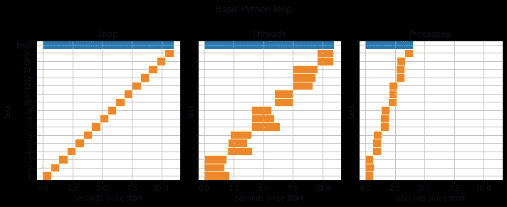
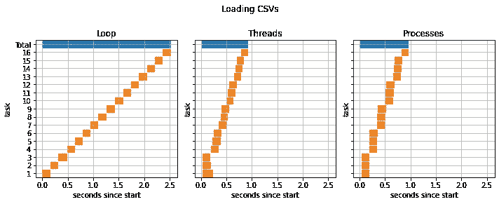
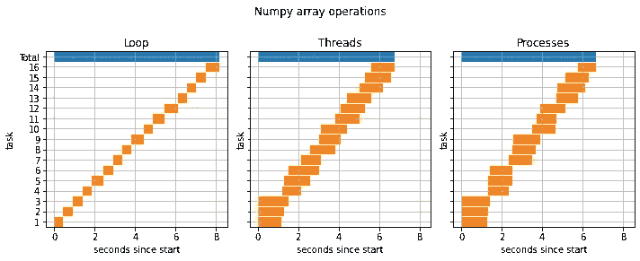
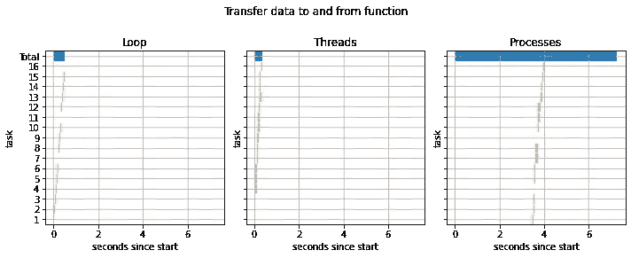

# Python 线程和进程哪个更快？一些有见地的例子

> 原文：<https://towardsdatascience.com/which-is-faster-python-threads-or-processes-some-insightful-examples-26074e90848f?source=collection_archive---------5----------------------->

## [理解大数据](https://towardsdatascience.com/tagged/making-sense-of-big-data)

## 一系列的例子解释了线程和进程的优缺点。用 Dask 代码做你自己的实验。


乔纳森·肯珀在 [Unsplash](https://unsplash.com?utm_source=medium&utm_medium=referral) 上的照片

如果你正在阅读这篇文章，你可能已经在试图找出 Python 中线程和进程之间的区别，以及何时应该使用它们。为了解释一些关键差异，我将展示一些示例函数，并分析使用线程和进程运行它们需要多长时间。重要的是，我将讨论为什么线程和进程在每种情况下有不同的计时。

我将使用 Dask 来运行使用线程和进程的示例函数。关于如何用 Dask 做到这一点的更多细节在文章的底部。现在，我将把重点放在线程和进程的区别上。

# **1。激活 GIL 的功能**

让我们从一个简单的函数开始，只是一个 Python *for-loop* 。它采用一个参数`n`,该参数是循环中重复次数的整数。

```
def basic_python_loop(n):
    """Runs simple native Python loop which is memory light 
    and involves no data input or output."""
    mydict = {}
    for i in range(n):
        mydict[i%10] = i
    return None
```

这个函数只创建一个 10 个条目的字典，所以使用很少的内存，并且对 CPU 的要求不高。你的计算机实际上会花大部分时间解释 Python 代码，而不是运行它。

下图显示了执行功能`basic_python_loop(n=10_000_000)` 16 次所需的时间。相比之下，运行这个函数只需要 0.8 秒。



作者图片

在图中，对该函数的 16 次调用中的每一次调用都被分配了一个任务编号 1-16。橙色阴影条显示了每个函数调用开始和结束的时间。例如，左边面板中的`task 8`开始计算后开始~5 秒，并一直运行到 5.6 秒。顶部的蓝条显示了完成所有 16 个函数调用所需的全部时间。

图中的三个面板使用简单的循环、多线程和并行处理对函数进行计时。

完整的 16 部分计算使用线程花费的时间与使用循环花费的时间相同。有趣的是，使用线程时，每个单独的任务都要花费更长的时间。**这是因为全局解释器锁(GIL)** 。**在 Python 中，一次只有一个线程可以读取代码**。这是 Python 语言的核心特性，但大多数其他编程语言没有这种限制。**这意味着你读到的关于多线程的其他文章可能不适用于 Python。**

> 在 Python 中，线程的工作就像一组厨师共享一本食谱。假设他们要准备 3 道菜(3 个线程)，有 3 个厨师(你电脑上的 3 个内核)。厨师会从食谱中读出一行，然后去完成它。一旦他们完成了这一步，他们就排队阅读下一步。如果食谱中的步骤很短(就像在一个基本的 Python for-loop 中一样)，厨师会很快完成它们，因此会花费大部分时间等待轮到他们阅读食谱。因此，每一份食谱的制作时间都比厨师单独阅读这本书的时间要长。

上面显示的 16 个任务使用 3 个线程运行，这意味着同时处理 3 个函数调用(3 个配方)。由于步骤很简单(就像访问字典一样)，线程花费大部分时间等待读取 Python 代码。因此，尽管我们同时运行 3 个函数调用，但每个调用都要花 3 倍的时间来完成。所以这里使用多线程没有任何好处！

在图中，您可以看到在完成所有 16 个任务时，进程比使用循环或多线程快了大约 3 倍。当使用进程运行时，每个单独的任务花费的时间与使用循环运行时一样长。这是因为每个进程都有自己的 GIL，所以进程不会像线程一样互相锁定。

> 在 Python 中，并行处理就像一个厨师团队，但是每个厨师都有自己的厨房和食谱。

# 2.从 CSV 加载数据

在这个函数中，我们从一个目录中加载一个随机选择的 CSV。目录中的所有 CSV 大小相同。

```
def load_csv():
    """Load, but do not return, a CSV file."""
    # Choose a random CSV from the directory
    file = np.random.choice(glob.glob(f"{temp_dir}/*.csv"))
    df = pd.read_csv(file)
    return None
```



作者图片

线程和进程花费的时间差不多，而且都比使用循环要快。在这个函数中，与前一个不同，线程完成的每个任务与循环完成的任务花费的时间相同。但是为什么线程不会因为 GIL 而变慢呢？

在这个函数中，大部分时间花在运行行`pd.read_csv(file)`上。这个函数使 Python 运行一大块 C 代码来从文件中加载数据。当运行这个 C 代码时，一个线程释放 Python 解释器，以便其他线程可以读取 Python 代码，并且它在完成加载之前不需要再次读取 Python 代码。这意味着线程不会像上一个例子那样互相锁定。他们并不都在努力一次读懂代码。

NumPy、scipy 和 pandas 中的大多数函数都是用 C 语言编写的，因此它们也会导致线程释放 GIL，避免相互锁定。

> 在食谱-烹饪的类比中，这就像食谱中有一个步骤说“揉面团 5 分钟”。这个指令读起来很快，但要花很长时间才能完成。

# 3.使用大量 CPU 的数字函数

下一个函数使用 NumPy 创建一个随机数组，并求它的逆。基本上，这只是一个计算量很大的计算。

```
def numpy_cpu_heavy_function(n):
    """Runs a CPU intensive calculation, but involves 
    no data input or output."""
    x = np.linalg.inv(np.random.normal(0, 1, (n,n)))
    return None
```

这个函数的时序如下所示，使用`n=2000`使得数组的形状为 2000x2000。



作者图片

奇怪的是，无论是使用线程还是进程，我们都没有获得很大的加速。但是为什么呢？在前面的例子中，我们获得了 3 倍的加速，因为所用的计算机有 3 个内核。这是因为 **NumPy 本身使用多线程，使用多核。**这意味着当你试图使用线程或进程并行运行这些 NumPy 函数时，你会受到计算能力的限制。每个内核都试图招募额外的内核来运行其 NumPy 计算。因此，一旦所有内核都以 100%的速度运行，就没有办法从它们那里获得更多的计算能力。

# 4.具有大量输入或输出的功能

到目前为止，我们使用的函数要么没有输入参数，要么输入参数只是一个整数。当我们有大量的输入或输出时，进程和线程之间的一个关键区别就显现出来了。

```
def transfer_data(x):
    """Transfer data into and out of a function."""
    return x*2
```

在上面的函数中，我们将传入一个数组`x`，并返回一个 doubled 数组。在下面显示的结果中`x`是一个 10，000x1000 大小的数组，内存为 80 MB。



作者图片

在这种情况下，线程完成任务用了 0.36 秒，循环用了 0.51 秒，但是进程用了 14 倍多的时间。这是因为**进程都有自己独立的内存池**。当我们将数组`x`传递到函数中，并使用进程运行它时，`x`必须从主 Python 会话复制到每个进程中。这花了大约 3.5 秒。一旦复制了数组，进程可以非常快速地将数组翻倍，但是将翻倍的数组复制回主会话又需要 3.5 秒。与此相反，**线程与主 Python 会话**共享相同的内存空间，因此不需要再来回复制数组。

> 在厨师类比中，过程就像三个厨师，每个人都有自己的食谱和自己的厨房。厨房在不同的地方，所以如果我们想让厨师运行一些食谱，我们需要把配料带给他们，然后他们可以烹饪这道菜，我们需要去收集这些菜。有时，使用线程并让它们在同一个厨房烹饪菜肴会更容易，即使这意味着它们必须阅读同一本食谱。

# 线程与进程——简要总结

让我们总结一下:

*   GIL 意味着一次只有一个线程可以读取 Python 代码。这意味着多个线程可能会相互锁定。
*   像在 NumPy、SciPy 和 pandas 函数中一样，使用对 C 代码的外部调用意味着线程在运行这些函数时将释放 GIL。这意味着线程不太需要等待机会来读取代码。
*   每个进程都有自己的内存池。这意味着将大量数据复制进或复制出它们的速度很慢。例如在大型输入数组或数据帧上运行函数时。
*   线程与主 Python 会话共享相同的内存，因此不需要在它们之间来回复制数据。

这些导致了一些加速计算的经验法则。

*   首先，关于数据传输。如果你的函数接收或返回大量数据，使用线程；否则你会浪费太多时间传输数据。然而，问问你自己，你真的需要数据作为参数吗，你能在函数中加载数据吗？如果是这样，那么您仍然可以使用进程。
*   接下来是 Python 循环。如果您的函数必须使用简单的本地 Python 循环，那么使用进程。然而，问问你自己，这些循环可以用 NumPy 数组操作代替吗？如果是这样，您仍然可以使用线程。
*   如果您正在使用计算开销很大的 NumPy/etc 操作，那么您可能不会从使用线程或进程中获得太多好处。

# 使用线程运行函数，使用 Dask 运行进程

在这篇文章中彻底覆盖 Dask 会让它太长，所以相反，我会覆盖必要的部分，并将 [**链接到一个笔记本**](https://gist.github.com/dfulu/14ae9b5aa2633226519956ce6ef04ce6#file-multi-threading-processing-ipynb) ，这样这些情节就可以重现了。

*如果你感兴趣，我在 DataCamp 上还有一个* [***Dask 课程***](https://www.datacamp.com/courses/parallel-programming-with-dask-in-python-073db121-aaeb-43b4-bf31-1912f8b0630d) *在那里我会用互动视频和练习更全面地介绍 Dask。该课程的第一章是免费的，大约需要 30 分钟，涵盖了下面和笔记本中使用的所有 Dask。*

我们可以使用 Dask 来运行使用线程或进程的计算。首先，我们导入 Dask，并使用`dask.delayed`函数创建一个延迟评估结果的列表。

```
import daskn = 10_000_000lazy_results= []
for i in range(16):
    lazy_results.append(dask.delayed(basic_python_loop)(n))
```

请注意，函数`basic_python_loop`实际上还没有运行，因为它是延迟求值的。相反，只存储了运行它的指令。

我们可以使用多线程来运行计算，例如:

```
results = dask.compute(lazy_results, scheduler='threads')
```

或者可以使用多重处理来运行计算，例如:

```
results = dask.compute(lazy_results, scheduler='processes')
```

这些是最简单的方法，但是在本文的实验中，我希望对使用的线程和进程的数量有更多的控制。为此，您可以创建一个客户机，它设置了一个进程和/或线程池，您可以用它来完成计算。

例如，要创建和使用 3 个进程的池，可以使用:

```
process_client = Client(
    processes=True, 
    n_workers=3, 
    threads_per_worker=1
)results = process_client.compute(lazy_results)
```

# 一些类似的故事和进一步的阅读

我从 Brendan Fortuner 几年前的文章中获得了很多灵感。事实上，我在这里所做的很多都是重现他的例子，但我想比他写的原始文章更深入一点。

[](https://medium.com/@bfortuner/python-multithreading-vs-multiprocessing-73072ce5600b) [## Python 中的线程和进程简介

### 并行编程初学者指南

medium.com](https://medium.com/@bfortuner/python-multithreading-vs-multiprocessing-73072ce5600b) 

如果你在代码中大量使用原生 Python 循环，那么你绝对应该使用 [Numba](https://numba.pydata.org/numba-doc/latest/user/5minguide.html) 。它可以将这些循环加速到接近 c 的速度。最好的是，如果你正确使用 Numba([见笔记本](https://gist.github.com/dfulu/14ae9b5aa2633226519956ce6ef04ce6#file-multi-threading-processing-ipynb))你可以设置它，这样你的循环函数就不会锁定 GIL。这意味着你可以使用你的 Numba 循环函数，它已经快得多了，并与多线程并行运行。

[](/speed-up-your-algorithms-part-2-numba-293e554c5cc1) [## 加速您的算法第 2 部分— Numba

### 使用 Numba 获得 C++/Fortran 般的速度

towardsdatascience.com](/speed-up-your-algorithms-part-2-numba-293e554c5cc1) 

最后，我们在本文中得出的使用线程和进程的经验法则与这里描述的 Dask 最佳实践非常相似。