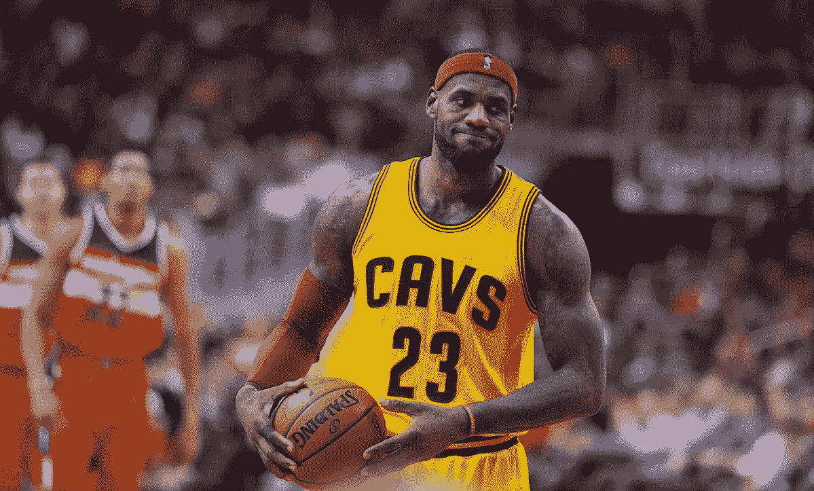
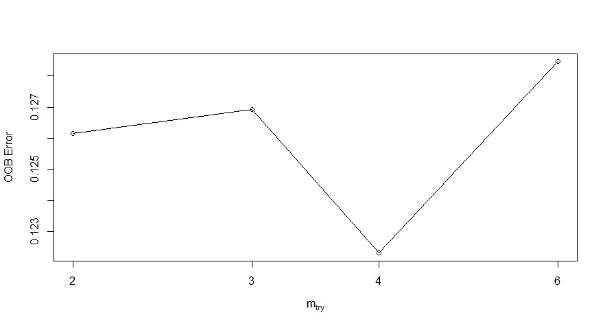
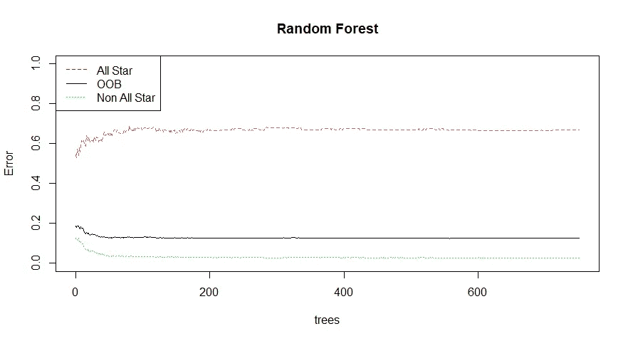
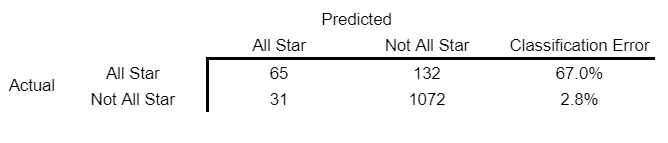
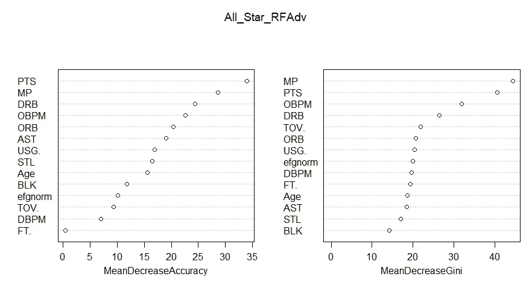
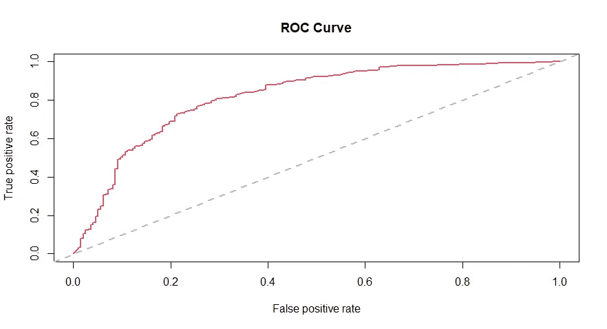
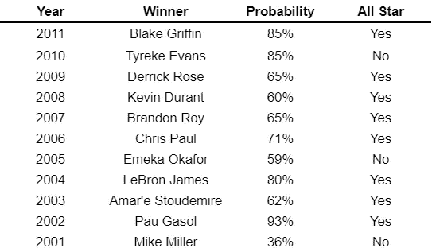
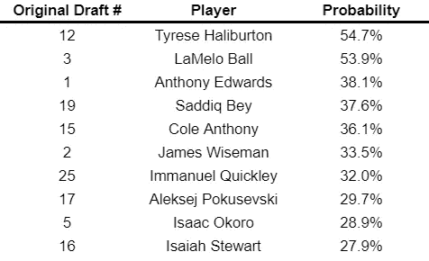

# 哪些 NBA 新秀会成为全明星？

> 原文：<https://towardsdatascience.com/which-nba-rookies-will-become-all-stars-1cdeb198afab?source=collection_archive---------26----------------------->

## 使用随机森林模型来预测哪些新秀有一天会进入全明星队

图片由[基思·艾利森](https://www.flickr.com/people/27003603@N00)在[维基共享资源](https://commons.wikimedia.org/wiki/File:LeBron_James_(15823062226).jpg)上提供

在 2010/11 NBA 赛季中，有两名球员打出了同样稳定但不起眼的新秀赛季。埃文·特纳，2010 年 NBA 选秀的第二顺位球员，在每场 23 分钟的比赛中得到 7.2 分。与此同时，在同一选秀中第 10 顺位的保罗·乔治，每场比赛 21 分钟，得到 7.8 分。然而，从那时起，他们的职业生涯走上了截然不同的道路。保罗·乔治参加了 7 场(还在继续)全明星赛，同时成为 NBA 最危险的双向球员之一。虽然特纳在 NBA 又打了 9 年，但他大部分时间都是作为一名平庸的替补球员度过的。

我打算回答的问题很简单:我能建立一个统计模型，把这两个球员和他们的新秀赛季区分开来吗？

## 数据和代码

数据取自[篮球参考](https://www.basketball-reference.com/)。从“三分时代”(1979/80 赛季起)开始，我总共训练了 1300 个新秀赛季的模型。赛季至少有 30 场比赛，每场比赛 7 分钟。我使用的最后一个新秀赛季是 2010/11 赛季，因为从那时起出道的新秀可能仍然有机会成为全明星，如果他们还没有成为全明星的话。在这 1300 名球员中，有 197 人最终在职业生涯中至少入选了一支全明星队。

数据和代码可在 [my GitHub](https://github.com/braydengerrard/AllStarRF) 上获得。我使用 [randomForest](https://cran.r-project.org/web/packages/randomForest/randomForest.pdf) 和 [ROCR](https://cran.r-project.org/web/packages/ROCR/ROCR.pdf) 软件包在 R 中执行所有分析。

## 模型

我将使用随机森林分类器。随机森林是一种灵活的学习方法，它使用许多决策树来对观察值进行分类。每个决策树包含随机选择的 mₜᵣᵧ预测特征。决策树的模式结论成为模型的分类。

总的来说，该模型被训练有 13 个特征:

*   每场比赛的时间
*   每场比赛得分
*   场均进攻篮板
*   场均防守篮板
*   每场比赛的块数
*   每场抢断
*   场均助攻数
*   有效投篮命中率(根据相应赛季的平均水平进行标准化)
*   罚球命中率
*   年龄
*   进攻方加减(OBPM)
*   防守方加减(DBPM)
*   使用率
*   周转率

## 拟合和调整模型

在最初用 750 个决策树拟合模型之后，可以对其进行一些调整以提高模型性能。我要优化的超参数是 mₜᵣᵧ，即每棵树的特征数量。我将 mₜᵣᵧ设置为最小化袋外(OOB)误差。正如你在下面看到的，4 是我的数据的神奇数字。

既然模型适合 mₜᵣᵧ=4，让我们来看看结果。

该模型的 OOB 估计误差率为 12.54%。简而言之，我预计这个模型有 12.54%的时间猜错。

我们还可以查看随着树数量的增加，误差如何变化:

起初，增加树的数量减少了 OOB 误差。然而，它很快稳定在略高于 12%的水平。750 棵树足以最大限度地发挥这种模式的潜力。

该混淆矩阵显示了该模型如何根据真实结果对玩家进行分类:

毫不奇怪，这个模型的猜测有相当大的误差。在真实世界的全明星中，模型有三分之二的时间会错过他们。

下面的图表显示了每个特征对于分类的重要性。左边的图表显示，如果删除任何一个特征，精度就会下降。右边的图表显示了基尼系数(衡量节点杂质的指标)的下降。在这两个图表中，顶部的特征最重要，而底部的特征最不重要。

最重要的指标是每场比赛的上场时间和得分。防守篮板(DRB)比我想象的要重要得多。令人惊讶的是，有效投篮命中率和罚球命中率都可以从模型中移除，而精确度几乎没有损失。由于这两个变量高度相关，因此任何一个变量的损失对模型的影响都很小。然而，这两个特征的损失使得模型的准确性大大降低。

由于 OBPM 在两个排行榜上都高于 DBPM，这似乎也证实了在全明星赛中进攻比防守更重要。然而，框加减度量可以是对性能的粗略度量。虽然得分等统计数据也可以衡量进攻，但防守价值更难以量化。最近的高级统计在使用更高级的追踪来测量防御方面取得了很大的进步，但是这些统计在这里没有足够大的样本可用。最终，很难说防守是否对全明星赛没有什么影响，或者我们只是没有很好地衡量防守。

评估该模型的一种方法是使用下图所示的受试者工作特征(ROC)曲线。该图显示了在不同的辨别阈值下假阳性率如何变化。在默认函数下(在此模型中使用)，阈值为 0.5。虽然这是可以修改的，但我对默认设置很满意。

ROC 曲线下的面积(AUC)可用于查看模型的有用程度。AUC 可以在 0.5 和 1 之间。AUC 为 0.5(曲线遵循上面的灰色虚线)表示该模型根本无法区分所有恒星和非所有恒星。AUC 为 1 表示模型可以完全区分。该模型的 AUC 为 0.818，这是令人尊敬的。

改进模型的一个选择是加入来自高级玩家跟踪技术的统计数据。然而，由于该数据仅从 2013/14 赛季开始收集，因此这还不是训练模型的现实选择。

另一个考虑可以是增加一个特征来说明他们球队的实力，因为与弱的重建队相比，好的前景可能在竞争的球队中发挥得更少。

## 有趣的数据点

在这篇文章的开始，我想知道一个模型是否能区分埃文·特纳和保罗·乔治的新秀赛季。最终，该模型认为保罗·乔治有 33%的机会成为全明星，埃文·特纳有 7.5%的机会成为全明星。虽然它仍然将两人归类为非全明星球员，但我很满意它能够确定两人是有意义的不同。

在训练样本的球员中，模型给了蒂姆·邓肯最高的赔率——超过 96%的机会成为全明星。这并不奇怪；邓肯在新秀赛季是全明星。这个模型也给了沙奎尔·奥尼尔(94.3%)和加索尔(93.3%)很高的赔率。

最大的假阳性是克拉克·凯洛格，该模型给出了几乎 90%的机会成为全明星。凯洛格在新秀赛季场均得分超过 20 分，但膝伤很快阻碍了他。他的职业生涯在仅仅五个赛季后就结束了，而且他从未超过他新秀赛季的平均得分。在光谱的另一端，该模型给贾森·威廉姆斯和里基·皮尔斯 0%的赔率，但这两名球员继续出现在一个单一的全明星赛。

最后，下面是这个模型如何处理几个年度最佳新人的:

## 对 2020 年选秀班的预测

最后，我们可以使用模型对未来进行一些预测。如果这个模型负责重新起草 2020 年的职业，它会这样做(排除一些小样本玩家):

虽然该模型没有发现任何全垒打的前景，但它准确地预测了两名全明星球员(泰瑞斯·哈利伯顿和拉梅洛·鲍尔)将从这一组中产生。混乱矩阵的结果表明，很可能还有其他人潜伏在狼群中。

## 结论

评估前景是篮球运动中最困难的任务之一。那么你能根据新秀赛季预测所有的球星吗？答案是有些。虽然新秀赛季可以给我们一个体面的想法，职业生涯仍然可以采取一些非常不可能的路径。很可能有更多的优秀球员(甚至是全明星球员)潜伏在这个平庸的新秀池中，这个模型还无法区分。

更好的数据可能会有所帮助。2013/14 赛季开始使用的球员跟踪技术为我们提供了比以往任何时候都更详细的 NBA 球员数据。这有可能使我们做出比以前更准确的预测。然而，我们还没有足够大的样本来充分利用这些数据。