# 哪些 NBA 球队最擅长选秀？

> 原文：<https://towardsdatascience.com/which-nba-teams-are-best-at-drafting-20070ccd1702?source=collection_archive---------6----------------------->

## 一项数据驱动的分析对每个 NBA 球队的选秀成功进行了排名

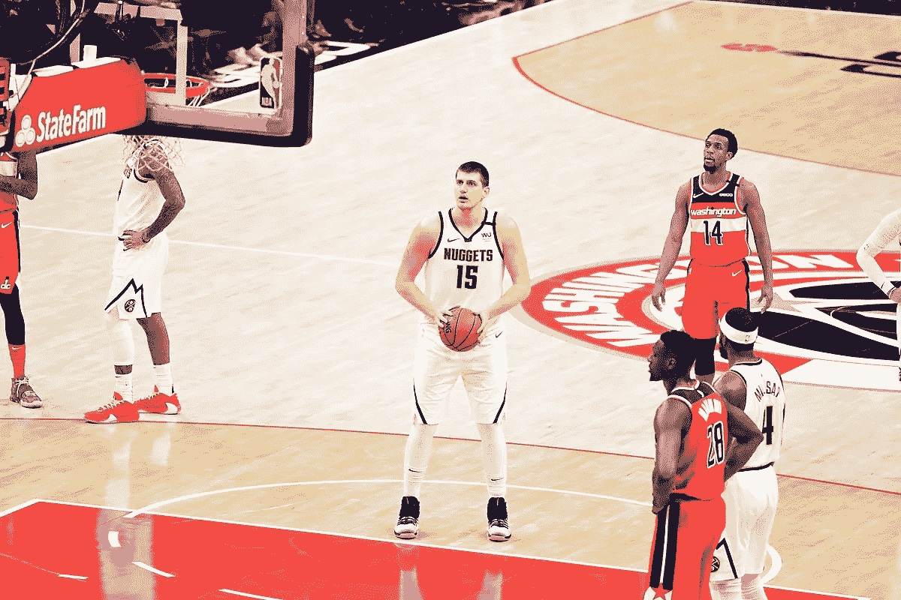

图片来自[维基共享资源](https://commons.wikimedia.org/wiki/File:Nikola_Jokic_free_throw.jpg)上的[全职业卷轴](https://www.flickr.com/photos/joeglo/)

*注:这里有一个* [*新仪表板*](https://braydengerrard.shinyapps.io/Draft_Scores/) *可以查看数据。这篇文章在 2022 年 6 月 14 日更新了新的数据和数字，以及方法的改进。*

选秀是一个成功的 NBA 球队最困难也是最关键的因素之一。从 1998 年到 2019 年，圣安东尼奥马刺队创纪录地连续 22 次季后赛出场，并在此过程中赢得了五个冠军。这种不可思议的运行是由一系列强有力的选秀权推动的，其中许多是在彩票之外。

在光谱的另一端，萨克拉门托国王队现在已经连续 16 个赛季错过了季后赛——这是 NBA 的记录。不出所料，这个分析显示了国王队一贯糟糕的选秀记录。

在这个分析中，我创建了一个衡量标准，通过将他们与之后选中的球员进行比较来对每个选中的球员进行评分(完整的方法在文章结尾提供)。每个球员的分数不仅取决于他们自己的表现，还取决于球队放弃了什么来选择他们。在对过去 12 次 NBA 选秀(从 2009 年到 2020 年)进行分析后，持续选秀的球队与不选秀的球队之间出现了明显的差异。

## 结果

在被分析的 849 名球员中，尼古拉·约基奇脱颖而出。在被选中之前，乔基奇已经被传了四十多次，在他的前七年里，他已经连续获得了 MVP。另一方面，马文·巴格利的排名比所有其他选秀状元都要差。

总的来说，选秀分数以零为中心——这是一个相当典型的既不差也不好的选秀分数。这些选秀权中有许多是第二轮选秀权，期望值低，相应的价值也低。

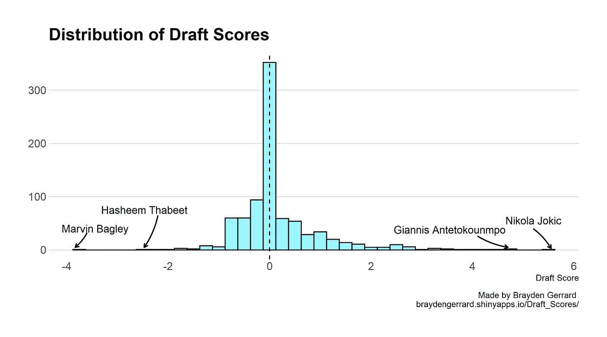

五大选秀状元:

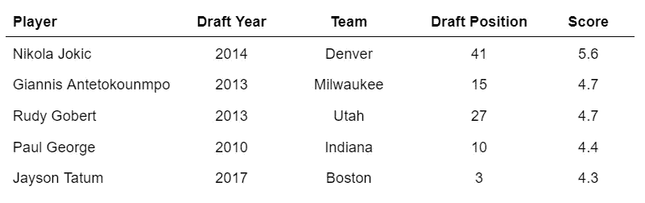

正如所料，顶级选秀是中后期选择的一些顶级球员。同样值得注意的是弗雷德·范弗利特(多伦多猛龙)，得分 3.7，第 7 高，排名第一的未选秀球员。

另一方面，底部的五个选择主要是没有成功的高选择。

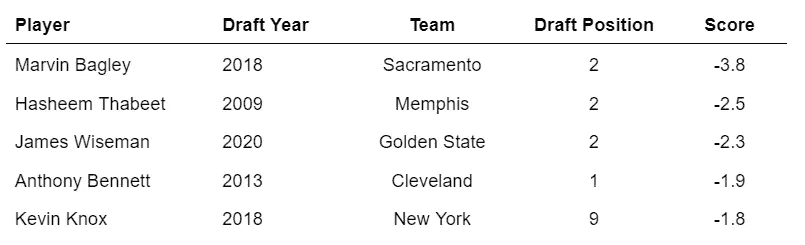

当巴格利还年轻的时候，萨克拉门托放弃了卢卡·东契奇、小贾伦·杰克逊和特雷·杨。选择巴格利的巨大机会成本是他得分低的原因。

詹姆斯·怀斯曼是一个异数——他的 NBA 生涯才开始两年，他就因伤错过了整个第二个赛季。他的排名很低，主要是因为勇士队没有选中拉梅洛·鲍尔(在他的第二个赛季已经是全明星了)。虽然怀斯曼有足够的时间来恢复他的选秀分数，但他的选择已经被设定得很高了。

多伦多猛龙队仍然是 NBA 中遥遥领先的最佳选秀球队，而萨克拉门托国王队和克利夫兰骑士队则排名垫底。

不出所料，圣安东尼奥马刺队排名第二，其他一些长期竞争者也接近榜首。

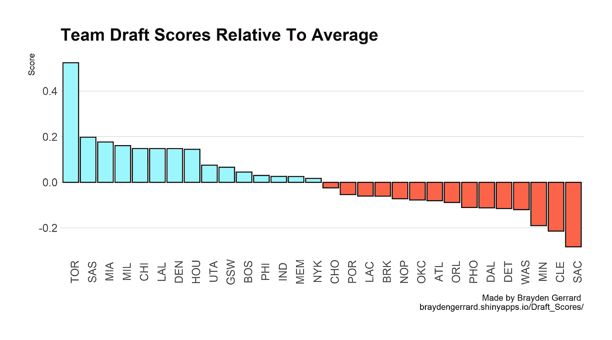

如果排除未选秀的球员，多伦多仍然是第一，尽管差距较小。

在活跃的总经理中，孟菲斯灰熊队的扎克克雷曼拥有迄今为止最好的选秀记录(尽管迄今为止只有 6 个选秀权)。在样本量较大的人当中，马赛乌吉里(多伦多猛龙)高居榜首。

大多数至少有 5 个选秀权的活跃高管在起草方面至少比平均水平好一点。这可能是因为不擅长起草的高管被解雇了，而更擅长起草的高管却被保留了下来。

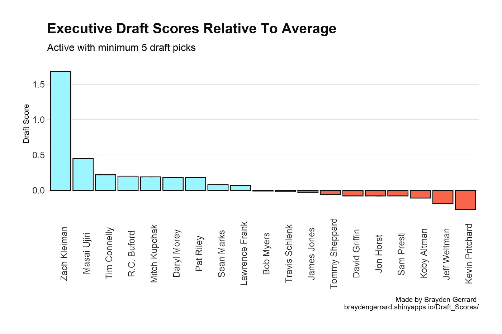

包括至少有五个选秀权的非活跃高管，拉里·伯德(印第安纳步行者队)排在克雷曼和乌吉里之后，弗拉德·迪瓦茨和克里斯·格兰特垫底。

## 方法学

[这里有一个完整的仪表盘](https://braydengerrard.shinyapps.io/Draft_Scores/)，你可以自己查看和探索完整的数据集(按团队、球员或负责起草的高管)。

**总结**

该指标的目标是衡量团队和高管识别人才的能力。

这种方法背后的中心思想相对简单:为了评估选秀选择，球员应该与可供选择的球员进行比较。如果有更好的球员，那么选秀会被认为是糟糕的。如果更好的球员*没有*可用——或者被选得太早以至于在那个选秀位置没有被现实地考虑——那么选秀选择是一个好的选择。

在那个位置被选中的球员通常表现如何并不重要——事实上，你会发现这种方法有时会将被认为令人失望的球员评为体面的选秀权，因为接下来被选中的球员甚至更差。例如，安德鲁·威金斯实际上得到了一个正的选秀分数，因为克里夫兰避免了选贾巴里·帕克(第二顺位)，他比克里夫兰差得多。

因此，每个被选中的球员的表现都要与之后被选中的球员的加权平均值进行比较。距离较近的球员比距离较远的球员被赋予更高的权重，因为他们更有可能被认为是那个位置的替代者。

彩票选择(#1 到#14)也根据选择的“明显”程度而打折扣。如果一名球员是一致同意的第一选择，那么这个选择既不好也不坏，因为任何球队都会做出同样的选择。

**球员包括**

所有被选中的球员(从第 1 名到第 60 名)都包括在内。未选秀的球员也包括在内，如果他们在符合条件的一年后的第一个赛季就进入了花名册。如果它们是后来签署的，则不包括在内。

一旦两个完整的季节过去，就会增加新的征兵年份。

**团队归属**

一些调整是围绕哪些球队的选秀权来进行的。虽然一名球员被正式列在了他们被选中的球队名下，但如果他们在选秀之夜或下一个赛季开始前的任何时候被交易，我会把选秀权归于他们被交易到的球队。此后的任何交易都不会影响归属。

未选秀的球员归属于他们签约的第一支球队。

**衡量玩家表现**

虽然该模型的最后一次迭代使用获胜份额来衡量球员的表现，但现在使用 BBall Index 中的 [LEBRON Wins Added (WA)指标来衡量球员的表现。这个指标比传统的高级统计数据更全面，应该能更准确地捕捉 NBA 球员的价值。然而，这一指标只适用于 2009 赛季至今，限制了对 2009 年选秀的分析。](https://www.bball-index.com/lebron-database/)

任何低于零的 WA 值都将被替换为零。一个打得很差的球员不应该被认为比一个从来不打比赛的球员更差。

**用于比较的加权平均值**

为了形成权重，我使用了布朗简单指数平滑模型的稍微修改版本:

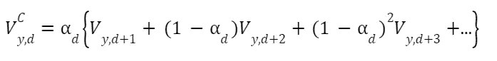

其中 *V* 代表 *y* 年 *d* 拔模位置的反事实( *C* )值( *V* )。α代表在 *d* 的平滑因子，它必须在零和一之间。一个高的 alpha 值会将更多的重量分配给靠得更近的玩家，而一个低的 alpha 值会将重量更平均地分配给许多玩家。alpha 乘以玩家在 *y* 年 *d* + 1(紧接其后)拍摄的实际值( *V* )。

但是，alpha 在任何一年内的草稿选择中并不一致(尽管它在不同年份的同一草稿位置中是一致的)。在选秀中，通常只有很少一部分球员可以被选中。在以后的选秀位置上，有大量的球员可以考虑。通过比较实际的选秀位置和 ESPN 对最佳选秀前景的排名可以很容易地看出这一点。在早期选秀位置中，ESPN 排名与实际选秀位置非常接近。到了第二轮，两者之间往往会有巨大的差异。

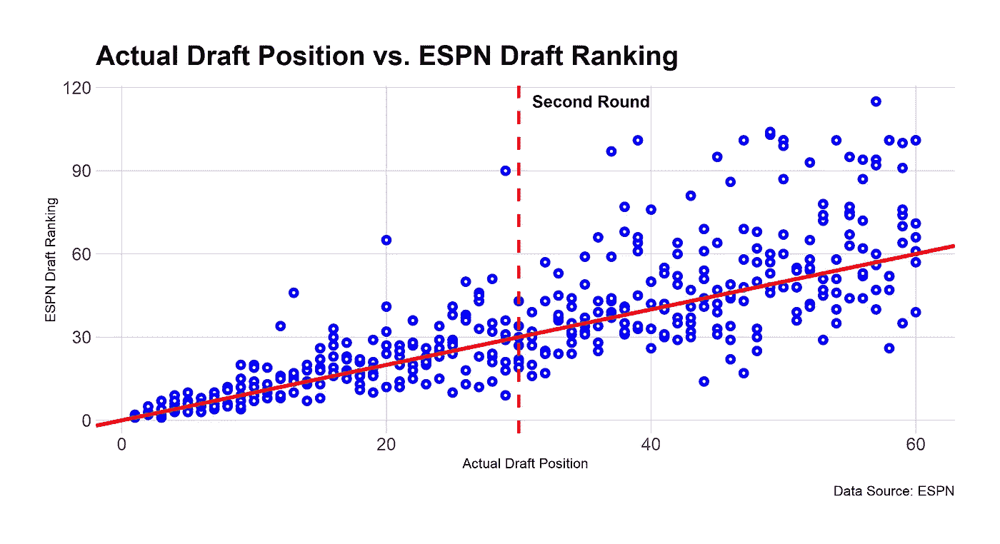

在统计学中，这种现象被称为异方差，当可变性在值的范围内变化时，就会出现异方差。在这种情况下，在较后的拔模位置可变性增加。

因此，每个拔模位置都有一个唯一的平滑因子。首先，我确定了同一名球员在 2014 年至 2020 年期间每次选秀的实际选秀位置和 ESPN 最佳球员排名之间的绝对差异。在极少数情况下，没有被 ESPN 排名的球员被选中，他们的排名被记录为 101。然后，我找到了每个草稿位置的平均值，并将其回归到实际草稿位置，如下所示:

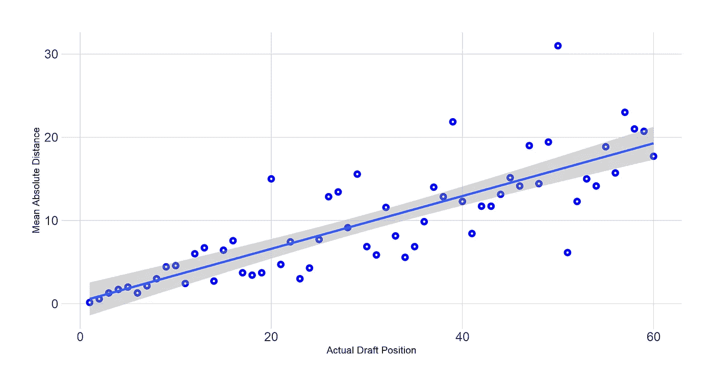

β系数为 0.317，然后将其输入以下等式，以确定每个吃水位置的α:

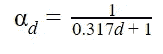

这样产生的阿尔法值在以后的选秀位置会下降。与之前的分析版本相比，这种方法为第一轮选秀权提供了相当高的 alpha，但为第二轮选秀权提供了相当低的 alpha。最终的结果是，顶尖选秀权的得分严重依赖于直接被选中的球员的表现，而后面的选秀权的得分则更加平均地与许多球员进行比较。

**计算原始选秀分数**

alpha 用于计算每个玩家的反事实表现。通过从反事实值中减去实际值，确定每个玩家的净等级。

净评级可以被视为草案选择相对于可能的可用备选方案产生的“超额价值”。虽然该值可以与一年内的其他草案选择进行比较，但不能在年份之间进行比较，因为较旧的草案年份有更多的时间来累积 WA。

为了使选秀分数可以跨选秀年份进行比较，我使用 z 评分法，将每年每个球员的净评分除以该年内净评分的标准偏差来计算原始选秀分数(RDS):

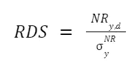

**概率得分**

最后，彩票选秀权会根据选择的明显程度而“打折扣”。例如，一个一致的第一次整体选秀权(普遍同意该球员应该先去)会被打折扣接近 100%——这意味着无论该球员表现如何，选秀分数都接近于零。不太确定的选秀权(可能有多名球员被选中)会因为积极或消极的结果而受到表扬。

对于分析的这一部分，我欠 [Chris Feller](https://twitter.com/chrisfellertwtr) 一份感激之情，因为他在这里创造了他的[原创分析，这是我的灵感来源，也因为他花时间和我谈论这个项目。](https://github.com/chrisfeller/NBA_Draft_Survival_Analysis)

为了估计一个球员在选秀中被选中的概率，我收集了一些专家和作家的选秀板和模拟草稿。

使用 R 中的 [PlackettLuce 包，模拟选秀选择符合 Plackett-Luce 排名模型。然后，生成的模型用于为每个草稿创建 10，000 个模拟。](https://cran.rstudio.com/web/packages/PlackettLuce/vignettes/Overview.html)

使用模拟，Kaplan-Meier 估计值(一种生存分析的常用方法)用于计算每个彩票选择在他们的实际位置被选中的概率(P ),条件是他们在该点之前没有被选中。

然后，通过条件概率(P)对 RDS 进行贴现，计算出最终草案得分(FDS):

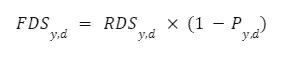

由于数据限制，这一过程仅针对彩票选择(前 14 名)完成，尽管无论如何对以后的选择影响不大。

所有个人草案分数的平均值构成了每个团队和高管的草案分数。

**针对高管的贝叶斯估计**

每个团队的高管都来自[篮球参考](https://www.basketball-reference.com/executives/)。虽然样本量对于团队来说相对较大，但对于高管个人来说通常很小。所以除了正常的选秀分数，我还计算了每位高管的贝叶斯估计。贝叶斯估计将每个分数向平均草案分数收缩。随着每位高管的选秀权数量的增加，他们的贝叶斯估计越来越接近他们的实际选秀得分。当您感兴趣的高管的样本量非常小时，这种估计非常有用。

贝叶斯估计的计算方法如下:

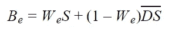

每位高管(e)的贝叶斯选秀得分(B)的计算方法是，将每位高管的缩水权重(W)乘以他们的正常选秀得分(S ),并将其与所有选秀的平均选秀得分(DS)相加，再乘以 1 减去权重。

每位高管的权重计算如下:

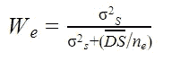

其中，高管选秀得分的方差(在那些至少有八个选择的人中)除以方差加(所有选秀得分的平均值除以该高管的选秀次数)。

(我还要感谢我的女朋友玛丽娜，帮我收集和输入草稿板。这是一个耗时的过程，在她的帮助下变得容易了。)