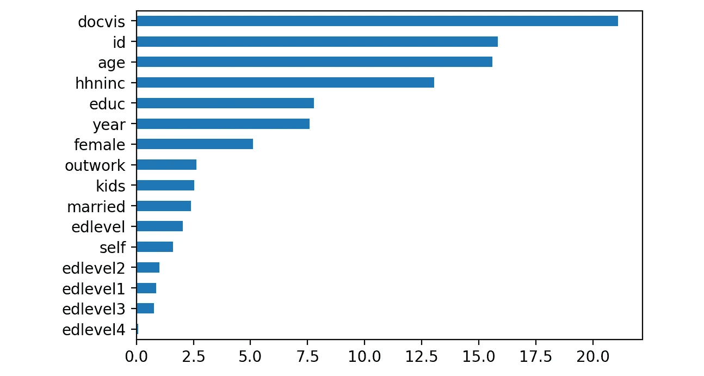
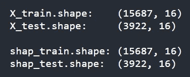
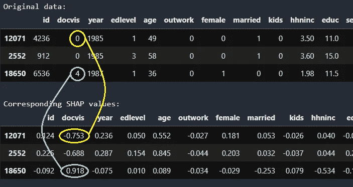
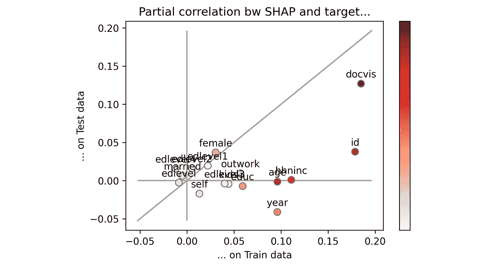
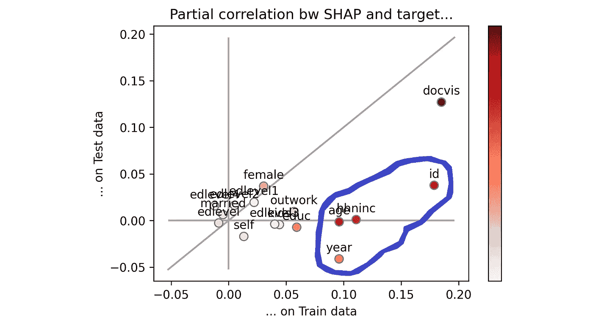
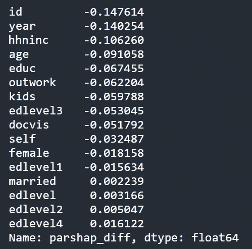
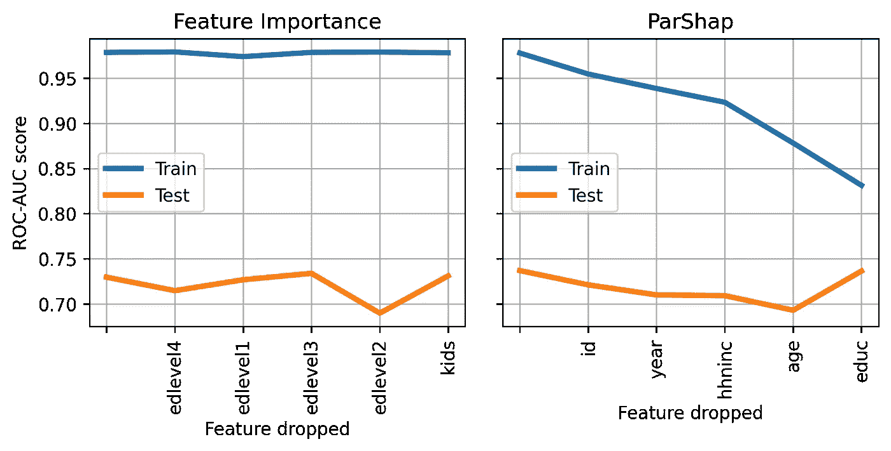

# 你的哪些特征是过度拟合的？

> 原文：<https://towardsdatascience.com/which-of-your-features-are-overfitting-c46d0762e769?source=collection_archive---------7----------------------->

## [提示和技巧](https://towardsdatascience.com/tagged/tips-and-tricks)

## 发现“ParShap”:一种高级方法，用于检测哪些列使您的模型在新数据上表现不佳


[图片由作者提供]

W 机器学习中最重要的是对新数据做出正确的预测。

当训练数据上的预测很好，但测试数据上的预测很差时，就说模型“**过拟合**”。这意味着该模型从训练数据中学习了太多的噪声模式，因此它无法很好地推广到它以前没有见过的数据。

过度拟合该怪谁？换句话说，

> **哪些特性(数据集的列)会妨碍模型对新数据进行良好的概括**？

在本文中，借助真实世界的数据集，我们将看到一种高级方法来回答这个问题。

# **功能重要性这次救不了你了！**

如果你对上述问题的回答是“我会考虑特性的重要性”，那就再努力一点。

> 要素重要性并没有说明要素在新数据上的表现。

事实上，它只是模型在训练阶段所学内容的代理。如果模型已经学习了许多关于特征“年龄”的模式，那么该特征将在特征重要性中排名较高。这并没有说明**这些模式是否正确**(所谓“正确”，我指的是一种足够通用的模式，对新数据也适用)。

因此，我们需要一种不同的方法来解决这个问题。

# “曾经有一家德国医院…”

为了解释这种方法，我将使用一个包含从 1984 年到 1988 年德国健康注册记录的数据集(该数据集可以从库 [Pydataset](https://github.com/iamaziz/PyDataset) 访问，使用 [MIT 许可证](https://github.com/iamaziz/PyDataset/blob/master/LICENSE.txt))。

下载数据非常简单:

```
import pydatasetX = pydataset.data('rwm5yr')
y = (X['hospvis'] > 1).astype(int)
X = X.drop('hospvis', axis = 1)
```

该数据集由 19，609 行组成，其中每行包含给定年份的某个患者的一些信息。请注意，对患者的观察跨越不同的年份，因此同一患者可能出现在数据帧的不同行中。

目标变量是:

*   ` **hospvis** `:患者在相应年度内住院时间是否超过 1 天。

我们处理了 16 列:

1.  ` **id** `:患者 ID(1-7028)；
2.  ` **docvis** `:一年中看医生的次数(0-121)；
3.  `**年**`:年(1984-1988)；
4.  ` **edlevel** `:教育程度(1-4)；
5.  `**年龄**`:年龄(25-64)；
6.  ` **outwork** `: 1 如果失业，0 否则；
7.  `**女** `: 1 如果女，0 否则；
8.  `**已婚** `: 1 如果已婚，0 否则；
9.  ` **kids** `: 1 如果有孩子，0 否则；
10.  ` **hhninc** `:家庭年收入，单位为马克(马克)；
11.  ` **educ** `:正规教育年限(7-18 年)；
12.  `**自营** `: 1 如果自营，0 否则；
13.  ` **edlevel1** `: 1 如果不到高中毕业，否则为 0；
14.  ` **edlevel2** `: 1 如果高中毕业，0 否则；
15.  ` **edlevel3** `: 1 如果大学/学院，0 否则；
16.  edlevel4 `: 1 如果读研，0 其他。

让我们将数据分为训练集和测试集。有更复杂的方法可以做到这一点，如交叉验证，但让我们保持简单。由于这是一个实验，我们将(天真地)把所有的列当作数字特征。

```
from sklearn.model_selection import train_test_split
from catboost import CatBoostClassifierX_train, X_test, y_train, y_test = train_test_split(
  X, y, test_size = .2, stratify = y)cat = CatBoostClassifier(silent = True).fit(X_train, y_train)
```

一旦模型被训练，让我们看看特征重要性:

```
import pandas as pdfimpo = pd.Series(cat.feature_importances_, index = X_train.columns)
```



训练模型的特征重要性。[图片由作者提供]

不足为奇的是,“docvis”——看医生的次数——对于预测患者是否住院超过 1 天非常重要。“年龄”和“收入”也有些明显。但是病人的 id 在重要性上排名第二的事实应该让我们怀疑，特别是因为我们已经把它当作一个数字特征。

现在，让我们在训练集和测试集上计算模型性能(ROC 下的面积)。

```
from sklearn.metrics import roc_auc_scoreroc_train = roc_auc_score(y_train, cat.predict_proba(X_train)[:, 1])
roc_test = roc_auc_score(y_test, cat.predict_proba(X_test)[:, 1])
```


在训练集和测试集上模拟性能。[图片由作者提供]

差别太大了！**这是严重过度拟合的迹象**。但是哪些特征对此“负责”呢？

# 听说过 SHAP 价值观吗？

我们有许多指标来衡量一个**模型**在一些数据上的表现。但是我们如何衡量一个**特性**在一些数据上的表现呢？

做到这一点的最有力的工具叫做“SHAP 价值观”。

一般来说，要高效地计算任何预测模型的 SHAP 值，可以使用[专用的 Python 库](https://github.com/slundberg/shap)。然而，在本例中，我们将利用 Catboost 的本机方法:

```
from catboost import Poolshap_train = pd.DataFrame(
  data = cat.get_feature_importance(
    data = Pool(X_train), 
    type = 'ShapValues')[:, :-1], 
  index = X_train.index, 
  columns = X_train.columns
)shap_test = pd.DataFrame(
  data = cat.get_feature_importance(
    data = Pool(X_test), 
    type = 'ShapValues')[:, :-1], 
  index = X_test.index, 
  columns = X_test.columns
)
```

如果你看一下`shap_train`和`shap_test`，你会注意到它们是各自数据集的相同形状。



数据帧的形状。[图片由作者提供]

如果你想更多地了解 SHAP 价值观及其运作方式，你可以从这里的和这里的开始。但是——为了我们的目的——你需要知道的是，SHAP 值让你了解每个单一特征对模型在一次或多次观察中做出的最终预测的**影响。**

让我们看几个例子:



原始数据与相应的 SHAP 值。[图片由作者提供]

第 12071 排的患者已 0 次就诊。相应的 SHAP 值(-0.753)告诉我们，这条信息将他住院超过 1 天的概率(实际上是对数优势)降低了-0.753。相反，排 18650 的患者已经去看过 4 次医生，这将她住院超过 1 天的对数比提高了 0.918。

# 会见 ParShap

直观地说，数据集上要素性能的一个很好的代理是要素的 SHAP 值和目标变量之间的**相关性。事实上，如果模型在一个特征上发现了好的模式，那么该特征的 SHAP 值必须与目标变量高度正相关。**

例如，如果我们希望计算特征“docvis”和测试集中包含的观测值上的目标变量之间的相关性:

```
np.corrcoef(shap_test['docvis'], y_test)
```

但是，SHAP 值是相加的，这意味着最终预测是所有要素形状的总和。因此，如果我们在计算相关性之前**去除其他特征*的影响，这将更有意义。这正是“ [**偏相关**](https://en.wikipedia.org/wiki/Partial_correlation) ”的定义。Python 库 [Pingouin](https://pingouin-stats.org/) 中包含了部分相关的一个方便实现:***

```
import pingouinpingouin.partial_corr(
  data = pd.concat([shap_test, y_test], axis = 1).astype(float), 
  x = 'docvis', 
  y = y_test.name,
  x_covar = [feature for feature in shap_test.columns if feature != 'docvis'] 
)
```

这段代码意味着“在去除所有其他特征的影响之后，计算特征‘doc vis’的 SHAP 值和测试集的观测值上的目标变量之间的相关性”。

既然每个人都需要一个名字，我就把这个公式叫做**【ParShap】**(来自“Shap 值的偏相关”)。

我们可以在训练集和测试集上对每个特征重复这个过程:

```
parshap_train = partial_correlation(shap_train, y_train)
parshap_test = partial_correlation(shap_test, y_test)
```

> 注意:你可以在本文末尾找到函数`partial_correlation`的定义。

现在，让我们在 x 轴*上绘制`parshap_train`，在 y 轴*上绘制`parshap_test`。

```
plt.scatter(parshap_train, parshap_test)
```



在训练集和测试集上，SHAP 值和目标变量之间的部分相关。注意:颜色条代表特征的重要性。[图片由作者提供]

**如果一个特征位于等分线上，这意味着它在训练集和测试集上的表现完全相同**。这是最理想的情况，既不过度配合也不欠配合。相反，如果一个特征位于等分线以下，这意味着它在测试集上的表现比在训练集上的表现差。这是过度拟合区域。

从视觉上看，哪些特性表现不佳是显而易见的:我用蓝色圈出了它们。



蓝色圆圈中的要素最容易过度拟合当前模型。[图片由作者提供]

因此，`parshap_test`和`parshap_train`之间的算术差(等于每个特征和平分线之间的垂直距离)为我们的模型提供了特征过度拟合程度的度量。

```
parshap_diff = parshap_test — parshap_train
```



parshap_test 和 parshap_train 之间的算术差异。[图片由作者提供]

我们应该如何解读这个输出？基于我们上面所说的，**这个分数越负，特征**带来的过度拟合就越多。

# “我不相信你”

没关系:你不必！你能想出一个方法来检查这篇文章背后的直觉是否正确吗？

在逻辑上，如果我们从数据集中删除“过拟合特征”，我们应该能够减少过拟合(即`roc_train`和`roc_test`之间的距离)。

因此，让我们尝试一次删除一个特性，看看 ROC 下的区域如何变化。



在训练集和测试集上的性能，一次删除一个特征，按特征重要性(左)或 ParShap(右)排序。[图片由作者提供]

在**左侧**，我们一次移除一个特征，按照**特征重要性**排序。因此，首先删除最不重要的(` edlevel4 `),然后删除两个最不重要的(` edlevel4 '和` edlevel1 `),依此类推。

在右侧**的**上，我们遵循相同的过程，但是移除的顺序由 **ParShap** 给出。因此，首先删除最负的 ParShap (`id `),然后删除两个最负的 ParShap (`id '和` year `),依此类推。

正如我们所希望的那样，删除具有最大负 ParShap 的特性导致过度拟合的大幅减少。事实上，`roc_train`离`roc_test`越来越近了。

请注意**这只是一个测试，用来检查我们推理路线**的正确性。一般来说，ParShap **不应该作为特征选择**的方法。的确，**一些特征容易过度拟合的事实并不意味着这些特征根本没有携带有用的信息！**(例如，本例中的收入和年龄)。

然而，ParShap 在给我们提示如何调试我们的模型方面非常有帮助。事实上，它允许我们将注意力集中在那些需要更多特性工程或规则的特性上。

> 本文使用的完整代码(由于随机种子，您可能会获得略有不同的结果):

```
# Import libraries
import pandas as pd
import pydataset
from sklearn.model_selection import train_test_split
from catboost import CatBoostClassifier, Pool
from sklearn.metrics import roc_auc_score
from pingouin import partial_corr
import matplotlib.pyplot as plt# Print documentation and read data
print('################# Print docs')
pydataset.data('rwm5yr', show_doc = True)X = pydataset.data('rwm5yr')
y = (X['hospvis'] > 1).astype(int)
X = X.drop('hospvis', axis = 1)# Split data in train + test
X_train, X_test, y_train, y_test = train_test_split(X, y, test_size = .2, stratify = y)# Fit model
cat = CatBoostClassifier(silent = True).fit(X_train, y_train)# Show feature importance
fimpo = pd.Series(cat.feature_importances_, index = X_train.columns)
fig, ax = plt.subplots()
fimpo.sort_values().plot.barh(ax = ax)
fig.savefig('fimpo.png', dpi = 200, bbox_inches="tight")
fig.show()# Compute metrics
roc_train = roc_auc_score(y_train, cat.predict_proba(X_train)[:, 1])
roc_test = roc_auc_score(y_test, cat.predict_proba(X_test)[:, 1])print('\n################# Print roc')
print('roc_auc train: {:.2f}'.format(roc_train))
print('roc_auc  test: {:.2f}'.format(roc_test))# Compute SHAP values  
shap_train = pd.DataFrame(
  data = cat.get_feature_importance(data = Pool(X_train), type = 'ShapValues')[:, :-1],
  index = X_train.index, 
  columns = X_train.columns
)
shap_test = pd.DataFrame(
  data = cat.get_feature_importance(data = Pool(X_test), type = 'ShapValues')[:, :-1],
  index = X_test.index, 
  columns = X_test.columns
)print('\n################# Print df shapes')
print(f'X_train.shape:    {X_train.shape}')
print(f'X_test.shape:     {X_test.shape}\n')
print(f'shap_train.shape: {shap_train.shape}')
print(f'shap_test.shape:  {shap_test.shape}')print('\n################# Print data and SHAP')
print('Original data:')
display(X_test.head(3))
print('\nCorresponding SHAP values:')
display(shap_test.head(3).round(3))# Define function for partial correlation
def partial_correlation(X, y):
  out = pd.Series(index = X.columns, dtype = float)
  for feature_name in X.columns:
    out[feature_name] = partial_corr(
      data = pd.concat([X, y], axis = 1).astype(float), 
      x = feature_name, 
      y = y.name,
      x_covar = [f for f in X.columns if f != feature_name] 
    ).loc['pearson', 'r']
  return out# Compute ParShap
parshap_train = partial_correlation(shap_train, y_train)
parshap_test = partial_correlation(shap_test, y_test)
parshap_diff = pd.Series(parshap_test - parshap_train, name = 'parshap_diff')print('\n################# Print parshap_diff')
print(parshap_diff.sort_values())

# Plot parshap
plotmin, plotmax = min(parshap_train.min(), parshap_test.min()), max(parshap_train.max(), parshap_test.max())
plotbuffer = .05 * (plotmax - plotmin)
fig, ax = plt.subplots()
if plotmin < 0:
    ax.vlines(0, plotmin - plotbuffer, plotmax + plotbuffer, color = 'darkgrey', zorder = 0)
    ax.hlines(0, plotmin - plotbuffer, plotmax + plotbuffer, color = 'darkgrey', zorder = 0)
ax.plot(
    [plotmin - plotbuffer, plotmax + plotbuffer], [plotmin - plotbuffer, plotmax + plotbuffer], 
    color = 'darkgrey', zorder = 0
)
sc = ax.scatter(
    parshap_train, parshap_test, 
    edgecolor = 'grey', c = fimpo, s = 50, cmap = plt.cm.get_cmap('Reds'), vmin = 0, vmax = fimpo.max())
ax.set(title = 'Partial correlation bw SHAP and target...', xlabel = '... on Train data', ylabel = '... on Test data')
cbar = fig.colorbar(sc)
cbar.set_ticks([])
for txt in parshap_train.index:
    ax.annotate(txt, (parshap_train[txt], parshap_test[txt] + plotbuffer / 2), ha = 'center', va = 'bottom')
fig.savefig('parshap.png', dpi = 300, bbox_inches="tight")
fig.show()# Feature selection
n_drop_max = 5
iterations = 4features = {'parshap': parshap_diff, 'fimpo': fimpo}
features_dropped = {}
roc_auc_scores = {
  'fimpo': {'train': pd.DataFrame(), 'test': pd.DataFrame()},
  'parshap': {'train': pd.DataFrame(), 'test': pd.DataFrame()}
}for type_ in ['parshap', 'fimpo']:
  for n_drop in range(n_drop_max + 1):
    features_drop = features[type_].sort_values().head(n_drop).index.to_list()
    features_dropped[type_] = features_drop
    X_drop = X.drop(features_drop, axis = 1)
    for i in range(iterations):
      X_train, X_test, y_train, y_test = train_test_split(X_drop, y, test_size = .2, stratify = y)
      cat = CatBoostClassifier(silent = True).fit(X_train, y_train)
      roc_auc_scores[type_]['train'].loc[n_drop, i] = roc_auc_score(y_train, cat.predict_proba(X_train)[:, 1])
      roc_auc_scores[type_]['test'].loc[n_drop, i] = roc_auc_score(y_test, cat.predict_proba(X_test)[:, 1])

# Plot feature selection
fig, axs = plt.subplots(1, 2, sharey = True, figsize = (8, 3))
plt.subplots_adjust(wspace = .1)
axs[0].plot(roc_auc_scores['fimpo']['train'].index, roc_auc_scores['fimpo']['train'].mean(axis = 1), lw = 3, label = 'Train')
axs[0].plot(roc_auc_scores['fimpo']['test'].index, roc_auc_scores['fimpo']['test'].mean(axis = 1), lw = 3, label = 'Test')
axs[0].set_xticks(roc_auc_scores['fimpo']['train'].index)
axs[0].set_xticklabels([''] + features_dropped['fimpo'], rotation = 90)
axs[0].set_title('Feature Importance')
axs[0].set_xlabel('Feature dropped')
axs[0].grid()
axs[0].legend(loc = 'center left')
axs[0].set(ylabel = 'ROC-AUC score')
axs[1].plot(roc_auc_scores['parshap']['train'].index, roc_auc_scores['parshap']['train'].mean(axis = 1), lw = 3, label = 'Train')
axs[1].plot(roc_auc_scores['parshap']['test'].index, roc_auc_scores['parshap']['test'].mean(axis = 1), lw = 3, label = 'Test')
axs[1].set_xticks(roc_auc_scores['parshap']['train'].index)
axs[1].set_xticklabels([''] + features_dropped['parshap'], rotation = 90)
axs[1].set_title('ParShap')
axs[1].set_xlabel('Feature dropped')
axs[1].grid()
axs[1].legend(loc = 'center left')
fig.savefig('feature_selection.png', dpi = 300, bbox_inches="tight")
fig.show()
```

> 感谢您的阅读！我希望你喜欢这篇文章。如果你愿意，[在 Linkedin 上加我](https://www.linkedin.com/in/samuelemazzanti/)！