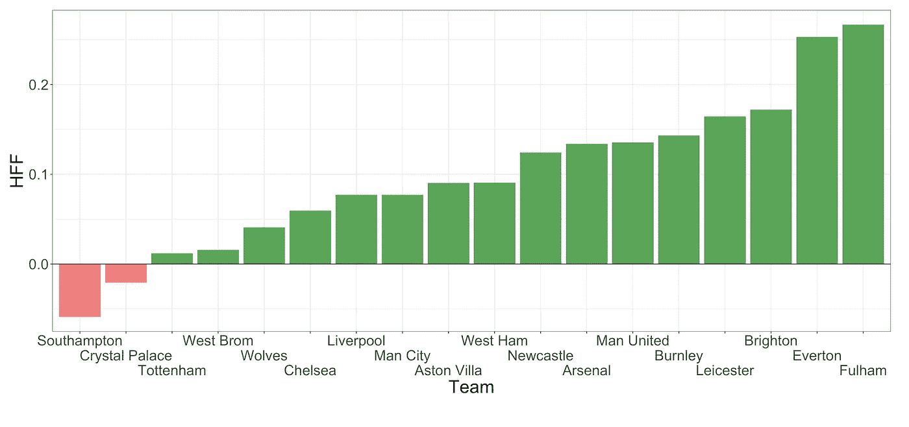

# 哪支英超球队的主场球迷最有冲击力？

> 原文：<https://towardsdatascience.com/which-premier-league-team-has-the-most-impactful-home-fans-2f1579d424e5?source=collection_archive---------18----------------------->

内森·罗杰斯在 [Unsplash](https://unsplash.com/s/photos/premier-league?utm_source=unsplash&utm_medium=referral&utm_content=creditCopyText) 上拍摄的照片。

主场优势一直是足球界被广泛研究的现象。据说好处主要来自减少旅行和主场球迷的出现。主场球迷为他们帮助球队获胜的影响力而自豪。然而，在过去很难确定有多少影响来自球迷。

2020-21 英超赛季的大部分时间都没有球迷。有几场比赛的上座率较低，但没有接近前几个赛季的水平。这给了一个绝佳的机会来确定主场球迷真正有多大的影响力，以及对哪支球队的影响最大。

在这篇文章中，我分析了过去十个赛季的英超历史数据，即从 2012-13 赛季到当前赛季(2021-22)。首先，我会试着回答这个问题:球迷在整个联盟中增加了主场优势吗？然后，我会具体看每支球队，确定哪些球迷对自己球队主场成绩的影响最大。

摘要为那些赶时间的人陈述了关键发现，而细节部分为那些想要更多信息的人提供了关于这些发现的进一步细节。

# 摘要

2020-21 赛季见证了主场胜率的大幅下降和客场胜率的上升。近十个赛季唯一一次客场胜率超过主场胜率。这表明，总的来说，在整个联赛中，主场球迷对结果有影响。随着粉丝的回归，本赛季的收视率多少回到了疫情之前的水平。

图片作者。

每支球队都计算了主场球迷因素，这是基于 2020-21 赛季英超联赛球队在 2020-21 赛季主场比赛中的分数与之前 8 个赛季的分数相比的比例。

富勒姆被证明有最大的主场球迷因素，这意味着富勒姆球迷的存在对联盟中任何球队的结果都有最大的积极影响。另一方面，南安普顿的得分最低，这意味着南安普顿在没有球迷在场的情况下主场表现更好。图 4 的细节部分显示了所有团队的因素。

图片作者。

主场球迷的出现被证明对比赛结果有积极的影响，对主队有利。然而，体育场容量对主场球迷因素没有影响。这说明粉丝的存在很重要，但数量并不重要。

# 细节

*第一部分:总体*

首先，在过去的十个赛季中，主场球迷的影响是跨整个联盟来看的。图 1 显示了本赛季主客场球队的胜率。在疫情之前的八个赛季中，主场胜率从未低于 40%，客场胜率从未超过 35%。事实上，这两个比率从来不会相差 10%以内。

图 1:按赛季划分的主场/客场胜率。图片作者。

对于 2020-21 赛季，客场胜率超过主场胜率，这证明了主场球迷在整个联盟中平均发挥着重要作用。事实上，它甚至可能表明大多数(如果不是全部)主场优势来自球迷，因为旅行因素仍然存在。有趣的是，2019–20 赛季的最后三分之一是在没有球迷的情况下进行的，但主场胜率与往年一致。然而，总体平均上座率并没有明显低于前几个赛季(见附录中的表 1)。

对于 2021-22 赛季，主场率再次提高，但差异没有以前那么极端。随着平均上座率回到疫情之前的水平，这表明了平局的趋势。事实上，提取率(29%)是所有季节中最高的。然而，由于赛季不完整，这可能只是统计上的波动，随着赛季的进行，差异可能会增加。

查看影响的另一种方式是查看自 2012-13 赛季以来的滚动胜率，如图 2 所示。红线表示没有球迷出现在体育场的时间。在此期间，滚动率明显下降。考虑到这一比率是由之前的八个赛季加权得出的，这一下降是相当惊人的。

图 2:最近十个赛季的滚动胜率(%)。图片作者。

所以，下一个问题是:在 2020-21 赛季，这些额外的客场胜利来自哪里？观察主客场进球总数(图 3)可以发现，这两个类别的进球数量多年来一直保持相对稳定。然而，对于 2020-21 赛季，我们看到了最剧烈的变化。虽然仍然有更多的主场进球，但差距现在已经小得多了。事实上，只有四个主场进球。因此，不出所料，客场胜率增加了，因为客场球队得分更多，主场球队得分更少。

图 3:按赛季划分的主客场进球数量。图片作者。

对每个赛季的平均出勤率(如附录中的表 1 所示)和客场赢球率进行学生 t 检验，结果显示出–0.72 的显著相关性(p 值为 0.02 <0.05), suggesting that higher fan attendance leads to a lower away win rate. Hence, we can conclude that the attendance of fans has a statistically significant effect on the away win rate.

*第 2 部分:特定团队*

在这里，我试图调查每支球队的球迷对他们表现的具体影响。为此，我将把 2020-21 赛季之前的八个赛季直接与 2020-21 赛季进行比较。我不会包括当前的赛季，因为这个赛季是不完整的。我会把疫情之前的赛季分组。这种比较只使用了 2020-21 赛季的球队，不包括利兹联队和谢菲尔德联队，因为他们在疫情之前的赛季中不在英超联赛中。

为了量化球迷的影响，我们可以看看每支球队在疫情之前和 2020-21 赛季之间主场胜率的差异。然而，一个队可能有较低/较高的胜率，仅仅是因为那个赛季的形式不同。相反，我会看一个赛季中主场比赛占总积分的比例。这样，球队的整体形式是不相关的，而是主场形式被认为是相对于客场形式的。我将比较疫情之前赛季和 2020-21 赛季球队主场总得分的比例。两者之间的差异将被称为*主场球迷因素(HFF)* ，定义为:

图 4 显示了每个团队的 HFF。正值表示该队在 2020-21 赛季主场比赛中的得分比例有所下降，这表明主场球迷通常会产生积极的影响。负值表示相反的情况。当球迷不在场时，整个联盟的主场胜率都下降了，所以 HFF 对大多数球队来说是积极的也就不足为奇了。水晶宫和南安普顿是例外。这两支球队似乎更喜欢在空无一人的体育场里比赛——也许他们也没有处理好球迷的压力。富勒姆和埃弗顿的 HFF 最大。这表明这两家俱乐部的球迷对主场比赛的结果有着最大的影响。

图 4:每支球队的主场球迷因素(HFF)。图片作者。

最后一点，比较 HFF 和每个队的体育场容量，发现没有显著的相关性，如图 5 所示。这表明体育场的大小并不影响主队的表现。事实上，HFF 最大的球队(富勒姆)容量也最低。尽管富勒姆并不以其特别喧闹的氛围而闻名，但与安菲尔德这样的地方相比，球队可能会在压力稍小的情况下比赛。所以，也许在家里最好的表演来自于更温和的氛围。

图 5:体育场容量与每支球队主场得分率的差异。图片作者。

总之，主场球迷的出现降低了整个联盟的平均客场胜率。富勒姆被证明拥有最具影响力的球迷。然而，体育场的容量与 HFF 没有相关性。这表明，虽然球迷的存在很重要，但实际人数相对来说并不重要。

**来源:**

资料:【https://www.football-data.co.uk/englandm.php 

使用的软件:R

**延伸阅读:**

<https://www.sciencedirect.com/science/article/pii/S146902922100131X>  

附录:

表 1:每季平均上座率。