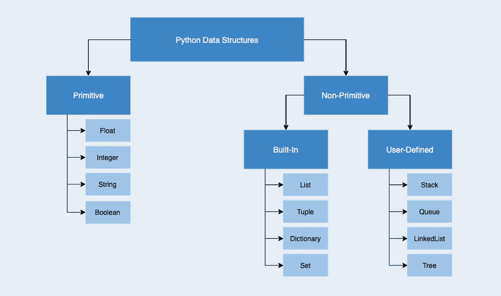

# 应该使用哪种 Python 数据结构？

> 原文：<https://towardsdatascience.com/which-python-data-structure-should-you-use-fa1edd82946c?source=collection_archive---------5----------------------->

## 列表、元组、集合、字典...什么时候使用哪种内置数据结构？

照片由[维多利亚诺·伊斯基耶多](https://unsplash.com/@victoriano?utm_source=medium&utm_medium=referral)在 [Unsplash](https://unsplash.com?utm_source=medium&utm_medium=referral) 拍摄

Python 是一种面向对象的编程(OOP)语言。类和对象用于结构化和模块化代码，以便可重用和易于修改。OOP 要求使用**数据结构**来组织和存储数据，以一种可以被有效访问的方式。

Python 有**原语**(或基本)数据结构，如浮点、整数、字符串和布尔。Python 还有**非原语**数据结构，比如列表、元组、字典和集合。非原始数据结构存储各种格式的值的集合，而不是单个值。有些可以在数据结构中保存数据结构，从而增加了数据存储能力的深度和复杂性。

作者照片

在本文中，我们将研究每种内置数据结构，以决定何时使用一种结构优于另一种结构。

## 什么是可变性？

可变性意味着数据结构中的数据在创建后可以被修改(添加、删除或更改)。可变性是选择数据结构时要考虑的一个重要因素。如果你知道你不需要改变内部状态，考虑使用一个不可变的对象来确保它是线程安全的，并且没有任何东西可以覆盖你的数据。

# 列表

为了表示按整数位置索引的项目序列，可以使用的一种数据结构是列表。列表包含零个或多个元素，并且可以包含不同类型的元素(甚至是对象！).这使得列表非常强大，因为它们允许您创建深度和复杂的数据结构。

列表是*可变的*，这意味着您可以灵活地添加、删除或更改元素。另一种顺序数据结构是一个**元组**；这两者的区别在于元组是不可变的。

因为列表有一个顺序元素:如果你只想跟踪唯一的*值而不关心顺序，使用 Python **set** 。*

使用`[]`或`list()`创建列表。使用`list()`进行类型转换。

## 一些值得注意的方法和技巧

**获取列表项:** `my_list[0]`通过偏移获取列表项。像字符串一样，负索引可以用来从末尾向后计数。
`my_list[0] = ‘new item'`通过偏移改变列表项。
`my_list[0:2]`通过偏移切片来提取项目。该示例返回`my_list`的前两个元素。

**添加列表项:** `append()`在列表末尾添加一项。
`extend()`或`+=`将一个列表合并到另一个列表中。
`insert()`在任何偏移前添加一项。

**删除列表项目:**
`remove()`从列表中删除项目值。
`pop()`删除最后一个(或指定的)元素，同时返回值。
`del`根据项目在列表中的位置删除项目。`del`是 Python 语句，不是 list 方法。

`join()`返回组合列表项的字符串。`join()`的参数是一个字符串或任何可迭代的字符串序列。
`len()`返回列表中的项数。`count()`返回指定值出现的次数。

# 元组

元组也是一种有序的数据结构，就像列表一样。但是，元组是*不可变的；*创建元组后，不能添加、删除或更改项目。元组不同于列表，它的函数要少得多，因为它们在定义后不能修改。元组包含零个或多个元素，并且可以包含不同的不可变类型的元素。

元组相对于列表的优势:

*   元组使用更少的空间
*   不变性防止错误地更改元组项
*   元组可以用作字典键
*   函数参数作为元组传递

使用`()`或没有括号的逗号分隔的元素列表创建元组。使用`tuple()`进行类型转换。

## 一些值得注意的方法和技巧

`count()`返回一个元素在元组中被找到的次数
`index()`返回一个元素的索引位置

# 字典

字典不使用偏移量，而是使用*键*来关联每个值。这意味着顺序是不可跟踪的，如果你打算使用字典的话，这并不重要。字典键是不可变的和唯一的，然而，字典是可变的。可以添加、删除或更改键值元素。简而言之，字典非常类似于*散列表*。

使用`{}`创建字典。使用`dict()`进行类型转换。

## 一些值得注意的方法和技巧

`my_dict[‘key’]`通过键获取一个项目
`my_dict['key'] = ‘value'`使用一个键添加(或改变，如果它已经存在)一个值。
`update()`将一个字典的键和值合并到另一个字典中。
`del`按提供的键删除项目。`del`是 Python 语句，不是字典方法。
`keys()`返回所有字典键。`values()`返回字典中的所有值。`items()`返回所有字典键值对。

# 设置

集合就像一本字典，只有关键字，没有值。这意味着集合是唯一的，而不是连续的(无序存储)。集合也是可变的。集合包含零个或多个元素，并且可以包含不同的不可变类型的元素。

本质上，当你想知道某样东西是否存在，而对它一无所知时，就要用到集合。如果跟踪值的顺序或存储相同值的倍数很重要，考虑使用空间友好的**元组**来代替。

使用`set()`创建器械包。使用`set()`进行类型转换。

## 一些值得注意的方法和技巧

`add()`向集合中添加不存在的项目
`clear()`从集合中删除所有项目
`intersect()`返回两个集合的交集
`union()`返回两个集合的并集

# 概括起来

*   如果需要跟踪排序，使用**列表**或**元组**
*   如果你只想跟踪*唯一的*值，而不关心顺序，使用 Python **set**
*   如果一旦定义了对象就不需要修改，那么使用一个**元组**来节省空间并确保没有东西会覆盖你的数据
*   如果你需要跟踪和修改键值对结构的数据，使用**字典**