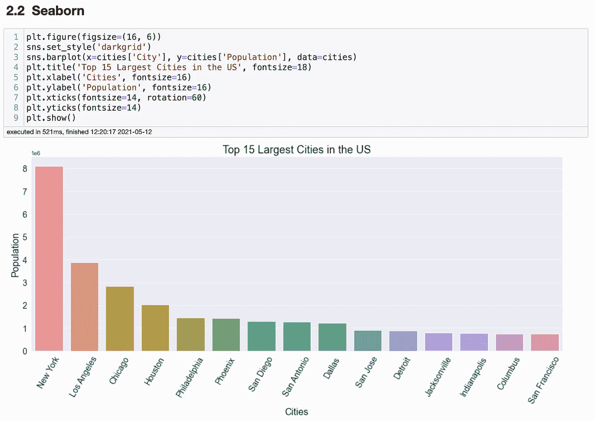

# 哪个 Python 库最适合数据可视化？

> 原文：<https://towardsdatascience.com/which-python-library-is-the-best-one-for-data-visualization-1b6ad1d66163?source=collection_archive---------15----------------------->

## 大蟒

## Matplotlib、Seaborn、Plotly Express 和 Altair。哪一个是最好的数据可视化库？


图片由 Jason Coudriet 提供。来源: [Unsplash](https://unsplash.com/photos/eQux_nmDew0)

数据可视化是任何探索性数据分析或报告的关键步骤。它通常易于阅读，并且可以让我们一眼就能洞察数据集。有几十个很棒的商业智能工具，比如 Tableau、Google Data Studio 和 PowerBI，它们让我们可以轻松地创建图表。数据分析师或数据科学家通常会使用 Python 在 Jupyter 笔记本上创建可视化效果。幸运的是，有几十个很棒的 Python 库可以创建很棒的图形。然而，百万美元的问题是:哪一个是最好的？

无论你是学生还是专业人士，你都应该知道一些选择。没有完美的图书馆。因此，您应该知道每种数据可视化的优缺点。我将介绍四个最流行的用于数据可视化的 Python 库:Matplotlib、Seaborn、Plotly Express 和 Altair。为此，我将创建一个简单的条形图，并分析使用每个库有多容易。对于这个博客，我将使用一个城市数据集。你可以在这里找到笔记本。

# **类别**

这篇博客将分析建立一个柱状图有多容易，定制图表使其最少呈现有多容易，以及库文档。

**设置数据集**

首先，让我们导入所有重要的库。很有可能你的电脑上已经安装了 Matplotlib 和 Seaborn。但是，你可能没有 Plotly Express 和 Altair。您可以使用`pip install plotly==4.14.3`和`pip install altair vega_datasets`轻松安装它们。

```
import pandas as pd
import matplotlib.pyplot as plt
%matplotlib inline
import altair as alt
import plotly.express as px
```

现在我们将导入数据集。出于演示目的，我们仅创建一个包含美国人口最多的前 15 个城市的数据框。我还将修改城市名称的大写字母。当我们创建可视化时，这将有助于编辑过程。

```
df = pd.read_csv('worldcitiespop.csv')us = df[df['Country'] == 'us']us['City'] = us['City'].str.title()cities = us[['City', 'Population']].nlargest(15, ['Population'], keep=’first’)
```

现在我们应该准备好分析每个库了。你准备好了吗？

# 类别:设置难度和初步结果

**赢家:** Plotly Express
**输家:** Matplotlib、Altair、Seaborn

在这个类别中，所有的库都表现良好。它们都很容易设置，基本编辑的结果对于大多数分析来说已经足够好了，但我们需要有赢家和输家，对吗？

Matplotlib 非常容易设置和记忆代码。然而，图表并不好看。它可能会做数据分析的工作，但它对于商务会议的结果不是很好。


作者图片

Seaborn 创造了一个更好的图表。它会自动添加 x 轴和 y 轴标签。x 记号可能看起来更好，但对于基本图表来说，这比 Matplotlib 好得多。


作者图片

Plotly Express 表演得很精彩。用很少的代码就可以创建一个好看且专业的条形图。没有必要设置图形或字体大小。它甚至旋转 x 轴标签。所有这些都只需要一行代码。印象非常深刻！


作者图片

牛郎星图表现不错。它提供了一个好看的图形，但是它需要更多的代码，并且出于某种原因，要按照字母顺序组织容器。那不可怕，很多情况下也能有帮助，但我感觉这应该是用户自己决定的事情。


作者图片

# 类别:编辑和定制

**赢家:** Plotly Express，Seaborn，Matplotlib
输家: Altair

我相信这四个图书馆都有成为赢家的潜力。在它们中的每一个中定制图表是不同的，但是我认为如果你学得足够多，你将学会如何创建漂亮的可视化。然而，我正在考虑编辑和在互联网上找到关于编辑它们的信息有多容易。我确实有使用这些库的经验，但是我把自己想象成一个新用户。

Matplotlib 和 Seaborn 非常容易定制，它们的文档非常惊人。即使你没有在他们的文档中找到你要找的信息，你也可以很容易地在 Stack Overflow 中找到它。他们还有一起工作的优势。Seaborn 基于 Matplotlib。因此，如果你知道如何编辑一个，你就会知道如何编辑另一个，这将非常方便。如果使用`sns.set_style('darkgrid')`设置 Seaborn 主题，会影响 Matplotlib。这可能就是为什么 Matplotlib 和 Seaborn 是两个更受欢迎的数据可视化库。


作者图片



作者图片

例如，Plotly Express 从一开始就提供了漂亮的图表，比 Matplotlib 需要更少的编辑，以获得最低限度的会议可视化。它的文档简单易懂，他们通过`Shift + Tab`提供文档，非常方便。在我尝试过的所有库中，它还提供了最多的定制选项。您可以编辑任何内容，包括字体、标签颜色等。最棒的是这不费吹灰之力。它的文档中有很多例子。


作者图片

我发现 Altair 的文档非常混乱。与其他库不同，Altair 没有`Shift + Tab`快捷键。这对初学者来说是非常有问题和困惑的。我可以做一些编辑，但是寻找相关信息很有压力。与我花在编辑 Matplotlib 和 Plotly Express 上的时间相比，我要说 Altair 对于初学者来说并不是一个很好的选择。


作者图片

# 类别:附加功能

**赢家:** Plotly Express 和牛郎星
输家: Matplolib 和 Seaborn

对于这一类别，我将考虑除了那些我们可以通过代码实现的特性之外的附加特性。Matplotlib 和 Seaborn 在这一类中是非常基础的。除了代码所提供的，它们不提供任何额外的编辑或交互选项。然而，Plotly Express 在这一类别中大放异彩。首先，图表是交互式的。你只需要将鼠标悬停在图表上，就会看到相关信息。


作者图片

Altair 提供了一些选项来保存文件或通过 Vega Editor 打开 JSON 文件。咩！


作者图片

# 类别:文档和网站

**赢家:** Plotly Express，Altair，Seaborn，Matplotlib

所有这些库的文档都很好。Plotly Express 有一个漂亮的[网站](https://plotly.com/python/plotly-express/#overview)，上面有代码和可视化演示。非常容易阅读和查找相关信息。我喜欢他们的网站看起来如此复杂和精心设计。你甚至可以与图表互动。


作者图片

Altair 也把他们的[网站](https://altair-viz.github.io)做得很好。他们的定制文档不是最好的，但网站看起来很好，很容易找到代码示例。我不会说这是惊人的，但它确实起了作用。


作者图片

Seaborn 的[网站](https://seaborn.pydata.org/)还可以。有些人说他们有最好的文档。我觉得还可以。它完成了任务。它包含代码示例。如果您正在寻找定制选项，这可能会变得棘手，但除此之外，这是一个干净的网站，其文档非常完整。


作者图片

Matplotlib 有完整的[网站](https://matplotlib.org/stable/contents.html)。在我看来，它有太多的文本，找到一些信息可能有点棘手。然而，信息就在那里的某个地方。他们还提供 PDF 格式的文档，我计划在将来的某个时候阅读这些文档。


作者图片

# 最终交付

我在这篇博客中分析的四个库都是很棒的库，有无限的可能性。我只检查了几个因素。基于这个原因，不要认为这个博客是理所当然的。所有的库都有优点和缺点，我是作为一个初学者写这篇博客的。我最喜欢的是 Plotly Express，因为它在所有类别中都表现良好。然而，Matplotlib 和 Seaborn 更受欢迎，大多数人会在他们的计算机上安装它们。在这些库中，Altair 是我最不喜欢的，但它值得我在未来给予一些关注。让我知道你最喜欢的数据可视化库是什么。