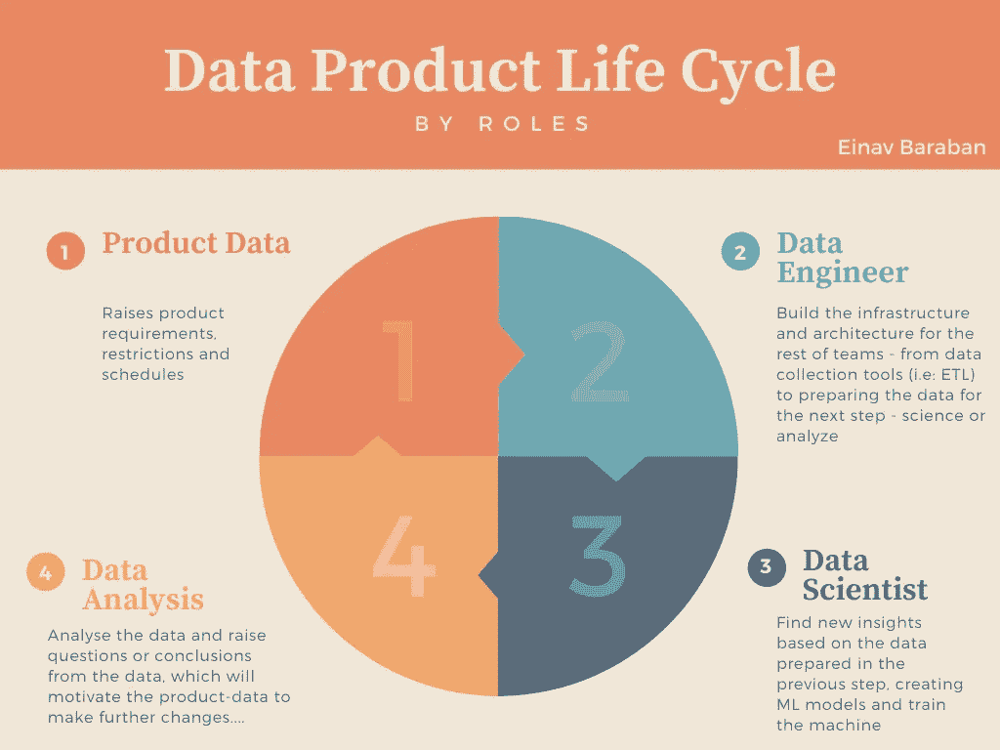
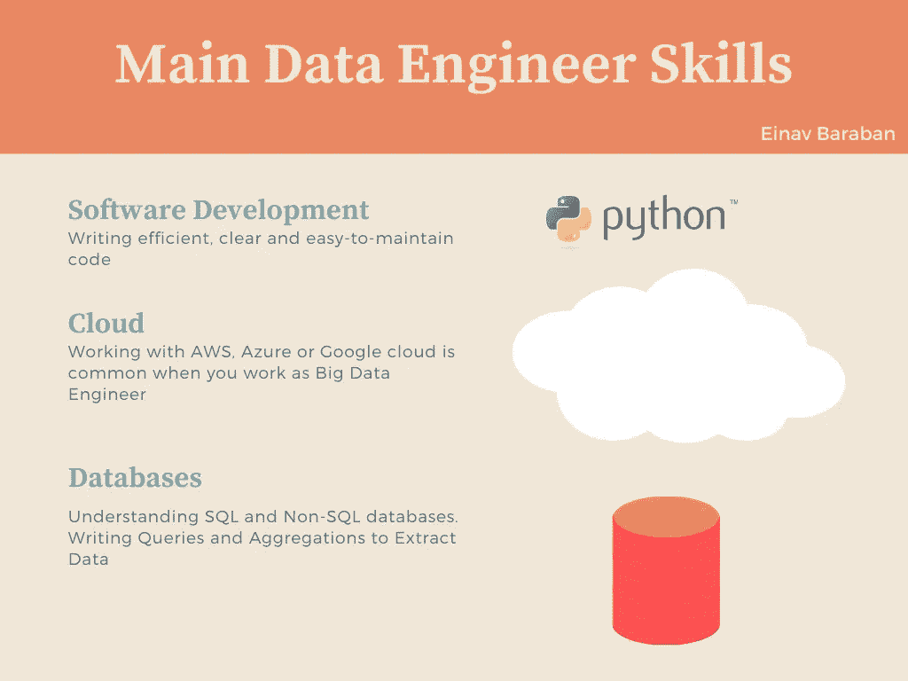

# 你是谁，数据工程师？

> 原文：<https://towardsdatascience.com/who-are-you-data-engineer-8febb06552a?source=collection_archive---------10----------------------->

## 在这篇文章中，我将解释当今存在的数据角色，特别是谁是数据工程师？其中包含的角色定义、职责和挑战是什么？

克里斯蒂娜@ wocintechchat.com 在 [Unsplash](https://unsplash.com?utm_source=medium&utm_medium=referral) 上的照片

在过去的几年里，我一直在做一名**大数据工程师**，虽然这听起来像是当前的流行语，但我已经知道，我在软件世界的许多同事不一定理解这个角色的内容。

有些人会将其与 DevOps、数据分析或数据科学相混淆。有些人会认为这是数据库架构师(DBA)这个神话角色的新品牌。

因此，在发现自己向许多不同的人解释了几次我做什么，以及为什么它与我之前提到的那些不同之后，我意识到可能会有更多的人乐于知道数据工程是怎么回事。

# 但是首先:目前存在哪些数据角色？

老实说，这种困惑是可以理解的-今天，许多公司已经意识到数据对组织的重要性，在这个世界上，每一个基本操作都被转换为数据并由某人使用，几乎每个公司都有一个数据组，其中的角色定义略有不同。

有时**数据组**将作为整个公司的一个组，通常是在具有特定领域的小公司中，但是随着公司以这种方式发展，对于具有特定领域的每个部门来说，将有一个专用的数据组来保存数据处理。

这些是数据组中的关键角色:

*   **数据分析师** —数据分析师的工作是将信息转化为知识，识别趋势，并将分析后的数据用作制定更好的基于数据的业务决策的战略引擎。它的主要工具将是数据库、SQL 和 HIVE 查询，以及用于数据可视化的图形仪表板。
*   **数据科学家** —使用数据驱动的算法、机器学习来解决业务问题，通常具有丰富的统计和数学知识，在数据中寻找趋势和模式，以将公司的利益带到下一个级别。
*   **数据工程师—** 构建和维护数据基础设施，如数据管道，负责将来自不同来源的数据传输到其他角色使用的地方，为数据科学家的模型构建准备数据。

作者图片

# 数据工程师的类型

数据工程师不仅“获取”数据，还允许您方便地访问数据，随时甚至实时收集最新数据。

## “经典”数据工程师——数据管道工程师

大部分工作是基于将数据从不同的数据源传输到单个目标，在许多情况下，他们将主要使用 ETL ( **ETL** 代表 **E** xtract，**T**transform，以及 **L** oad，指的是从多个数据源提取数据并根据业务需求将其转换并加载到目标数据库的过程)或者构建和维护这样的数据库。

这种类型的数据工程师需要对关系数据库和 SQL 查询有很高的理解。

## 机器学习数据工程师

这些工具的主要作用是将模型(由数据科学家开发)部署到真实的生产环境中，并完成所有必要的工作—构建包括自动化、测试、监控和日志的生产基础架构。

机器学习工程师将参与编写用于训练和准备模型的代码(大数据解决方案中的数据准备和训练层)，在这种情况下，Python、Spark 和云环境方面的强大背景是必须的。

# 数据工程师的主要技能

虽然数据科学家通常在数学和统计学方面有很强的背景，但数据工程师通常是有几年经验的软件开发人员，他们了解云基础设施和开发语言，如 Python 或 Java、Scala 等。

由于我们处于一个大数据世界，它通常是在**云**中管理的，因此了解其中一个提供商将是有用的——如谷歌云服务、Azure 或 AWS。

此外,**数据库**的知识是工作所需的知识之一——理解关系和非关系数据库，运行复杂的数据获取查询，所有这些都不会影响用于生产环境的数据。

在某些情况下，根据工程师从事的项目，需要对机器学习算法、统计模型和各种数学函数有基本的理解。

作者图片

# 作为数据工程师的挑战

## 可靠性

数据世界中最重要的事情是数据的可靠性——在数据损坏的情况下，任何复杂的模型都无法提供帮助。因为数据工程师负责收集数据(有时来自不同的来源)并将它们移动到一个目标，转换和处理它们以创建一致性，等等，所以人们担心数据的可靠性会在这个过程中受到损害。

这是一个巨大的挑战，要确保一路上我们没有改变数据的本质，我们收到的和我们传递的是一样的。

为了提供高度确定的数据，我们必须全程采取行动，例如:

*   **数据一致性** —意味着数据中的每个变量都只有一个含义。为了确保数据的可靠性，我们必须验证模式的一致性——对于特定的模式，每个记录都以相同的方式处理。
*   **元数据存储库** —通过有序保存元数据的来源和处理方式，为数据提供上下文。
*   **数据修改权限** —只有被授权的人才能修改数据——人和流程都一样。这将确保不会发生意外的变化。

## 可扩展性和性能分析

有时，传入数据的数量和速度是不可预测的，该角色面临的挑战之一是构建一个知道如何轻松快速地处理增加的负载的系统。

重要的是要明白 ***Scale*** 没有神奇的解决方案，但是会根据问题给出解决方案——如何处理负载？
例如，如果您的系统是一个 web API，负载可能会影响响应时间，因此解决方案应该在这个级别。

## 再现性

数据是一切的基础。因此，我们应该做好准备，以防由于各种原因导致某些数据丢失。因此，高效、快速地恢复并保持数据随时间推移而可用的能力，是数据工程师面临的一项重要挑战。

# 结论

综上所述，关于谁是数据工程师，他们的职责是什么的困惑是理解的。这确实是一个有趣而多样化的角色，包括代码编写以及云基础设施的维护和建立，数据库的复杂工作，在某些情况下还包括统计和机器学习。

数据基础架构用户相信您能为他们提供一个数据可靠的系统，能够快速处理突发负载而不丢失关键数据，并且能够在意外情况下恢复信息。
工作中的许多挑战增加了人们的兴趣和令人印象深刻的学习曲线——数据世界正在快速发展，为了保持一致，我们必须跟上我们作为解决方案所面临的变化和技术。此外，这一角色还伴随着许多责任，例如，数据可靠性是一个真正的挑战，至少在“最坏的情况”下意味着大量的金钱损失，在其他情况下，可能会因为不正确的数据或错误的决策而产生法律后果，从而导致人员伤亡(例如，安装在煤气罐上的传感器和实时泄漏报告，如果数据在此过程中被不同地翻译，则可能会错过实时灾难警报)。