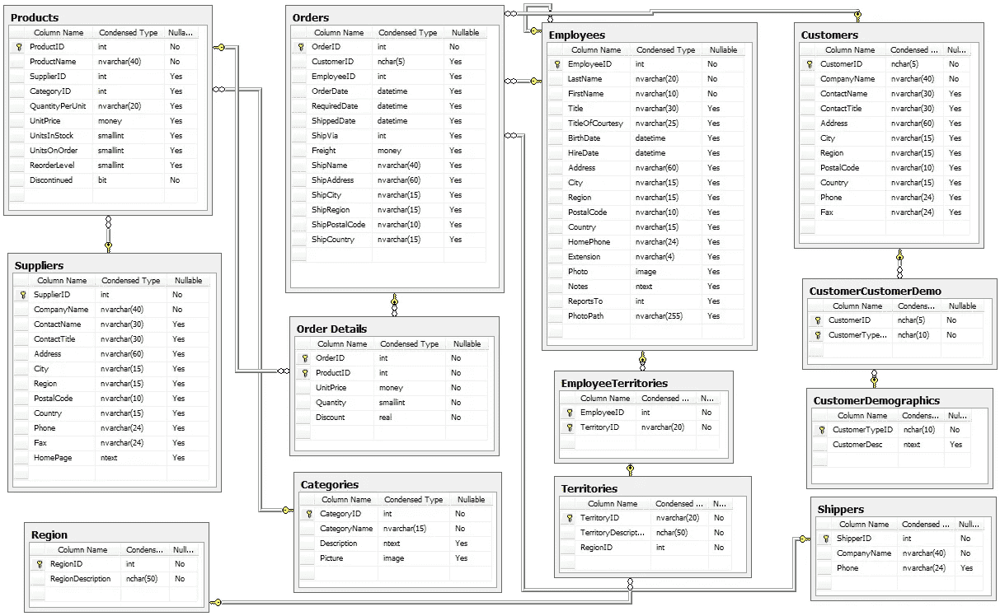
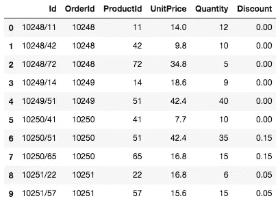
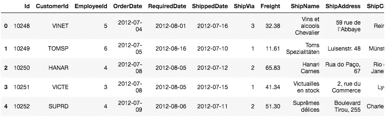

# 这个数据库是谁设计的？

> 原文：<https://towardsdatascience.com/who-designed-this-database-19ab75eee457?source=collection_archive---------36----------------------->


塞巴斯蒂安·赫尔曼在 [Unsplash](https://unsplash.com?utm_source=medium&utm_medium=referral) 上的照片

一个设计良好的数据库和最新的文档是最理想的，但是如果不是这样，并且您无法改进数据库设计，那么有什么解决方法呢？

## 考虑以下场景

你是一名自由职业的数据科学家，受雇对一家公司的数据进行分析。这似乎很简单，您知道如何使用 SQL 和 Python，以及如何进行假设检验，并且您会被告知您将获得一个数据库模式。

该公司一直在向一些客户提供不同程度的折扣。作为您的第一项任务，您需要弄清楚提供产品折扣是否有助于增加订单中的商品数量，如果有，它是否特定于某个或某些折扣？

## 看一下这个模式

您要做的第一件事是查看提供给您的数据库模式，并提出一个收集数据的计划。



提供的数据库模式

您会看到订单明细表中列出了产品折扣。您已经看到了这个数据库设计的一个问题，这个表的标题中有一个空格，这不是一个好现象，但是您可以通过引用表名来解决它。

## 订单细节表数据看起来像什么？

您将使用 [Python 的](https://www.python.org/) [sqlite3](https://docs.python.org/3/library/sqlite3.html) 包来查询数据库，并计划将查询到的数据存储在 [Pandas Dataframe](https://pandas.pydata.org/pandas-docs/stable/reference/api/pandas.DataFrame.html) 中。

首先，您需要查看表中的几个条目。

```
import sqlite3
import pandas as pdquery = """SELECT * FROM 'Order Details' LIMIT 10"""df = pd.DataFrame(cur.execute(query).fetchall(), columns = [description[0] for description in cur.description])df.head(10)
```

## 您收到的不是数据，而是以下错误:

```
OperationalError                          Traceback (most recent call last)
<ipython-input-5-8791be329a46> in <module>
----> 1 cur.execute(query).fetchall()

OperationalError: no such table: Order Details
```

嗯。在仔细检查模式中的拼写错误后，很明显没有名为 Order Details 的表。

## 如果模式是错误的，那么表名是什么？

不幸的是，如何做到这一点取决于您正在使用的关系数据库实现，但是在我们的例子 sqlite 中，您可以使用下面的查询。

```
query = """
        SELECT name FROM sqlite_master
        WHERE type='table'
        ORDER BY name;
        """
cur.execute(query).fetchall()
```

返回的表名是:

```
[('Category',),
 ('Customer',),
 ('CustomerCustomerDemo',),
 ('CustomerDemographic',),
 ('Employee',),
 ('EmployeeTerritory',),
 ('Order',),
 ('OrderDetail',),
 ('Product',),
 ('Region',),
 ('Shipper',),
 ('Supplier',),
 ('Territory',)]
```

什么？没有一个表名与模式匹配。此时，您不能信任该模式，但是希望即使表名不匹配，每个表之间的关系仍然存在。

现在您知道了正确的表名，您可以再次尝试检索一些数据。

```
query = """SELECT * FROM 'OrderDetail' LIMIT 10"""df = pd.DataFrame(cur.execute(query).fetchall(), columns = [description[0] for description in cur.description])df.head(10)
```

这次你得到一些数据！



OrderDetail 表的输出

您会发现模式和当前数据库实现之间存在更多的不一致。有一个 Id 列未在架构中显示，并且 OrderId 列和 ProductId 的大小写与架构不匹配。虽然大写在 SQL 中并不重要，但是一旦你将数据放入 Pandas 数据框架中，大写就很重要了。您需要记下这一点，以便将来进行查询和分析。

你现在可以使用这个表进行假设检验了，我不会在这篇文章中详细介绍这个表，但是如果你需要其他表中的数据呢？

## 订单表呢？

你可能已经注意到上面有一个叫做 Order 的表。如果您熟悉 SQL，您会知道顺序是一个保留字。您应该怀疑从订单表中查询数据会有问题，但是为什么会这样呢？

举个简单的例子，您可以尝试从那个表中查询几行数据。

```
query = """SELECT * FROM Order LIMIT 5"""df = pd.DataFrame(cur.execute(query).fetchall(), columns = [description[0] for description in cur.description])df.head()
```

正如所料，您会收到一个错误

```
---------------------------------------------------------------------------
OperationalError                          Traceback (most recent call last)
<ipython-input-31-dc8e46beab2b> in <module>
 **1** query = """SELECT * FROM Order LIMIT 5"""
 **2** 
----> 3 df = pd.DataFrame(cur.execute(query).fetchall(), columns = [description[0] for description in cur.description])
 **4** df.head()

OperationalError: near "Order": syntax error
```

对此你能做些什么？SQL 怎么知道 Order 是表名不是保留字？不幸的是，该解决方案依赖于数据库实现。我将向您展示如何在 sqlite 的情况下处理它。您需要用反斜杠将表名括起来。

```
query = """SELECT * FROM `Order` LIMIT 5"""df = pd.DataFrame(cur.execute(query).fetchall(), columns = [description[0] for description in cur.description])df.head()
```

这次检索了一些数据。



订单表中的数据

如果您参考上面的有问题的模式，您会注意到被指定为 OrderID 的内容实际上被称为 ID，并且需要注意。

如果您需要引用订单表中的一列，该怎么办？你还在用反勾号。下面是一个更复杂的查询示例。

```
query = """
SELECT `Order`.Id AS OrderId, 
       SUM(OrderDetail.Quantity) AS TotalQty 
FROM `Order` JOIN OrderDetail 
ON `Order`.Id = OrderDetail.OrderId 
GROUP By `Order`.Id
"""
```

您可以看到，在任何使用 Order 的地方，都需要用反勾括起来。如果您需要将它用作子查询，重命名顺序。Id 到 OrderId 将有助于保持查询的其余部分“干净”。

感谢你花时间阅读这篇文章。当您遇到设计和/或文档不良的数据库时，我希望我详述的解决方法会有所帮助。