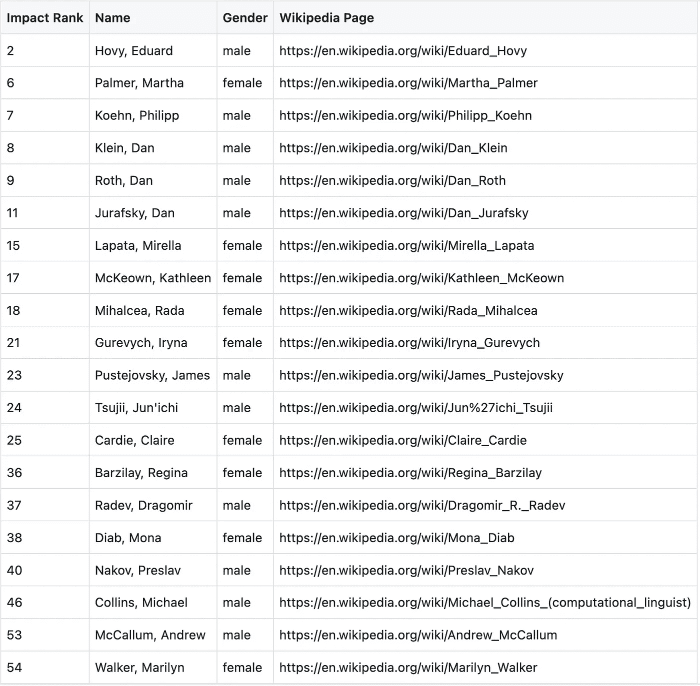
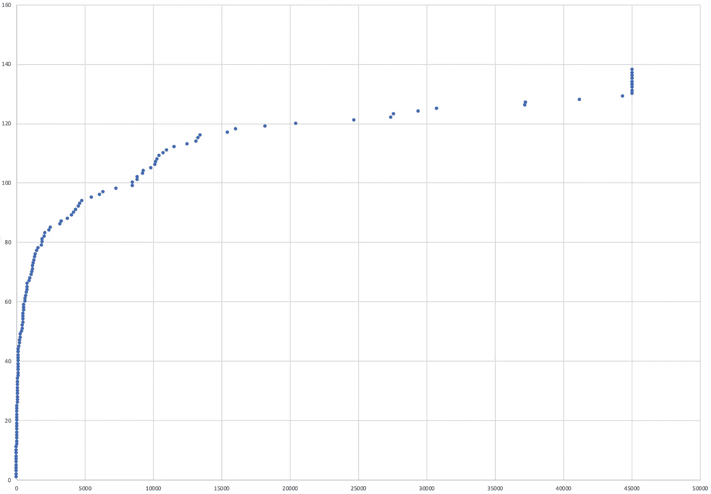
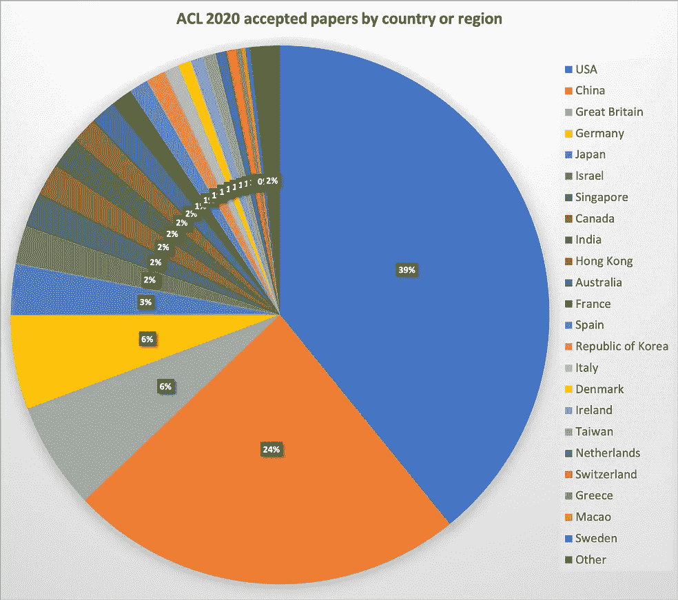
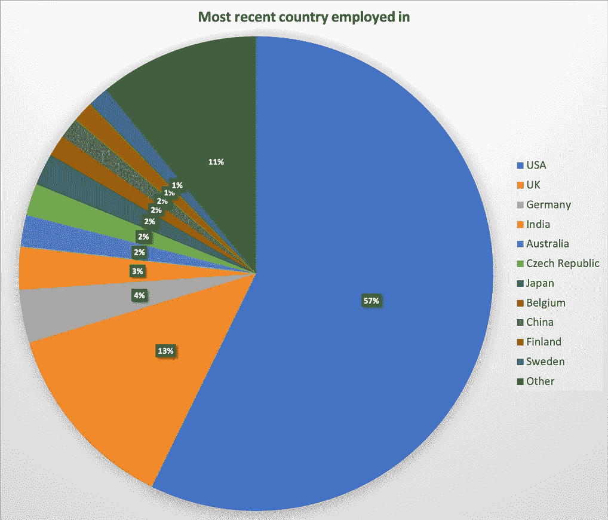
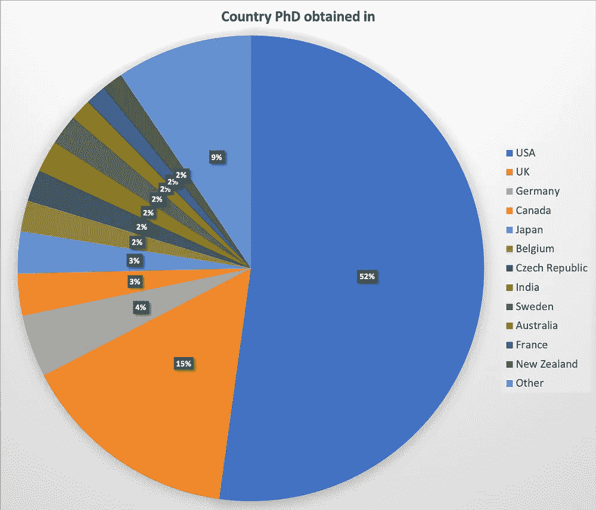
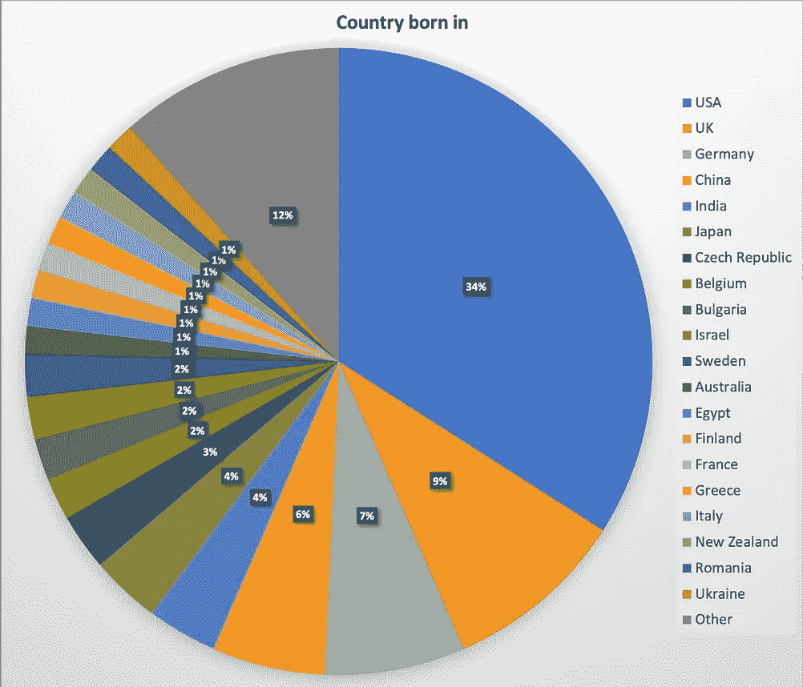
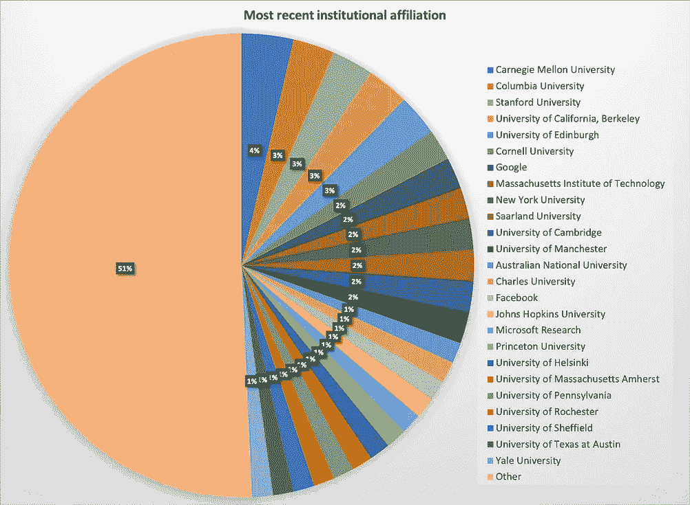
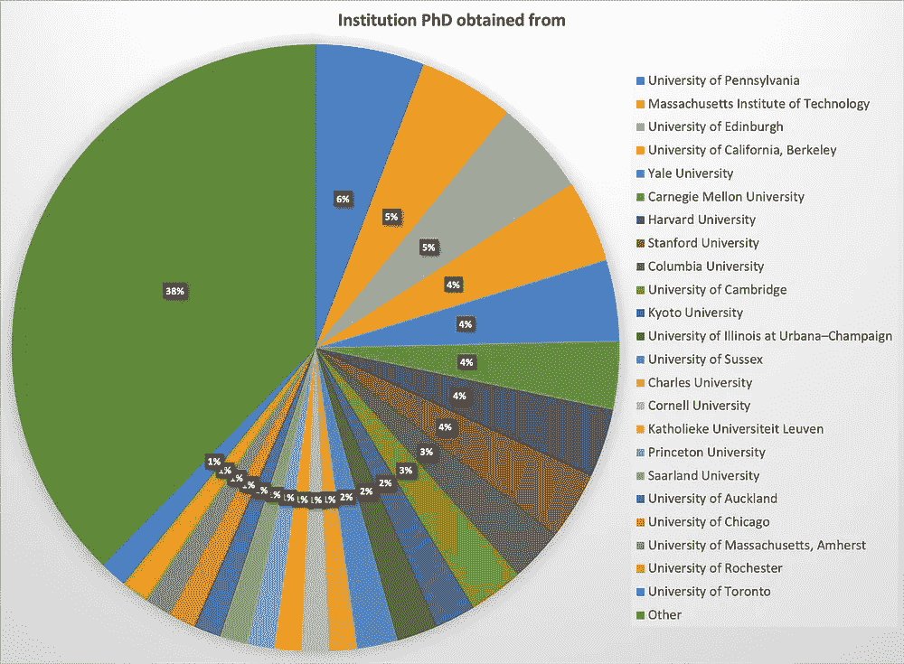

# 谁是自然语言处理领域的“维基百科名人”?

> 原文：<https://towardsdatascience.com/who-is-wikipedia-famous-within-natural-language-processing-fa0c8e91bdf6?source=collection_archive---------25----------------------->

## [变更数据](https://towardsdatascience.com/tagged/data-for-change)

## 尽管维基百科的简历中存在众所周知的偏见，但拥有维基百科的简历通常被视为衡量知名度的一个标准

作为一名研究人员，拥有一篇维基百科文章是衡量一名研究人员有多著名的众多标准之一。然而，维基百科因其性别偏见而受到严厉批评，这是一个如此突出的问题——你可能已经猜到了——有一个关于这个话题的[专门的维基百科页面](https://en.wikipedia.org/wiki/Gender_bias_on_Wikipedia)。此外，研究发现，在维基百科上有一篇传记文章实际上与传统的影响指标如引用计数没有关联。鉴于我在自然语言处理(NLP) 研究领域参与了[多样性&包容计划，以及对](http://www.winlp.org/)[性别偏见检测](http://www.copenlu.com/project/gender-bias/)和[学术数据](http://www.copenlu.com/project/scholarly-data/)的兴趣，我对我们领域的现状感到好奇，具体来说:1) **有多少研究人员拥有维基百科传记**，2) **是否存在显著的性别差异**，3) **拥有一篇维基百科文章与拥有，** 4)谁有维基百科的文章中有任何可观察到的**国家或机构偏见**？

**注意事项**:我先分享一些数据准备的注意事项，然后是数据分析和讨论。尽管我尽了最大努力，但还是有可能无意中排除了一些维基百科页面。还要注意的是，NLP 研究人员可能因为他们的 NLP 研究之外的原因而出名。此外，有许多不同的影响指标可以比较，我选定了一个将研究人员发表的 NLP 论文数量与这些论文吸引的引用数量相结合的指标。最后，除了性别之外，还有更多偏见——我也将分享一些关于这方面的笔记。如果你只是想要外卖，跳到 TL；博士总结在最后。

# 数据准备

这种分析需要两种类型的数据:关于自然语言处理研究人员的维基百科文章列表，以及这些研究人员的出版数据，以衡量他们对该领域的相对影响。

## 收集维基百科的简历

有几种方法可以识别维基百科文章的主题，最直接的方法是出现在文章底部的[类别标签](https://en.wikipedia.org/wiki/Help:Category)。虽然有用，但不幸的是它们也很稀少。因此，我浏览了大约 1000 篇链接到自然语言处理页面的文章[，如果它们代表了相关研究人员的传记，就将它们标记为自然语言处理](https://en.wikipedia.org/wiki/Special:WhatLinksHere/Natural_language_processing)和/或计算语言学研究人员[。正如你从(现在更新的)类别列表以及](https://en.wikipedia.org/wiki/Category:Natural_language_processing_researchers)[这个电子表格](https://docs.google.com/spreadsheets/d/10dSQ6Q2-AR5aZg5ZTz6ruGb7rZlgk1_W46tloqAsVCk/edit?usp=sharing)、**中看到的，总共有 138 名 NLP 研究人员拥有维基百科简介**。

附注:术语“自然语言处理”和“计算语言学”之间有一些语义上的差异，但由于它们经常被混为一谈，因此出于分析的目的，我将它们视为同一个术语，并通篇使用当今更常见的术语“自然语言处理”。
此外，我只考虑了英文维基百科的 NLP 页面作为起点。因此，我可能错过了只有维基百科非英文版页面的 NLP 研究人员。

## 收集学术资料

为了评估这些研究人员对该领域的影响，我使用了 [NLP 学者数据集](http://saifmohammad.com/WebPages/nlpscholar.html)，它包含了 [ACL 选集](https://www.aclweb.org/anthology/)中的所有论文(反过来，它索引了在著名的 NLP 会议、研讨会和期刊上发表的论文)。除了论文列表，它还包含截至 2020 年 6 月谷歌学术论文的引用计数。请注意，相关研究人员不必拥有谷歌学术帐户；只有论文需要被谷歌学术索引。

## 衡量研究影响

衡量研究影响的一个常用指标是研究人员的 h 指数。然而，这个衡量标准考虑了所有研究者的论文，而不仅仅是某个特定学科的论文，正如我在这里想要捕捉的。为了衡量 NLP 中的研究影响，我选择了一个不同的指标，即研究人员发表了多少篇论文，以及这些论文被引用的情况，这两个指标也是常见的研究影响指标。不仅仅是测量引用的原因是，基于[NLP 的哪个子领域是关于](https://www.aclweb.org/anthology/2020.acl-main.464/)、第一作者的性别是什么、[和更多](https://arxiv.org/abs/2012.05742)，关于什么论文获得多少引用存在偏见。
此外，我采用了一个相对宽泛的“突出”场所的定义，因为[这些偏见也会影响同行评审](https://www.aclweb.org/anthology/2020.findings-emnlp.112/)，从而影响作者希望在多有声望的场所发表他们的工作——例如，介绍新数据集的论文虽然对社区非常有价值，但很少在 NLP 内排名最高的场所发表，因为介绍新模型的论文通常被评审员认为更值得发表。

请进一步注意，这些研究人员可能在其他领域发表过论文，或者他们可能因为他们的研究论文以外的原因而更加引人注目。此外，维基百科页面的长度，它们被编辑的频率或其他更细粒度的统计数据可能有助于衡量，正如[Samoilenko&Yasseri(2013)](https://arxiv.org/abs/1310.8508)所调查的那样。由于我对维基百科上高影响力的 NLP 研究人员的代表性感兴趣，我只考虑了他们的 NLP 出版物(如上所述，我在这里使用的 NLP 学者数据集只包含由 ACL 选集索引的论文，这些论文都是关于 NLP 的论文)。此外，我没有对他们的维基百科简历进行更细致的统计。

此外，测量研究影响是非常复杂的，当然不仅仅是研究人员的出版物，例如，参见关于替代指标的讨论。出版物的数量也受到研究小组规模的限制，而研究小组的规模本身又受到研究经费等资源的限制。给研究人员排名甚至会对科学本身有害，因此除非必要，否则应该避免。在这里，衡量研究影响应被视为达到目的的必要手段，而不是目的本身。我想积极劝阻读者试图过多地解读下面某个研究人员的特定影响排名，因此不会发布与他们的 NLP 影响度量配对的研究人员的完整列表。

事不宜迟，这是我选定的衡量标准。根据 NLP 学者数据集，我首先计算了每位研究人员的论文数量和引用数量。然后，我对结果列表进行降序排列，以获得两个等级: *r_p* ，一个研究人员的等级，表示他们相对于其他研究人员发表了多少篇论文，以及 r_c，一个研究人员的等级，表示他们相对于其他研究人员获得了多少引用。然后，我线性组合了两个等级，即 *r_p + r_c* ，并对结果等级进行归一化，这样每个位置之间的增量为 1。

# 数据分析

回想起来，我主要对两件事感到好奇:维基百科上 NLP 研究人员的代表性是否存在性别差异，以及拥有维基百科简历本身是否与 NLP 的科学影响力相关。总共有 138 名研究人员拥有维基百科的简历，因此很难从中得出任何结论性的发现(如果我将这篇博文作为论文提交，审稿人 2 可能会反对我这样做)。然而，这是我的发现。

## 定性分析

我知道你们中的一些人来这里是为了一些容易理解的情节/图表/例子，所以下面是根据我之前定义的研究影响排名以及赛义德和性别(手动标记，见下文)列出的拥有维基百科页面的前 20 名研究人员。显而易见，并非所有有影响力的 NLP 研究人员都有维基百科的简历。此外，有很有影响力的男性和女性 NLP 研究人员都有维基百科的简历。

前 20 名最有影响力的 NLP 研究人员，他们的维基百科页面和手动标记的性别。影响排名是根据他们的 NLP 论文及其引用来确定的。

## 性别代表性

我根据维基百科简历中描述他们的代词，在维基百科页面上手动标记了每个研究人员的性别。没有一个研究者被称为“他们”，51 个被称为“她”，86 个被称为“他”。请注意，维基百科页面不是自传性的，因此，尽管不太可能，但有可能有人无意中弄错了性别。此外，[一些非二元的人使用代词“她”或“他”，而不是“他们”](https://transequality.org/issues/resources/understanding-non-binary-people-how-to-be-respectful-and-supportive)或其他代词，这意味着性别不能仅从代词中推断出来。尽管如此，我得出的结论是，极不可能存在拥有维基百科页面的非二进制 NLP 研究人员，拥有维基百科简历的女性研究人员比例为 37.2%。作为比较， [Mohammad (2020)](https://www.aclweb.org/anthology/2020.acl-main.702/) 估计 NLP 中 29%的第一作者和 25%的最后作者是女性， [Schluter (2018)](https://www.aclweb.org/anthology/D18-1301/) 估计 NLP 中女性占所有研究人员的比例为 33.5%。鉴于此，似乎拥有维基百科简历的女性 NLP 研究人员的比例明显低于男性 NLP 研究人员的比例。然而，这也略高于妇女在该领域的代表性。

## 影响分析

回想一下，我感兴趣的是拥有维基百科简历的研究人员是否也倾向于对该领域产生重大影响。总的来说，在 NLP Scholar 数据集中有 45041 个唯一作者条目。其中一些可能是重复的，例如，如果一名研究人员以不同的名字发表了论文——出于这种粗略分析的目的，没有努力将这些联系起来。

研究这个问题的一个简单方法是计算拥有维基百科简历的研究人员的平均排名(回想一下，有 138 个这样的排名——你可以在这里看到所有的排名)。拥有维基百科简历的 NLP 研究人员的平均排名是 8152，而数据集里 NLP 研究人员的平均排名是 22521。此外，拥有维基百科简历的研究人员中有 37%属于 NLP 影响排名最高的前 1%的 NLP 研究人员。为了说明这一点，下面是具有维基百科简历的 NLP 研究人员的绝对影响排名(x 轴)与具有维基百科简历的所有 NLP 研究人员的相对影响排名(y 轴)的曲线图。

拥有维基百科简历的 NLP 研究人员的绝对影响排名(x 轴)与拥有维基百科简历的所有 NLP 研究人员的相对影响排名(y 轴)

正如你可以再次看到的，这些研究人员中约有 2/3 的影响力排名为 5000 或更低，只有少数离群值在远端，没有被 ACL 选集索引的 NLP 研究论文。因此，他们被分配了一个虚拟级别(可能的最高级别)。观察一些离群值，他们要么是在不被 ACL 选集索引的本地期刊上发表文章的 NLP 研究人员，要么主要不是 NLP 研究人员(但其他领域的研究人员，现在在行业中的前研究人员，或者根本不是主要研究人员的人)。

总体而言，由此可以得出结论，**拥有 bios 的 NLP 研究人员在该领域的影响力远远高于没有拥有 BIOS 的研究人员，这与[Samoilenko&Yasseri(2013)](https://arxiv.org/abs/1310.8508)的发现相反。**

## 国家和机构分析

最后，我很好奇，想知道谁有维基百科的简历是否存在国家或机构偏见。在最近的 ACL(NLP 中排名最高的会议)上，记录了每篇论文联系作者的国家或地区，会议组织者发现[大多数研究论文来自](https://acl2020.org/blog/general-conference-statistics/)美国(39%)，其次是中国(24%)，英国(6%)，德国(6%)和日本(3%)。

注意，因为国家和地区在 ACL 调查中被合并，所以左图中的地区“大不列颠”和“爱尔兰”不能直接映射到其他图表中的国家“英国”和“爱尔兰”。“香港”和“中国”也是如此，它们在 ACL 调查中被视为独立的地区，但在维基百科中却不是独立的国家。

为了与维基百科上的研究人员进行比较，我考虑了一个人出生的国家，他们获得博士学位的机构和它位于哪个国家，以及最近的机构隶属关系和它位于哪个国家。所有这些都是从研究人员的维基百科页面手动获得的。在没有现成可用的地方，我在研究人员的机构网站上搜索这些信息，并相应地更新他们的维基百科页面。结果可以在下面看到。

左图:基于联系作者的 ACL 2020 论文的国家或地区分布；共有 779 篇论文被接受。右图:在维基百科上有简历的 NLP 研究人员最近被雇佣的国家。只有拥有最多两篇论文/维基百科简历的国家被明确命名。

显而易见，ACL 作者所在的国家(左)和拥有维基百科简历的 NLP 研究人员目前受雇的国家(右)之间存在明显的差异。有 57%的美国 NLP 研究人员拥有维基百科的简历，只有 39%的 ACL 2020 论文是由美国提交的。此外，在 ACL 2020 上发表的所有论文中，有 24%是由中国提交的，而只有 2%的维基百科关于 NLP 研究人员的简历是关于目前在中国的研究人员的。以色列、新加坡和加拿大各占 ACL 2020 认可的论文主要作者居住国的 3%,但在维基百科关于 NLP 研究人员的简历中却一个都没有。

左图:拥有维基百科简历的国家自然语言处理研究人员在。右图:拥有维基百科简历的 NLP 研究人员出生的国家。只有拥有最多两个维基百科传记的国家才被明确命名。

将 NLP 研究人员目前所在的国家与他们获得博士学位的国家和出生的国家进行比较，很明显，随着时间的推移，分布越来越倾向于以英语为主要语言的国家，在某种程度上是英国和加拿大，但特别是美国(34%出生于，52%获得博士学位，57%最近就业的国家)。

作为补充，这并不令人惊讶，这里是拥有维基百科简历的 NLP 研究人员获得博士学位的最著名的机构。

左图:拥有维基百科简历的 NLP 研究人员最近加入的机构。右图:NLP 研究人员获得博士学位的机构。

在这两种情况下，分布都是由美国的机构主导的，这些机构在 CSRankings 等[排名中也名列前茅。虽然可以看出，并不是所有排名靠前的机构都在维基百科上的 NLP 简历中有大量出现，这意味着这可能部分是大学公关努力的结果。](http://csrankings.org/#/index?nlp&world)

总的来说，在每个国家发表的研究论文数量和被引用的程度上已经存在差异。当谈到维基百科上 NLP 学者的代表性时，这些问题进一步加剧，这使他们处于进一步的劣势。所以总的来说，在英文版的维基百科中，NLP 学者有很强的国家和机构偏见**。
这些偏见可能是由多种因素造成的，文化和资源可能是社会偏见的一部分。**

# 行动呼吁

总体而言，存在明显的国家和机构偏见，以及女性 NLP 学者在维基百科上的代表性不足。尽管性别偏见并不像我预期的那样明显有利于男性研究人员，但在 NLP 和更广泛的社会中，还有许多其他传统上代表性不足的群体。首先，性别不仅仅是二元性别，偏见也不仅仅是性别和制度偏见，例如种族、宗教、阶级、性别、残疾等方面的偏见。[交叉性](https://www.ncbi.nlm.nih.gov/pmc/articles/PMC4181947/)，即一个人身份的不同方面如何相互作用，也应予以考虑——研究人员可能面临不止一种类型的偏见，例如性别和种族偏见。我帮助发起的[拓宽 NLP 倡议](http://www.winlp.org/)，旨在提高所有传统上在 NLP 中代表性不足的群体的代表性。作为这项计划的一部分，我维护着 NLP 中代表性不足的群体的大目录。如果你有兴趣支持这项倡议，并且有几个小时的空闲时间，为什么不为这个目录中的一个人创建一个维基百科个人资料呢？

## 如何开始

第一件要做的事当然是挑选一个值得维基百科关注的人。维基百科社区[整理了一些关于这个](https://en.wikipedia.org/wiki/Wikipedia:Notability_(academics))的指南，不遵循这些指南的文章通常会被标记为删除。还要注意的是，文章应该从中立的角度来写，所以强烈反对[写一篇关于你自己的维基百科文章](https://en.wikipedia.org/wiki/Wikipedia:An_article_about_yourself_isn%27t_necessarily_a_good_thing)。为了让你更容易理解，我将大目录与 NLP 学者数据集中有影响力的研究人员列表进行了交叉引用，你可以在这里找到结果。如果您为这些研究人员之一添加维基百科页面，请将维基百科页面链接添加到相应的栏中。具有高影响力指标的研究人员很可能通过显著性标准，但是没有高影响力指标并不意味着他们不显著，因为人们可能因为不同的原因而显著(也参见进一步的讨论)。

# TL；博士；医生

一开始，我提出了以下研究问题:
1)有多少研究人员拥有维基百科传记，2)是否存在显著的性别差异，3)拥有一篇维基百科文章与对自然语言处理领域产生影响之间是否存在关联？以及 4)在谁拥有维基百科文章的问题上，是否存在任何可观察到的国家或机构偏见？

答案是:
1) 138 名 NLP 研究人员拥有维基百科传记，而 ACL 选集有 45041 名独特的作者，该选集索引了所有著名的 NLP 期刊、会议和研讨会的会议记录。
2)拥有维基百科简历的自然语言处理作者中，37.2%为女性，明显低于男性。然而，ACL 选集中女性论文作者的比例估计在 25%到 33.5%之间，这意味着，相对于女性在 NLP 领域的代表性，女性在维基百科上的代表性更突出。
3) 37%拥有维基百科简历的研究人员属于 NLP 研究人员中影响力排名最高的前 1%,仅根据他们的出版物计算。因此，可以得出结论，在拥有一篇维基百科文章和对 NLP 领域产生影响之间有很强的相关性。
4)美国有 57%的自然语言处理研究人员拥有维基百科的简历，只有 39%的 ACL 2020 论文是由美国提交的。此外，在 ACL 2020 上发表的所有论文中，有 24%是由中国提交的，而只有 2%的维基百科关于 NLP 研究人员的简历是关于目前在中国的研究人员的。拥有大量拥有维基百科资料的 NLP 学者的机构不一定在诸如 CSRankings 这样的排名中排名靠前。因此，可以得出结论，在自然语言处理学者的维基百科简历中，存在非常明显的国家和机构偏见。

# **遗言&致谢**

谢谢你能走到这一步。如果你喜欢阅读这篇文章，并有评论或建议，请在下面留下。

感谢 Saif Mohammad 的有用和详细的反馈，以及分享 NLP 学者数据集。还要感谢巴里·诺顿、拉达·米哈尔恰、莫娜·迪亚卜、佩帕·阿塔纳索娃、瑞安·科特雷尔、嵇和塔马尔·索洛里奥分享了他们对本文的看法。也感谢 Pascale Fung 和 Smaranda Muresan 鼓励我写这篇文章。