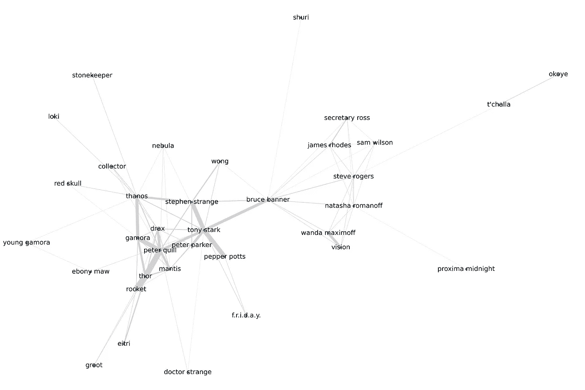
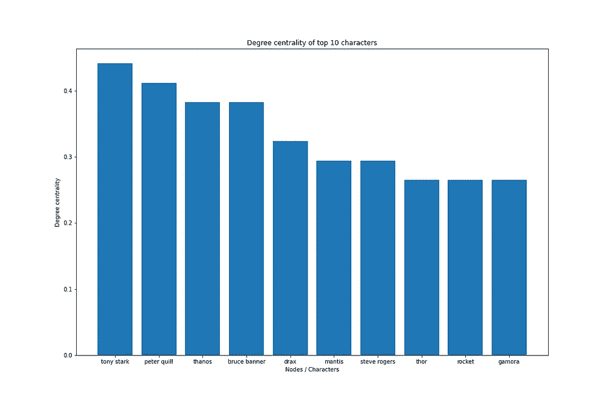
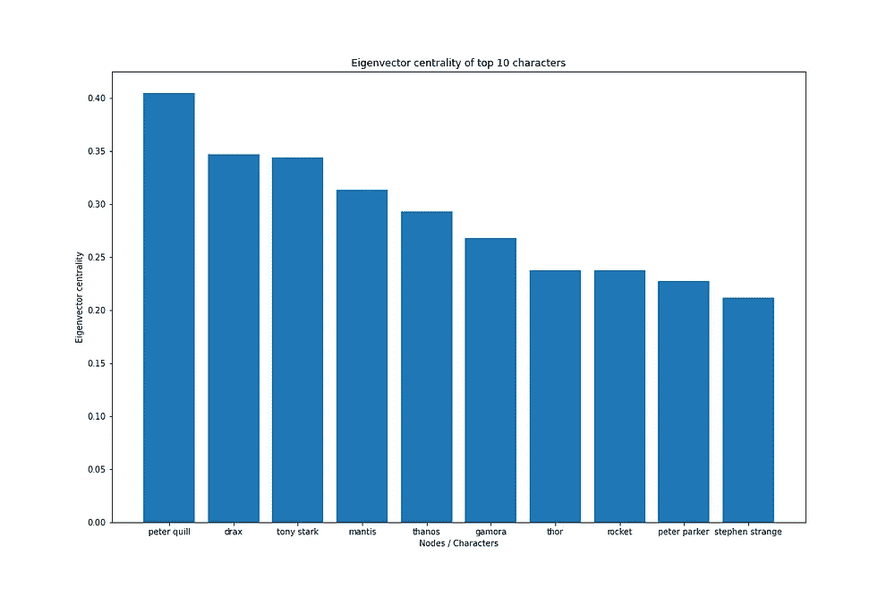
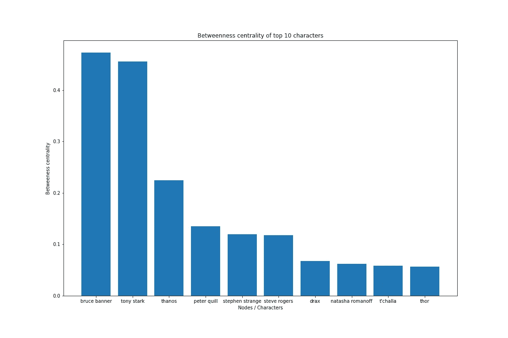
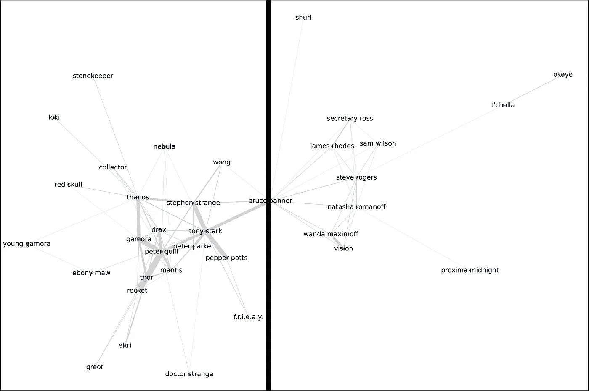

# 谁是《复仇者联盟 3：无限战争》中的主角？

> 原文：<https://towardsdatascience.com/who-was-the-main-character-in-avengers-infinity-war-a15c486b920e?source=collection_archive---------24----------------------->

## 利用网络分析和节点中心性确定复仇者联盟 3：无限战争最重要的特征

图片由来自 [Pixabay](https://pixabay.com/?utm_source=link-attribution&utm_medium=referral&utm_campaign=image&utm_content=6074197) 的 [Carlos Hilario](https://pixabay.com/users/hilariophotography-14115/?utm_source=link-attribution&utm_medium=referral&utm_campaign=image&utm_content=6074197) 拍摄

复仇者联盟 3：无限战争出现在大银幕上已经三年了。电影中有这么多角色，当决定哪个角色在故事情节中扮演最重要的角色时，无疑是具有挑战性的，甚至是有争议的。是钢铁侠吗？是绿巨人吗？是美国队长吗？为了找出故事中最有影响力和不可或缺的角色，我们可以利用社交网络分析来了解电影的情节。

# 1.数据

我们将使用复仇者联盟 3：无限战争的文字记录，可以在网上找到。以下是我改编的出处:

<https://transcripts.fandom.com/wiki/Avengers:_Infinity_War>  

上面的脚本包含了无限战争的情节，这是[在知识共享](https://www.fandom.com/licensing)下授权的。

# 2.构建字符网络

我们构建一个网络，其中每个节点代表一个角色(例如史蒂夫·罗杰斯)，每个边表示两个角色出现在同一个场景中。我们定义边权重为这两个由边连接的人物出现的共同场景的数量。

此时，我们注意到某些边的边权重很低，因为字符很少一起出现。我们可以去掉这些无关紧要的边，在网络中制造更多的空隙，以突出网络的结构特征。下图显示了字符网络，其中每条边的宽度表示两个节点之间的边权重

《无限战争》中人物的社会网络(图片由作者提供)

# 3.衡量一个角色的重要性

一个角色的重要性可以用多种方式来定义。以下是一些可能的标准:

*   这个角色有多少“朋友”(或关系)？
*   人物在维护网络结构中有多重要？

## 度中心性和特征向量中心性

程度中心性是衡量一个人物在网络中有多大影响力的有用指标。节点的度中心性是与它共享直接边的节点的分数。在我们的上下文中，高度的中心性意味着一个角色至少出现在一个场景中，而故事情节中的其他角色占了很大比例。

特征向量中心性是另一种测量节点影响的方法，基于它连接到什么类型的节点。如果相邻节点具有高中心性分数，则节点本身也将具有高中心性分数。这种排序方法比简单地查看节点度更简单，因此与度中心性相比，它是节点与网络中心的接近程度的更好指标。

左:程度中心性右:特征向量中心性(图片由作者提供)

我们观察到托尼·斯塔克(钢铁侠)根据程度中心性(左)出现在同一个场景中的人物数量最多，这意味着他与电影中的人物数量最多。然而，基于特征向量中心性，来自银河护卫队的人物(彼得·奎尔和德拉克斯)实际上占据了更多的中心位置(即，他们与更多的主要人物相连)。

## 中间中心性

介数中心性是通过特定节点的最短路径数量的度量，并且可以指示网络中节点的结构重要性。在我们的上下文中，具有高介数中心性的节点将表明，如果没有特定角色的出现，故事将无法顺利进行。如果一个节点具有高介数中心性，这意味着如果没有该节点，网络更可能变得脱节，因此该节点是不可或缺的，因为它是一组节点和另一组节点之间仅有的链接之一。

前 10 个字符的中间中心性得分

参照上面的柱状图，我们看到中间中心性有一个相当有趣的趋势。对于程度和特征向量中心性，前 10 名得分之间只有轻微的变化。然而，我们终于看到了一些角色之间在中间中心性方面的鲜明对比，布鲁斯·班纳和托尼·斯塔克名列前茅。

## 铰接点

考虑到布鲁斯·班纳的特征向量中心性甚至不在网络的前 10 名之内，布鲁斯·班纳(绿巨人)的高中间中心性看起来确实令人惊讶。让我们试着把他从网络中移除，然后观察会发生什么。

移除 Bruce Banner 后将网络分成两部分(图片由作者提供)

有趣的是，这个网络把自己分成了两个截然不同的角色群体。我们只在 Bruce Banner 的情况下观察到这一点，这解释了为什么他具有最高的中间值。这个节点作为一个关节点，这意味着如果这个节点被删除，该图将分裂成其取代不相交的集群。

这很有意义，因为在电影中，布鲁斯·班纳(绿巨人)是连接银河护卫队(左边)和其他复仇者(右边)的复仇者。布鲁斯·班纳(Bruce Banner)是一个警告复仇者联盟灭霸(反派)威胁的人，也是一个通过他与托尼·斯塔克(Tony Stark)和斯蒂芬·斯特兰奇(Stephen Strange)的联系间接将新角色引入复仇者联盟电影系列(如《守护者》)的角色。《无限战争》也紧随托尔·拉格纳洛克的事件，布鲁斯·班纳(或绿巨人)充当了两部电影之间的桥梁。

# 4.结论

从纯粹的影响力角度来看，托尼·斯塔克和彼得·奎尔与电影中的其他角色互动得更频繁，可以被认为是网络中最有影响力的节点。

然而，在考虑了布鲁斯·班纳在网络中的结构意义后，很明显布鲁斯·班纳是无限战争故事情节中不可或缺的角色，尽管像托尼·斯塔克和彼得·奎尔这样的角色在故事中与更多的角色互动。

这是一个相当简单的角色网络表示，这里可能有更多的角色。然而，基于我们从网络上获得的观察，似乎浩克绝对是一个关键的(也可能是被低估的)角色。

我希望你喜欢阅读无限战争角色之间的关系！网络让我们可以在多维的层面上可视化角色之间的关系，这对于揭示这些网络中有趣的模式是很有用的。用于生成网络的源代码，点击[这里](https://github.com/jzh001/medium/tree/main/infinity_war)。

在这个项目的下一部分中，我们将使用哈利波特系列探索这样的故事网络是如何随着时间的推移而演变的。点击下面的链接继续阅读！

<https://jiangzh.medium.com/storytelling-via-temporal-networks-110ddeefb633>  

我受到了下面这篇文章的启发，这篇文章使用了自然语言处理(NLP)方法来分析角色，如果你对更多的电影数据分析感兴趣，我强烈推荐它:

</reliving-avengers-infinity-war-with-spacy-and-natural-language-processing-2abcb48e4ba1>  

如果你有任何新的见解，请随时发表评论！