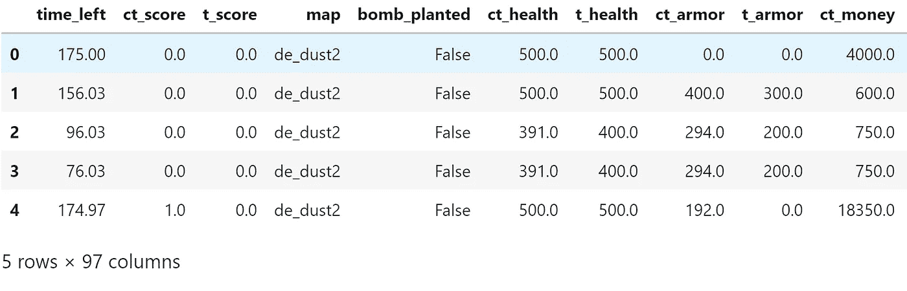
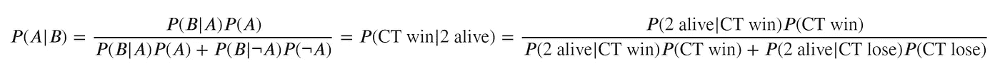
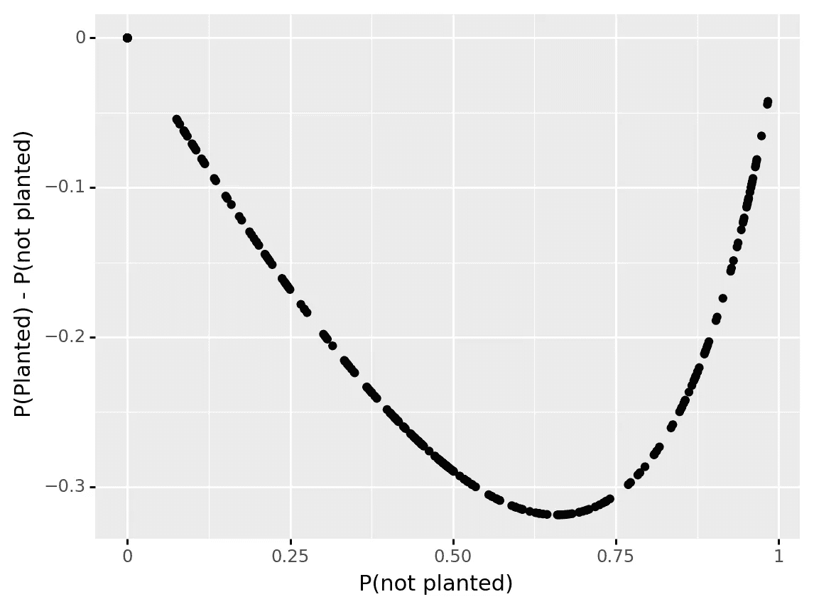
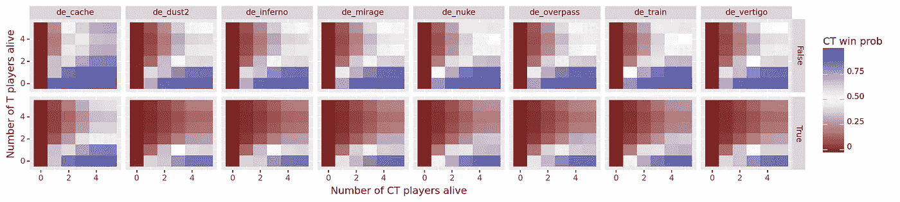

# 谁会赢得下一轮《反恐精英:全球攻势》？

> 原文：<https://towardsdatascience.com/who-will-win-the-next-round-of-counter-strike-global-offensive-de574a4f37f4?source=collection_archive---------37----------------------->

## *使用贝叶斯统计预测回合获胜概率*

*的文章、代码和数据可以在 github 上的*[](https://github.com/PaulHiemstra/bayes_csgo_round)*找到*

# *介绍*

*像在其他领域一样，统计和数据的使用在电子竞技中有所增长。一个具体的领域是电子竞技广播，其中统计数据用于增强和改善观看体验。最近一个让我印象深刻的例子是 [Blast Spring CS:GO 总决赛](https://liquipedia.net/counterstrike/BLAST/Premier/2021/Spring)的一部分，在比赛中展示了一轮获胜概率“AI 预测”。随着回合的展开，这个概率被更新。例如，一个反恐(CT)玩家倒下会降低 CT 获胜的概率。我脑子里的齿轮立即开始转动:除了不称之为“人工智能预测”之外，我如何实现这样一个舍入预测器。在这篇文章中，我将提出我的解决方案，使用贝叶斯统计来解决这个问题。使用这种方法，需要回答的问题可能是:*

*   *放置炸弹时 1v1 获胜概率如何变化*
*   *当炸弹被放置时，获胜的概率一般是怎样变化的*
*   *当 CT 或 T 玩家倒下时，获胜概率如何变化*
*   *地图对获胜概率有什么影响*

*反恐精英玩家可以利用这些信息在特定情况下做出明智的决定。此外，一个团队可以使用总的获胜概率，并用它们来衡量自己。例如，你的 4v5 胜率与整体 4v5 胜率相比如何。*

*在接下来的几节中，我将慢慢建立统计模型。*

# *还剩两个 CT*

*我想解决的第一个问题是当两个 CT 玩家活着的时候，CT 获胜的概率。一般来说，活着的玩家数量的减少应该会降低特定团队获胜的概率。但是在我们进入统计之前，首先我们必须确定使用什么数据。*

*为了计算这种可能性，我使用了大量的历史数据(感谢基督徒！):*

```
*122410
Index(['time_left', 'ct_score', 't_score', 'map', 'bomb_planted', 'ct_health',
       't_health', 'ct_armor', 't_armor', 'ct_money', 't_money', 'ct_helmets',
       <<<SNIP>>>>>
       't_grenade_flashbang', 'ct_grenade_smokegrenade',
       't_grenade_smokegrenade', 'ct_grenade_incendiarygrenade',
       't_grenade_incendiarygrenade', 'ct_grenade_molotovgrenade',
       't_grenade_molotovgrenade', 'ct_grenade_decoygrenade',
       't_grenade_decoygrenade', 'round_winner'],
      dtype='object')*
```

**

*该数据集在一轮 CS:GO 中提供了超过 122k 的快照，提供了该轮的属性，例如有多少 CT 仍然活着，哪些武器或工具仍然存在，等等。此外，它还列出了谁赢得了这一轮。回合属性和谁赢了回合的组合使我们能够计算赢的概率。*

*以下帮助器函数计算成功概率，在本例中只是计算总联系类型成功概率。*

```
*0.4901887100727065*
```

*其简单地计算例如`CT`赢得一轮的次数与总回合数的比值。在这种情况下，它显示 CT 赢得了 49%的回合。但是当然，我们有更多的数据可用，而不仅仅是我们属于哪个队，例如有多少 CT 球员仍然活着。为了扩展我们的回合获胜概率以包括该信息，我们转向[贝叶斯统计](https://en.wikipedia.org/wiki/Bayes%27_theorem)。*

*贝叶斯统计从 CT 获胜概率(𝑃(CT 获胜)的*先验*估计开始，在这种情况下，我们之前计算了总体获胜概率(0.49)。接下来，我们添加额外的证据，在这种情况下，我们知道只有 2 个 CT 玩家仍然活着。使用贝叶斯定理来计算*后验* CT 获胜概率(𝑃(CT 获胜|2 存活):*

**

*当剩下两个联系类型时，𝑃(2 活着|联系类型获胜)是联系类型获胜的*可能性*。等式右侧的所有项都可以使用我们的数据进行计算:*

```
*0.27515169576151494*
```

*因此，当一轮中剩下两名 CT 玩家时，获胜概率从 0.49 下降到 0.27。这是有道理的，因为 CT 玩家越少，CT 赢得这一轮的可能性就越小。*

# *de_cache 上还剩两个联系类型*

*为了使我们的 CT 获胜概率更加真实，我们将扩大我们放入贝叶斯定理的证据数量。这里我们添加了各队正在比赛的地图，`de_cache`。*

*假设这两个证据不相关(条件独立)，我们可以非常直接地扩展我们的公式。这里，除了两个联系类型处于活动状态的证据之外，我们还添加了我们在映射 de_cache 上使用的证据:*

**

*条件独立性的假设确保了新的似然𝑃(map 可以以这种简单的方式被插入。这导致以下后验 CT 获胜概率:*

```
*0.48211252170893965*
```

*这表明，给定 2 个 CT 在缓存上处于活动状态时，CT 获胜概率远远高于给定 2 个 CT 处于活动状态时的总体获胜概率，在本例中为 0.48 比 0.27。*

# *引入更多的证据*

*添加更多的证据当然会使我们的估计更准确。为了让我们的代码更灵活一点(我是一个懒惰的程序员)，我写了一些帮助函数，它允许我们传递任何我们想要的证据，只要它是我们数据集的一部分:*

```
*0.48211252170893965*
```

*这表明，通过在字典中提供证据，我们可以在缓存图中获得两个活动联系类型的相同后验概率。有了这些更灵活的代码，我们可以更自由地开始试验。例如，在这里，我们计算了 1v1 情况下放置炸弹前后的获胜概率:*

*这表明，当炸弹是*而不是*放置时，获胜概率稍微偏向于 T(CT 为 0.45)。这可能是因为 T 可以选择战斗发生的地点。当 T 成功放置炸弹时，概率会更有利于 T。*

# *炸弹工厂的更多细节*

*有了更灵活的代码，我们可以计算出更多的概率，包括剩下的 CT 玩家，剩下的 T 玩家，玩的地图以及炸弹是否被放置:*

*请注意，这段代码需要很长时间才能运行，而且肯定没有经过优化。*

*从这一大组概率中，我们可以得出一些有趣的见解。例如，炸弹工厂如何影响 CT 获胜概率:*

**

*其中 x 轴是放置炸弹前的 CT 获胜概率*，y 轴是放置炸弹后 CT 获胜概率的下降。在该图中，我们看到:**

*   *一般来说，放置炸弹后，CT 获胜的概率会下降*
*   *当 CT 已经有很高的输赢机会时，概率的变化就不大了*
*   *最大的变化发生在当联系类型的获胜概率在 0.62 左右时，下降到 0.3 左右。*

*职业 CS:GO 的一个要点是，在获胜的概率非常均匀的情况下，让 T 的植物和游戏进行重拍是有风险的。*

*为了扩大我们对炸弹工厂的探索，我绘制了双方存活玩家的数量，以及在瓦片图中放置炸弹工厂前后的获胜概率:*

**

*有趣的是:*

*   *一般来说，5v5 的获胜概率几乎是 50/50。de_cache 是一个例外，它在很大程度上依赖于 CT。在较小的程度上，这也适用于裁减核武器和取消训练。*
*   *当少于三名 CT 或 T 玩家存活时，CT 获胜概率发生最显著的变化。*
*   *失去团队成员会降低每个团队的获胜概率。*
*   *正如我们在前面的图表中看到的，当 T 设法放置炸弹时，CT 获胜的概率显著下降。*

# *有趣的前进方式*

*本文中的方法仍然很简单，一些可能的有趣的改进途径可能是:*

*   *添加更多的变量。这确实是一个挑战，因为数据集在计算获胜百分比时会越来越分散。另外，有些变量不是范畴。我目前的方法需要这样，所以这些必须分类。这可以使用`pd.cut`来完成。*
*   *超越条件独立的。现在我假设所有的证据都是有条件独立的，这通常是不正确的。使用一个[贝叶斯信念网络](https://en.wikipedia.org/wiki/Bayesian_network)我们可以整合各种证据之间的依赖关系。[这篇文章](https://machinelearningmastery.com/introduction-to-bayesian-belief-networks/)用 Python 很好地介绍了 BBN 的。*
*   *地图和 CS:GO 元数据的变化可能会使我目前用来计算概率的数据失效。要在实践中使用这样的系统，需要使用相关的最新数据，例如来自 hltv.org 的数据。理想情况下，将证据纳入贝叶斯定理的方法可能是有益的。例如，较旧的数据对最终数据的影响可能小于较新的数据。不过，我不确定如何在实践中实现这一点。*

# *我是谁？*

*我叫 Paul Hiemstra，是荷兰的一名教师和数据科学家。我是科学家和软件工程师的混合体，对与数据科学相关的一切都有广泛的兴趣。你可以在 medium 上关注我，或者在 LinkedIn 上关注 T4。*

*如果你喜欢这篇文章，你可能也会喜欢我的其他一些文章:*

*   *[掌握数据科学并不是学习一系列技巧](/mastering-data-science-is-not-learning-a-series-of-tricks-df66d8529c29)*
*   *[牛郎星图解构:可视化气象数据的关联结构](/altair-plot-deconstruction-visualizing-the-correlation-structure-of-weather-data-38fb5668c5b1)*
*   *[面向数据科学的高级函数式编程:用函数运算符构建代码架构](/advanced-functional-programming-for-data-science-building-code-architectures-with-function-dd989cc3b0da)*
*   *[通过规范化扩展您的回归曲目](/expanding-your-regression-repertoire-with-regularisation-903d2c9f7b28)*