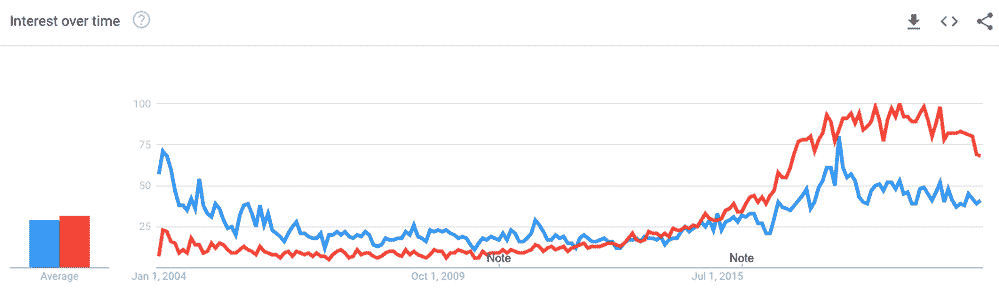
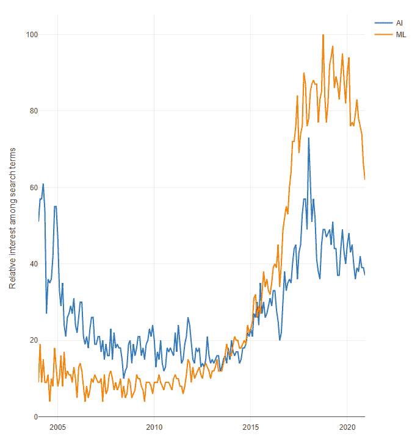
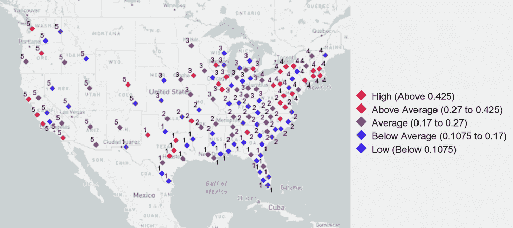

# 谁对 AI 和 ML 很好奇？

> 原文：<https://towardsdatascience.com/whos-curious-about-ai-and-ml-628a0347e483?source=collection_archive---------58----------------------->

## 日常的例子让“人工智能”和“机器学习”不仅对数据专家来说是熟悉的概念，对普通大众来说也是如此。但是*怎么*熟悉呢？对谁呢？

*博客预告图片由*[豪尔赫弗洛雷斯](https://unsplash.com/@jorgeflores?utm_source=unsplash&utm_medium=referral&utm_content=creditCopyText) *上* [*下*](https://unsplash.com/s/photos/curious?utm_source=unsplash&utm_medium=referral&utm_content=creditCopyText)

本周我们有一个特别的音频节目:沙盒播客迷你剧数据的[奖励集](https://community.alteryx.com/t5/Alter-Everything-Podcast/Data-in-the-Sandbox-Episode-6-Can-my-TV-read-my-mind/ba-p/684305)！我们用孩子们可以理解的方式解释“人工智能”和“机器学习”的含义，使用日常例子，如电视节目推荐、机器人吸尘器和数学作业。

这些日常例子使“人工智能”和“机器学习”不仅对数据专家来说是熟悉的概念，对普通大众来说也是如此。但是*怎么*熟悉呢？对谁呢？

谷歌趋势数据可以更精确地向我们展示这些术语有多流行，它们的用法如何随着时间的推移而变化，甚至它们在哪里更流行或更不流行。当然，这是一种分析方法，你可以使用各种关键词或短语，针对你最感兴趣的话题。

# 一段时间内的 AI/ML 利息

[谷歌趋势](https://trends.google.com/trends/?geo=US)帮助你探索人们搜索特定术语的次数。您可以一次比较多达五个术语，还可以查看地理细节(即，整个世界或特定国家的数据，以及美国、州、大都市地区或城市级别的数据)。

阅读趋势数据有点棘手。数据被标准化以反映搜索词的受欢迎程度，每个时间段的值从 1 到 100，100 反映该词的最高受欢迎程度。此外，悬停在地图位置上将提供从 1 到 100 的值，最频繁搜索该术语的位置得分为 100。(如果你想了解更多趋势，谷歌提供了深入的[课程](https://newsinitiative.withgoogle.com/training/lesson/5748139575214080?image=trends&tool=Google%20Trends)。)

如下所示，Google Trends 的网络界面提供了一种很好的方式来初步查看数据，随着时间的推移，相对搜索兴趣会被绘制出来，地图会自动显示。

作者图片(通过谷歌趋势)

但是，您会希望使用您最喜欢的软件进行更深入的挖掘，对吗？😉正如您可能猜到的，图右上角的小向下箭头将数据下载为 CSV 文件，以备进一步分析。地图显示也是如此。我下载了 2004 年至今美国大都市地区的数据。

下面是我的折线图在 Designer 中的样子——由于其更窄的布局，显得更有戏剧性:

作者图片

有趣的是，在 2013 年 10 月，美国对“机器学习”的搜索兴趣超过了对“人工智能”的兴趣，尽管人工智能的含义更广，而且流行文化也很熟悉。是什么让 ML 当时领先，并且之后几乎每个月都保持领先？

这种变化的一个可能原因可能是 Coursera 的增长，Coursera 成立于 2012 年，其特色是现在著名的由网站创始人之一吴恩达教授的机器学习课程。如今，它仍然是 Coursera 上最受欢迎的课程，注册人数达 380 万。

# 地理比较

将这些数据引入 Designer 后，可以将趋势数据与其他数据结合起来，包括 Designer 中包含的美国人口普查数据。例如，这允许我使用城市地区的名称来添加空间信息，并生成更具体、信息更丰富的地图。

我将谷歌趋势的地铁名称与来自[分配输入](https://help.alteryx.com/current/designer/allocate-input-tool)工具的数据中使用的名称进行了匹配，然后向趋势数据中添加了一些基本的人口统计信息和空间数据。我创建了一个新的变量，ML 中的搜索兴趣与 AI 中的搜索兴趣的比率。确定对机器学习相对于可能不太专业的术语“人工智能”有更大相对搜索兴趣的地方可能是有趣的这一比率从旧金山-奥克兰-圣何塞大都市地区的 0.69 到北卡罗来纳州威尔明顿的 0.07 不等(不包括对一个或两个词都没有搜索兴趣的城市)。

我还使用城市地区的纬度和经度，通过[K-质心聚类分析](https://help.alteryx.com/current/designer/k-centroids-cluster-analysis-tool)工具生成地理聚类。该工具与[追加集群](https://help.alteryx.com/current/designer/append-cluster-tool)工具相结合，将城市分配到组中。拥有一个“集群”变量允许我在数据中寻找地理模式，而不依赖于纬度和经度。这种方法生成了下面的地图，其中的城市按照它们的人工智能搜索兴趣比进行了颜色编码；钻石越红的城市比例越高，而钻石越蓝的城市则相反。城市的数字标识了它们的地理集群。

作者图片

美国东北部的人工智能与人工智能搜索兴趣的平均比率最高，为 0.29，美国西部排名第二，为 0.27。虽然我们可能会在旧金山地区和西雅图等美国主要科技中心看到更多的“机器学习”搜索，但在地理集群中脱颖而出的城市也很有趣，如弗吉尼亚州的夏洛茨维尔和宾夕法尼亚州的匹兹堡。随着学生研究数据科学主题，主要大学可能也会提高 ML 与 AI 的比率。

# 继续学习

那些搜索 AI/ML 的人就像我们的数据(在沙盒中)听众，嗯，就像我们所有人一样——只是试图跟上这个快速增长和变化的领域！感兴趣的关键术语和概念将会改变，但拥有数据驱动和好奇的心态有助于我们所有人保持在趋势的顶端。

查看沙盒奖励集的数据，并与你认识的一个年轻人分享人工智能/人工智能的阴谋！

*原载于* [*Alteryx 社区*](https://community.alteryx.com/t5/Data-Science/Who-s-Curious-about-ML-and-AI/ba-p/687168) *并精选于* [*Alteryx 数据科学门户*](https://community.alteryx.com/t5/Alteryx-Data-Science-Portal/ct-p/ds-portal/) *。*