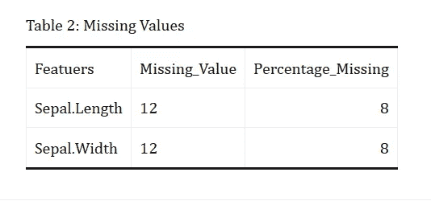

# 谁不见了？

> 原文：<https://towardsdatascience.com/whos-missing-d717ee657674?source=collection_archive---------62----------------------->


https://unsplash.com/@timmossholder

## 编写 Python 实用函数来计算要素方面的缺失值。

找出数据中缺少的东西是数据科学中令人头疼的数据争论任务之一。虽然它们是丢失的数据，但如果不指出并正确处理，它们会回来并长期困扰你！

在使用 Python 的项目中工作时，我发现找到丢失的数据很容易，但在笔记本中很好地呈现可能会很麻烦。因此，这是我的努力，使失踪的数据探索更容易和更有用。

# 动机

在 Python 中，我们可以使用简单的一行代码`data.isnull().sum`来列出数据集中缺失的数据。但是问题在于这个函数如何产生一个包含所有特性名称的完整列表，不管它们是否有任何缺失值。当所讨论的数据集是一个包含许多特性的大数据集时，在笔记本中可能看起来非常混乱。

为了克服这一点，在本教程中，我们将了解如何编写一个简单的效用函数，该函数将仅计算具有缺失观测值的要素的缺失值，并将其存储在数据框中，该数据框稍后可用于报告或可视化。

# 准备

## 工具和库

在本教程中，我将使用 RStudio 作为 IDE。因此我将使用 R 包 [Reticulate](https://rstudio.github.io/reticulate/) 来运行 Python 代码。

我将使用一个*迷你 Conda* 虚拟环境，后端的*好奇乔*作为 Python 环境。为了能够重现本教程，您可能想在 Conda 中创建自己的虚拟环境，并在`reticulte::use_condaenv()`函数中使用其名称。要了解有关创建和管理 Conda 环境的详细信息，您可以访问此[文档](https://docs.conda.io/projects/conda/en/latest/user-guide/tasks/manage-environments.html)。

```
# loading libraries
library(reticulate)
library(dplyr)
library(kableExtra)
library(knitr)# setting up virtual python environment
reticulate::use_condaenv("curious-joe")
```

## Python 函数

我们将看到的函数依赖于 Python 库 *Pandas* ，这是一个常用于数据争论和分析的库。

这个函数非常简单，你可以通过它来理解。但是对于 Python 编程的新手来说，这里有一个功能在函数内部流动的分解:

1.  创建一个字符串值列表， *colNames* 用于存储列名，
2.  用来自 *colNames* 的值作为列名创建一个空白数据框 *df* ，
3.  运行 for 循环以迭代输入数据框的每一列，并执行以下一系列任务:

*   计算列中缺失值的百分比，并将输出保存在名为 *p* 的对象中，
*   计算一列中缺失值的总数，并将输出保存在一个名为 *q* 的对象中，
*   检查 *p* 、缺失值的百分比是否大于零，如果大于零，则用列名及其相应的计数和缺失值的百分比填充空数据框 *df* 。
*   将结果数据帧 *df* 按降序排序，

1.  返回 *df* ，带有名称的数据框和带有缺失值的要素的缺失计数。

```
# pyhton library
import pandas as pd# @ countMissing
# Fetches columns from the spefied dataset that contains missing values
# @param dataFrame Name of the dataframe objectdef countMissing(dataFrame):
    # colNames = ['colNames', 'missingValue', 'missingValuePerc']
    colNames = ['Featuers', 'Missing_Value', 'Percentage_Missing']
    df = pd.DataFrame(columns = colNames)
    for i in dataFrame.columns:
        p = round((dataFrame[i].isnull().sum()/dataFrame.shape[0]) * 100, 2)
        q = round(dataFrame[i].isnull().sum(), 0)
        if p > 0:
            df.loc[len(df)] = [i, q, p]
    # creating data frame with the missing value columns and values   
    df = df.sort_values(['Percentage_Missing'], ascending = False).reset_index(drop=True)
    return(df)
```

# 演示

## 数据

为了演示该函数如何工作，我将使用 *iris* 数据集，并在数据中引入一些 *NA* 值(R 语言中的缺失值)。

```
# preparing data
data <- iris
data = data %>% mutate(Sepal.Width = ifelse(Sepal.Length >7, NA, Sepal.Width))
data = data %>% mutate(Sepal.Length = ifelse(Sepal.Length >7, NA, Sepal.Length))
```

在代码中，我们删除了 Sepal 的值。宽度和萼片。萼片时的长度特征。长度值大于 7。这导致 24 行缺少值。

## 应用

下面的代码块应用了我们刚刚创建的函数 *countMissing()* ，并打印出输出数据帧。

```
# calculating missing value using countMissing()
table = countMissing(r.data)
table##        Featuers Missing_Value  Percentage_Missing
## 0  Sepal.Length            12                 8.0
## 1   Sepal.Width            12                 8.0
```

让我们使用一些 R markdown 包来使输出看起来更好！

```
knitr::kable(py$table, caption = "Missing Values") %>%
  kable_classic(full_width = F, html_font = "Cambria")
```


# 我们改进了什么？

如果你查看一下 *countMissing()* 函数，你会发现我们使用的是 *isnull()。sum()* 内部，我们可以使用相同的函数来获得缺失的计数。我们创建 *countMissing()* 的唯一原因是确保缺失计数以一种更可展示和可用的方式产生。虽然当它们在更大的数据集上运行时，差异会更明显，但是下面的代码块显示了这两种方法的输出是如何不同的。

```
r.data.isnull().sum()## Sepal.Length    12
## Sepal.Width     12
## Petal.Length     0
## Petal.Width      0
## Species          0
## dtype: int64
```

**VS**

```
countMissing(r.data)##        Featuers Missing_Value  Percentage_Missing
## 0  Sepal.Length            12                 8.0
## 1   Sepal.Width            12                 8.0
```

**甚至更好的**

```
knitr::kable(py$table, caption = "Missing Values") %>%
  kable_classic(full_width = F, html_font = "Cambria")
```



在本教程中，我们基本上介绍了如何用 Python 编写函数。我们学会了如何编写自己的小效用函数来解决我们独特的问题。

# 感谢阅读！

通过阅读本文，您应该对 Python 中的函数是如何工作的，以及如何在您的数据分析中使用它有一个基本的了解！

不确定接下来要读什么？我为你选了另一篇文章:

[](/is-that-red-wine-good-enough-49326a4c08e4) [## 那种红酒够好吗？

### 一个介绍性的教程，介绍预测建模的基本工作流程，并演示如何记录…

towardsdatascience.com](/is-that-red-wine-good-enough-49326a4c08e4) 

# 阿拉法特·侯赛因

*   ***如果你喜欢这个，*** [***跟我上媒***](https://medium.com/@curious-joe) ***了解更多***
*   ***让我们连线上*** [***领英***](https://www.linkedin.com/in/arafath-hossain/)
*   ***有兴趣合作？查看我的*** [***网站***](https://curious-joe.net/)