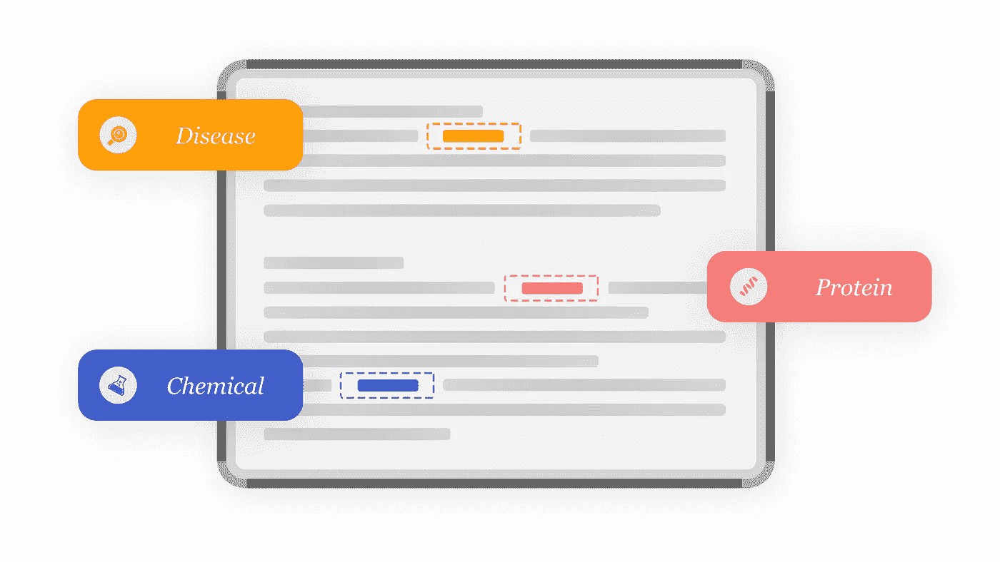
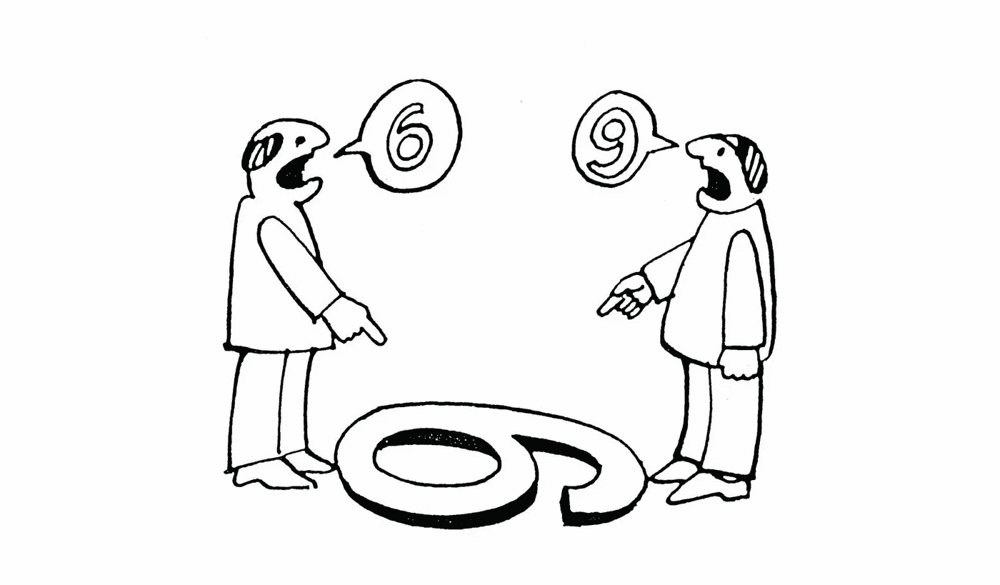
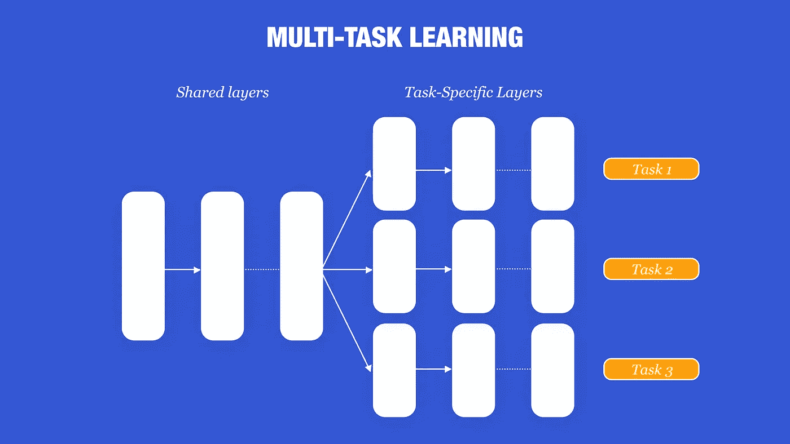

# 谁是谁，什么是什么:生物医学命名实体识别进展

> 原文：<https://towardsdatascience.com/whos-who-and-what-s-what-advances-in-biomedical-named-entity-recognition-bioner-c42a3f63334c?source=collection_archive---------20----------------------->

[国家癌症研究所](https://unsplash.com/@nci?utm_source=medium&utm_medium=referral)在 [Unsplash](https://unsplash.com?utm_source=medium&utm_medium=referral) 上拍摄的照片

## [思想与理论](https://towardsdatascience.com/tagged/thoughts-and-theory)

## 命名实体识别研究概述，以帮助解决与生物医学领域相关的挑战。

# 介绍

在 [Slimmer AI](https://www.slimmer.ai/) ，我们一直在探索生物医学领域的 NER(BioNER)。这种探索很重要，因为有一些挑战在其他领域并不总是存在，包括:

*   数据通常不能自由获取，尤其是在临床病例中。
*   数据注释需要专业知识。
*   生物医学概念的空间是巨大的，这使得 NER 系统不太可能超越它们被注释的特定设置。

本文概述了命名实体识别工作和研究，以帮助解决与生物医学领域相关的挑战，如生物医学数据集和处理它们的技术。我还将讨论迁移学习和多任务学习在这一领域的重要性。我将快速介绍一些 BioNER 的替代方法，与基于深度学习的流行模型(如 BERT)进行比较。

# NER 发展概述

命名实体识别(NER)是自然语言处理的组成部分之一，被用于许多下游任务，如问题回答、主题建模和信息检索。**【1】**该任务涉及使用诸如人、组织、位置等类别来标记非结构化文本中的实体。

命名实体识别的目标是将单词识别为实体，并对它们所属的实体类型进行分类。图片作者，灵感来自 [MonkeyLearn](https://monkeylearn.com/blog/named-entity-recognition/) 。

早期的 NER 系统使用手工制作的规则、词汇、拼写特征和本体。**【1，2】**诸如此类的模型有一些好处，比如它们不需要带注释的训练数据。然而，这些模型有几个缺点。例如，词典需要详尽，相关词典需要由领域专家主动更新。

随着这一领域的发展，人们开始使用机器学习，但这种方法也有其缺点，如费力的特征工程。最近，引入了端到端深度学习方法，并消除了对每个特定数据集手动设计特征的需要。尽管缺乏特定领域的规则和知识，这些特征推断网络优于特征工程系统。**【1】**

# 数据集噪声和偏差

许多带注释的数据集已被引入生物医学领域，包括实体类别，如细胞系、化学、疾病、基因、蛋白质和物种。他们中的大多数使用 [PubMed](https://pubmed.ncbi.nlm.nih.gov/) 的文章作为他们的来源，这已经被一些领域专家注释过了。对于流行的 BioNER 数据集的概述，GitHub 上由 [Flair](https://github.com/flairNLP/flair/blob/master/resources/docs/HUNFLAIR_CORPORA.md) 或[this overview](https://github.com/bionlp-hzau/BioNLP-Corpus)所做的评论是很好的参考。

NER 数据集最突出的问题之一是数据集是不完美的，这并不局限于生物医学领域。例如，大多数人——如果不是全部的话——都会遇到注释者不同意或者缺少注释的问题。

李等人强调数据注记质量是领域的主要挑战之一。**【2】**举几个例子，MedMentions 语料库的创建者通过让生物学家审查专业注释者所做的注释来评估注释质量，并报告了 97.3%的一致性。**【3】**2004 年的 JNLPBA 任务在 2019 年有了一个修订版，试图修复原始语料库中的不完善之处。**【4，5】**有两轮注释，注释者在两轮之间讨论了一些分歧。在第一轮中，注释的一致性为 79.5%，而在第二轮中为 91.4%。这离 100%还是挺远的。Wang 等人分析了广泛采用的 CoNLL03 数据集，能够在大约 5.38%的测试句子中识别错误。鉴于最先进的测试分数已经达到 93%左右，他们进一步强调了这一点的重要性。

根据知识或视角，插图或文字可以有不同的解释。这可能导致注释者不同意和不完善的数据集。图片由 [Pixy](https://pixy.org/4537282/) 提供。

发现注释错误需要深厚的专业知识和大量的时间投入。为了用另一种方式处理它们，王等人引入了一个叫做 CrossWeigh 的框架。他们的解决方案很简单，但确实需要相当长的运行时间。想法是训练多个模型，每个模型基于训练数据的不同分割。分割或折叠是以这样的方式建立的，即训练集不包含来自相应测试集的任何术语。不正确的预测在所有测试集上聚集，并且这个过程重复几次迭代(给定不同的随机种子来创建折叠)。直觉告诉我们，如果一个术语在每个文件夹中都被错误分类，那么这个注释可能是不正确的。然后通过在训练期间给它们较小的权重来抑制这些注释。随着 F1 分数提高 0.2-0.4%，他们注意到他们的模型变得更加稳定，在多次运行中 F1 分数的标准偏差更低。

正如在许多机器学习任务中显而易见的那样，数据集通常包含偏见。NER 也不例外。识别在训练(记忆)期间看到的实体提及和处理形态变化(同义词概括)通常不会对像(生物)BERT 这样的大模型造成问题。**【8】**然而，Kim 和 Kang 发现，BioNER 模型经常利用数据集偏差，并且未能归纳出在训练期间未见过的概念。**【8】**他们分析了 BC5CDR 数据集中的 50 个分类错误，发现 BioBERT 在其中 34%的情况下使用了统计线索。

为了解释他们滥用了什么样的线索，让我们首先快速查看一下 NER 数据集中最常用的格式:[内-外-开始注释模式](https://en.wikipedia.org/wiki/Inside%E2%80%93outside%E2%80%93beginning_(tagging))) (IOB)。当一个实体由多个(子)字组成时，例如组织' Slimmer AI '，第一个字' *Slimmer* '以 ***B-*** 为前缀，表示一个实体的开始， *'AI'* 以 ***I-*** 为前缀，表示一个字是前面实体的一部分。不属于实体的单词用 ***O*** 标注。这种格式有助于区分文本中的连续实体。

用 IOB-scheme 注释的例句。 *Slimmer AI* 是一个组织实体，由两部分组成: *Slimme* r，前缀为 *B-* 和 *AI* ，前缀为 *I-* 。其他单词不是实体，用*或*标注。图片作者。

Kim 和 Kang 发现，一些单词只在训练集中与 ***B-*** 一起出现，因此在测试集中总是被归类为 ***B-*** ，导致不正确的预测。**【8】**为了解决这种偏差，他们提出了基于偏差乘积法的去偏差程序。**【9】**结果，这些模型确实对记忆性能产生了一点影响，但它们在同义词和概念概括方面有所改善。然而，他们的去偏置方法可能会减少在实体中使用有效模式的机会。这种模式的例子有“__ street”和“__ disease”，它们是非常相关的模式，可以用来促进概念的泛化。作者指出这是未来的工作。

生物医学领域的另一个大问题是，通常很难获得由专家注释的大型数据集。如果你碰巧找到这样一个黄金标准的语料库，它们通常都很小。为了解决小数据集的问题，你可以利用迁移学习、多任务学习或少量学习。

# 迁移和少量学习

使用预先训练的模型和应用迁移学习技术是当今 NLP 社区的常见做法，可以显著提高下游任务的性能。将它应用于 BioNER 任务也不例外，因为基于大量生物医学数据训练的几个模型已经开源并被频繁使用。最突出的模型之一是 BioBERT，首先在一般领域语料库上进行预训练，随后在 PubMed 等生物医学领域语料库上进行预训练。**【10】**为了说明开源这些模型如此重要的原因，仅生物医学领域预培训的后半部分就花费了 23 天时间，使用了 8 个 Nvidia V100 GPUs。这对中小型企业来说是一笔不小的投资。另一个取得显著成功的模型是 HunFlair 模型，它在 23 个生物医学数据集上进行训练，远远超过 SciSpaCy 和 HUNER 等 BioNER 模型。**【11，12，13】**使用领域特定模型而不是普通模型提高下游任务性能的证据是压倒性的。**【8，10，11，14–18】**

展示迁移学习概念的高级概述。在一个数据集上训练的模型的一部分被转移，并在另一个任务上进一步微调。图片由作者提供，灵感来自 [TopBots](https://www.topbots.com/transfer-learning-in-nlp/) 。

与随机初始化的 LSTM 相比，HunFlair 模型利用预训练，在不同类别的 F1 分数上提高了 0.80-4.75%。观察到的增加主要是由更高的回忆引起的。他们的模型和训练数据可以在[他们的 GitHub](https://github.com/flairNLP/flair/blob/master/resources/docs/HUNFLAIR.md) 页面上找到，而且，由于它是流行的[风格](https://github.com/flairNLP/flair) Python 库的一部分，你可以很容易地根据自己的喜好扩展这个模型。**【19】**

Peng 等人引入了生物医学语言理解评估(BLUE)基准，其中 BioNER 是标准之一，以促进预训练模型开发中的研究(有关 BLUE 的更多信息，请查看各自的 [GitHub 页面](https://github.com/ncbi-nlp/BLUE_Benchmark))。**【16】**他们评估了几个 BERT 和 ELMo 基线，发现根据 PubMed 摘要和 MIMIC-III 临床笔记预先训练的 BERT 模型取得了最好的结果。**【20】**他们的模型被恰如其分地命名为 BlueBERT，在所有数据集上均优于 ELMo、BioBERT 和其他最先进的模型。最佳模型设置在 BioBERT 上提高了 8.9 F1 分，单个数据集平均提高了 1.8 分。

Giorgi 和 Bader 利用银标准语料库，这些语料库往往更大，但质量较低。**【17】**这样的语料库可以通过使用现有的 NER 模型来标注大的、未标记的语料库来生成。作者通过首先在这些银标准语料库上进行训练，然后在金标准语料库上进行微调，在几个数据集上实现了 11%的错误减少。对于注释很少的数据集(< 6000)，改进特别大。

预培训也带来了应用一些技术的机会，比如少量学习:只使用少量标签来微调你的模型。这是一项非常有用的技术，尤其是在缺少带注释数据的领域。Hofer 等人评估了在医学领域中处理这种小数据集的五种技术，直到仅使用 10 个训练样本。**【21】**作为基线，他们使用了一个基于当时为 CoNLL-2003 和 OntoNotes 5.0 调整的最先进模型的模型。**【7，22】**改善他们的少数镜头学习任务的技术之一涉及使用更多样本对相关数据集进行预训练。在对几个数据集进行测试后，他们在最佳设置下的 F1 分数比基线提高了 4.52%。使用同一个域中的数据集明显优于使用另一个域中的数据集。

另一种设置利用多个单独的数据集，并对所有数据集进行组合预训练。有趣的是，与使用单一数据集进行预训练相比，作者报告了-1.66%的负面影响。作者指出，这可能是由他们的训练策略引起的，因为他们使用了针对单独数据集优化的超参数。他们进一步认为，通过对第一个数据集进行预训练获得的权重可能不适合第二个数据集。值得注意的最后一种技术是使用专门在生物医学文本上训练的单词嵌入作为输入，而不是使用普通的手套嵌入。**【23】**这让他们的 F1 得分又提高了 3.78%。所有技术的结合使他们的 F1 分数从 69.30%提高到 78.87%，这是一个很好的提高。

# 多任务学习

除了应用迁移学习，另一种流行的方法是使用多任务学习:不仅训练手头的任务，还包括其他相关任务，以提高主要任务的表现。这背后的概念是，相似的任务或数据集具有语义和语法的相似性，这有助于为手头的任务训练更优化的模型。此外，它可以减少过度拟合的机会。常见的任务包括标注词性(POS)标签、句法成分和依赖关系。**【2，14】**此外，这些任务的数据相对容易获得，因为语法特征可以使用现成的工具包获得，如 [NLTK](https://www.nltk.org/) 或 [Stanford CoreNLP](https://stanfordnlp.github.io/CoreNLP/) 。

应用多任务学习的示例架构。第一层由不同但相关的任务共享。图片由作者提供，灵感来自 [Ruder.io](https://ruder.io/multi-task/) 。

Tian 等人尝试使用键值记忆网络将句法特征结合到 BioBERT 模型中，并看到其性能提高了约 0.2–0.9% F1。这听起来可能不多。然而，当考虑到一些数据集上的一些模型已经在 90%以上的范围内执行时，这样的增加可能是显著的。

Wang 等人将使用具有不同实体类型的多个数据集的训练视为多任务问题。**【18】**他们通过迭代遍历数据集来训练不同的 BioNER 模型，同时在这些模型之间共享一些参数。在 15 个数据集的 14 个数据集上，它们优于之前的最先进水平，f 1 得分提高了 0.2%至 1.8%。

Khan 等人采用了类似的方法，但他们将他们的模型视为一个单一的模型，每个任务都有共享的底层和特定的顶层。**【15】**对于下层，他们使用了预训练的 BioBERT 模型。在三个数据集上的训练产生了最佳性能，与单任务学习模型相比，F1 分数提高了 0.2-1.3%，并在王等人的模型上进一步提高了 0.7-2.3% F1。

应用多任务学习的一种独特方式是让多个单一模型进行协作。CollaboNet 是一个应用这一技巧的框架，它使用在不同数据集上训练的特定模型来完成不同的任务。**【24】**作者指出，常规的多任务学习产生的模型在回忆上得分较高，但精确度较低。因为这些模型是针对几种不同的实体类型进行训练的，所以它们在预测正确的实体类型时往往会有困难。此外，作者确定了生物医学领域的一个问题，即实体可以根据上下文被标记为不同的实体类型。有些词在一种语境中可以表示基因，在另一种语境中可以表示疾病。

使用 CollaboNet，他们试图通过为协作的每种实体类型建立专家模型来解决这个问题。在训练期间，这些模型轮流被更新或作为合作者。每个模型接收协作者模型的输出，并将其用作辅助输入。因此，每个模型都被认为是自己领域的专家，同时通过利用多领域信息来提高其他模型的性能。与王等人相比，CollaboNet 的 F1 得分提高了 0.2-5.0%。**【18】**值得注意的是，使用 BiLSTM-CRF 架构的 CollaboNet 已经被 BioBERT 超越。然而，该框架本身仍然可以应用于更先进的模型，进一步提高它们的分数。然而，人们需要足够的记忆和时间来应用它。

缓解内存和时间问题的一种方法是使用较小的网络，或者使用利用权重共享的网络。一个很有前途的模型是生物阿尔伯特，基于(你猜对了):阿尔伯特。除了他们的参数缩减技术来加速模型，作者不仅在 NER 的任务上训练他们的模型，而且还应用了句序预测。这种技术从训练数据中提取两个连续的句子和两个随机的句子，并尝试预测一个句子是否跟随另一个句子。这允许模型更好地学习依赖于上下文的表示。

BioALBERT 在几个数据集上的表现一直优于 BioBERT，而且常常是大幅度领先，他们报告的分数相当可观。随着参数的减少，训练时间减少了大约 2-3 倍:这是一个巨大的胜利！作者在 [Github](https://github.com/usmaann/BioALBERT) 上公开了他们的模型。

# 基于知识的 NER 和本体论

当您由于昂贵且劳动密集型的标注过程而没有大量已标记数据时，可能有另一种训练模型的方法:基于知识的 NER。基于知识的 NER 模型基于与本体和注释的对应关系进行分类。

照片由[德文神](https://unsplash.com/@lightrisephoto?utm_source=medium&utm_medium=referral)在 [Unsplash](https://unsplash.com?utm_source=medium&utm_medium=referral)

具有挑战性的 MedMentions 数据集将他们的注释建立在广泛的 [UMLS](https://www.nlm.nih.gov/research/umls/index.html) 本体论的基础上。**【3】**这个丰富的本体包含了数百万个概念，在几个专注于创建仿生系统的研究中使用。MedMentions 数据集“仅”标注了 35.2 万次 UMLS 概念，但它仍然是最具挑战性的数据集之一。大量的概念使得任何模型都难以记忆或概括。因此，在这个数据集上表现最好的基于 BERT 的模型达到大约 56% F1 的测试分数就不足为奇了。**【27】**我的同事 [Stephan Tulkens](https://medium.com/u/d4d520c0dfe?source=post_page-----c42a3f63334c--------------------------------) 的后续博客文章将尝试使用无监督方法处理 MedMentions 数据集，敬请关注！

回到基于知识的:2013 年，Zhang 和 Elhadad 通过对语料库中每个出现的 TF-IDF 向量进行平均，为每个出现的实体类型创建了签名向量。然后，将这些向量与所有名词短语块的向量进行比较，以识别所有实体。它优于传统的基于字典的方法，但低于最近的监督方法。

吉亚斯万德和凯特通过几项改进超过了张和艾尔哈达德。【28,29，29】他们只使用明确的 UMLS 项作为种子项来生成正反例。这些例子的句法和语义特征被用于训练决策树的集合。这个模型的输出然后被用来扩展例子，以包括模糊的 UMLS 术语。这个循环重复了几次。该方法优于其他非监督方法，并且在一些实体类上，它的性能与使用手动注释的监督系统相当。

类似地，De Vine 等人从自由文本笔记中学习概念嵌入，首先使用 UMLS 附带的匹配器提取概念。**【30】**然后，他们用概念的 ID 替换文本中的任何跨度，然后通过应用 skip-gram(例如，word2vec)学习概念嵌入。通过在两个小数据集上将概念之间的余弦距离与人类判断相关联来评估这些概念，并获得了积极的结果。

Beam 等人采用了类似的方法，后来他们的嵌入技术[公开发布](http://cui2vec.dbmi.hms.harvard.edu/)。**【31】**Phan 等人通过使用一种“暹罗”网络来学习姓名嵌入:他们使用预先训练的单词嵌入和字符嵌入作为 BiLSTM 的输入。**【32】**然后使用 BiLSTM 的输出来计算三个损失:一个损失是惩罚同义词之间的距离(即同义词应该靠得很近)，一个损失是惩罚名称和概念(即由名称表示的概念)之间的距离，一个损失是惩罚到“局部上下文”的距离(即概念出现在其中的单词嵌入的平均值)。).他们的模型在许多检索、相似性和关联性任务上优于其他基线。

脸书人工智能的研究人员提出了无监督知识增强语言模型(KALM)，它用知识库增强了传统的语言模型，端到端地训练以优化[困惑](https://en.wikipedia.org/wiki/Perplexity)。**【33】**在训练过程中，在给定目前观察到的上下文和作为输入的知识库的情况下，它使用门控机制来控制一个单词是一般单词还是应该被建模为对实体的引用。它随后在预测时间期间使用这种门控机制来预测一个单词是否是一个实体。它不需要任何额外的信息，例如在文本语料库中标记的命名实体标签，并且仍然实现了与现有技术的监督模型相当的性能。

Karadeniz 和 ozgür 解决了实体规范化的问题:将实体映射到一个本体/字典，这对理解被识别的实体是必要的。**【34】**由于几个原因，这在生物医学领域不是一个要解决的小问题。如前所述，通常存在歧义问题——实体可能根据上下文具有不同的语义。此外，还存在识别在文本中以不同表面形式出现的概念(例如，现在和过去时态，或缩写)的挑战。

作者通过使用带有句法分析信息的预训练单词嵌入，以无监督的方式利用语义和句法信息。他们获得了一个新的最先进的精确分数，以 2.9 个百分点的优势击败了之前的最先进分数。

但是，当您想要提取的实体没有在文本中明确提到，而是；含蓄？举个例子，假设一个句子包含*水解*这个词。单词*水*或 *H2O* 没有被明确地提到，但是你可以推断水参与了这个过程。

Shoshan 和 Radinsky 创造了潜在实体提取(LEE)的任务，在这里你试图识别这些隐含的实体。**【35】**在他们的研究中，作者使用[反应体](https://reactome.org/)本体集中于生化反应领域。他们使用预训练的单词嵌入和顶部的 BiLSTM 分类器训练了几个一对一对所有分类器，一个分类器用于一种类型的实体。这里还应用了多任务学习，不仅训练每个分类器的指定实体类型，还训练其他相关类型。作者表明，他们的模型在识别这些潜在实体方面达到了很高的性能。作者得出结论，LEE 任务将显著改进许多 NER 系统和基于它们构建的应用程序。

# 结束语

生物医学命名实体识别的挑战是不可低估的。幸运的是，对于我们所有在软件产品开发中积极应用人工智能的人来说，有许多聪明的头脑帮助我们处理这个复杂的领域。

我被我们可以用来走得更远的许多“技巧”所鼓舞。例如，您可以使用 CrossWeigh 框架来处理嘈杂的注释，识别和去偏差您的数据，或者使用银标准语料库来预训练您的模型。如果有机会的话，你当然应该在相关的任务中利用迁移学习和多任务学习。

有许多预先训练的模型可用，您可以从多任务学习方案中进行选择。而且，如果你没有可用的带注释的数据，我建议求助于基于知识的系统，它利用本体论或任何其他种类的知识库。最后，考虑在你的文本中是否有隐含的实体。如果是这样，一定不要忽视它们，无论如何都要尝试提取它们。

最后一点:我确信我们已经错过了文献中一些有趣和有前途的技术。如果你知道任何，请在评论中留下回复，与社区的其他人分享(你太棒了)。祝你的 BioNER 之旅好运！感谢我的同事[米歇尔·范·德·斯蒂格](https://medium.com/u/c5b3cf7064de?source=post_page-----c42a3f63334c--------------------------------)和[斯蒂芬·图尔肯斯](https://medium.com/u/d4d520c0dfe?source=post_page-----c42a3f63334c--------------------------------)为这项研究做出的贡献。

# 参考

**【1】**v . Yadav 和 S. Bethard，[深度学习模型命名实体识别近期进展综述](https://www.aclweb.org/anthology/C18-1182/) (2018)，第 27 届计算语言学国际会议论文集。

**【2】**j . Li，A. Sun，J. Han，C. Li，[面向命名实体识别的深度学习综述](https://ieeexplore.ieee.org/abstract/document/9039685) (2020)，IEEE 知识与数据工程汇刊。

**【3】**s . Mohan 和 D. Li， [MedMentions:一个用概念标注的大型生物医学语料库](https://arxiv.org/abs/1902.09476) (2019)，2019 年自动化知识库构建会议论文集。

**【4】**j . d . Kim，T. Ohta，Y. Tsuruoka，Y. Tateisi 和 N. Collier，[jnl PBA 生物实体识别任务介绍](https://www.aclweb.org/anthology/W04-1213/) (2004)，生物医学自然语言处理及其应用国际联合研讨会会议录。

**【m . Huang，P. Lai，R.T. Tsai，W. Hsu，[修订版 JNLPBA 语料库:用于关系抽取任务的生物医学 NER 语料库修订版](https://arxiv.org/abs/1901.10219) (2019)，arXiv:1901.10219【cs .IR】。**

****【6】**z . Wang，J. Shang，L. Liu，L. Lu，J. Liu，J. Han， [CrossWeigh:从不完全标注训练命名实体标记器](https://arxiv.org/abs/1909.01441) (2019)，arXiv:1909.01441【cs .CL】。**

****【7】**e . f . Tjong Kim Sang 和 F. De Meulder，[CoNLL-2003 共享任务介绍:独立于语言的命名实体识别](https://www.aclweb.org/anthology/W03-0419/) (2003)，HLT-NAACL 2003 第七届自然语言学习会议论文集。**

****【8】**h . Kim 和 J. Kang，[你们的生物医学命名实体模型是如何推广到小说实体的？](https://arxiv.org/abs/2101.00160) (2021)，arXiv:2101.00160【cs。CL】。**

****【9】**c . Clark，M. Yatskar 和 L. Zettlemoyer，[不要走捷径:基于集成的避免已知数据集偏差的方法](https://www.aclweb.org/anthology/D19-1418/) (2019)，2019 年自然语言处理经验方法会议和第九届自然语言处理国际联合会议论文集。**

****【10】**j . Lee，W. Yoon，S. Kim，D. Kim，S. Kim，C. Ho So 和 J. Kang， [BioBERT:一种用于生物医学文本挖掘的预训练生物医学语言表示模型](https://academic.oup.com/bioinformatics/article/36/4/1234/5566506) (2020)，生物信息学。**

****【11】**l . Weber，m . singer，J. Münchmeyer，M. Habibi，U. Leser 和 A. Akbik， [HunFlair:一种用于最新生物医学命名实体识别的易用工具](https://academic.oup.com/bioinformatics/advance-article-abstract/doi/10.1093/bioinformatics/btab042/6122692) (2021)，生物信息学。**

****【12】**m . Neumann，D. King，I. Beltagy 和 W. Ammar， [ScispaCy:生物医学自然语言处理的快速鲁棒模型](https://arxiv.org/abs/1902.07669) (2019)，arXiv:1902.07669【cs .CL】。**

****l . Weber，J. Münchmeyer，t . rocktschel，M. Habibi，U. Leser， [HUNER:用预训练改善生物医学 NER](https://academic.oup.com/bioinformatics/article/36/1/295/5523847)(2019)，生物信息学。****

******【14】**【2020】田永辉，沈文伟，宋永辉，夏，何，李，[利用句法信息改进生物医学命名实体识别，BMC 生物信息学。](https://bmcbioinformatics.biomedcentral.com/articles/10.1186/s12859-020-03834-6)****

******【15】**m . r . Khan，M. Ziyadi 和 M. Abdelhady， [MT-BioNER:使用深度双向变换器的生物医学命名实体识别的多任务学习](https://arxiv.org/abs/2001.08904) (2020)，arXiv:2001.08904 [cs .CL】。****

******【16】**【y . Peng，S. Yan，和 Z. Lu，[生物医学自然语言处理中的迁移学习:在十个基准数据集上对 BERT 和 ELMo 的评估](https://www.aclweb.org/anthology/W19-5006/) (2019)，第 18 届 BioNLP 研讨会和共享任务会议录。****

******【17】**j . m . Giorgi 和 G.D. Bader，[用神经网络进行命名实体识别的迁移学习](https://www.aclweb.org/anthology/L18-1708/) (2018)，第十一届语言资源与评价国际会议论文集。****

******【18】**x . Wang，Y. Zhang，X. Ren，Y. Zhang，M. Zitnik，J. Shang，C. Langlotz，J. Han，[深度多任务学习的跨类型生物医学命名实体识别](https://academic.oup.com/bioinformatics/article/35/10/1745/5126922) (2018)，生物信息学。****

******【19】**a . AK bik，D.A. Blythe 和 R. Vollgraf，[用于序列标注的上下文字符串嵌入](https://www.aclweb.org/anthology/C18-1139/) (2018)，第 27 届计算语言学国际会议论文集。****

******【20】**a . e . w . Johnson，T.J. Pollard，L. Shen，L.H. Lehman，M. Feng，M. Ghassemi，B. Moody，P. Szolovits，L.A 和 R.G. Mark， [MIMIC-III，一个可免费访问的危重病数据库](https://www.nature.com/articles/sdata201635) (2016)，科学数据。****

******m . Hofer，A. Kormilitzin，P. Goldberg 和 A. Nevado-Holgado，[医学文本中命名实体识别的少镜头学习](https://arxiv.org/pdf/1811.05468.pdf) (2018)，arXiv:1811.05468【cs .CL】。******

******E. Hovy，M. Marcus，M. Palmer，L. Ramshaw 和 R Weischedel，[onto notes:90%解决方案](https://www.aclweb.org/anthology/N06-2015/) (2006)，NAACL 人类语言技术会议论文集。******

********【23】**j . Pennington，R. Socher 和 C.D. Manning， [GloVe:单词表示的全局向量](https://www.aclweb.org/anthology/D14-1162/) (2014)，2014 年自然语言处理经验方法会议论文集。******

******【24】**w . Yoon，C. So 和 J. Lee， [CollaboNet:用于生物医学命名实体识别的深度神经网络协作](https://bmcbioinformatics.biomedcentral.com/articles/10.1186/s12859-019-2813-6) (2019)，BMC 生物信息学。****

******【25】**u . Naseem，M. Khushi，V. Reddy，S. Rajendran，I. Razzak 和 J，Kim， [BioALBERT:一种简单有效的生物医学命名实体识别预训练语言模型](https://arxiv.org/abs/2009.09223) (2020)，arXiv:2009.09223【cs .CL】。****

******【26】**z . Lan，M. Chen，S. Goodman，K. Gimpel，P. Sharma 和 R. Soricut， [ALBERT:一个用于语言表征自我监督学习的 Lite BERT](https://arxiv.org/abs/1909.11942)(2019)，arXiv:1909.11942【cs .CL】。****

******【27】**k . c . Fraser，I. Nejadgholi，B. Bruijn，M. Li，A. LaPlante 和 K.Z. Abidine，[使用通用和特定领域深度学习模型从医学文本中提取 UMLS 概念](https://arxiv.org/abs/1910.01274) (2019)，arXiv:1910.01274【cs .CL】。****

******【28】**s . Zhang 和 N. Elhadad，[无监督生物医学命名实体识别:临床和生物文本实验](https://www.sciencedirect.com/science/article/pii/S1532046413001196) (2013)，生物医学信息学杂志。****

******【29】**o . Ghiasvand 和 R.J. Kate，[无人工标注的临床命名实体识别的学习](https://www.sciencedirect.com/science/article/pii/S2352914818301965) (2018)，医学信息学解锁。****

******【30】**l . De Vine，G. Zuccon，B. Koopman，L. Sitbon 和 P. Bruza，[用神经语言模型进行医学语义相似度](https://dl.acm.org/doi/10.1145/2661829.2661974) (2014)，第 23 届 ACM 信息与知识管理国际会议论文集。****

******【31】**a . l . Beam，B. Kompa，A. Schmaltz，I. Fried，G. Weber，N. Palmer，X. Shi，T. Cai 和 I.S. Kohane，[从多模态医学数据的海量来源中学习的临床概念嵌入](https://pubmed.ncbi.nlm.nih.gov/31797605/) (2018)，太平洋生物计算研讨会。****

******【32】**m . c . Phan，A. Sun，Y. Tay，[生物医学名称的鲁棒表征学习](https://www.aclweb.org/anthology/P19-1317/) (2019)，计算语言学协会第 57 届年会论文集。****

******【33】**a . Liu，J. Du，V. Stoyanov，[知识增强语言模型及其在无监督命名实体识别中的应用](https://www.aclweb.org/anthology/N19-1117/) (2019)，计算语言学协会北美分会 2019 年会议论文集:人类语言技术。****

******【34】**i̇.Karadeniz 和 a . ozgür，[使用单词嵌入和句法重排通过本体链接实体](https://bmcbioinformatics.biomedcentral.com/articles/10.1186/s12859-019-2678-8) (2019)，BMC 生物信息学。****

******【35】**e . Shoshan 和 K. Radinsky，[潜在实体提取:如何提取文本中没有出现的实体？](https://www.aclweb.org/anthology/K18-1020/) (2018)，第 22 届计算自然语言学习会议论文集。****