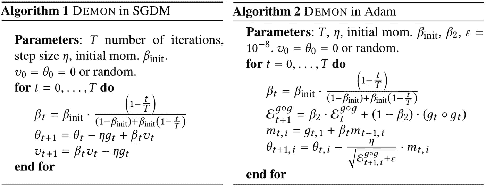

# 为什么是 0.9？走向深度学习中更好的动量策略。

> 原文：<https://towardsdatascience.com/why-0-9-towards-better-momentum-strategies-in-deep-learning-827408503650?source=collection_archive---------16----------------------->

## [**思想与理论**](https://towardsdatascience.com/tagged/thoughts-and-theory)

## 更复杂的动量策略如何让深度学习不那么痛苦。

(摘自鲍里斯·波亚克的《最优化导论》)

# 介绍

动量是一种广泛使用的策略，用于加速基于梯度的优化技术的收敛。动量被设计成在低曲率方向上加速学习，而在高曲率方向上不变得不稳定。在深度学习中，大多数实践者将动量的值设置为 0.9，而没有试图进一步调整这个超参数(即，这是许多流行的深度学习包中动量的默认值)。然而，没有迹象表明这种对动量价值的选择是普遍合理的。

在这篇文章中，我们概述了最近的研究表明，在整个训练过程中衰减动量值可以帮助优化过程。特别推荐一个新颖的*恶魔*动量衰减策略。为了支持这一建议，我们对动量衰减的不同策略进行了大规模分析，并与其他流行的优化策略进行了比较，证明了使用 *Demon* 进行动量衰减实际上是有用的。

***概述***

这篇文章将首先总结深度学习优化的相关背景知识，重点介绍当前训练深度模型的常用技术。在此介绍之后，将介绍并激励*恶魔*动量衰减策略。最后，我们将对 *Demon* 进行广泛的实证分析，并与各种流行的优化策略进行比较。 ***总的来说，我们旨在通过这篇文章证明，通过开发更好的策略来处理深度学习中的动量参数，可以获得显著的好处。***

# 背景

对于任何深度学习实践者来说，训练模型在计算上可能是昂贵的，这并不奇怪。当考虑超参数调整过程时，模型训练的计算费用甚至进一步加剧。例如，当考虑超参数调整时，一些最先进的语言模型可以花费数百万美元在公共云资源上进行训练(参见[此处](https://arxiv.org/abs/2004.08900)了解更多细节)。为了避免如此巨大的训练费用，深度学习社区必须发现优化策略，这些策略使得 *(i)* 有助于快速收敛， *(ii)* 能够很好地概括，并且 *(iii)* 对于超参数调整(相对)健壮。

带动量的随机梯度下降(SGDM)是一种广泛用于深度学习优化的工具。在计算机视觉(CV)领域，SGDM 被用来在几个著名的基准测试中实现最先进的性能。但是，SGDM 的超参数在众所周知的数据集(如 ImageNet)上是高度可调的，因此，用 SGDM 训练的模型的性能通常对超参数设置很敏感。

为了减轻 SGDM 的弱点，开发了自适应的基于梯度的优化工具，其对模型内的每个参数采用不同的学习速率(即，基于一阶梯度信息的历史)。尽管已经提出了许多这样的自适应技术，Adam 仍然是最受欢迎的，而 AdamW 等变体在自然语言处理(NLP)等领域中很常见。尽管自适应方法的收敛速度有所提高，但它们在历史上一直难以达到与 SGDM 相当的泛化性能，并且仍然对超参数调整相对敏感。因此，即使是深度学习优化的最佳方法也是有缺陷的— *没有一种用于训练深度模型的单一方法总是最佳的*。

***这能怎么办？***

虽然没有单一的优化策略总是最好的，但我们证明了深度学习社区中很大程度上未探索的衰减动量策略提供了改进的模型性能和超参数鲁棒性。事实上， *Demon* 动量衰减策略与众多领域中流行的学习速率策略(例如余弦学习速率循环)相比，表现出更加一致的性能。尽管最近的一些研究已经探索了超过 0.9 的简单设置的调整动量，但是还没有进行大规模的经验分析来确定训练期间动量参数的最佳实践。*通过这篇帖子，我们希望解决这个问题，并使动量衰减成为深度学习优化的一个众所周知的选项。*

# 最佳动量随 Demon 衰减

虽然存在几种衰退势头的选择，但我们推荐*恶魔*策略，在本文<https://arxiv.org/abs/1910.04952>*中提出。 *Demon* 在实践中被广泛评估，并显示出优于所有其他动量衰减时间表。在这里，我们花时间来描述这种势头衰减策略，它的动机，以及如何在实践中实现它。*

## **什么是妖？**

**

*(图片由作者提供)*

*众多众所周知的衰变策略，包括*恶魔*策略，如上图所示，其中 x 轴代表训练从开始到结束的进程。这些策略中的大多数最初是作为学习率衰减时间表而被推广的。然而，在这篇文章中，我们也评估了每一个动量衰减的有效性。与其他衰减时间表相比，*恶魔*等到训练后期才显著降低动量值。因此，对于大多数训练，*恶魔*保持动量值接近 0.9，在后期训练阶段迅速衰减为零。 *Demon* 策略的动机是衰减梯度对所有未来训练更新的总贡献。关于*恶魔*的动机的更严谨的描述，可以参考[的关联论文](https://arxiv.org/abs/1910.04952)，它提供了更广泛的理论和直观的分析。下面的等式给出了 *Demon* 衰变时间表的确切形式。*

**

*恶魔衰变时间表(图片由作者提供)*

*这里，`t`表示当前迭代次数，`T`表示训练时的总迭代次数，β表示动量参数。因此，上面的等式产生了在 *Demon* 衰变纲图的训练的迭代`t`时动量参数的值。β的初始值代表动量参数的初始值。一般来说，可以使用值 0.9 来初始化β，但是在实践中观察到稍高的值会产生改进的性能(例如，0.95 而不是 0.9)。在所有情况下， *Demon* 用于将动量参数从训练开始时的初始值衰减到训练结束时的零。*

## *向现有优化器添加 Demon*

*虽然*恶魔*的衰变时间表并不复杂，但是确定如何将这个时间表整合到现有的深度学习优化器中并不是立即显而易见的。为了帮助理解如何将 *Demon* 用于 SGDM 和 Adam 等流行的优化器，我们在下面提供了这些优化器的 *Demon* 变体的伪代码描述。*

**

*SGDM 和亚当中的恶魔(图片由作者提供)*

*从上面的算法描述中可以看出，SGDM 和 Adam 优化器并没有因为添加了 *Demon* 而有很大的改变。特别是， *Demon* 仅用于修改 SGDM 和 Adam 中第一个矩估计(即训练期间随机梯度上的滑动平均)的衰减因子。优化器的其他方面都没有改变，这表明在实践中采用 *Demon* 实际上非常简单。*

## *代码中的恶魔*

*实现 Demon 时间表的代码也非常简单。我们在下面用 python 语法提供它。*

**

*Python 中的 Demon 代码(图片由作者提供)*

# *恶魔的实验分析*

*我们在实践中广泛评价*妖*。在几个数据集上提供了实验，如 MNIST，CIFAR-10/100，FMNIST，STL-10，Tiny ImageNet，PTB 和 GLUE。此外， *Demon* 经过了众多流行模型架构的测试，包括 resnet 和 Wide ResNets、非残差 CNN 架构(即 VGG)、LSTMs、变压器(即伯特微调)、VAEs、噪声条件分数网络和胶囊网络。我们使用 SGDM 和 Adam 进行基线实验，每个实验有 10 个不同的学习速率和动量衰减变量。此外，基线实验提供了广泛的最新优化策略，如 YellowFin，AMSGrad，AdamW，QHAdam，准双曲动量和聚集动量。我们的目标是在下一节中总结所有这些实验，并展示使用 *Demon* 进行动量衰减所带来的好处。*

## *大局*

*在执行的所有实验中(即所有数据集、模型和优化策略组合)，我们记录了与所有其他优化策略相比，每个优化策略产生前 1 或前 3 性能的次数。直观地说，这种度量反映了优化策略在模型和领域中的一致性。下面给出了最佳性能优化策略的性能统计数据。*

**

*不同优化策略的前 1 名和前 3 名性能比率(图片由作者提供)*

*从上面可以看出， *Demon* 在不同的域中产生了极其一致的性能。特别是，它在近 40%的实验中产生了任何优化策略的最佳性能——比第二好的余弦学习率时间表绝对提高了 20%。此外， *Demon* 与其他优化器相比，在超过 85%的总实验中获得了前 3 名的性能，这表明 *Demon* 即使不是最好的，也仍然表现良好。*

*有趣的是，除了与许多广泛使用的优化策略相比产生更一致的性能之外， *Demon* 在动量衰减方面明显优于其他调度。事实上，在所有实验设置中，任何其他动量衰减策略都无法实现顶级性能。这一发现强调了这样一个事实，即当选择适当的衰变策略时，动量衰变是最有效的。基于这些结果，*恶魔*显然是那些被考虑的最佳动量衰减策略。*

## *详细的实验结果*

**Demon* 已经在多个不同领域的众多模型和数据集上进行了测试。在这里，我们提供了使用 *Demon* 运行的所有实验的详细结果。对于这些实验中的每一个， *Demon* 都与众多基准优化方法进行了比较(如本节开头所述)。应该注意的是，下面显示的实验结果用于生成上面概述的汇总统计数据，从而揭示出 *Demon* 具有迄今为止所考虑的任何优化方法中最一致的性能。*

**

*(图片由作者提供)*

**

*(图片由作者提供)*

## *超参数稳健性*

*除了加速训练和推广之外，降低超参数敏感性的优化策略也是需要的，因为它们可以减少超参数调整的需要，这在实践中是计算昂贵的。我们通过记录各种可能的超参数的模型性能(即测试精度)，评估了 *Demon* 相对于 SGDM 和 Adam 优化器(即深度学习中最广泛使用的优化器)对不同超参数设置的鲁棒性。*

**

*超参数稳健性结果(图片由作者提供)*

*从左到右，上面描述的实验是在 STL-10 上使用 SGDM 的 Wide ResNet，在 CIFAR-100 上使用 SGDM 的 VGG，以及在 CIFAR10 上使用 Adam 的 ResNet-20。 *Demon* 性能显示在顶行，而普通优化器(即 SGDM 和 Adam)的性能显示在底行。较浅的颜色表示较高的性能，并且单独的模型被训练以在上述每个瓦片内生成测量值。对于测试的所有实验设置，可以看出，在训练期间使用 *Demon* 会在不同的超参数设置中产生明显更大的光带。例如，在 STL-10 数据集上， *Demon* 除了与 SGDM 相比实现了更好的顶级性能之外，在每一列中平均有 5-6 个浅色瓦片，而 vanilla SGDM 只有 1-3 个(大致如此)。这些结果表明 *Demon* 在大范围的超参数上产生了合理的性能，这意味着它对超参数调整更加鲁棒。*

## *其他值得注意的实证结果*

*对*恶魔*的实验支持是巨大的，我们推荐任何对具体实验指标和结果感兴趣的人参考[的论文](https://arxiv.org/abs/1910.04952)。然而，有几个关于*恶魔*的额外实验结果特别值得一提。*

****微调用恶魔上胶****

*变压器模型是深度学习中训练计算量最大的模型之一。为了测试使用 *Demon* 是否可以提高变压器的性能，我们使用 *Demon* 和 Adam 对 BERT 进行了微调。结果如下所示。*

**

*恶魔大战胶水上的亚当(图片由作者提供)*

*可以看出， *Demon* 在 GLUE 数据集上的 BERT 微调方面优于 Adam。此外，为了实现这些结果，不需要对 *Demon* 进行额外的微调。我们只需使用其他实验中使用的相同超参数，并以最小的努力获得更好的性能。这个结果很有趣，特别是因为 Adam，它是 NLP 领域中的一个首选优化器，已经在 GLUE 数据集上进行了广泛的调优。*

****定性结果为 NCSN****

**

*NCSN 在 CIFAR-10 上的初始得分(图片由作者提供)*

*我们发现在 CIFAR-10 上训练的[噪声条件得分网络](https://arxiv.org/abs/1907.05600) (NCSN)在数量上优于 Adam*Demon*，如上表所示。然而，当用 Adam 和 *Demon* 训练的模型的结果被定性地检查时，我们注意到一个有趣的模式。*

**

*亚当(左)和恶魔(右)的 NCSN 结果(图片由作者提供)*

*从上面可以看出，用亚当训练的 NCSN，尽管获得了稍微提高的盗梦空间分数，但产生了看起来不自然的图像(即，所有图像看起来都具有绿色背景)。相比之下，用*恶魔*训练的 NCSN 产生的图像看起来明显更真实。*

# *结论*

*深度学习社区的大多数从业者将动量超参数设置为 0.9，并将其遗忘。我们认为这不是最优的，通过采用更复杂的动量策略可以获得显著的收益。特别是，我们介绍了 *Demon* 动量衰减时间表，并证明与许多其他广泛使用的优化器相比，它产生了显著改善的经验性能。 *Demon* 非常容易使用，我们鼓励深度学习社区尝试一下。关于这篇文章没有包括的更多细节，请随意阅读[为*恶魔*写的论文](https://arxiv.org/abs/1910.04952)。*

*非常感谢你阅读这篇文章，非常感谢你的任何反馈。对于任何有兴趣了解更多类似研究的人来说，本文中介绍的项目是由莱斯大学计算机科学系优化实验室进行的。查看[此处](http://akyrillidis.github.io/group/)了解该实验室的更多细节，该实验室由[Anastasios Kyrillidis](http://akyrillidis.github.io/about/)博士领导。*